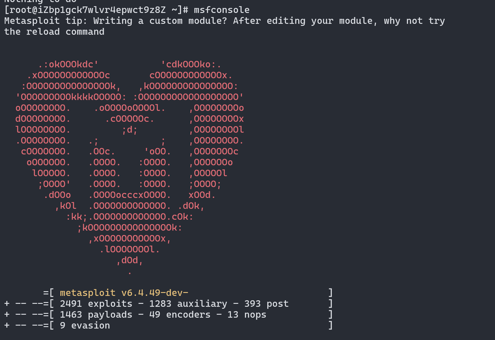

### 进入bash命令行

- 执行命令下载`msf`

```bash
curl https://raw.githubusercontent.com/rapid7/metasploit-omnibus/master/config/templates/metasploit-framework-wrappers/msfupdate.erb > msfinstall
```

- 给权限

```bash
chmod +x msfinstall
```

- 运行安装脚本

```bash
./msfinstall
```



- 安装`postgresql`数据库

```bash
export LC_ALL=en_US.UTF-8
export LANG=en_US.UTF-8
yum install -y https://download.postgresql.org/pub/repos/yum/reporpms/EL-7-x86_64/pgdg-redhat-repo-latest.noarch.rpm
yum install -y postgresql12 postgresql12-server
```

- 查询是否安装成功

```bash
rpm -qa | grep postgresql
```


- 初始化数据库

```bash
/usr/pgsql-12/bin/postgresql-12-setup initdb
```


- 设置开机自启

```bash
systemctl start postgresql-12 
systemctl enable postgresql-12
```


- 设置数据库

```bash
su postgres
psql
ALTER USER postgres WITH PASSWORD '设置的密码';
```


- msf连接postgresql,退出postgresql

```bash
cd /opt/metasploit-framework/bin/
useradd msf
su msf    
./msfdb init
```


- 切换root覆盖配置文件

```bash
cp /home/msf/.msf4/database.yml /opt/metasploit-framework/embedded/framework/config/
```

- 启动msf

```bash
msfconsole
db_status
```


*****