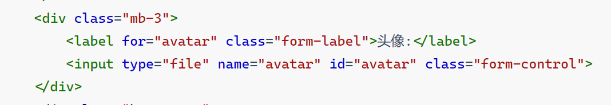
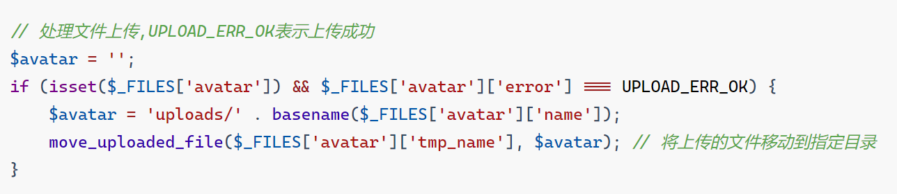

#### 主页

- 主页就是一个简单的表单填写,主页填写的内容与注册填写的相同但是不冲突,

- 多了一个文件上传(指定文件到当前目录下的一个叫``uploads``的文件夹),需要手动创建

- 重点说一下文件上传处理

- 

- 

- 这段代码包括了一个 HTML 文件上传表单和一个处理文件上传的 PHP 代码。下面是详细的解释：

  ### HTML 部分

  ```html
  <div class="mb-3">
      <label for="avatar" class="form-label">头像:</label>
      <input type="file" name="avatar" id="avatar" class="form-control">
  </div>
  ```

  **解释：**

  1. **`<div class="mb-3">`**：这是一个包含文件上传控件的容器，`class="mb-3"` 是 Bootstrap 的一个类，用于添加底部边距。

  2. **`<label for="avatar" class="form-label">头像:</label>`**：
     - `for="avatar"`：这个属性将标签与 ID 为 `avatar` 的输入框关联起来。点击标签时，浏览器会自动聚焦到对应的输入框。
     - `class="form-label"`：Bootstrap 样式类，用于给标签添加适当的样式。

  3. **`<input type="file" name="avatar" id="avatar" class="form-control">`**：
     - `type="file"`：指定输入框用于选择文件。
     - `name="avatar"`：表单提交时，文件将以 `avatar` 作为字段名发送到服务器。
     - `id="avatar"`：与 `<label>` 标签的 `for` 属性匹配，使得标签点击后会激活此输入框。
     - `class="form-control"`：Bootstrap 样式类，用于给输入框添加适当的样式。

  ### PHP 部分

  ```php
  $avatar = '';
  if (isset($_FILES['avatar']) && $_FILES['avatar']['error'] === UPLOAD_ERR_OK) {
      $avatar = 'uploads/' . basename($_FILES['avatar']['name']);
      move_uploaded_file($_FILES['avatar']['tmp_name'], $avatar); // 将上传的文件移动到指定目录
  }
  ```

  **解释：**

  1. **`$avatar = '';`**：
     - 初始化一个空的变量 `$avatar`，用于存储文件上传后的目标路径。

  2. **`if (isset($_FILES['avatar']) && $_FILES['avatar']['error'] === UPLOAD_ERR_OK)`**：
     - `isset($_FILES['avatar'])`：检查 `$_FILES['avatar']` 是否存在。这表明表单提交时有文件上传。
     - `$_FILES['avatar']['error'] === UPLOAD_ERR_OK`：检查上传过程中是否没有错误。`UPLOAD_ERR_OK` 是一个常量，表示上传成功，没有错误。

  3. **`$avatar = 'uploads/' . basename($_FILES['avatar']['name']);`**：
     - `basename($_FILES['avatar']['name'])`：获取上传文件的原始名称，并去掉路径，只保留文件名。这样做有助于防止路径遍历攻击。
     - `'uploads/' . basename($_FILES['avatar']['name'])`：拼接上传目录路径和文件名，得到文件在服务器上的目标路径。

  4. **`move_uploaded_file($_FILES['avatar']['tmp_name'], $avatar);`**：
     - `$_FILES['avatar']['tmp_name']`：获取上传文件在服务器上的临时文件路径。
     - `move_uploaded_file()`：将上传的临时文件移动到目标路径。如果移动成功，文件将被保存到 `uploads/` 目录下，并且不再存在临时文件夹中。

  ### 小结

  - **HTML 部分**：创建了一个文件上传表单，让用户选择文件。
  - **PHP 部分**：处理文件上传：
    - 检查上传是否成功。
    - 生成目标文件路径。
    - 将文件从临时目录移动到目标目录。

  **注意事项**：

  - 确保 `uploads/` 目录存在，并且有适当的写权限。
  - 在实际应用中，应添加更多的安全措施，比如文件类型检查、文件大小限制等，以防止潜在的安全风险。

