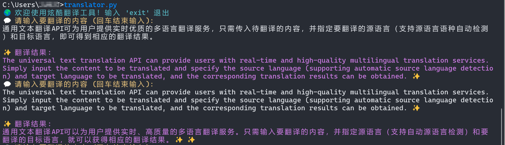

# 🌍 炫酷翻译工具

## 📌 介绍

**炫酷翻译工具** 是一个基于 **百度翻译 API** 的命令行翻译工具，支持自动拆分长文本、智能检测语言，并带有彩色输出增强用户体验。

## 🔧 功能特点

- 🚀 **支持多语言翻译**（自动检测输入语言）
- 📝 **自动拆分长文本**（百度 API 单次最大 6000 字）
- 🎨 **彩色终端界面**（使用 `colorama` 提供高亮显示）
- ⌨ **交互式输入**（输入 `exit` 退出）

------

## 📥 安装依赖

在运行本工具前，请确保已安装以下依赖项：

```sh
pip install requests colorama
```

------

## ⚙ 配置 API 密钥

**使用百度翻译 API 需要申请 `APP_ID` 和 `SECRET_KEY`。**

1. 访问 [百度翻译开放平台](https://fanyi-api.baidu.com/) 并注册账号。

2. 创建应用，获取 `APP_ID` 和 `SECRET_KEY`。

3. 修改 **`translator.py`** 文件，填入您的 `APP_ID` 和 `SECRET_KEY`：

   ```python
   APP_ID = "你的 APP_ID"
   SECRET_KEY = "你的 SECRET_KEY"
   ```

------

## 🚀 使用方式

### 方式 1：直接运行脚本

```sh
python translator.py
```

输入要翻译的内容，回车换行，**再按回车键结束输入**，将自动进行翻译。
 输入 `exit` 退出程序。

示例：

```
🌍 欢迎使用炫酷翻译工具！输入 'exit' 退出
💬 请输入要翻译的内容 (回车结束输入):
Hello, how are you?
（按回车结束输入）

✨ 翻译结果:
你好，你好吗？ ✨
```

------

## 🛠️ 环境变量配置（可选）

**为了便捷运行，可以将 `translator.py` 添加到系统 PATH 变量中。**

### Windows：

1. 复制 `translator.py` 到 `Scripts` 目录（`where pip` 获取 `Scripts` 目录路径）。

2. 在命令行输入：

   ```sh
   setx PATH "%PATH%;C:\path\to\your\Scripts"
   ```

3. 现在可以直接在命令行运行：

   ```sh
   translator
   ```

### Linux/Mac：

1. 复制 `translator.py` 到 `/usr/local/bin/` 并重命名：

   ```sh
   mv translator.py /usr/local/bin/translator
   chmod +x /usr/local/bin/translator
   ```

2. 现在可以在终端中直接输入 `translator` 运行工具。

------

## 运行效果



------

## 📢 免责声明

本工具仅供学习交流使用，**请勿用于商业用途**，否则后果自负。

🙌 **感谢使用！期待你的 Star ⭐**