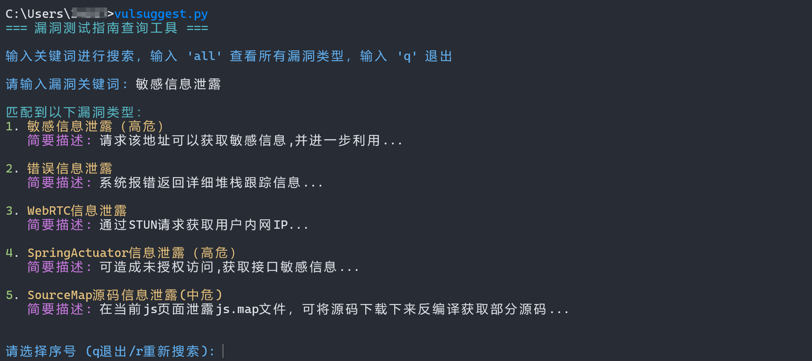
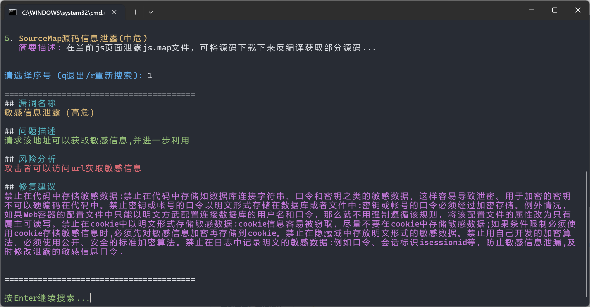

# 🛠️ VulSuggest 漏洞查询工具

## 📌 介绍

**VulSuggest** 是一款面向渗透测试人员的命令行漏洞查询工具，利用模糊搜索算法帮助用户快速查找漏洞信息，并自动生成详细的修复建议报告。通过简洁的命令行界面，用户可以快速定位漏洞、了解其风险，并获取解决方案。

## 🔧 功能特点

- 🚀 **模糊搜索漏洞**（通过关键词搜索漏洞信息）
- 📄 **自动生成漏洞报告**（提供漏洞名称、问题描述、风险分析、修复建议）
- 🎨 **彩色终端输出**（使用 `termcolor` 提供高亮显示）
- ⌨ **交互式输入**（支持输入 `q` 退出，`r` 重新搜索）

------

## 📥 安装依赖

在运行本工具前，请确保已安装以下依赖项：

```sh
pip install python-Levenshtein termcolor
```

------

## ⚙ 配置漏洞数据

**VulSuggest** 使用本地漏洞数据文件，您可以自定义这些漏洞数据。默认情况下，数据文件已包含一些常见漏洞。

1. 在工具中使用默认数据，无需其他配置。
2. 如果需要自定义漏洞数据，请编辑 `vul_data.json` 文件。

------

## 🚀 使用方式

### 方式 1：直接运行脚本

```sh
python vul_suggest.py
```

启动后，输入漏洞相关的关键词进行模糊搜索，工具会自动列出相关的漏洞信息。输入 `q` 退出工具，输入 `r` 重新搜索。

示例：

```
请输入漏洞关键词: DS_Store
```

输出：

```
匹配到以下漏洞类型：
1. DS_Store文件泄露(中危)
   简要描述: 攻击者可以访问该地址下载包含敏感文件夹信息的 `.DS_Store` 文件。

请选择序号 (q退出/r重新搜索): 1
```

#### 查看详细报告：

```
========================================
## 漏洞名称
DS_Store文件泄露(中危)

## 问题描述
攻击者可以访问该地址下载包含敏感文件夹信息的 `.DS_Store` 文件。该文件记录了文件夹中的文件和目录结构，可能暴露敏感数据。

## 风险分析
攻击者通过访问该文件，能够推测目录下的文件名和文件夹结构，甚至通过文件中的系统信息获得路径布局，可能为进一步的攻击提供线索。

## 修复建议
确保服务器的敏感目录和文件设置了合适的访问控制，防止未授权访问 `.DS_Store` 文件。
========================================
```

------

## 🛠️ 环境变量配置（可选）

**为了便捷运行，可以将 `vul_suggest.py` 添加到系统 PATH 变量中。**

### Windows：

1. 复制 `vul_suggest.py` 到 `Scripts` 目录（`where pip` 获取 `Scripts` 目录路径）。

2. 在命令行输入：

   ```sh
   setx PATH "%PATH%;C:\path\to\your\Scripts"
   ```

3. 现在可以直接在命令行运行：

   ```sh
   vul_suggest
   ```

### Linux/Mac：

1. 复制 `vul_suggest.py` 到 `/usr/local/bin/` 并重命名：

   ```sh
   mv vul_suggest.py /usr/local/bin/vul_suggest
   chmod +x /usr/local/bin/vul_suggest
   ```

2. 现在可以在终端中直接输入 `vul_suggest` 运行工具。

------

## 运行效果





------

## 📢 免责声明

本工具仅供学习交流使用，**请勿用于商业用途**，否则后果自负。

🙌 **感谢使用！期待你的 Star ⭐**