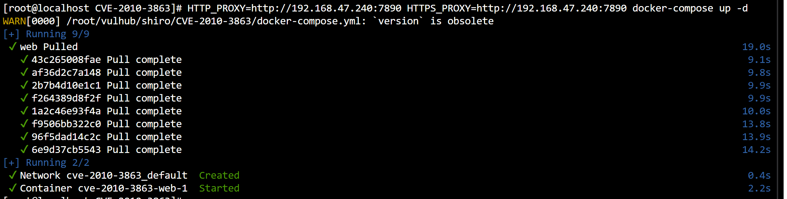
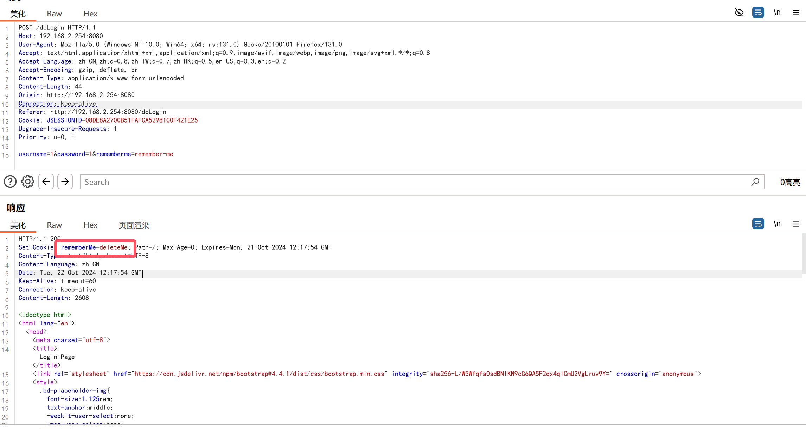
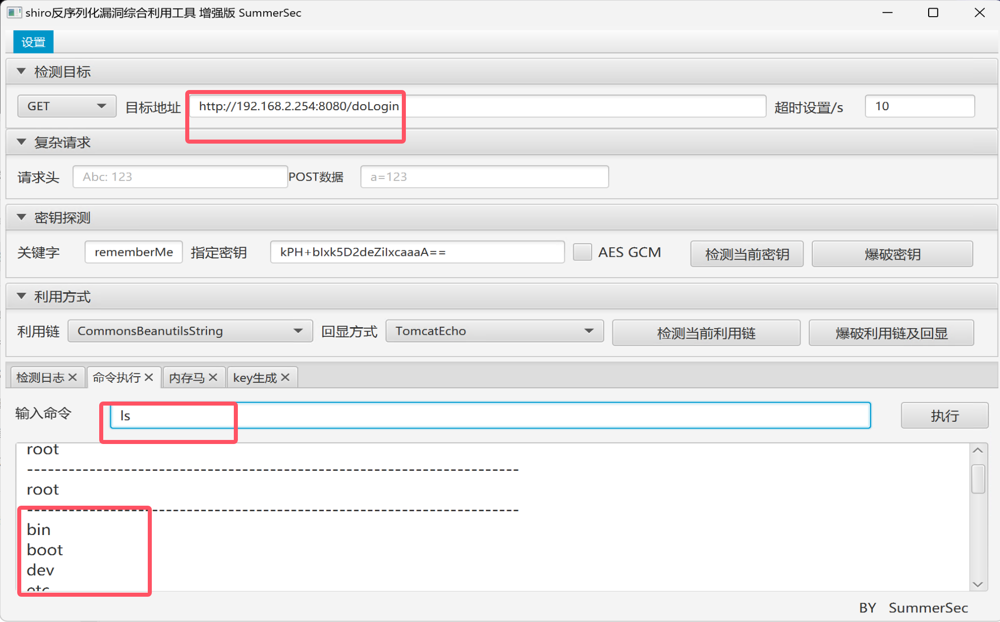

# shiro认证绕过

> CVE-2010-3863

### 环境准备



### 攻击

- 构造恶意请求绕过登录认证


### 漏洞原理

- shiro是一个强大易于使用的`java`安全框架,提供了`认证,授权,加密,会话管理`等

- `Apache Shiro 1.1.0`以前的版本,shiro进行权限认证前未对url做`标准化`处理,攻击者可以利用`/`,`//`,`/./`,`/…/`绕过权限验证

  

****

# shiro550反序列化

> CVE-2016-4437

### 环境准备


### 开始攻击

- 输入任意账号密码,勾选`记住密码`,bp抓包查看


- 发现数据包里有`rememberme=deleteme`的字段,说明使用了shiro框架,存在反序列化漏洞



- 打开shiro反序列化攻击jar


- 利用漏洞



### 漏洞原理

- `shiro`框架提供了`记住密码`的功能,用户登录成功后会将用户信息进行加密
- 加密过程:`序列化->AES加密->base64编码->remember cookie`
- 如果用户勾选了`记住密码`,那么请求中会`携带cookie`,并且将加密信息存放在cookie的`rememberme`字段里,在服务段收到`remeberme`值先`base64解码`然后再`AES`解密然后`反序列化`,这个过程中如果我们知道AES加密的`密钥`,把用户信息替换成恶意命令就造成了`反序列化远程命令执行漏洞`
- 在`shiro <= 1.2.4`版本中使用默认密钥更容易触发

****

# shiro认证绕过

> CVE-2020-1957

### 环境搭建


### 攻击手法同上

- 构造恶意请求绕过登录认证

```http
http://192.168.2.254:8080/xxx/..;/admin/
```


****