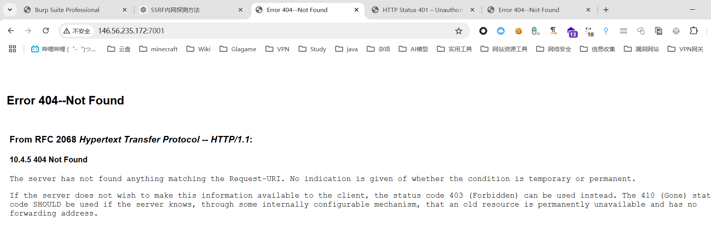
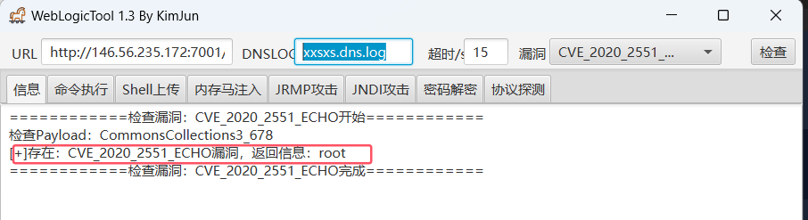
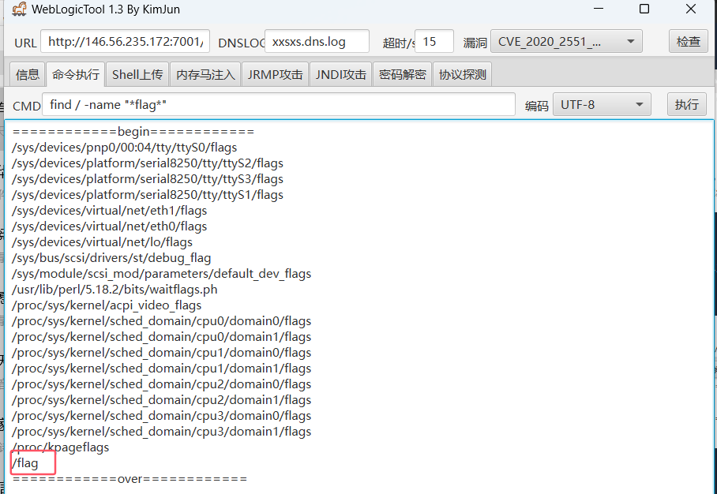
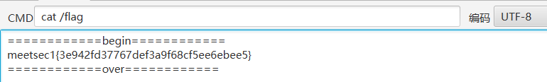

```
http://146.56.235.172:7001/
```

1. 根据题目服务器ip地址，初步判断为weblogic服务，尝试访问

   

2. 无法访问，进一步尝试用工具梭哈



3. 直接命令查找flag

   ```
   find / -name "*flag*"
   ```

   

4. 成功获取flag1

   

   ```
   meetsec1{3e942fd37767def3a9f68cf5ee6ebee5}
   ```

5. 其余flag需要内网渗透，暂时无法获取