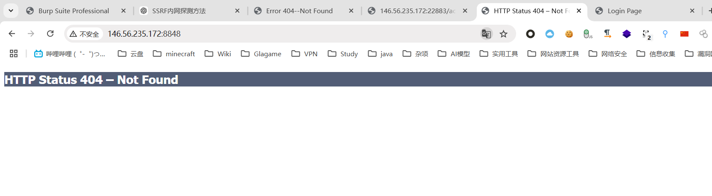
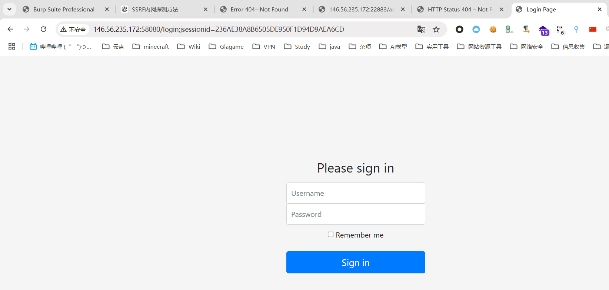
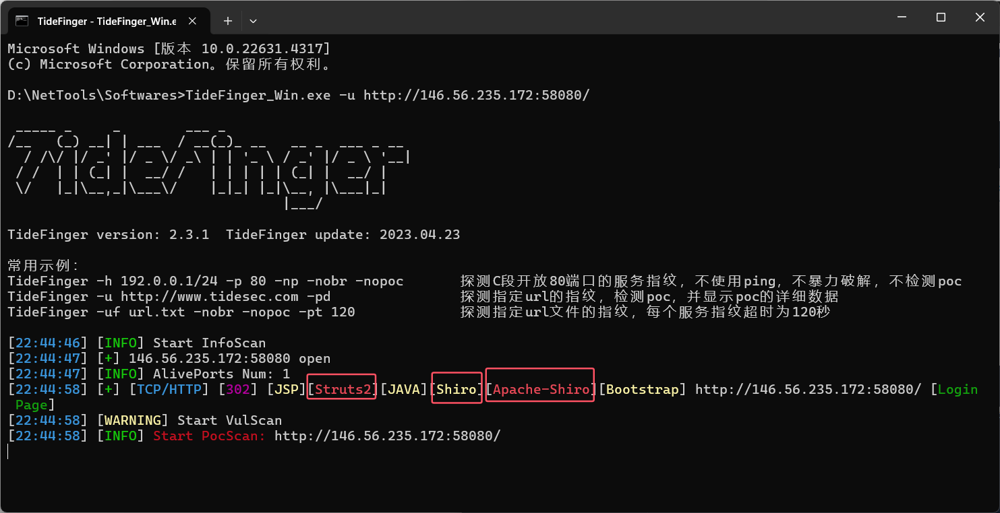
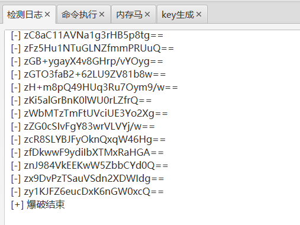
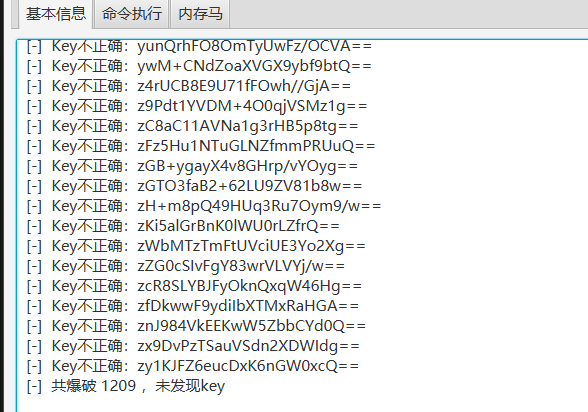
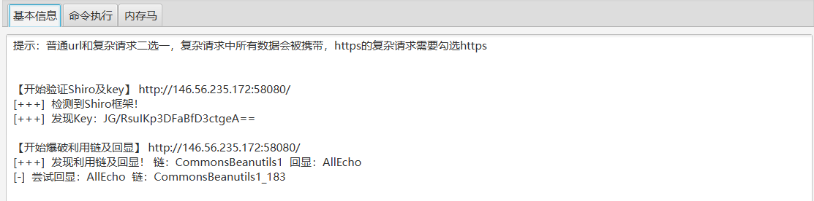
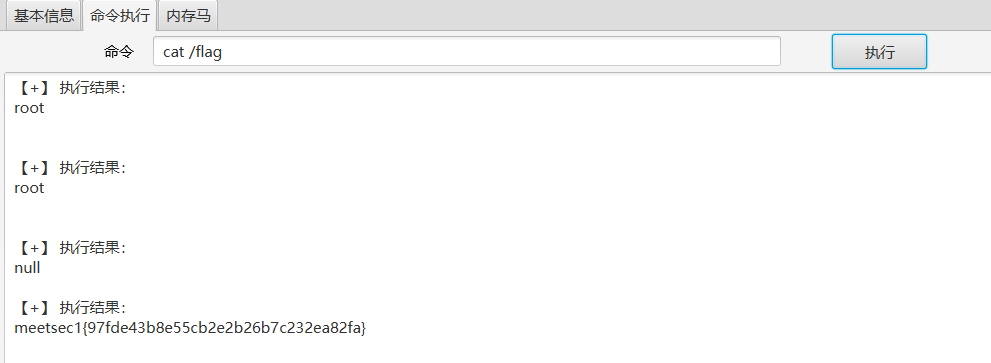

```
146.56.235.172:8848
146.56.235.172:58080
```

1. 尝试访问两个网页，第一个404，第二个为登录页面





2. 第二个页面存在Remember me标识，考虑为shiro框架，使用cms识别工具进行确认

   

3. 直接使用工具梭哈，均未跑出密钥

   

   

4. 上网搜集，偶然发现一串密钥，尝试使用，直接成功，运气很好！

   ```
   JG/RsuIKp3DFaBfD3ctgeA==
   ```

   

5. 直接尝试执行命令，搜索falg

   ```
   meetsec1{97fde43b8e55cb2e2b26b7c232ea82fa}
   ```

   