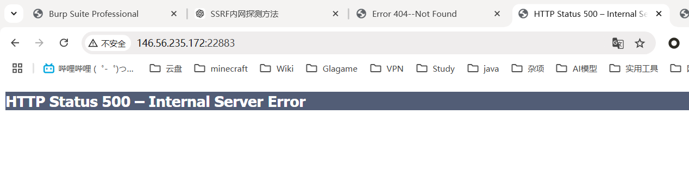
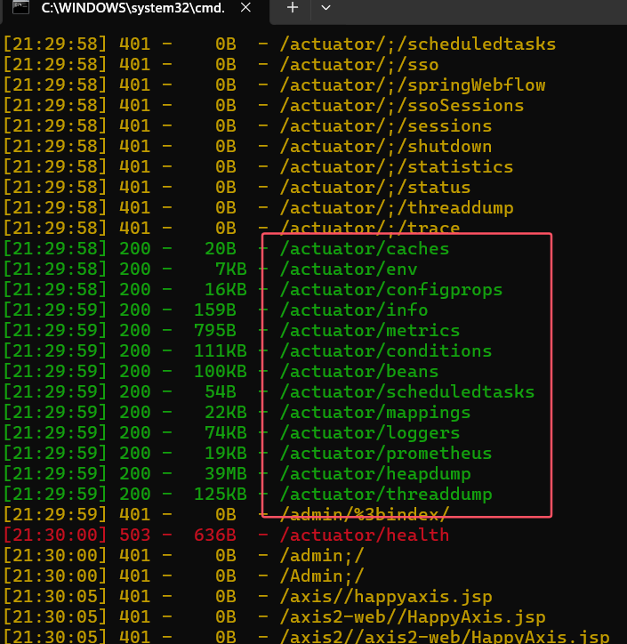
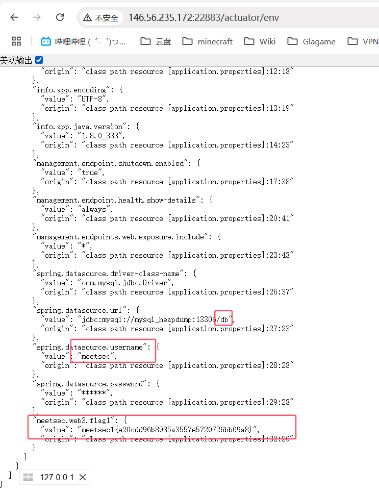

```
146.56.235.172:22883
146.56.235.172:13306
```

1. 根据题目信息，flag1存在于第一台主机泄露的信息中，因此尝试访问第一台主机



2. 很明显，无法进一步查看，因此，转向目录扫描

   

3. 仔细查看路径，发现存在**/actuator**，这是**springboot**的明显特征，进一步查看子路径名，缓存、环境配置、信息展示、实体类、关系映射、JVM堆转储文件，一个一个查看，最终在/env文件中，搜索到flag，和mysql数据库用户名、数据库名

   ```
   meetsec1{e20cdd96b8985a3557e5720726bb09a8}
   ```

   

4. 根据JVM堆转储文件headdump可以进一步分析文件得出数据库密码

5. 另外个flag需要进行内网渗透，故暂时无法获取