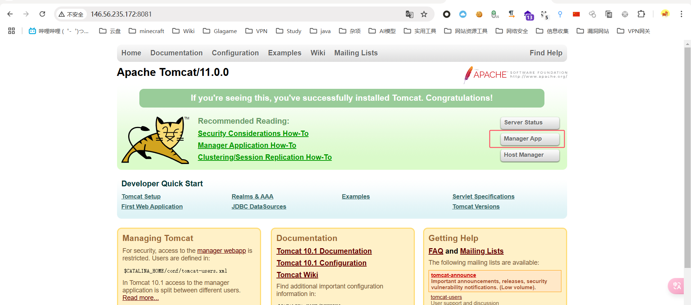
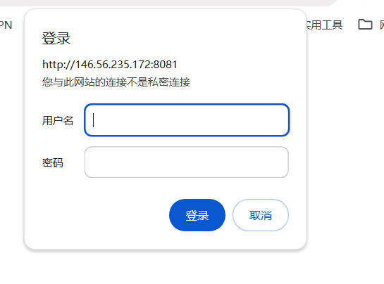
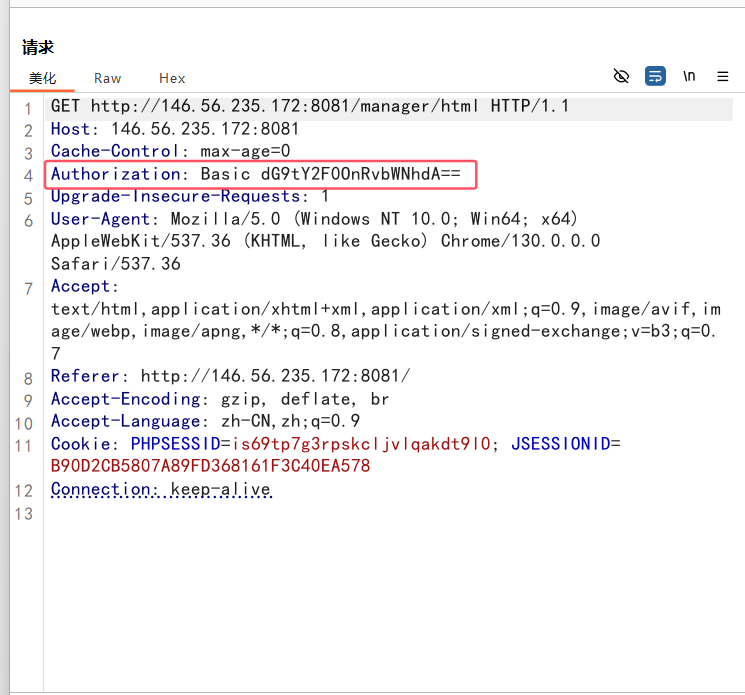
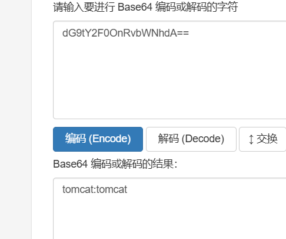
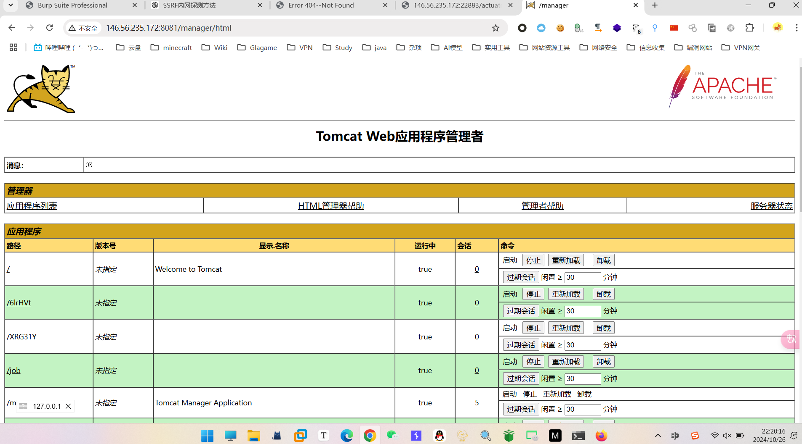
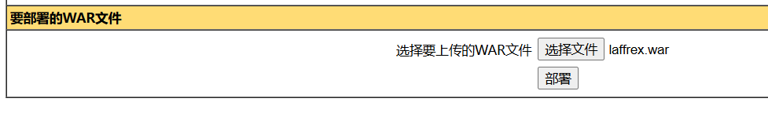
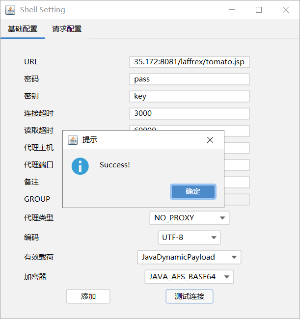
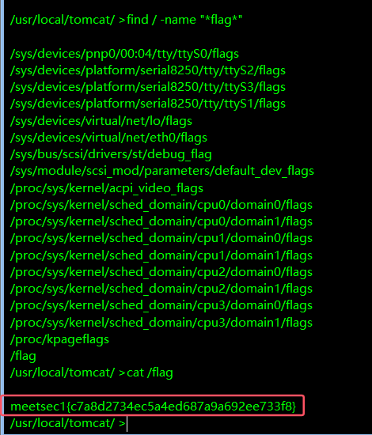

```
146.56.235.172:8081
```

1. 尝试访问该路径



2. 老套路，先尝试是否能够进入后台部署war包，发现需要用户名及密码



3， 尝试常见弱口令组合，失败，故尝试抓包爆破



很懵逼，通过get传参，但是却没有参数内容，找了半天，尝试手动拼接参数，失败。

再次仔细观察数据包，发现存在header字段Authorization(翻译后的名字为：权限认证)，去百度后得知，`HTTP 头字段使用基本认证（Basic Authentication）方式传递凭证`，并且他为Base64编码，尝试解码，内容刚好是输入的值



至此，思路很清晰：burp抓包，发送到Intruder模块爆破，选择自定义迭代器模式，最终爆破出来的用户名密码为 `tomcat:qwe123`



4. 尝试部署war包，成功部署

   

5. 成功连接

   

6. 进入服务器后，直接查找flag

   ```
   meetsec1{c7a8d2734ec5a4ed687a9a692ee733f8}
   ```

   