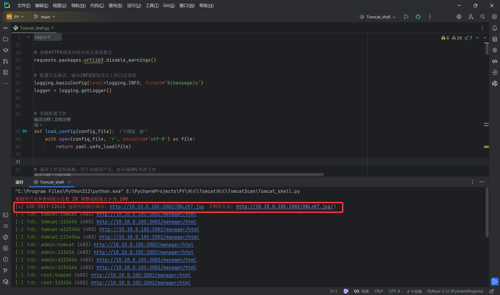

### Nmap端口扫描


- 先看看`2001`端口


*****

### struts2

- 看到这个界面原本以为是文件上传漏洞,仔细看标题`strust2`,直接打框架漏洞


- 上传哥斯拉`webshell`


### Tomcat(put)




*****

### 生成ssh公钥

- win+r->cmd


- 挂载

```bash
fdisk -l
mkdir /test && mount /dev/sda1 /test
cd /test/root
mkdir .ssh
```


- 将生成的公钥粘贴到`.ssh`

